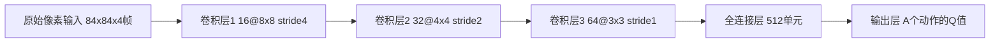

# Playing Atari with Deep Reinforcement Learning - Reading Notes
> **论文链接**: [arXiv:1312.5602](https://arxiv.org/abs/1312.5602) 
> 
> **作者**: Volodymyr Mnih, Koray Kavukcuoglu, David Silver, Alex Graves, Ioannis Antonoglou, Daan Wierstra, Martin Riedmiller 
> 
> **年份**: 2013 (NIPS)
> 
> **引用**: ~15,000+ (Google Scholar) 

---

### 1. 论文试图解决什么问题？(What is the problem?)
- 传统RL的局限性：传统强化学习（RL）算法依赖手工设计的状态特征（如位置、速度），难以直接处理高维感知输入（如像素图像）。
- 端到端学习需求：能否构建一个通用框架，直接从原始像素输入中学习控制策略，无需人工特征工程，并在多种任务上泛化？
- 挑战：高维状态空间、奖励稀疏性、数据序列相关性导致的训练不稳定性。

---

### 2. 核心思想/创新点是什么？(What is the core idea?)
- Deep Q-Network (DQN)：首次将卷积神经网络（CNN） 与 Q-learning 结合，实现端到端学习。
- 两大关键技术：
  - Experience Replay：存储转移样本 (s, a, r, s') 在记忆库中，训练时随机采样以打破数据相关性。
  - Target Network：引入独立的目标网络（参数定期更新）计算目标Q值，稳定训练过程。

---

### 3. 方法是怎么实现的？(How does it work?)
#### **架构**: (例如：网络结构图)

  - 输入：预处理后的灰度图像（84×84），堆叠最近4帧以捕获时序信息。 
  - 输出：每个动作对应的Q值。
#### **算法流程**: (例如：伪代码)
```python
  Initialize replay memory D, Q-network θ, target network θ'=θ
  for episode = 1 to M:
    s = initial state
    for t = 1 to T:
      With probability ε select random action a_t, else a_t = argmax_a Q(s_t, a; θ)
      Execute a_t, observe r_t, s_{t+1}
      Store (s_t, a_t, r_t, s_{t+1}) in D
      Sample random minibatch from D
      Set y_j = r_j if terminal, else r_j + γ * max_{a'} Q(s_{j+1}, a'; θ')
      Update θ by SGD on loss (y_j - Q(s_j, a_j; θ))^2
      Every C steps: θ' ← θ
```
#### **关键公式**:
- **Q-learning 更新目标**：  
  $$
  y_j = \begin{cases}
  r_j & \text{if } s_{j+1} \text{ is terminal} \\
  r_j + \gamma \max_{a'} Q(s_{j+1}, a'; \theta') & \text{otherwise}
  \end{cases}
  $$
- **损失函数**（均方误差）：  
  $$
  L(\theta) = \mathbb{E}_{(s,a,r,s') \sim D} \left[ \left( y - Q(s, a; \theta) \right)^2 \right]
  $$

---

### 4. 效果如何？(How is the performance?)
#### **实验设置**:
- **环境**：7款Atari 2600游戏（e.g., Breakout, Pong, Space Invaders）。
- **评估指标**：训练后策略的**平均总回报** vs. 随机策略、人类玩家、传统RL方法。
- **基线**：Sarsa、Contingency等基于手工特征的算法。
#### **主要结果**:
- 在6/7游戏中**超越所有基线**，在3款游戏中达到**人类专家水平**（如Breakout得分提升1950%）。
- **泛化性**：同一网络结构适配所有游戏（仅输入/输出层微调）。
#### **Ablation Study (消融实验)**:
- **移除Experience Replay**：训练不稳定，性能下降约50%。
- **移除Target Network**：Q值震荡，收敛速度显著降低。
- **帧堆叠必要性**：单帧输入无法处理部分游戏（如Pong）。

---

### 5. 有什么优点和缺点？(What are the strengths and weaknesses?)
#### 优点
- **通用性**：统一框架处理多种任务，无需领域知识。
- **端到端学习**：直接从原始像素提取特征，避免手工设计。
- **训练稳定性**：Experience Replay + Target Network 有效解决数据相关性。

#### 缺点
- **样本效率低**：需数百万帧数据（约38天实时游戏）。
- **训练时间过长**：GPU训练需数天至数周。
- **部分游戏表现差**：需长时序推理的游戏（如Montezuma's Revenge）未解决。

---

### 6. 我的思考和启发 (My thoughts and inspirations)
- (这篇论文对我有什么启发？可以和哪些已知的工作联系起来？有什么地方可以进一步改进？)

---

### 7. 关键术语 (Key Terms)
- **Q-learning**：基于贝尔曼方程的值迭代算法，学习动作价值函数 `Q(s,a)`。
- **Experience Replay**：存储历史转移样本并随机重放，解决数据相关性和非平稳分布问题。
- **Target Network**：独立于主网络、周期性更新的网络，用于计算稳定的Q值目标。
- **ε-greedy策略**：以概率ε随机探索，否则选择当前最优动作（平衡探索与利用）。
- **帧堆叠（Frame Stacking）**：将连续多帧图像堆叠为输入，提供时序动态信息。 
