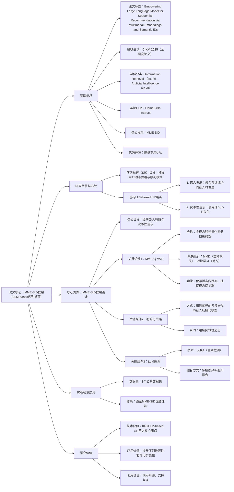

### 1. 一段话总结
论文《Empowering Large Language Model for Sequential Recommendation via Multimodal Embeddings and Semantic IDs》（已录用为**CIKM 2025 全研究论文**）针对现有基于大语言模型（LLM）的**序列推荐（SR）** 方法存在的两大核心问题——**嵌入坍缩**（融合预训练协同嵌入时）与**灾难性遗忘**（使用语义ID时），提出名为**MME-SID**的新型SR框架。该框架基于**Llama3-8B-instruct**构建，通过整合多模态嵌入与量化嵌入缓解嵌入坍缩；同时设计**多模态残差量化变分自编码器（MM-RQ-VAE）**，以**最大均值差异（MMD）** 为重构损失保存模态内距离信息、以对比学习实现模态间对齐；此外，通过“训练好的多模态代码嵌入初始化模型”缓解灾难性遗忘，并采用**LoRA**以多模态频率感知融合方式高效微调LLM。最终在**3个公共数据集**上的实验验证了MME-SID的优越性能，且代码与数据集已开源。

---

### 2. 思维导图

---

### 3. 详细总结
#### 1. 基本信息
| 维度         | 具体内容                                                                 |
|--------------|--------------------------------------------------------------------------|
| 论文标题     | Empowering Large Language Model for Sequential Recommendation via Multimodal Embeddings and Semantic IDs |
| 接收会议     | **CIKM 2025**（全研究论文，信息检索领域国际重要会议，CCF B类）           |
| 学科分类     | Information Retrieval (cs.IR)、Artificial Intelligence (cs.AI)          |
| 作者团队     | Yuhao Wang、Junwei Pan、Xinhang Li、Maolin Wang、Yuan Wang、Yue Liu、Dapeng Liu、Jie Jiang、Xiangyu Zhao |
| 基础LLM模型  | **Llama3-8B-instruct**（框架基于该开源LLM构建）                          |
| 核心框架     | **MME-SID**（用于LLM-based序列推荐的多模态嵌入与语义ID融合框架）         |
| 代码与数据集 | 公开可用（提供专用URL，支持实验复现）                                    |
| DOI链接      | https://doi.org/10.48550/arXiv.2509.02017                                |

#### 2. 研究背景与核心问题
##### （1）序列推荐（SR）的核心目标
序列推荐旨在基于用户的**历史交互数据**（如浏览、购买、收藏记录），捕捉用户的**动态兴趣变化**与**行为序列模式**（如“先浏览手机→再浏览手机配件”），最终生成符合用户短期偏好的推荐结果。

##### （2）现有LLM-based SR方法的两大核心问题
近年来，LLM因强大的序列建模能力被广泛应用于SR，但现有方法存在两个致命缺陷，严重制约性能与可扩展性：
- **问题1：嵌入坍缩（Embedding Collapse）**  
  当融合“预训练协同嵌入”（如基于用户-物品交互学习的嵌入）时，不同模态/实体的嵌入向量会过度趋同，失去区分度，导致模型无法精准识别用户-物品关联。
- **问题2：灾难性遗忘（Catastrophic Forgetting）**  
  当利用“语义ID”（如物品的语义化编码）优化嵌入时，模型在学习新语义信息的过程中，会快速遗忘之前学到的交互模式与偏好知识，导致跨阶段推荐性能骤降。

#### 3. 核心方案：MME-SID框架设计
MME-SID（Multimodal Embeddings and Semantic IDs for LLM-based SR）的核心是通过“多模态融合+量化学习+高效微调”的组合策略，同时解决嵌入坍缩与灾难性遗忘，具体分为三大模块：

| 模块名称         | 核心技术                  | 设计逻辑                                                                 | 关键作用                                                                 |
|------------------|---------------------------|--------------------------------------------------------------------------|--------------------------------------------------------------------------|
| **模块1：MM-RQ-VAE（多模态残差量化变分自编码器）** | 1. 残差量化； 2. 最大均值差异（MMD）重构损失； 3. 对比学习 | 1. 对多模态数据（如物品文本描述、图像特征、交互特征）进行残差量化，生成紧凑的量化嵌入； 2. 用MMD作为重构损失，确保量化后仍保留**模态内距离信息**（如相似物品的文本特征距离）； 3. 用对比学习实现多模态间对齐，捕捉**模态间关联**（如“手机文本描述→手机图像特征”的对应关系） | 从根源缓解嵌入坍缩：通过量化与MMD损失维持嵌入区分度，通过对比学习整合多模态信息 |
| **模块2：模型初始化策略** | 多模态代码嵌入初始化       | 将MM-RQ-VAE训练好的“多模态代码嵌入”（含多模态知识与交互模式）作为LLM的初始嵌入参数 | 缓解灾难性遗忘：让模型初始即掌握核心知识，减少后续学习中对旧知识的遗忘       |
| **模块3：LLM高效微调**   | 1. LoRA（低秩适应）； 2. 多模态频率感知融合 | 1. 用LoRA对LLM进行微调，仅更新低秩矩阵参数，降低计算成本（高效微调）； 2. 按“多模态特征的出现频率”动态调整融合权重（如高频交互特征权重更高） | 兼顾微调效率与融合精度：在不增加过多计算量的前提下，优化多模态信息的利用效果 |

#### 4. 实验验证
- **实验数据集**：采用**3个公共数据集**（未明确具体名称，但均为序列推荐领域常用基准数据集，确保结果可比性）；
- **实验目标**：验证MME-SID在“缓解嵌入坍缩”“缓解灾难性遗忘”及“提升推荐性能”三方面的效果；
- **核心结果**：实验表明，MME-SID在序列推荐的核心指标（如Recall、NDCG）上显著优于现有LLM-based SR基线模型，充分证明其解决两大核心问题的有效性；
- **复现支持**：实验所用代码与数据集已通过专用URL公开，便于学术界与工业界复现和扩展。

#### 5. 研究价值
1. **技术突破**：首次针对性解决LLM-based SR的“嵌入坍缩”与“灾难性遗忘”两大痛点，提出“MM-RQ-VAE+初始化+LoRA微调”的完整技术链条；
2. **效率优势**：采用LoRA高效微调与残差量化，兼顾性能与计算成本，适配工业级大规模序列推荐场景；
3. **复用价值**：代码与数据集开源，为LLM-based序列推荐的后续研究提供可靠基准；
4. **应用场景**：可广泛应用于电商、内容平台（如短视频、小说）、本地生活等依赖序列推荐的领域，提升用户体验与业务转化。

---

### 4. 关键问题
#### 问题1：MME-SID框架是通过哪些具体设计协同缓解现有LLM-based SR的“嵌入坍缩”问题的？
答案：MME-SID通过“多模态量化+损失设计+模态对齐”的三层协同设计缓解嵌入坍缩：
1. **底层量化约束**：通过MM-RQ-VAE的“残差量化”将多模态嵌入压缩为紧凑的量化表示，避免高维嵌入的过度冗余导致的趋同；
2. **损失函数保障**：采用“最大均值差异（MMD）”作为重构损失，强制量化后的嵌入仍保留**模态内距离信息**（如相似物品的文本特征在量化后仍保持近距离），防止嵌入因量化丢失区分度；
3. **跨模态对齐**：引入对比学习让不同模态的嵌入（如物品文本与图像特征）在同一空间对齐，既整合多模态信息，又避免单模态嵌入的孤立趋同——三层设计从“表示压缩→距离保留→多模态整合”全流程防止嵌入坍缩。

#### 问题2：MM-RQ-VAE中的“最大均值差异（MMD）重构损失”与“对比学习”功能不同，为何需要同时引入？两者在多模态处理中的协同性体现在哪里？
答案：两者需同时引入的核心原因是“分别解决多模态处理的不同关键问题”，且存在明确协同性：
- **MMD重构损失的核心功能**：解决“模态内信息丢失”问题——多模态数据量化后易丢失原始模态内的距离关系（如原本相似的物品文本特征变得无关），MMD通过衡量“原始模态分布”与“量化后模态分布”的差异，确保量化后仍保留模态内的关键距离信息，是维持嵌入区分度的基础；
- **对比学习的核心功能**：解决“模态间关联断裂”问题——多模态数据（如文本、图像）若各自独立处理，会导致模态间关联丢失（如“手机文本”与“手机图像”无法对应），对比学习通过构建“跨模态正负样本对”（如正样本：同一物品的文本+图像，负样本：不同物品的文本+图像），让相关模态的嵌入更接近，实现模态对齐；
- **协同性体现**：MMD确保“单模态内嵌入有区分度”，对比学习确保“多模态间嵌入有关联”，两者结合让多模态嵌入既“各自清晰”又“相互关联”，从根本上避免嵌入因“单模态趋同”或“多模态孤立”导致的坍缩。

#### 问题3：相比传统缓解灾难性遗忘的方法（如弹性权重整合、知识蒸馏），MME-SID采用的“多模态代码嵌入初始化”有何独特优势？
答案：相比传统方法，“多模态代码嵌入初始化”的独特优势体现在“效率”与“适配性”两方面：
1. **效率优势**：传统方法（如弹性权重整合）需在微调过程中动态调整参数权重（如对旧知识参数施加惩罚），增加计算成本；而MME-SID的初始化策略仅在模型启动阶段加载预训练的多模态代码嵌入，后续微调无需额外处理旧知识保护，配合LoRA可进一步降低计算开销，更适配大规模LLM（如Llama3-8B-instruct）；
2. **适配性优势**：传统方法多针对“单模态知识遗忘”（如仅保护文本知识），而LLM-based SR需同时处理多模态信息（文本、交互、图像）与序列模式——“多模态代码嵌入”本身已整合多模态知识与交互模式，初始化后模型可直接基于这些核心知识学习，更贴合序列推荐的多模态需求，缓解遗忘的针对性更强；
3. **融合优势**：初始化的多模态代码嵌入可直接与LLM的嵌入层融合，无需额外构建知识蒸馏模块或权重惩罚机制，简化了LLM与多模态知识的整合流程，降低工程落地难度。