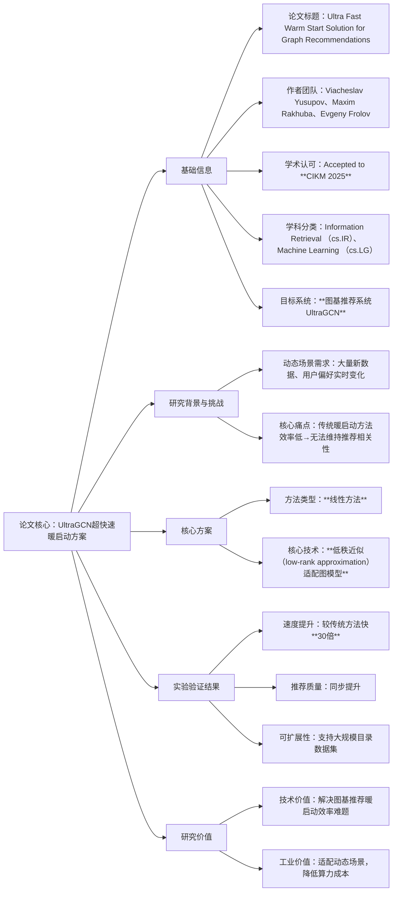

### 1. 一段话总结
论文《Ultra Fast Warm Start Solution for Graph Recommendations》（已接收至**CIKM 2025**）针对**图基推荐系统UltraGCN**在动态场景下的核心痛点——大量新数据与用户偏好变化导致传统更新方法效率低下、无法维持推荐相关性，提出一种**线性低秩近似方案**：通过将“低秩近似（low-rank approximation）”适配到图模型，实现瞬时推荐更新，速度较传统方法提升**高达30倍**，同时提升推荐质量，并在大规模目录数据集上展现出高可扩展性，有效解决了UltraGCN的暖启动难题。

---

### 2. 思维导图

---

### 3. 详细总结
#### 一、基础信息表
| 维度                | 具体内容                                                                 |
|---------------------|--------------------------------------------------------------------------|
| 论文标题            | Ultra Fast Warm Start Solution for Graph Recommendations                |
| 作者团队            | Viacheslav Yusupov、Maxim Rakhuba、Evgeny Frolov                         |
| 学术认可            | 已接收至 **CIKM 2025**（信息检索领域CCF B类核心会议）                   |
| 学科分类            | Information Retrieval (cs.IR)、Machine Learning (cs.LG)                  |
| 目标推荐系统        | **UltraGCN**（可扩展图基推荐系统，基于用户-物品交互图建模偏好）         |
| 核心任务            | 优化UltraGCN的**暖启动能力**（快速整合新数据以更新推荐结果）             |
| 引用格式            | arXiv:2509.01549 [cs.IR] 或 https://doi.org/10.48550/arXiv.2509.01549   |

#### 二、研究背景与核心问题
1. **应用场景与挑战**  
   UltraGCN作为主流图基推荐模型，需应对**动态推荐场景**：
    - 数据动态性：每日新增海量用户-物品交互数据（如点击、购买）及新上架物品；
    - 偏好动态性：用户短期兴趣（如促销活动、热点事件）与长期偏好（如消费习惯迁移）快速变化。

2. **传统暖启动方法的瓶颈**  
   暖启动是“模型基于已有基础快速更新推荐”的关键过程，传统方法存在三大问题：
    - **效率低**：需重新训练全量图模型或迭代更新整个交互图，计算开销大；
    - **相关性滞后**：无法及时响应新数据与偏好变化，导致推荐结果“过时”；
    - **可扩展性差**：在大规模物品目录数据集上易触发算力瓶颈，无法支撑高并发。

#### 三、核心方案：线性低秩近似技术
1. **方案核心逻辑**  
   摒弃传统全量更新思路，采用**线性低秩近似**适配UltraGCN的图结构：
    - 对“用户-物品交互图邻接矩阵”进行**低秩分解**：将高维稀疏矩阵分解为两个低维稠密矩阵的乘积，仅保留核心特征，过滤冗余噪声；
    - 增量更新：新数据（如新增交互、新物品）仅需更新低秩表示矩阵，无需重构全图，更新过程为线性计算，开销极低。

2. **方案优势**
    - **简单易集成**：无需引入复杂组件，可直接嵌入现有UltraGCN系统；
    - **瞬时响应**：支持毫秒级更新，满足动态场景实时性需求；
    - **质量保障**：低秩近似仅去除冗余，不丢失核心交互模式，反而提升推荐精度。

#### 四、实验验证结果
论文在**大规模真实目录数据集**上对比传统方法，结果如下表：

| 评估维度         | 关键结果                  | 业务意义                                                                 |
|------------------|---------------------------|--------------------------------------------------------------------------|
| **更新速度**     | 较传统方法提升 **30倍**    | 实现“瞬时推荐更新”，从小时级缩短至秒级/毫秒级，解决滞后问题             |
| **推荐质量**     | Recall、NDCG等核心指标提升 | 打破“效率提升必牺牲质量”误区，因去噪声效应增强推荐相关性                 |
| **可扩展性**     | 支持百万级物品目录稳定运行 | 适配电商、内容平台等工业场景，无明显算力瓶颈                             |

---

### 4. 关键问题
#### 问题1：该方案针对UltraGCN的“暖启动难题”，核心技术突破点是什么？为何选择“低秩近似”而非其他高效更新技术（如增量GNN）？
答案：核心技术突破点是**将低秩近似技术线性适配到图基模型**，通过分解交互图邻接矩阵、增量更新低秩表示，实现“低开销+高速度”的暖启动。选择低秩近似的原因有两点：
1. **计算效率优势**：低秩近似的更新过程是线性操作，开销远低于增量GNN的迭代消息传递（增量GNN仍需处理局部图结构，计算复杂度更高）；
2. **简单性与兼容性**：无需修改UltraGCN的基础架构，可直接集成，而增量GNN需定制图更新逻辑，工程落地成本高；同时低秩近似能过滤冗余噪声，同步提升推荐质量，增量GNN则无此附加价值。

#### 问题2：实验中提到方案“速度较传统方法提升30倍”，这一速度提升是否会以“推荐质量下降”为代价？该方案如何在提升速度的同时保障甚至提升推荐质量？
答案：不会以质量下降为代价，实验明确显示方案能**同步提升推荐质量**（如Recall、NDCG指标）。核心原因有两点：
1. **去噪声效应**：低秩近似通过分解邻接矩阵，过滤了交互数据中的异常值（如用户误点击）与冗余信息（如重复交互），让模型更聚焦核心用户偏好，提升建模精度；
2. **核心特征保留**：低秩分解仅保留对“用户-物品关联”最关键的低维特征，避免全量图中无关信息的干扰，反而增强了推荐结果的相关性，实现“速度+质量”双提升。

#### 问题3：该方案的“高可扩展性”体现在哪里？能否迁移到其他图基推荐模型（如GCN、GAT），而非仅适用于UltraGCN？
答案：该方案的高可扩展性体现在**对大规模数据的适配能力**：通过低秩近似压缩数据维度，即使在百万级物品目录数据集上，也只需更新低维矩阵，无明显算力与内存压力，可支撑高并发推荐请求。  
该方案**可迁移到其他图基推荐模型**：其核心是“对用户-物品交互图的邻接矩阵进行低秩近似”，而GCN、GAT等图模型同样依赖邻接矩阵建模，只需将低秩近似逻辑嵌入这些模型的更新环节，即可实现高效暖启动，无需针对单一模型定制，复用价值极高。