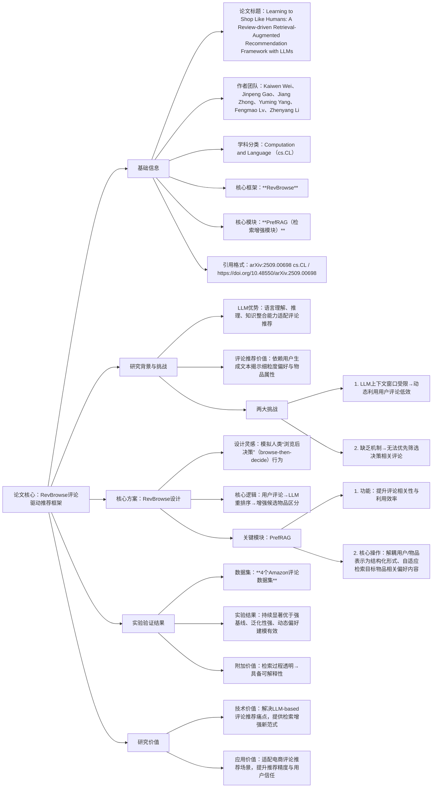

### 1. 一段话总结
论文《Learning to Shop Like Humans: A Review-driven Retrieval-Augmented Recommendation Framework with LLMs》提出**RevBrowse**——一种模拟人类“浏览后决策”（browse-then-decide）行为的评论驱动推荐框架，旨在解决LLM-based评论推荐的两大核心挑战：（1）LLM**上下文窗口受限**，无法高效动态利用用户评论；（2）缺乏有效机制优先筛选与用户当前决策相关的评论。该框架将用户评论融入LLM重排序过程以增强候选物品区分能力，并引入**PrefRAG检索增强模块**（解耦用户与物品表示为结构化形式，自适应检索目标物品相关的偏好内容）。在**4个Amazon评论数据集**上的实验表明，RevBrowse持续且显著优于强基线，兼具泛化性与动态偏好建模能力；同时因检索过程透明，可展示影响推荐的具体评论，具备一定**可解释性**。

---

### 2. 思维导图

---

### 3. 详细总结
#### 一、基础信息表
| 维度                | 具体内容                                                                 |
|---------------------|--------------------------------------------------------------------------|
| 论文标题            | Learning to Shop Like Humans: A Review-driven Retrieval-Augmented Recommendation Framework with LLMs |
| 作者团队            | Kaiwen Wei、Jinpeng Gao、Jiang Zhong、Yuming Yang、Fengmao Lv、Zhenyang Li |
| 学科分类            | **Computation and Language (cs.CL)**（聚焦自然语言处理与推荐系统交叉领域） |
| 核心框架            | **RevBrowse**（评论驱动的检索增强推荐框架）                              |
| 核心模块            | **PrefRAG**（检索增强模块，优化评论相关性与利用效率）                    |
| 目标任务            | 基于用户评论的推荐（Review-based Recommendation）                       |
| 实验数据集          | **4个Amazon评论数据集**（电商场景典型评论数据，具备泛化性验证价值）     |
| 引用格式            | arXiv:2509.00698 [cs.CL] 或 https://doi.org/10.48550/arXiv.2509.00698   |

#### 二、研究背景与核心问题
1. **LLM与评论推荐的适配性**  
   LLM因强大的**语言理解、推理与知识整合能力**，在推荐任务中展现出潜力，尤其适配“评论推荐”——这类推荐依赖用户生成的语义丰富文本（评论），以挖掘细粒度用户偏好（如“喜欢轻薄笔记本”）与物品属性（如“续航长”），提升推荐精准度。

2. **现有LLM-based评论推荐的两大核心挑战**  
   尽管LLM适配评论推荐，但实际应用中存在两个致命瓶颈，制约性能与实用性：
   - **挑战1：评论利用低效**  
     LLM的**上下文窗口存在长度限制**（如GPT-3.5上下文窗口约4k tokens），无法动态加载大量用户评论（单用户可能生成数十条评论，多用户评论总量更庞大），导致部分关键评论无法参与推荐决策。
   - **挑战2：评论相关性筛选缺失**  
     缺乏有效机制从海量评论中，优先筛选与“用户当前决策上下文”（如“当前想购买游戏本”）相关的评论，导致无关评论占用上下文空间，干扰LLM对核心偏好的判断。

#### 三、核心方案：RevBrowse框架设计
RevBrowse的核心思路是“模拟人类购物决策流程，用检索增强解决LLM评论利用难题”，具体分为框架整体设计与PrefRAG模块细节两部分：

##### （1）框架整体设计：模拟“浏览后决策”
- 设计灵感：借鉴人类在线购物的“浏览评论→做出购买决策”行为，将推荐流程分为“评论检索浏览”与“LLM决策重排序”两步；
- 核心逻辑：
   1. 先通过PrefRAG模块检索与目标物品相关的用户评论（模拟“浏览评论”）；
   2. 将检索到的相关评论输入LLM，辅助LLM对候选物品进行重排序（模拟“做出决策”）；
   3. 最终输出个性化推荐列表，同时保留“检索到的评论”以支撑可解释性。

##### （2）关键模块：PrefRAG检索增强模块
PrefRAG是解决“评论低效与相关性”问题的核心，具体操作分为两步：
1. **结构化表示解耦**  
   将用户表示与物品表示解耦为结构化形式（而非传统文本token），例如：
   - 用户表示：提取用户评论中的“偏好关键词+情感倾向”（如“喜欢续航>10小时（正面）”）；
   - 物品表示：提取物品评论中的“属性关键词+评价”（如“游戏本续航8小时（中性）”）；  
     结构化表示可大幅压缩信息体积，适配LLM上下文窗口。
2. **自适应相关检索**  
   以“目标物品”为条件，自适应检索与该物品属性匹配的用户偏好评论（如为“游戏本”检索用户“关注显卡性能”的评论），确保检索到的评论与当前推荐决策高度相关，避免无关信息干扰。

#### 四、实验验证结果
论文在**4个Amazon评论数据集**（覆盖不同电商品类，确保结果泛化性）上，将RevBrowse与“纯LLM推荐”“传统评论推荐（如DeepCoNN）”“简单检索+LLM”等强基线对比，核心结果如下：

| 评估维度         | 关键结果                  | 业务意义                                                                 |
|------------------|---------------------------|--------------------------------------------------------------------------|
| **推荐精度**     | 持续且显著优于所有强基线  | 证明PrefRAG的检索增强能有效提升LLM对细粒度偏好的捕捉能力                 |
| **泛化性**       | 在4个不同品类数据集上均有效 | 适配多类电商评论推荐场景，无需针对单一品类定制                           |
| **动态偏好建模** | 对“用户近期新评论”响应更灵敏 | 可快速整合用户最新偏好，解决传统模型“偏好更新滞后”问题                   |
| **可解释性**     | 可展示影响推荐的具体评论  | 用户能清晰看到“为何推荐该物品”（如“基于您曾评论‘喜欢大存储’，推荐此1TB手机”），提升用户信任 |

#### 五、研究价值
1. **技术价值**：首次将“检索增强”与“LLM重排序”结合，针对性解决LLM上下文窗口限制与评论相关性筛选难题，为LLM-based评论推荐提供新范式；
2. **应用价值**：适配电商、内容平台等依赖评论的推荐场景，提升推荐精度的同时增强用户信任（可解释性）；
3. **工程价值**：PrefRAG模块的结构化表示与自适应检索逻辑，可低成本集成到现有LLM推荐系统，落地难度低。

---

### 4. 关键问题
#### 问题1：RevBrowse模拟人类“浏览后决策”行为的设计，具体如何解决LLM-based评论推荐的“上下文窗口受限”问题？与“直接将所有评论塞入LLM上下文”的方案相比，优势在哪里？
答案：RevBrowse通过“**检索前置+精选评论**”解决上下文窗口受限问题：首先由PrefRAG模块从海量评论中，检索出与目标物品相关的少量核心评论（结构化表示进一步压缩体积），再将这些精选评论输入LLM上下文，而非直接加载所有评论。  
相比“直接塞入所有评论”的方案，优势有两点：
1. **空间适配**：精选评论数量远低于总评论量，可完全适配LLM上下文窗口，避免关键评论因窗口限制被截断；
2. **效率与精度**：排除无关评论占用空间，让LLM聚焦核心偏好，既提升推理效率（减少token数量），又避免无关信息干扰决策，提升推荐精度。

#### 问题2：PrefRAG模块的“解耦用户与物品表示为结构化形式”具体如何实现？这种结构化表示为何能提升评论检索的相关性？
答案：PrefRAG的“结构化表示解耦”通过**关键词提取+情感/属性标注**实现：
- 用户结构化表示：从用户历史评论中，提取“偏好关键词”（如“续航、显卡、轻薄”），并标注每个关键词的情感倾向（如“续航>10小时：正面”），形成“用户偏好结构表”；
- 物品结构化表示：从物品评论中，提取“属性关键词”（如“游戏本、续航8小时、RTX4060显卡”），并标注属性评价（如“显卡性能：正面”），形成“物品属性结构表”。

这种结构化表示提升检索相关性的核心原因是：**实现“精准属性-偏好匹配”**——传统文本检索依赖字符串相似度（如“续航”与“电池使用时间”可能匹配失效），而结构化表示直接基于“关键词+属性”进行匹配（如物品“续航8小时”可精准匹配用户“关注续航”的偏好），大幅降低检索噪声，提升相关评论的筛选精度。

#### 问题3：RevBrowse的“可解释性”与其他LLM-based推荐框架（如直接让LLM生成推荐理由）相比，有何独特优势？这种可解释性能否满足用户对“推荐可信度”的需求？
答案：RevBrowse的可解释性优势在于**“事实锚定”与“透明可追溯”**：
- 其他LLM-based框架的推荐理由多为LLM生成的自然语言（如“推荐此电脑，因您喜欢轻薄款”），缺乏具体评论支撑，可能存在“幻觉理由”；
- RevBrowse的可解释性直接锚定“真实用户评论”——展示的是“检索到的具体评论+该评论如何影响决策”（如“基于您2024年5月评论‘游戏本需强显卡’，推荐此RTX4060机型”），评论可追溯至原始用户输入，无幻觉风险，可信度更高。

这种可解释性能满足用户对“推荐可信度”的需求：用户可通过查看“影响推荐的评论”，验证推荐是否贴合自身真实偏好（如“确实曾关注显卡性能”），减少对“黑箱推荐”的疑虑，显著提升对推荐结果的信任度。