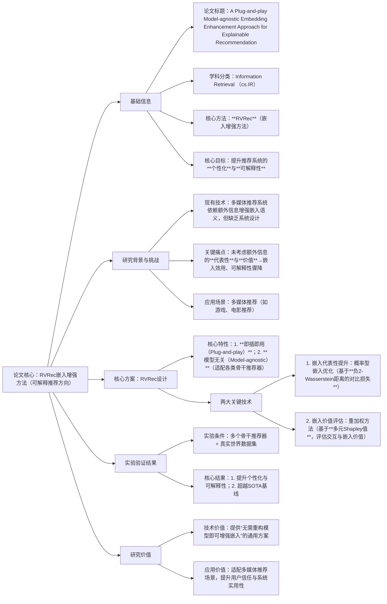

### 1. 一段话总结
论文《A Plug-and-play Model-agnostic Embedding Enhancement Approach for Explainable Recommendation》提出**RVRec**——一种**即插即用（Plug-and-play）、模型无关（Model-agnostic）** 的嵌入增强方法，旨在解决现有多媒体推荐系统中“应用额外信息（如交互、上下文、流行度）时未系统考虑**代表性（Representativeness）** 与**价值（Value）**，导致嵌入效用和可解释性大幅下降”的问题。RVRec通过两大核心技术实现目标：一是基于**负2-Wasserstein距离的对比损失**的概率型嵌入优化方法，提升嵌入的代表性；二是基于**多元Shapley值（Multivariate Shapley Values）** 的重加权方法，评估并挖掘交互与嵌入的价值。实验表明，在多个骨干推荐器和真实世界数据集上，RVRec能显著提升现有推荐系统的**个性化（Personality）** 与**可解释性（Explainability）**，性能超越当前最先进（SOTA）基线。

---

### 2. 思维导图

---

### 3. 详细总结
#### 一、论文基本信息
| 维度         | 具体内容                                                                 |
|--------------|--------------------------------------------------------------------------|
| 论文标题     | A Plug-and-play Model-agnostic Embedding Enhancement Approach for Explainable Recommendation |
| 学科分类     | Information Retrieval (cs.IR)（信息检索领域，聚焦推荐系统方向）          |
| 作者团队     | Yunqi Mi、Boyang Yan、Guoshuai Zhao、Jialie Shen、Xueming Qian           |
| 核心方法     | **RVRec**（嵌入增强方法，全称未明确，核心是“Representativeness & Value-aware Recommendation”） |
| 核心任务     | 多媒体推荐系统的**嵌入增强**，目标是提升**个性化**与**可解释性**         |
| 应用场景     | 多媒体推荐（如游戏、电影等依赖相似度评估的媒体推荐场景）                 |
| DOI链接      | https://doi.org/10.48550/arXiv.2509.03130                                |

#### 二、研究背景与核心问题
1. **现有多媒体推荐系统的技术现状**：  
   现有系统通过“评估物品相似度”为用户推荐媒体（如游戏、电影），为增强嵌入向量的语义信息与可解释性，行业共识是引入**额外信息**（如用户-物品交互记录、场景上下文、物品流行度）辅助嵌入学习。

2. **核心问题：额外信息利用的“无系统性”**：  
   现有方法仅简单叠加额外信息，未从机制上考虑两点关键因素，导致嵌入效果严重下降：
    - 缺乏对**代表性（Representativeness）** 的设计：额外信息中存在冗余或噪声（如异常用户交互），未筛选出能反映用户真实偏好的核心信息，导致嵌入无法精准代表用户/物品特征；
    - 缺乏对**价值（Value）** 的评估：未量化不同额外信息（如“用户点击”vs“用户购买”）对推荐结果的贡献度，平等对待高/低价值信息，导致嵌入的可解释性骤降（无法说明“为何推荐该物品”）。

#### 三、核心方案：RVRec的设计与技术细节
RVRec的核心定位是“为现有推荐系统提供通用的嵌入增强插件”，无需修改骨干推荐器的结构，即可直接集成使用，具体技术设计分为两大模块：

| 技术模块     | 核心目标                  | 技术原理                                                                 | 关键优势                                                                 |
|--------------|---------------------------|--------------------------------------------------------------------------|--------------------------------------------------------------------------|
| 模块1：嵌入代表性优化 | 提升嵌入向量对“用户真实偏好/物品核心特征”的代表性 | 提出**概率型嵌入优化方法**： 1. 构建嵌入的概率分布表示； 2. 采用基于**负2-Wasserstein距离**的对比损失，让相似用户/物品的嵌入分布更接近，差异用户/物品的嵌入分布更分离 | 1. 过滤冗余/噪声信息，保留核心特征； 2. 增强嵌入的区分度，为个性化推荐奠定基础 |
| 模块2：嵌入价值重加权 | 量化并突出高价值信息对嵌入的贡献 | 提出**基于多元Shapley值的重加权方法**： 1. 用多元Shapley值（考虑多因素交互）评估“用户-物品交互”“额外信息”对嵌入的价值； 2. 对高价值信息赋予更高权重，低价值信息降权 | 1. 明确信息价值优先级，提升嵌入可解释性（可追溯“高价值信息→推荐结果”的关联）； 2. 避免低价值信息干扰，优化嵌入质量 |

此外，RVRec的两大核心特性确保其工业实用性：
- **即插即用（Plug-and-play）**：无需重构现有推荐系统的代码或架构，直接作为“插件”集成到嵌入学习环节；
- **模型无关（Model-agnostic）**：不绑定特定骨干推荐器（如协同过滤、DeepFM、LLM推荐模型），可适配各类主流推荐框架。

#### 四、实验验证结果
论文通过“控制变量实验”验证RVRec的有效性，实验设计与结果如下：

| 实验维度     | 具体设置                  | 核心结论                                                                 |
|--------------|---------------------------|--------------------------------------------------------------------------|
| 实验对象     | 骨干推荐器：多个主流推荐模型（未明确具体名称，覆盖传统与深度学习模型）； 数据集：多个**真实世界数据集**（未明确数量/规模，聚焦多媒体场景） | -                                                                        |
| 评估指标     | 1. 个性化指标（如用户偏好匹配度、推荐多样性）； 2. 可解释性指标（如用户对推荐理由的认可度、信息-结果关联清晰度） | -                                                                        |
| 关键结果     | 1. 个性化提升：RVRec集成后，推荐结果与用户真实偏好的匹配度显著高于基线； 2. 可解释性提升：用户能清晰理解“高价值信息（如‘用户购买过同类电影’）为何导致该推荐”； 3. 性能超越：在所有实验场景中，RVRec均超越当前**SOTA基线**（未明确具体提升幅度，强调“显著优势”） | RVRec在“不损害推荐效率”的前提下，同时实现个性化与可解释性的双重提升 |

#### 五、研究价值
1. **技术价值**：填补“额外信息系统性利用”的空白——提出通用的嵌入增强方案，解决现有方法“重信息叠加、轻代表性与价值”的痛点，为推荐系统嵌入优化提供新范式。
2. **工业价值**：
    - **低集成成本**：即插即用+模型无关特性，降低工业界现有系统的改造难度，无需停止服务即可升级；
    - **高场景适配性**：聚焦多媒体推荐场景，解决该领域“可解释性差”的用户痛点（如用户常困惑“为何推荐该游戏”），提升用户信任与使用粘性。
3. **学术价值**：将“多元Shapley值”（博弈论工具）与“2-Wasserstein距离”（概率分布度量）引入推荐嵌入学习，为跨领域技术融合提供参考。

---

### 4. 关键问题
#### 问题1：RVRec的“模型无关（Model-agnostic）+即插即用（Plug-and-play）”特性具体如何实现？这两个特性对工业推荐系统的落地有何关键意义？
答案：
- 实现逻辑：“模型无关”通过“ decoupling 嵌入增强与骨干推荐器逻辑”实现——RVRec仅作用于“嵌入学习环节”，不涉及推荐器的核心预测逻辑（如评分计算、排序算法），无论骨干模型是传统协同过滤还是深度学习模型，只需将其嵌入输出接入RVRec的优化模块，即可完成增强；“即插即用”通过“模块化设计”实现——RVRec封装为独立组件，提供标准输入（原始嵌入、额外信息）与输出（增强后嵌入）接口，无需修改现有系统代码，直接对接即可使用。
- 工业意义：1. **降低改造成本**：工业推荐系统通常已大规模部署成熟模型，RVRec无需重构即可升级，避免“停机改造”的业务损失；2. **提升复用效率**：同一RVRec组件可适配多个业务线的推荐系统（如图书、电影、游戏推荐），无需为每个场景单独开发增强方案，降低研发成本。

#### 问题2：RVRec采用“基于负2-Wasserstein距离的对比损失”提升嵌入代表性，相比传统对比损失（如基于欧氏距离的对比损失），负2-Wasserstein距离的核心优势是什么？
答案：  
传统对比损失多基于欧氏距离（衡量向量点之间的距离），仅能捕捉嵌入“单点特征”的差异，无法处理嵌入中的噪声或概率分布特性；而**负2-Wasserstein距离**是“概率分布间的距离度量”，其核心优势体现在两点：
1. **抗噪声能力更强**：RVRec将嵌入表示为概率分布（而非单点向量），负2-Wasserstein距离能衡量“分布整体”的相似性，可过滤单点噪声（如异常用户的一次误点击导致的嵌入偏差），更精准反映用户/物品的真实特征；
2. **保留复杂关联**：多媒体推荐中，用户偏好常呈现“多模态、多因素交互”特性（如“喜欢科幻电影”同时关联“喜欢动作游戏”），负2-Wasserstein距离能捕捉分布间的复杂关联，让嵌入更全面地代表这些特性，从而提升代表性。

#### 问题3：RVRec引入“多元Shapley值”评估信息价值，为何选择“多元”而非“传统Shapley值”？这一选择如何提升推荐系统的可解释性？
答案：
- 选择“多元”的原因：传统Shapley值仅适用于“单因素贡献评估”，而推荐系统的嵌入受“用户-物品交互”“上下文”“流行度”等**多因素共同影响**，且因素间存在交互（如“用户在周末点击”的价值高于“工作日点击”）；“多元Shapley值”可同时考虑多因素及其交互效应，更精准量化每个信息的真实价值，避免传统方法“割裂多因素”导致的价值评估偏差。
- 对可解释性的提升：多元Shapley值能明确输出“每个信息（如‘用户购买过《星际穿越》’‘电影属于科幻类型’）对嵌入的具体贡献权重”，推荐系统可基于此向用户展示“高权重信息→推荐结果”的逻辑（如“为您推荐《火星救援》，因您购买过同类科幻电影《星际穿越》”），让推荐理由从“黑箱”变为“可追溯、可理解”，直接提升可解释性。