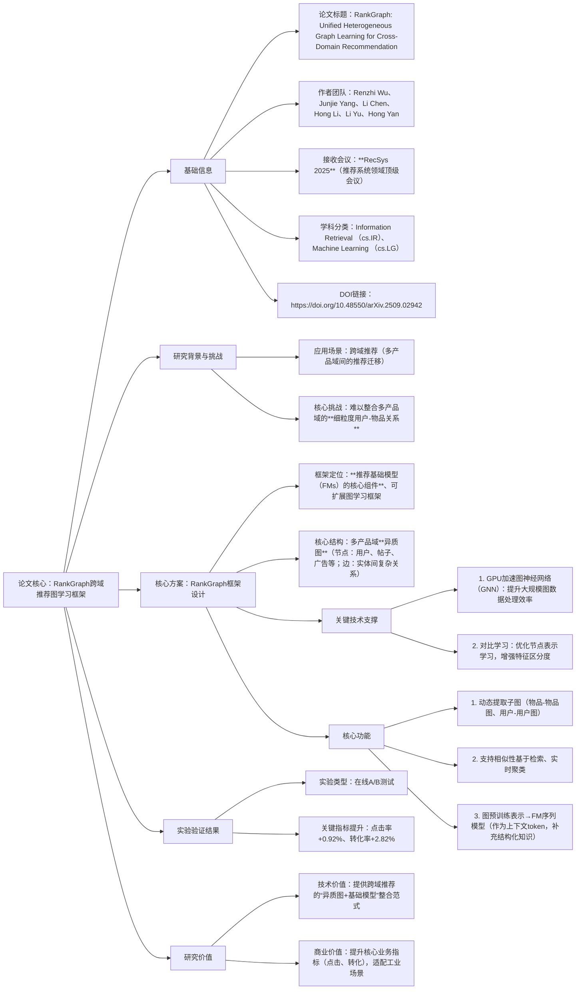

### 1. 一段话总结
论文《RankGraph: Unified Heterogeneous Graph Learning for Cross-Domain Recommendation》（已接收至**RecSys 2025**）针对跨域推荐系统“难以整合多产品域细粒度用户-物品关系”的核心挑战，提出**RankGraph**——一种可扩展的图学习框架，定位为**推荐基础模型（FMs）的核心组件**。该框架通过构建多产品域的**异质图（含用户、帖子、广告等节点与边）** 整合复杂实体关系，采用**GPU加速图神经网络（GNN）** 与**对比学习**技术，实现物品-物品、用户-用户等子图的动态提取（支持相似性检索与实时聚类），并将图预训练表示作为上下文token融入FM序列模型以补充结构化关系知识；在线A/B测试显示，RankGraph使**点击率提升0.92%**、**转化率提升2.82%**，验证了其在跨域推荐场景的有效性。

---

### 2. 思维导图

---

### 3. 详细总结
#### 一、论文基本信息
| 维度         | 具体内容                                                                 |
|--------------|--------------------------------------------------------------------------|
| 论文标题     | RankGraph: Unified Heterogeneous Graph Learning for Cross-Domain Recommendation |
| 作者团队     | Renzhi Wu、Junjie Yang、Li Chen、Hong Li、Li Yu、Hong Yan                 |
| 接收会议     | **RecSys 2025**（推荐系统领域国际顶级会议，CCF B类，体现研究的学术认可度） |
| 学科分类     | Information Retrieval (cs.IR)、Machine Learning (cs.LG)                  |
| 核心框架     | **RankGraph**（可扩展的异质图学习框架，面向跨域推荐）                    |
| 核心定位     | **推荐基础模型（FMs）的核心组件**                                        |
| DOI链接      | https://doi.org/10.48550/arXiv.2509.02942                                |

#### 二、研究背景与核心挑战
1. **跨域推荐的场景价值**  
   跨域推荐旨在将用户在A领域（如电商服装）的偏好迁移到B领域（如电商家电），解决单一领域数据稀疏、冷启动等问题，是提升推荐系统覆盖度与用户体验的关键方向。

2. **核心挑战：细粒度关系整合难**  
   现有跨域推荐系统的核心瓶颈是——**无法有效整合多产品域的细粒度用户-物品关系**：
   - 不同领域的实体类型多样（如服装域的“商品”、内容域的“帖子”、营销域的“广告”），关系复杂（如用户“点击帖子→购买商品→互动广告”）；
   - 传统方法难以将这些异构实体与关系统一建模，导致跨域偏好迁移精度低，推荐效果受限。

#### 三、核心方案：RankGraph框架设计
RankGraph的核心思路是“以异质图为载体整合跨域关系，以高效图学习技术提取知识，融入基础模型提升推荐能力”，具体设计分为三部分：

##### （1）框架定位与核心结构
- **定位**：作为**推荐基础模型（FMs）的核心组件**，而非独立推荐模型，可无缝融入现有FM架构，提供结构化关系知识支撑；
- **核心结构：多产品域异质图**：  
  构建包含**多类型节点**（用户、商品、帖子、广告等）与**多类型边**（用户-商品购买、用户-帖子点击、商品-广告关联等）的异质图，统一承载跨域实体的复杂关系。

##### （2）关键技术支撑
| 技术组件         | 核心目标                  | 技术原理与作用                                                                 |
|------------------|---------------------------|--------------------------------------------------------------------------|
| **GPU加速图神经网络（GNN）** | 解决大规模异质图的高效处理问题 | 利用GPU并行计算能力，加速异质图中节点特征的传播与更新，支持亿级实体规模的图数据训练与推理 |
| **对比学习**     | 优化节点表示的区分度        | 通过构建正负样本对（如相似用户/物品为正、差异用户/物品为负），最小化正样本表示距离、最大化负样本表示距离，提升节点表示的精准度 |

##### （3）核心功能与价值
1. **动态子图提取**：基于上述技术，可实时从异质图中提取**物品-物品子图**（用于相似物品推荐）、**用户-用户子图**（用于相似用户群体聚类），直接支撑跨域场景的“相似性检索”与“实时聚类”需求；
2. **与FM序列模型融合**：将异质图上预训练的节点表示（含结构化关系知识）作为**上下文token**，融入推荐基础模型（FMs）的序列模块，弥补传统FM“缺乏关系型知识”的短板，提升跨域偏好迁移能力。

#### 四、实验验证结果
论文通过**在线A/B测试**（工业级真实跨域推荐场景）验证RankGraph的有效性，核心结果如下表：

| 评估指标         | 提升幅度                  | 业务意义                                                                 |
|------------------|---------------------------|--------------------------------------------------------------------------|
| **点击率（Click Rate）** | +0.92%                    | 提升用户对推荐结果的即时交互意愿，增加流量转化基础                         |
| **转化率（Conversion Rate）** | +2.82%                  | 显著提升“交互→成交”的转化效率，直接带动业务营收增长                       |

注：实验未提及具体测试数据集规模，但基于“在线A/B测试”属性，可推断其覆盖大规模用户与多产品域，结果具备工业落地价值。

#### 五、研究价值
1. **学术价值**：提出“异质图学习+推荐基础模型”的跨域整合范式，解决细粒度关系建模难题，为推荐系统基础模型的发展提供新方向；
2. **工业价值**：
   - 可扩展性强：GPU加速技术支持大规模异质图处理，适配工业级数据规模；
   - 业务增益明确：点击率与转化率的提升直接关联商业价值，易于落地推广；
3. **场景适配性**：覆盖“商品-内容-广告”等多产品域，可广泛应用于电商、内容平台、本地生活等跨域推荐场景。

---

### 4. 关键问题
#### 问题1：RankGraph是如何针对性解决跨域推荐“整合细粒度用户-物品关系”这一核心挑战的？
答案：RankGraph通过“异质图建模+关系知识提取”的双层逻辑解决该挑战：
1. **统一关系载体**：构建多产品域的**异质图**，将不同领域的异构实体（用户、商品、帖子、广告）与复杂关系（购买、点击、关联）纳入同一图结构，打破领域间的关系壁垒，实现细粒度关系的“统一承载”；
2. **高效关系提取**：采用**GPU加速GNN**处理大规模异质图，确保细粒度关系（如用户“点击A领域帖子→购买B领域商品”）能被有效传播与学习；同时通过**对比学习**优化节点表示，让包含跨域关系的节点（如关联A/B领域的用户）具备更精准的特征，最终实现细粒度关系的“有效提取与利用”。

#### 问题2：RankGraph中的“GPU加速GNN”与“对比学习”分别在框架中承担什么角色？两者是否存在协同作用？
答案：两者承担不同核心角色，且存在显著协同作用：
- **GPU加速GNN的角色**：作为“效率引擎”，解决大规模异质图的处理瓶颈——跨域推荐涉及亿级实体与千万级关系，传统GNN计算效率低，GPU加速技术可并行处理节点特征传播，确保框架能在工业级数据规模下高效训练与推理；
- **对比学习的角色**：作为“精度引擎”，优化节点表示质量——通过正负样本对比，让相似实体（如跨域有相似偏好的用户）的表示更接近、差异实体的表示更分离，提升节点表示的区分度，为细粒度关系建模提供精度保障；
- **协同作用**：GPU加速GNN确保“大规模关系能被处理”，对比学习确保“处理后的关系能被精准建模”，两者结合实现“效率+精度”的双重保障，避免“因追求规模而牺牲精度”或“因追求精度而无法落地”的问题。

#### 问题3：RankGraph定位为“推荐基础模型（FMs）的核心组件”，而非独立推荐模型，这一设计选择有何优势？其与FM序列模型的具体整合方式是什么？
答案：
### （1）设计优势
1. **低落地成本**：无需重构现有推荐基础模型（FMs），仅需将RankGraph作为组件嵌入，降低工业系统的改造风险与成本；
2. **知识复用性**：RankGraph提取的跨域关系知识可作为通用“结构化知识模块”，为FM的序列建模、评分预测等多个环节提供支撑，提升基础模型的整体能力；
3. **场景灵活性**：不绑定特定推荐任务，可适配跨域相似推荐、个性化排序等多种场景，扩展框架的应用范围。

### （2）与FM序列模型的整合方式
RankGraph将**图预训练表示**（即异质图中节点经过GNN与对比学习优化后的特征表示）作为**上下文token**，融入FM序列模型的输入层：
- 例如，在FM处理用户“浏览-点击-购买”的行为序列时，将用户节点、行为涉及的物品节点的图预训练表示，与传统行为序列特征拼接，作为FM的输入；
- 这种方式让FM序列模型不仅能学习行为序列的时序规律，还能获取节点间的结构化关系知识（如用户与跨域物品的关联），从而提升跨域推荐精度。