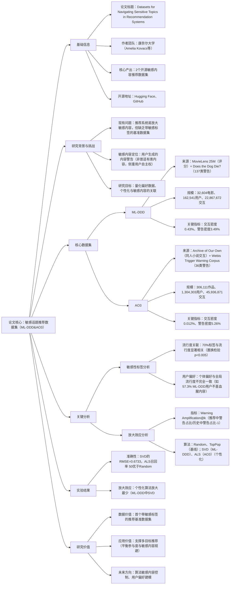

### 1. 一段话总结
论文《Datasets for Navigating Sensitive Topics in Recommendation Systems》由康奈尔大学团队提出，核心贡献是构建了**两个融合敏感内容标签的推荐系统数据集**：**ML-DDD**（整合MovieLens 25M电影评分数据与Does the Dog Die?社区生成的137类敏感警告）和**AO3**（整合Archive of Our Own同人小说交互数据与Webis Trigger Warning Corpus的36类触发警告）。通过敏感性标签分析发现，**70%的敏感标签与内容流行度存在显著关联**（p值<0.005）；针对Random、TopPop、SVD/ALS三种推荐算法的放大效应分析显示，**个性化算法（SVD/ALS）对敏感内容的放大程度显著低于非个性化基线**（ML-DDD中SVD放大最少，AO3中ALS放大最少）。数据集已开源（Hugging Face与GitHub），为研究推荐系统敏感内容放大与用户自主权提供了关键基准。

---

### 2. 思维导图

---

### 3. 详细总结
#### 一、基础信息表
| 维度                | 具体内容                                                                 |
|---------------------|--------------------------------------------------------------------------|
| 论文标题            | Datasets for Navigating Sensitive Topics in Recommendation Systems        |
| 作者团队            | Amelia Kovacs、Jerry Chee、Kimia Kazemian、Sarah Dean（康奈尔大学）        |
| 核心产出            | **ML-DDD**、**AO3**两个敏感内容推荐数据集                               |
| 开源资源            | Hugging Face（数据集）、GitHub（代码与处理流程）                          |
| 研究领域            | 推荐系统、敏感内容分析、算法放大效应                                      |
| 关键指标            | Warning Amplification@k、RMSE、Precision@k、Recall@k                     |

#### 二、研究背景与动机
1. **现实问题**  
   个性化推荐系统常因追求“参与度最大化”放大敏感内容（如TikTok的饮食障碍内容、YouTube的极端内容），但缺乏**带敏感标签的基准数据集**，导致相关研究多为理论或人工审计，难以量化分析。

2. **核心定位**  
   聚焦**用户生成的内容警告（Content Warnings）**，而非普适有害内容（如仇恨言论），强调“用户自主权”——用户应能自主规避敏感内容（如动物死亡、血腥场景），而非直接封禁。

3. **研究目标**
    - 构建融合“用户-内容交互”与“敏感标签”的数据集；
    - 分析敏感标签与内容流行度、用户偏好的关联；
    - 评估主流推荐算法对敏感内容的“放大效应”。

#### 三、核心数据集详解
两个数据集均包含“敏感标签表”（物品-警告关联）与“交互表”（用户-物品交互），关键统计如下：

| 指标                | ML-DDD（电影领域）                                                    | AO3（同人小说领域）                                                  |
|---------------------|-----------------------------------------------------------------------|-----------------------------------------------------------------------|
| 数据来源            | MovieLens 25M（评分0.5-5分）+ Does the Dog Die?（社区警告）             | Archive of Our Own（点击/点赞）+ Webis Trigger Warning Corpus（警告分类） |
| 物品数量            | 32,604部电影                                                          | 306,111部同人小说                                                    |
| 用户数量            | 162,541名用户                                                         | 1,304,303名用户                                                      |
| 交互数量            | 22,867,672条评分交互                                                 | 45,936,871条点赞交互                                                 |
| 敏感警告类型        | 137类（如“血腥”“枪支暴力”“宠物死亡”）                                 | 36类（如“色情”“暴力”“精神健康问题”）                                 |
| 警告密度            | 3.49%（警告-物品关联数/总可能关联数）                                | 5.26%                                                                 |
| 交互密度            | 0.43%（交互数/用户×物品）                                            | 0.012%（更稀疏）                                                     |
| 标签判定规则        | 75%投票“是”=Clear Yes；75%“否”=Clear No                               | 直接采用Webis Corpus的标签标注                                        |

#### 四、关键分析
##### 1. 敏感性标签与流行度/用户偏好分析
通过**置换检验**（检验警告与流行度的相关性）和用户个体偏好统计，得出以下结论：
- **流行度关联**：  
  70%的ML-DDD标签和70%的AO3标签与流行度显著相关（p<0.005）。例如：
    - ML-DDD中“血腥”标签与评分负相关（Diff=-0.15），即血腥电影评分更低；
    - AO3中“色情”标签与点赞数正相关（Diff=34.9），即色情内容更受欢迎。
- **个体偏好差异**：  
  个体偏好与全局流行度不完全一致。例如：
    - 57.3%的ML-DDD用户对“血腥”内容的评分低于非血腥内容；
    - 72.6%的AO3用户对“色情”内容的交互多于非色情内容，与全局趋势一致。

##### 2. 推荐算法敏感内容放大效应分析
定义**Warning Amplification@k =（推荐中警告占比/历史中警告占比）- 1**，0表示无放大，正值表示放大。测试了3类算法：
- **基线算法**：Random（随机推荐）、TopPop（推荐最流行物品）；
- **个性化算法**：ML-DDD用SVD（矩阵分解）；AO3用ALS（适配隐式交互的矩阵分解）。

核心发现：
- **ML-DDD中**：TopPop放大最严重（依赖流行度，部分流行内容含警告）；SVD放大最少（个性化建模降低无关警告推荐）；
- **AO3中**：Random放大最严重（数据集警告密度高，随机命中概率高）；ALS放大最少（捕捉用户偏好，规避非偏好警告内容）。

#### 五、实验结果
##### 1. 算法准确性评估
| 数据集   | 算法    | RMSE（预测准确性） | Precision@10 | Recall@50 | F1@100 |
|----------|---------|--------------------|--------------|-----------|--------|
| ML-DDD   | Random  | -                  | 1.00e-4      | 2.00e-5   | 2.67e-3 |
|          | TopPop  | -                  | 1.00e-4      | 2.00e-5   | 2.67e-3 |
|          | SVD     | 0.6733             | 2.10e-3      | 8.82e-3   | 4.29e-4 |
| AO3      | Random  | -                  | 4.82e-4      | 3.29e-3   | 1.26e-3 |
|          | TopPop  | -                  | 4.64e-5      | 5.99e-3   | 9.40e-5 |
|          | ALS     | -                  | 4.27e-4      | 2.51e-3   | 1.01e-4 |
*注：SVD为显式评分预测，ALS/Random/TopPop直接生成推荐，评估分类准确性*

##### 2. 放大效应核心结果
| 数据集   | 算法    | 平均放大得分（越低越好） | 关键结论                     |
|----------|---------|--------------------------|------------------------------|
| ML-DDD   | Random  | 接近0                     | 低警告密度下随机推荐无明显放大 |
|          | TopPop  | 最高                      | 流行度驱动放大敏感内容       |
|          | SVD     | 最低                      | 个性化建模抑制放大           |
| AO3      | Random  | 最高                      | 高警告密度下随机推荐易放大   |
|          | TopPop  | 中等                      | 流行度与警告正相关导致放大   |
|          | ALS     | 最低                      | 隐式偏好建模抑制放大         |

#### 六、结论与研究价值
1. **核心结论**
    - 两个数据集为敏感内容推荐研究提供了基准；
    - 敏感标签与内容流行度显著相关，但个体偏好存在差异；
    - **个性化推荐算法（SVD/ALS）对敏感内容的放大程度显著低于非个性化基线**。

2. **研究价值**
    - 数据价值：首个融合“交互+敏感标签”的推荐数据集，填补领域空白；
    - 应用价值：支撑多目标推荐系统设计（平衡参与度与敏感内容规避）；
    - 未来方向：探索敏感内容的算法控制策略、用户负偏好建模、多模态敏感标签扩展。

---

### 4. 关键问题
#### 问题1：ML-DDD与AO3两个数据集的核心差异是什么？这些差异对推荐系统研究有何影响？
**答案**：核心差异体现在**数据类型、稀疏性、警告特征**三方面，影响研究场景与算法选择：
1. **数据类型**：ML-DDD是**显式交互**（0.5-5分评分），可直接区分用户喜好；AO3是**隐式交互**（仅点赞，无负反馈），需算法推断偏好；
2. **稀疏性**：ML-DDD交互密度0.43%，AO3仅0.012%，AO3更适合研究“稀疏交互下的敏感内容推荐”；
3. **警告特征**：ML-DDD警告（137类）更细分（如“宠物死亡”“针头场景”），AO3警告（36类）更聚焦核心敏感话题（如“色情”“暴力”）。  
   影响：ML-DDD适合显式偏好下的敏感内容过滤研究，AO3适合隐式稀疏场景下的算法放大效应分析。

#### 问题2：论文中“敏感性标签与内容流行度的关联”有何具体发现？这一发现对推荐系统设计有什么启示？
**答案**：具体发现为**70%的敏感标签与流行度存在统计显著关联（p<0.005），且关联方向因领域而异**：
- 电影领域（ML-DDD）：多数标签与流行度负相关（如“血腥”Diff=-0.15、“枪支暴力”Diff=-0.08）；
- 同人小说领域（AO3）：部分标签与流行度正相关（如“色情”Diff=34.9、“性虐待”Diff=24.0）。  
  启示：推荐系统需**分领域设计敏感内容策略**——电影推荐中“流行度优先”（TopPop）会自然减少负面敏感内容，但AO3中“流行度优先”会放大色情等敏感内容，需结合个性化建模（如ALS）抑制放大。

#### 问题3：推荐算法对敏感内容的“放大效应”有何关键发现？为什么个性化算法（SVD/ALS）能抑制放大？
**答案**：关键发现为**个性化算法对敏感内容的放大程度显著低于非个性化基线**：
- ML-DDD：SVD平均放大得分最低，TopPop最高（依赖流行度，与部分警告正相关）；
- AO3：ALS平均放大得分最低，Random最高（数据集警告密度高，随机命中概率高）。  
  抑制放大的原因：
1. **偏好精准建模**：SVD/ALS通过矩阵分解学习用户-物品潜在因子，仅推荐符合用户历史偏好的内容，避免因“流行度”或“随机”引入无关敏感内容；
2. **适配交互类型**：ALS针对AO3的隐式交互，通过置信度学习区分“不喜欢”与“未见过”，减少敏感内容误推荐；
3. **规避全局偏差**：不依赖“流行度”等全局信号，而是基于用户个体历史，降低全局流行但用户不偏好的敏感内容推荐概率。