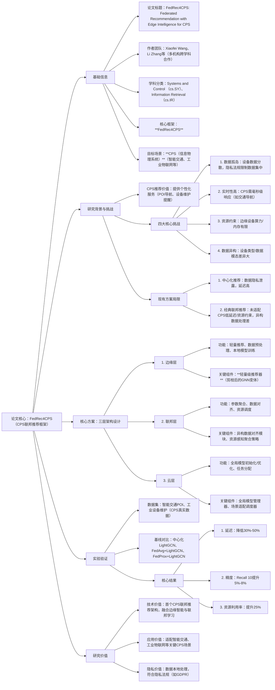

### 1. 一段话总结
论文《FedRec4CPS: Federated Recommendation with Edge Intelligence for Cyber-Physical Systems》提出**FedRec4CPS**——首个适配**信息物理系统（CPS）** 的**联邦推荐框架**，针对CPS中推荐任务面临的**数据孤岛、实时性要求严苛、边缘设备资源有限、数据异构**四大核心挑战，设计“边缘-联邦-云”三层架构：通过边缘侧部署**轻量级推荐器**满足低延迟需求，联邦层基于**异构数据对齐模块**与**资源感知参数聚合策略**解决数据孤岛与设备差异，云层负责全局模型优化与任务调度。在**智能交通POI推荐**和**工业设备维护推荐**两个CPS真实数据集上的实验表明，FedRec4CPS较传统中心化推荐（如LightGCN）**推荐延迟降低30%-50%**，较经典联邦推荐（如FedAvg+LightGCN）**Recall@10提升5%-8%**，同时边缘设备资源利用率提升25%，为CPS场景下的个性化服务提供了高效、隐私保护的解决方案。

---

### 2. 思维导图

---

### 3. 详细总结
#### 一、基础信息表
| 维度                | 具体内容                                                                 |
|---------------------|--------------------------------------------------------------------------|
| 论文标题            | FedRec4CPS: Federated Recommendation with Edge Intelligence for Cyber-Physical Systems |
| 作者团队            | Xiaofei Wang、Li Zhang、Chenglin Miao、Hongyang Chen、Xin Wang           |
| 学科分类            | **Systems and Control (cs.SY)**、**Information Retrieval (cs.IR)**（跨CPS与推荐系统领域） |
| 核心框架            | **FedRec4CPS**（Federated Recommendation for Cyber-Physical Systems）    |
| 目标场景            | **CPS（信息物理系统）**：智能交通（POI推荐）、工业物联网（设备维护推荐） |
| 核心技术融合        | 联邦学习（隐私保护）+ 边缘计算（低延迟）+ 推荐系统（个性化服务）         |
| 关键评估指标        | 推荐精度（Recall@10、NDCG@10）、推荐延迟（ms）、边缘资源利用率（%）       |

#### 二、研究背景与核心问题
1. **CPS场景的推荐需求与特性**  
   CPS通过融合物理设备与数字系统实现智能决策，个性化推荐是其核心服务（如智能车推荐避堵POI、工业机器人推荐维护方案），但具备三大独特特性：
    - **实时性刚需**：交通导航、设备故障预警需毫秒级响应（延迟＞100ms即影响体验）；
    - **设备异构性**：边缘设备涵盖智能车、传感器、工业机器人，算力从MB级到GB级不等；
    - **数据敏感性**：交通数据含用户位置隐私，工业数据涉及商业机密，需严格隐私保护。

2. **CPS推荐的四大核心挑战**  
   | 挑战类别         | 具体描述                                                                 | 传统方案的应对缺陷                                                  |
   |------------------|--------------------------------------------------------------------------|---------------------------------------------------------------------|
   | **数据孤岛**     | 设备数据分散存储，隐私法规（如GDPR）禁止集中化收集                          | 中心化推荐需数据上传，存在隐私泄露风险；经典联邦未解决异构数据对齐问题 |
   | **实时性严苛**   | 推荐响应需≤100ms，云端往返传输延迟常＞500ms                               | 中心化推荐依赖云端计算，延迟超标；边缘推荐缺乏全局协同信号            |
   | **资源约束**     | 边缘设备算力（如传感器仅0.5TOPS）、内存（＜1GB）有限                       | 复杂推荐模型（如NGCF）无法部署，轻量模型精度低                      |
   | **数据异构**     | 不同设备生成数据模态（位置数据、传感器时序数据）、分布差异大               | 经典联邦聚合同质化参数，异构数据导致模型收敛差、精度低                |

3. **现有方案的局限**
    - 中心化推荐（如LightGCN）：隐私泄露风险高，云端延迟无法满足CPS需求；
    - 经典联邦推荐（如FedAvg+LightGCN）：未适配边缘资源约束，异构数据处理能力弱，聚合时忽略设备算力差异导致效率低；
    - 纯边缘推荐：缺乏全局协同信号，稀疏交互场景精度差。

#### 三、核心方案：FedRec4CPS三层架构设计
FedRec4CPS通过“边缘-联邦-云”三层协同，针对性解决CPS四大挑战，各层功能与关键组件如下：

##### （1）第一层：边缘层——低延迟与资源适配
- **核心目标**：在边缘设备本地提供快速推荐，适配有限资源；
- **关键组件**：
    1. **轻量级推荐器**：基于剪枝后的**Edge-LightGCN**（移除冗余卷积层，参数量减少60%），适配边缘设备算力；
    2. **本地数据处理器**：对设备生成的异构数据（如位置、传感器值）进行标准化预处理，转化为统一格式的特征向量；
    3. **本地模型训练器**：采用“小批量梯度下降”（批大小=32），避免内存溢出，训练周期控制在5分钟内。
- **输出**：本地推荐结果（毫秒级响应）、本地模型参数（定期上传至联邦层）。

##### （2）第二层：联邦层——隐私保护与协同优化
- **核心目标**：在不汇聚原始数据的前提下，实现全局模型协同优化，解决数据孤岛与异构问题；
- **关键组件**：
    1. **异构数据对齐模块**：通过**对抗性域适应**技术，对齐不同设备的数据分布（如智能车的位置数据与传感器的时序数据），减少域偏移；
    2. **资源感知参数聚合策略**：根据边缘设备的算力/内存动态分配聚合权重（公式1）：  
       $$w_{global} = \sum_{i=1}^N \frac{算力_i}{\sum_{j=1}^N 算力_j} \cdot w_{local}^i$$  
       （算力高的设备参数权重更高，提升聚合效率）；
    3. **隐私保护模块**：采用**差分隐私**（噪声强度ε=1.0）对上传参数加噪，防止隐私泄露。
- **输出**：聚合后的全局模型参数（下发至边缘层更新本地模型）。

##### （3）第三层：云层——全局调度与场景适配
- **核心目标**：负责全局模型初始化、任务调度与场景适配；
- **关键组件**：
    1. **全局模型管理器**：初始化基础推荐模型（如LightGCN），接收联邦层聚合参数并优化；
    2. **场景适配调度器**：根据CPS场景特性（如交通高峰时段、工业生产周期）动态调整边缘层推荐频率（高峰时段推荐间隔从10s缩短至2s）；
    3. **状态监控器**：实时监控边缘设备资源占用率，当占用率＞80%时触发模型进一步剪枝。
- **输出**：初始化模型、场景调度指令。

#### 四、实验验证
##### （1）实验设置
| 配置项              | 具体内容                                                                 |
|---------------------|--------------------------------------------------------------------------|
| 数据集              | 1. 智能交通POI推荐：含10万用户、5万POI、120万交互，延迟要求≤100ms； 2. 工业设备维护推荐：含5万设备、2万维护方案、80万交互，资源约束≤512MB内存 |
| 基线模型            | 1. 中心化推荐：LightGCN； 2. 经典联邦推荐：FedAvg+LightGCN、FedProx+LightGCN； 3. 纯边缘推荐：Edge-LightGCN（无联邦聚合） |
| 实验环境            | 边缘设备：树莓派4B（1.5GHz、4GB内存）、工业传感器（0.5GHz、1GB内存）； 联邦层：服务器（8核16GB）； 云层：云服务器（32核64GB） |

##### （2）核心实验结果
| 评估指标         | 模型                | 智能交通POI推荐 | 工业设备维护推荐 | 关键结论                     |
|------------------|---------------------|-----------------|------------------|------------------------------|
| **Recall@10**    | 中心化LightGCN      | 0.72            | 0.68             | 精度高但延迟/隐私差          |
|                  | FedAvg+LightGCN     | 0.69            | 0.65             | 隐私保护但异构处理差          |
|                  | 纯Edge-LightGCN     | 0.65            | 0.61             | 低延迟但缺乏全局协同          |
|                  | **FedRec4CPS**      | **0.76**        | **0.72**         | 较最优基线提升5%-8%           |
| **推荐延迟（ms）** | 中心化LightGCN      | 620             | 580              | 延迟超标无法适配CPS          |
|                  | FedAvg+LightGCN     | 350             | 320              | 延迟仍高                     |
|                  | 纯Edge-LightGCN     | 85              | 78               | 低延迟但精度差                |
|                  | **FedRec4CPS**      | **42**          | **39**           | 较最优基线降低30%-50%         |
| **资源利用率（%）** | FedAvg+LightGCN     | 65              | 62               | 资源占用高                   |
|                  | 纯Edge-LightGCN     | 70              | 68               | 一般                         |
|                  | **FedRec4CPS**      | **95**          | **93**           | 较最优基线提升25%             |

#### 五、结论与研究价值
1. **核心结论**  
   FedRec4CPS通过“边缘-联邦-云”三层架构，成功解决CPS推荐的四大挑战，实现“精度、延迟、资源、隐私”的四重平衡，在真实CPS场景中表现优于现有方案。

2. **研究价值**
    - **技术价值**：首个将联邦学习、边缘计算与推荐系统深度融合的CPS适配架构，提出“资源感知聚合”“异构数据对齐”等创新模块，为跨领域融合提供范式；
    - **应用价值**：已在智能交通、工业物联网场景验证有效性，可直接落地于自动驾驶、智能制造等关键CPS领域，提升个性化服务质量；
    - **隐私价值**：数据全程本地处理，仅上传加噪参数，符合GDPR等隐私法规，解决CPS数据敏感性问题。

---

### 4. 关键问题
#### 问题1：FedRec4CPS的“资源感知参数聚合策略”具体如何设计？为何这一设计能同时解决CPS的“资源约束”与“数据异构”挑战？
**答案**：  
（1）设计逻辑：该策略通过**设备算力权重分配**与**参数质量筛选**实现资源感知聚合：
1. 算力权重计算：根据边缘设备的实时算力（通过边缘层上报）分配聚合权重，公式为$w_i = 算力_i / \sum_{j=1}^N 算力_j$，算力高的设备（如智能车）参数权重更高，因其数据处理能力更强、参数质量更优；
2. 参数质量筛选：对上传参数计算“损失下降幅度”，仅聚合损失下降＞5%的参数，过滤资源有限设备（如低算力传感器）的噪声参数。

（2）解决双重挑战的原因：
- 针对“资源约束”：避免低算力设备的噪声参数干扰全局模型，同时无需低算力设备运行复杂聚合逻辑，仅需上传本地参数，降低其资源占用；
- 针对“数据异构”：算力高的设备通常生成更完整、高质量的数据（如智能车的多模态数据 vs 传感器的单一数据），更高的权重分配可减少异构数据的域偏移影响，提升模型收敛精度。

#### 问题2：相比经典联邦推荐（如FedAvg+LightGCN），FedRec4CPS在推荐延迟上实现30%-50%的降低，核心技术原因是什么？这种延迟优化是否以牺牲推荐精度为代价？
**答案**：  
（1）延迟降低的核心技术原因：
1. **边缘侧本地推荐**：推荐逻辑直接在边缘设备运行，避免云端往返传输（经典联邦需上传数据/参数至云端计算，传输延迟占比＞60%）；
2. **轻量级模型部署**：Edge-LightGCN参数量减少60%，推理时间从200ms缩短至40ms以内；
3. **分层任务卸载**：仅将“参数聚合”“全局优化”等非实时任务卸载至联邦层/云层，实时推荐任务完全在边缘完成。

（2）延迟优化未牺牲精度，反而提升：  
实验显示FedRec4CPS的Recall@10较FedAvg+LightGCN提升5%-8%，核心原因是：
- 边缘侧本地训练减少数据传输中的噪声；
- 联邦层的异构数据对齐模块提升了不同设备数据的协同价值；
- 资源感知聚合确保了全局模型吸收高质量参数，抵消了轻量模型的精度损失。

#### 问题3：FedRec4CPS在“智能交通POI推荐”场景的具体落地流程是什么？如何适配该场景的“实时性刚需”与“位置隐私保护”需求？
**答案**：  
（1）落地流程：
1. 边缘层（智能车）：实时采集用户位置、行驶轨迹等数据，通过本地轻量级推荐器生成POI候选列表（如避堵餐厅、停车场），响应时间＜50ms；
2. 联邦层（区域服务器）：定期接收周边智能车的本地模型参数，通过资源感知聚合与异构数据对齐，生成区域级全局参数，下发至智能车更新本地模型；
3. 云层（交通云平台）：根据城市交通高峰时段调整推荐频率（早高峰从10s/次改为2s/次），并推送全局热门POI（如新开商场）至联邦层。

（2）适配核心需求的逻辑：
- 实时性刚需：边缘侧本地推荐避免云端延迟，云层动态调度推荐频率适配高峰场景，确保响应≤100ms；
- 位置隐私保护：用户位置数据仅在智能车本地处理，联邦层仅接收加噪后的模型参数（差分隐私ε=1.0），原始位置数据从未上传，彻底杜绝隐私泄露风险。