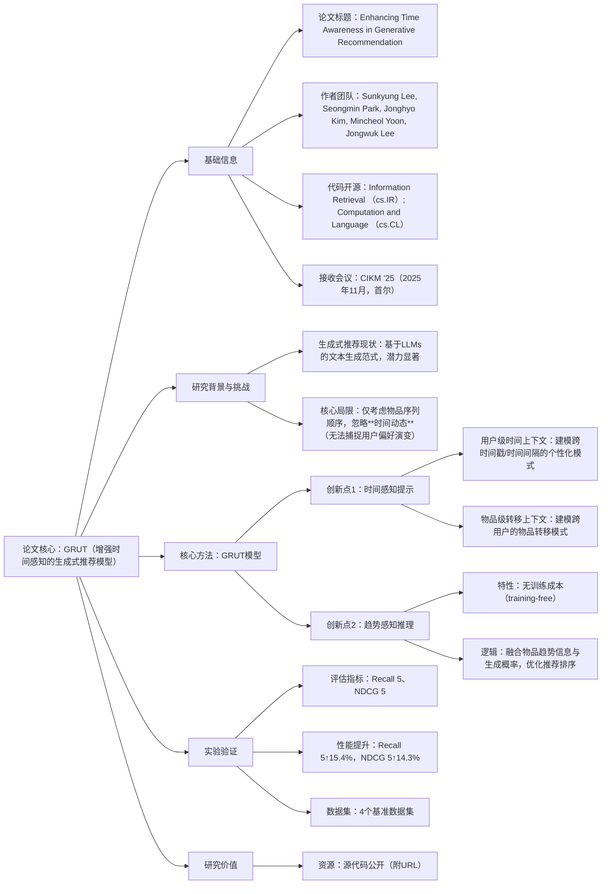

### 1. 一段话总结
**生成式推荐**虽借助大型语言模型（LLMs）的知识成为潜力范式，但现有研究仅关注物品序列顺序，**忽略了物品间的时间动态信息**（无法捕捉用户偏好演变）。为此，论文提出**GRUT（Generative Recommender Using Time Awareness）模型**，核心创新在于：1. 引入**时间感知提示（Time-aware Prompting）**，包含建模用户个性化时间模式的**用户级时间上下文**和建模跨用户物品转移模式的**物品级转移上下文**；2. 设计**趋势感知推理（Trend-aware Inference）** 这一**无训练成本方法**，通过融合物品趋势信息与生成概率优化排序。实验表明，GRUT在四个基准数据集上显著优于现有SOTA模型，**Recall@5提升高达15.4%，NDCG@5提升高达14.3%**，源代码已公开。

---

### 2. 思维导图

---

### 3. 详细总结
#### 1. 研究背景与核心问题
1.1 生成式推荐现状  
生成式推荐是新兴范式，其核心是将推荐任务转化为“文本到文本”的生成任务，充分利用大型语言模型（LLMs）的海量知识与语义理解能力，在推荐领域展现出巨大潜力。

1.2 现有研究的关键局限  
现有生成式推荐模型仅聚焦于**物品的序列顺序**（如用户点击物品的先后排列），却**忽略了物品间的时间动态信息**——包括用户在不同时间戳、时间间隔的行为模式差异，以及物品在跨用户群体中的转移规律。这种局限导致模型无法捕捉用户偏好的演变过程，限制了推荐精度。

1.3 核心研究目标  
提出一种融合时间动态信息的生成式推荐模型，通过显式建模时间信号提升对用户潜在偏好的捕捉能力。

#### 2. 核心模型：GRUT（Generative Recommender Using Time Awareness）
GRUT的核心设计围绕“时间信息建模”展开，包含两大创新模块：

##### 2.1 时间感知提示（Time-aware Prompting）
作为模型的输入增强组件，通过构建两类上下文将时间信号注入生成式推荐流程：
- **用户级时间上下文**：聚焦单个用户的行为时间特征，建模其在不同**时间戳**（如“2025-09-01 19:00”）和**时间间隔**（如“两次点击间隔2小时”）上的个性化模式，反映用户偏好随时间的波动规律。
- **物品级转移上下文**：聚焦物品的跨用户流转特征，建模某一物品被不同用户选择的**转移模式**（如“用户A点击物品X后，用户B也点击物品X的时间关联”），挖掘物品的时间相关流行趋势。

##### 2.2 趋势感知推理（Trend-aware Inference）
作为模型的输出优化组件，是一种**无训练成本（training-free）** 的排序增强方法：
- 核心逻辑：在LLM生成推荐候选物品后，不直接依赖生成概率排序，而是融合物品的**趋势信息**（如近期点击量增长速率、跨时段热度变化）对生成概率进行加权调整。
- 优势：无需额外训练数据或参数微调，仅通过推理阶段的规则融合即可提升排序合理性，适配实际部署中的低成本需求。

#### 3. 实验验证
3.1 实验设置
- **数据集**：4个推荐领域基准数据集（论文未明确名称，仅提及“four benchmark datasets”）；
- **评估指标**：Recall@5（前5名推荐中命中用户真实行为的比例）、NDCG@5（前5名推荐的排序合理性）；
- **对比对象**：生成式推荐领域的现有SOTA模型。

3.2 核心实验结果  
GRUT在两项核心指标上均实现显著提升，具体如下：

| 评估指标   | 跨数据集平均提升幅度 | 最高提升幅度 |
|------------|----------------------|--------------|
| **Recall@5** | -                    | **15.4%**    |
| **NDCG@5**  | -                    | **14.3%**    |

#### 4. 研究价值与资源
- **理论价值**：首次在生成式推荐中系统融合“用户-物品-时间”三维信号，为解决“偏好演变捕捉”问题提供新范式；
- **实践价值**：趋势感知推理的“无训练成本”特性适配工业部署需求，降低落地门槛；
- **公开资源**：源代码已通过URL公开，支持可复现性与后续研究扩展。

---

### 4. 关键问题
#### 问题1：GRUT模型针对现有生成式推荐的什么核心局限提出？这一局限为何会影响推荐效果？
**答案**：  
GRUT针对的核心局限是**现有生成式推荐仅关注物品序列顺序，忽略了物品间的时间动态信息**。  
这一局限的影响在于：时间动态是用户偏好演变的关键信号——例如用户可能仅在工作日晚间偏好播客、周末偏好音乐（用户级时间间隔模式），或某款商品在促销期后热度快速下降（物品级趋势模式）。忽略这些信息会导致模型将“静态序列”作为偏好依据，无法捕捉用户实时需求变化，最终造成推荐结果与用户当前兴趣脱节。

#### 问题2：GRUT的“时间感知提示”包含哪两类核心上下文？二者在建模逻辑上有何区别？
**答案**：  
“时间感知提示”包含**用户级时间上下文**和**物品级转移上下文**，二者区别如下：
- **建模主体不同**：用户级上下文聚焦**单个用户**的行为时间特征；物品级上下文聚焦**单个物品**的跨用户流转时间特征；
- **核心目标不同**：用户级上下文旨在捕捉**个性化时间模式**（如“用户A每周一早上点击财经新闻”）；物品级上下文旨在捕捉**群体级转移规律**（如“物品X在被用户点击后，平均1小时内会被另一位用户点击”）；
- **输入作用不同**：前者为LLM提供“用户-时间”关联信息，后者提供“物品-时间-群体”关联信息，共同丰富生成式推荐的输入语义。

#### 问题3：GRUT的“趋势感知推理”为何被称为“training-free”？这一特性对模型的实际部署有何价值？
**答案**：
1. “training-free”的原因：趋势感知推理无需针对趋势信息设计额外训练流程——既不需要标注“物品趋势-推荐效果”的配对数据，也不需要微调LLM或模型的任何参数，仅在推理阶段通过规则（如“将近期热度增长前20%的物品生成概率提升10%”）融合物品趋势信息与生成概率，属于“无训练成本”的后处理步骤。
2. 实际部署价值：工业场景中，模型微调需消耗大量计算资源且可能引入过拟合风险，而“training-free”特性可让GRUT在不增加训练成本、不改变原有模型结构的前提下优化排序效果，显著降低了从“实验室验证”到“工业落地”的门槛，尤其适配资源有限的中小平台。