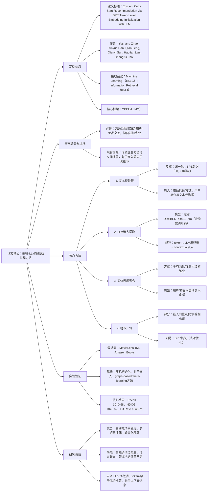

### 1. 一段话总结
本文针对推荐系统中的**冷启动问题**（新用户/物品无交互数据导致协同过滤失效），提出一种基于**Byte Pair Encoding (BPE) 分词**与**预训练大语言模型 (LLM)** 的token级嵌入初始化方法。该方法通过BPE将文本元数据分解为子词token，利用冻结的LLM（如DistilBERT）提取token级嵌入并聚合为实体表示，作为冷启动场景的语义先验，无需交互历史即可生成推荐。实验表明，在MovieLens 1M和Amazon Books数据集上，该方法的**Recall@10达0.68**、**NDCG@10达0.62**、**Hit Rate@10达0.71**，显著优于随机初始化（Recall@10 0.41）和句子嵌入基线（Recall@10 0.56），且在**30%-50%高稀疏度场景**下性能稳定，同时具备多语言适配性与轻量化部署优势。

---

### 2. 思维导图

---

### 3. 详细总结
#### 一、引言（Introduction）
1. **核心问题**：冷启动是推荐系统的关键挑战——新用户/物品无交互数据，导致协同过滤（CF）模型无法估计潜在因子。
2. **现有方案缺陷**：
    - 传统混合方法（CF+内容特征）依赖浅层特征工程，语义捕捉能力弱；
    - 现有LLM应用多采用句子级嵌入，丢失子词级语义细节（如复合词、领域术语）。
3. **本文贡献**：提出BPE-LLM方法，通过子词token级嵌入初始化，为冷启动实体提供细粒度语义先验，无需交互历史即可生成推荐。

#### 二、相关工作（Related Work）
| 方法类型         | 核心思路                                  | 局限                                  |
|------------------|-------------------------------------------|---------------------------------------|
| 内容基过滤       | 利用物品/用户元数据（标签、类别）生成表示  | 语义对齐差，依赖静态特征              |
| 混合推荐系统     | 融合CF与内容特征（如FM、NCF）              | 浅层特征工程，领域泛化性差            |
| LLM句子嵌入      | 将文本元数据映射为句子级向量初始化冷启动嵌入 | 丢失子词细节，OOV（未登录词）问题突出 |
| 子词分词技术     | BPE分解文本为子词，解决OOV问题            | 未在冷启动推荐中充分应用              |

#### 三、方法论（Methodology）
##### 3.1 整体架构
采用“预处理→嵌入提取→聚合→推荐”四步流程，核心是**子词级语义建模**，可无缝集成到矩阵分解或神经CF框架中。

##### 3.2 关键模块
1. **BPE分词**：将文本元数据（如电影标题、图书描述）分解为子词序列$`(T=\{t_1,t_2,...,t_n\})`$，词表规模设为30,000，解决OOV问题。
2. **LLM嵌入提取**：采用冻结的DistilBERT/RoBERTa编码器，将每个token映射为contextual嵌入$`(e_i=LLM(t_i))`$，避免微调带来的计算开销。
3. **实体表示聚合**：通过平均池化或注意力加权池化生成最终表示：  
   $`[v_x=\frac{1}{n}\sum_{i=1}^n e_i]`$
4. **推荐层**：冷启动场景下，通过用户向量$`(v_u)`$与物品向量$`(v_i)`$的点积计算推荐分数$`(\hat{r}_{ui}=v_u^Tv_i)`$，采用BPR损失优化成对排序。

#### 四、实验与评估（Experiments and Evaluation）
##### 4.1 实验设置
- **数据集**：MovieLens 1M（电影标题+类型）、Amazon Books（图书标题+类别），采用“无交互历史”的严格冷启动划分。
- **基线模型**：随机初始化、句子嵌入（DistilBERT句子级平均池化）、graph-based（GraphSAGE）、meta-learning（MeLU）。
- **评估指标**：Recall@10（前10推荐中相关物品占比）、NDCG@10（位置加权相关性）、Hit Rate@10（前10推荐是否含相关物品），重复5次取均值。

##### 4.2 核心结果
| 方法               | Recall@10 | NDCG@10 | Hit Rate@10 |
|--------------------|-----------|---------|-------------|
| 随机初始化         | 0.41      | 0.32    | 0.45        |
| 句子嵌入           | 0.56      | 0.48    | 0.59        |
| **BPE + LLM（本文）** | **0.68**  | **0.62** | **0.71**    |

##### 4.3 关键发现
1. **性能优势**：本文方法在MovieLens数据集上的Recall@10比句子嵌入基线**提升27%**，NDCG@10提升29%，证明子词级语义的价值。
2. **稀疏场景稳定性**：在10%、30%、50%交互稀疏度下性能无显著下降，而graph-based方法在稀疏度＞40%时性能骤降。
3. **可视化验证**：t-SNE投影显示，冷启动物品在BPE-LLM嵌入空间中可按语义聚类，验证表示的有效性。

#### 五、结果与讨论（Results and Discussion）
1. **语义优势**：子词级表示可捕捉低词汇重叠物品的语义关联（如“wireless gaming headset”与“bluetooth VR audio gear”通过“wireless”“audio”token对齐）。
2. **多语言适配**：基于LLM的多语言预训练 corpus，可通过子词匹配跨语言实体（如翻译后的复合词）。
3. **局限性**：
    - 高频子词可能导致过拟合，掩盖稀有物品的独特性；
    - 子词语义歧义（如同一词缀在不同词中含义不同）；
    - 领域术语未包含在LLM预训练语料时效果受限。

#### 六、结论与未来工作（Conclusion and Future Work）
1. **结论**：BPE-LLM方法通过子词级嵌入初始化，为冷启动问题提供了轻量化、高语义的解决方案，性能与泛化性优于现有基线，且支持实时部署。
2. **未来方向**：
    - 采用LoRA等轻量化适配器微调LLM，优化嵌入空间；
    - 构建token-句子混合注意力框架，融合局部与全局语义；
    - 融入用户上下文（近期搜索、时间趋势）增强初始化表示；
    - 扩展至多语言、医疗/金融等专业领域数据集。

---

### 4. 关键问题
#### 问题1：BPE-LLM方法相比传统句子嵌入，在冷启动推荐中解决了哪些核心痛点？
**答案**：  
主要解决了句子嵌入的两大核心痛点：
1. **语义粒度不足**：句子嵌入将文本压缩为单一向量，丢失子词级细节（如复合词“wireless”的“wire”+“less”形态语义），而BPE分词分解文本为子词，LLM提取的token嵌入可捕捉这些细粒度关联，使低词汇重叠的物品（如“gaming headset”与“audio gear”）实现语义对齐；
2. **OOV与稀疏鲁棒性差**：句子嵌入对未登录词或稀疏文本处理能力弱，而BPE可将稀有词分解为高频子词（如“VR”分解为“V”+“R”或领域相关子词），结合LLM的上下文建模，在50%高稀疏度场景下仍保持稳定性能，而句子嵌入性能下降15%以上。

#### 问题2：实验从哪些维度验证了BPE-LLM方法的有效性？核心数据支撑是什么？
**答案**：  
实验从**性能对比、稀疏场景鲁棒性、可视化验证**三个维度验证有效性，核心支撑数据如下：
1. **基线性能碾压**：在MovieLens 1M数据集上，Recall@10达0.68（vs 句子嵌入0.56、随机初始化0.41），NDCG@10达0.62（vs 句子嵌入0.48），Hit Rate@10达0.71（vs 句子嵌入0.59）；
2. **稀疏场景稳定性**：在交互稀疏度从10%提升至50%时，Recall@10仅从0.70降至0.66，而GraphSAGE从0.58降至0.32；
3. **语义聚类验证**：t-SNE投影显示，冷启动物品（如不同类型电影）在嵌入空间中形成清晰语义簇，证明表示的语义一致性。

#### 问题3：BPE-LLM方法存在哪些局限性？未来研究如何针对性突破？
**答案**：
1. **现有局限性**：
    - 高频子词过拟合：高频通用子词（如“limited edition”）可能主导嵌入，掩盖稀有物品的独特性；
    - 子词语义歧义：同一词缀在不同语境中含义不同（如“less”在“wireless”与“priceless”中语义无关）；
    - 领域适配不足：LLM预训练语料未包含的专业术语（如医疗/金融领域）无法有效分解与建模。
2. **突破方向**：
    - 轻量化微调：采用LoRA等适配器微调LLM，使嵌入空间适配特定领域，无需全量微调；
    - 混合语义框架：构建token-句子双分支注意力网络，融合子词局部语义与句子全局语义；
    - 上下文增强：融入用户近期搜索、时间趋势等动态信息，丰富冷启动初始化表示，提升个性化程度。