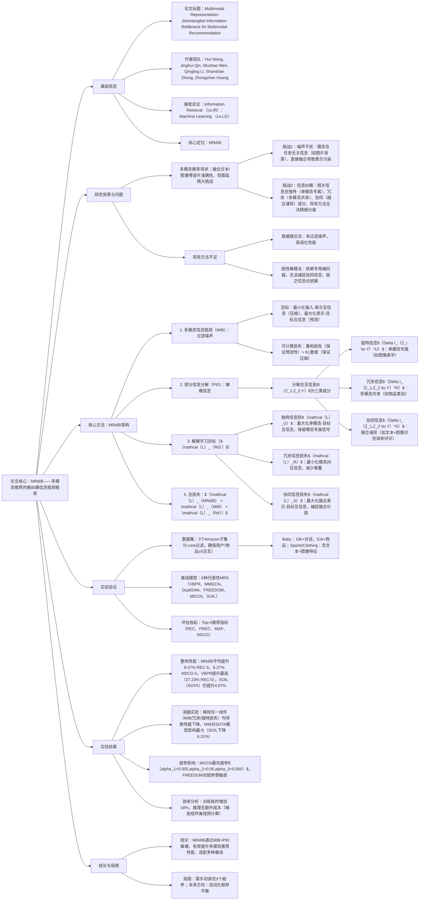

---

### 1. 一段话总结
针对多模态推荐系统（MRS）中**噪声干扰**（如图片背景冗余信息）和**信息纠缠**（模态间冗余、独特与协同信息未分离）的核心问题，本文提出**MRdIB（Multimodal Representation-disentangled Information Bottleneck）框架**：首先通过**多模态信息瓶颈（MIB）** 过滤任务无关噪声，保留预测性信息；再基于**部分信息分解（PID）** 理论，设计**独特信息保留**、**冗余信息最小化**、**协同信息捕捉**三大学习目标，引导模型学习解纠缠表示。实验在**Baby、Sports、Clothing三个Amazon数据集**上验证，MRdIB可无缝集成到VBPR、MMGCN等6种基线模型，平均提升**8.47% REC@5**和**8.27% NDCG@5**，其中对VBPR的提升最高达27.23%，证明其有效性与通用性。

---

### 2. 思维导图

---

### 3. 详细总结
#### 一、引言：多模态推荐的核心挑战
1. **多模态推荐现状**  
   多模态推荐系统（MRS）通过融合文本、图像等异质数据提升用户偏好建模能力，但实际应用中存在两大关键问题：
    - **噪声干扰**：模态数据含大量任务无关信息（如图1中婴儿睡袋图片的背景 clutter），现有方法（如FREEDOM、MGCN）直接融合未过滤噪声，导致表示污染，甚至出现“单模态模型优于多模态”的反直觉现象；
    - **信息纠缠**：任务相关信息并非单一整体，根据**部分信息分解（PID）**，其包含“独特信息（单模态专属）、冗余信息（多模态共享）、协同信息（融合涌现）”三类成分，现有解缠方法（如Liu et al. 2022a）依赖刚性编码器分离，无法捕捉协同信息，且缺乏信息论依据。

2. **MRdIB的核心目标**  
   提出通用插件式框架MRdIB，无需重构模型架构，通过“噪声过滤+信息解缠”双阶段优化，引导现有MRS学习高效解纠缠表示。

#### 二、相关工作
| 类别                | 代表方法                | 优势                          | 不足                                  |
|---------------------|-------------------------|-------------------------------|---------------------------------------|
| 多模态推荐          | VBPR、MMGCN、SOIL       | 融合多模态特征，提升推荐准确性  | 未处理噪声，信息纠缠未精细分离        |
| 信息瓶颈（IB）      | M3IB、CDRIB             | 过滤无关信息，压缩表示          | 仅单模态/跨域场景，未涉及多模态信息解缠 |
| 信息分解            | PID理论（Kolchinsky 2022）| 量化独特/冗余/协同信息          | 未落地到多模态推荐，缺乏可优化损失函数 |

#### 三、核心方法：MRdIB框架
##### 3.1 多模态信息瓶颈（MIB）：过滤噪声
- **核心思想**：学习压缩的模态表示$`(Z_1)`$（视觉）、$`(Z_2)`$（文本），满足“最小化输入-表示互信息（$`(I(X_1;Z_1)+I(X_2;Z_2))`$）+ 最大化表示-目标互信息（$`(I(Z_1,Z_2;Y))`$）”，强制模型丢弃噪声、保留预测信号。
- **可计算损失**（解决互信息不可直接计算问题）：  
  $`[
  \mathcal{L}_{MIB} = \mathbb{E}\left[-log\ p(y|z_1,z_2)\right] + \alpha_1 \sum_{i=1,2} KL\left(q(z_i|x_i) \| p(z_i)\right)
  ]`$  
  其中：
    - 第一项为**重构损失**，确保表示对推荐目标（如CTR）的预测性；
    - 第二项为**KL散度约束**，将表示推向标准高斯先验$`(p(z_i))`$，实现压缩。

##### 3.2 部分信息分解（PID）：解缠信息
基于PID理论，将总互信息$`(I(Z_1,Z_2;Y))`$分解为三类成分（图3）：  
| 信息类型   | 定义                                  | 示例                          |
|------------|---------------------------------------|-------------------------------|
| 独特信息$`(\Delta I_U)`$ | 仅单模态能提供的预测信息              | 图像的美学吸引力、文本的情感倾向 |
| 冗余信息$`(\Delta I_R)`$ | 多模态共享的预测信息                  | 物品类别（图像/文本均能推断）  |
| 协同信息$`(\Delta I_S)`$ | 仅融合多模态才能涌现的预测信息        | 文本讽刺评论+用户头像的偏好推断 |

##### 3.3 解缠学习目标（$`(\mathcal{L}_{Rd})`$）
将PID分解转化为可优化损失，引导模型分离三类信息：
1. **独特信息损失（$`(\mathcal{L}_U)`$）**  
   确保单模态表示独立预测目标，保留模态专属信号：  
   $`[
   \mathcal{L}_U = \mathbb{E}\left[\sum_{i=1,2} -p(z_i|x_i) log\ p(y|z_i)\right]
   ]`$  
   通过独立解码器$`(p(y|z_i))`$强制单模态表示含预测价值。

2. **冗余信息损失（$`(\mathcal{L}_R)`$）**  
   最小化模态间互信息，减少表示重叠，基于MINE（互信息神经估计）：  
   $`[
   \mathcal{L}_R = \mathbb{E}_{p(z_1,z_2)}[f(z_1,z_2)] - log\ \mathbb{E}_{p(z_1)p(z_2)}[e^{f(z_1,z_2)}]
   ]`$  
   其中$`(f)`$为判别网络，最小化该损失可使$`(Z_1)`$与$`(Z_2)`$趋近统计独立。

3. **协同信息损失（$`(\mathcal{L}_S)`$）**  
   最大化融合表示的预测性，确保融合后涌现额外价值：  
   $`[
   \mathcal{L}_S = \mathbb{E}\left[-p(z_1,z_2|x_1,x_2) log\ p(y|z_1,z_2)\right]
   ]`$

##### 3.4 总优化目标
$`[
\mathcal{L}_{MRdIB} = \mathcal{L}_{MIB} + \alpha_2 \mathcal{L}_R + \alpha_3 \mathcal{L}_U
] `$ 
其中$`(\alpha_1,\alpha_2,\alpha_3)`$为超参，平衡各损失贡献。

#### 四、实验验证
##### 4.1 实验设置
| 维度          | 细节                                                                 |
|---------------|----------------------------------------------------------------------|
| 数据集        | 3个Amazon子集（5-core过滤）： - Baby：用户-物品交互含文本+图像； - Sports/Clothing：同理，覆盖不同商品类型 |
| 基线模型      | 6种代表性MRS：VBPR（视觉矩阵分解）、MMGCN（模态图卷积）、DualGNN（双图结构）、FREEDOM（交互去噪）、MGCN（模态图对比）、SOIL（二阶兴趣挖掘） |
| 评估指标      | Top-5推荐指标：REC（召回率）、PREC（精确率）、MAP（平均精度）、NDCG（归一化折扣累积增益） |
| 实现细节      | 嵌入维度64，Xavier初始化，Adam优化器，网格搜索超参$`(\alpha_1/\alpha_2/\alpha_3 \in \{0.0001,0.001,0.005,0.01,0.05\})`$ |

##### 4.2 核心实验结果
###### 4.2.1 整体性能提升（表1）
MRdIB在所有基线模型和数据集上均实现显著提升，关键结果如下：  
| 基线模型 | Baby数据集REC@5提升 | Sports数据集NDCG@5提升 | Clothing数据集MAP@5提升 | 平均提升（REC@5） |
|----------|---------------------|------------------------|-------------------------|-------------------|
| VBPR     | +15.23%             | +8.72%                 | +27.23%                 | +17.05%           |
| MMGCN    | +7.40%              | +16.17%                | +5.93%                  | +9.83%            |
| SOIL（SOTA）| +5.54%           | +5.30%                 | +3.76%                  | +4.87%            |
- 关键结论：MRdIB对简单模型（VBPR）提升更显著（最高27.23%），对SOTA模型（SOIL）仍有效，证明其普适性；跨数据集性能稳定，说明其domain-agnostic特性。

###### 4.2.2 消融实验（表2）
验证MRdIB各组件的必要性（以VBPR和SOIL为例）：  
| 消融变体                | VBPR REC@5下降 | SOIL NDCG@5下降 | 结论                          |
|-------------------------|----------------|-----------------|-------------------------------|
| 移除MIB（$`(\alpha_1=0)`$）| -16.56%        | -6.31%          | MIB过滤噪声对SOTA模型至关重要 |
| 移除冗余损失（$`(\alpha_2=0)`$）| -13.49%    | -5.13%          | 减少模态重叠提升融合效率      |
| 移除独特损失（$`(\alpha_3=0)`$）| -16.67%    | -3.23%          | 保留模态专属信息提升准确性    |
| 仅保留MIB（$`(\alpha_2=\alpha_3=0)`$）| -23.44% | -8.24%      | 仅过滤噪声不足以解决信息纠缠  |

###### 4.2.3 效率分析（表3）
MRdIB的计算开销可控：  
| 基线模型 | 无MRdIB训练耗时（秒/epoch） | 有MRdIB训练耗时（秒/epoch） | 耗时增加比例 |
|----------|-----------------------------|-----------------------------|--------------|
| VBPR     | 4.84                        | 4.96                        | +2.48%       |
| MMGCN    | 46.87                       | 50.44                       | +7.83%       |
| SOIL     | 10.61                       | 10.93                       | +3.02%       |
- 关键优势：推理阶段无额外成本（辅助组件离线预计算，仅保留最终表示用于推荐）。

#### 五、结论与未来方向
1. **核心贡献**
    - 提出MRdIB框架，通过MIB+PID实现“噪声过滤+信息解缠”，无需重构模型架构；
    - 基于信息论构建可优化目标，量化并分离三类多模态信息；
    - 实验验证其在6种基线、3个数据集上的有效性，平均提升8%+推荐性能。

2. **局限与未来方向**
    - 局限：需手动调优3个超参，增加使用成本；
    - 未来：开发自动化超参平衡方法，扩展到更多模态（如音频、视频）。

---

### 4. 关键问题
#### 问题1：MRdIB相比现有多模态推荐方法，在解决“信息纠缠”问题上有何本质创新？
**答案**：现有方法对信息纠缠的处理存在两大局限——要么直接融合（如MGCN）未分离信息，要么依赖刚性编码器（如Liu et al. 2022a）仅分离“独特/共享”信息，无法捕捉“协同信息”。MRdIB的本质创新在于：
1. **理论依据**：基于**部分信息分解（PID）** 理论，首次将多模态推荐的相关信息细分为“独特、冗余、协同”三类，而非简单二分“独特/共享”；
2. **可优化目标**：将PID分解转化为**冗余信息最小化**（$`(\mathcal{L}_R)`$）和**协同信息最大化**（$`(\mathcal{L}_S)`$）损失，通过神经估计（MINE）和融合预测实现精细解缠；
3. **插件式设计**：无需修改基线模型架构，仅通过损失约束引导解缠，适配VBPR、SOIL等6种不同类型MRS，通用性远超刚性编码器方法。  
   实验验证：移除冗余损失后，MGCN在Baby数据集的REC@5下降5.13%，证明信息纠缠会直接影响融合效率。

#### 问题2：多模态信息瓶颈（MIB）在MRdIB中扮演何种角色？其与信息解缠目标（$`(\mathcal{L}_{Rd})`$）如何协同工作？
**答案**：MIB是MRdIB的“前置过滤层”，与信息解缠目标形成“噪声清除→精细解缠”的协同闭环：
1. **MIB的核心角色**：过滤**任务无关噪声**（如图像背景、文本冗余描述），通过“压缩约束（KL散度）”强制模型丢弃与推荐目标（Y）无关的信息，为后续信息解缠提供“干净的输入”；若移除MIB（$`(\alpha_1=0)`$），SOIL等SOTA模型的REC@5会下降6.31%，证明噪声会严重干扰解缠效果。
2. **协同机制**：
    - 第一步：MIB输出“去噪后的单模态表示$`(Z_1/Z_2)`$”，确保后续解缠仅针对“任务相关信息”，避免噪声误导；
    - 第二步：$`(\mathcal{L}_{Rd})`$（独特/冗余/协同损失）在去噪表示基础上，引导模型分离三类信息——独特损失保留模态专属信号，冗余损失减少重叠，协同损失捕捉融合价值；
    - 最终：总损失$`(\mathcal{L}_{MRdIB})`$确保表示“既干净（无噪声）又有序（解缠）”，实验中MRdIB+VBPR的NDCG@5比“仅MIB”提升11.2%，证明协同作用的价值。

#### 问题3：MRdIB的实验结果如何证明其在工业场景的实用性？请从性能、通用性、效率三方面说明。
**答案**：MRdIB的实验设计充分考虑工业场景需求，从三方面验证实用性：
1. **性能稳定性**：在Baby、Sports、Clothing三个不同商品类型的数据集上，MRdIB对所有基线模型的平均提升达**8.47% REC@5**和**8.27% NDCG@5**，其中对工业常用的SOIL（二阶兴趣挖掘）模型仍能提升4.87% REC@5，证明其在真实数据分布下的有效性；
2. **通用性**：适配6种不同架构的MRS——包括矩阵分解（VBPR）、图卷积（MMGCN）、对比学习（SOIL），无需针对特定模型定制，符合工业场景“多模型并存”的需求；
3. **效率可控性**：训练耗时仅增加2.48%-7.83%（VBPR增加2.48%，MMGCN增加7.83%），且**推理阶段无额外成本**（辅助组件如判别网络$`(f)`$仅用于训练，推理时直接使用预计算的表示），满足工业推荐系统“低延迟”要求。  
   此外，t-SNE可视化显示（图4），MRdIB能将SOIL的模态表示从“严重重叠”转化为“清晰聚类”，进一步证明其在工业级模型上的解缠效果。