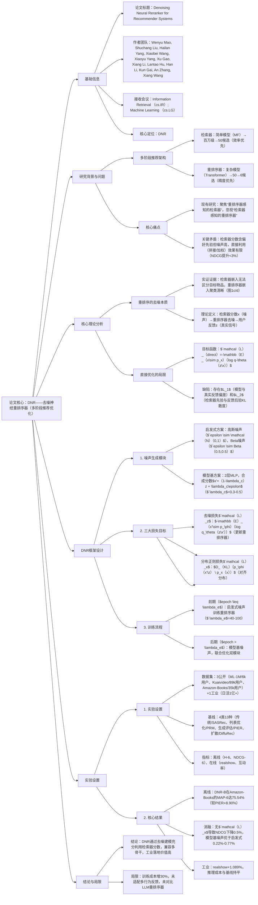

---

### 1. 一段话总结
针对多阶段推荐系统中**重排序器未充分利用检索器分数（含偏好先验但噪声高）** 的核心痛点，论文通过实证与理论证明重排序任务本质是**检索器分数的去噪过程**，并提出**DNR（Denoising Neural Reranker）框架**：设计**启发式（高斯/Beta）与模型基（2层MLP）两类噪声生成模块**，构建**去噪损失（对齐反馈）、对抗生成损失（提升鲁棒性）、分布正则损失（对齐分布）三大目标**，分两阶段训练重排序器与噪声生成器。实验在**ML-1M、Kuaivideo、Amazon-Books**三个公开数据集及日活1亿+工业短视频平台验证，DNR在ML-1M的**NDCG@6达77.67%（较PRM提升4.82%）**，Kuaivideo的**H@6达50.30%（较HetComp提升5.59%）**，工业场景中**realshow（用户观看3s+视频数）提升1.089%（p<0.05）**，且推理成本与基线持平，验证其有效性与落地价值。

---

### 2. 思维导图

---

### 3. 详细总结
#### 一、引言：多阶段推荐的重排序痛点
工业推荐系统为平衡**效率与精度**，普遍采用“检索器→重排序器”的多阶段架构，但存在关键问题：
1. **检索器特性**：用简单模型（如矩阵分解MF）从百万级物品池筛选50-100个候选，输出的**检索器分数含用户偏好先验，但因模型能力有限噪声高**（AUC仅79.2%-89.6%）；
2. **重排序器局限**：用复杂模型（如Transformer）优化列表排序，但现有方法仅通过“拼接/加权”直接利用检索器分数，效果有限（NDCG提升<3%），且忽视检索器分数的噪声特性；
3. **核心洞察**：**重排序任务本质是对检索器分数的去噪过程**——重排序器需降低检索器分数噪声，使结果更对齐用户反馈（图1c/d显示：检索器嵌入无法区分目标物品，重排序器嵌入可清晰聚类）。

#### 二、相关工作综述
| 研究领域         | 核心思路                                                                 | 与DNR的差异                                                                 |
|------------------|--------------------------------------------------------------------------|------------------------------------------------------------------------------|
| 多阶段推荐       | 独立优化各阶段，或用后阶段模型指导前阶段（如RankFlow、COPR）             | DNR首次用前阶段（检索器分数）指导后阶段（重排序器），将重排序建模为去噪问题   |
| 重排序策略       | 单点重评分（SASRec）、列表优化（PRM）、生成评估（PIER）、扩散模型（DiffuRec） | DNR不依赖多列表生成或迭代扩散，通过去噪建模兼容多种重排序骨干，效率更高       |
| 对抗学习         | IRGAN（生成负样本）、AdvIR（嵌入空间扰动）                                 | DNR的对抗目标是“生成难去噪的检索器分数”，而非负样本或嵌入扰动，聚焦去噪能力提升 |

#### 三、方法论：DNR框架设计
##### 3.1 问题建模
- **输入**：用户请求$`u`$（含交互历史）、检索器分数$`x_u`$（候选集$`I(u)`$的分数，$`x_u \in [0,1]^n`$）、用户反馈$`z_u`$（二进制标签，1=交互，0=未交互）；
- **目标**：学习重排序器$`q_\theta(z|x,u)`$，预测用户对候选集的反馈，输出top-6物品用于展示；
- **去噪定义**：检索器分数$`x`$是“噪声化的用户偏好”，重排序器需从$`x`$中提取与$`z`$对齐的“纯净信号”，即$`q_\theta(z|x)`$逼近真实反馈分布$`p_{z|x}`$。

##### 3.2 噪声生成模块（核心组件）
用于合成含噪声的检索器分数$x'$，辅助重排序器学习去噪能力，两类方案对比如下：

| 生成方案       | 实现细节                                                                                | 优点                                                                 | 缺点                                                                 | 关键性能（ML-1M NDCG@6） |
|----------------|-------------------------------------------------------------------------------------|----------------------------------------------------------------------|----------------------------------------------------------------------|--------------------------|
| 启发式生成     | 高斯噪声（$`epsilon \sim \mathcal{N}(0,1)`$）、Beta噪声（$`epsilon \sim Beta(0.5,0.5)`$）        | 非参数化，易实现，训练初期稳定                                       | 固定分布，无法适配真实检索器的噪声特性，效果有限                     | 高斯：76.69%；Beta：76.90% |
| 模型基生成     | 2层MLP输出$`epsilon$，合成分数$x'=(1-\lambda_c)z_u + \lambda_c\epsilon`$（$`lambda_c`$=0.3-0.5） | 可通过训练拟合真实噪声分布，能生成难去噪样本，性能优                 | 需额外训练，依赖超参$`lambda_c`$调优                                 | Gaussian基：77.67%；Beta基：77.12% |

**关键发现**：Beta噪声因贴合用户反馈的二进制特性（0/1标签），性能优于高斯噪声；模型基方案通过对抗学习进一步提升效果，较启发式高0.22%-0.77%。

##### 3.3 三大损失目标（创新核心）
联合优化重排序器（$`theta`$）与噪声生成器（$`phi`$），确保去噪效果与分布一致性：

| 损失类型       | 目标                                                                 | 公式/优化对象                                                                                                                                       | 核心作用                     |
|----------------|----------------------------------------------------------------------|-----------------------------------------------------------------------------------------------------------------------------------------------|--------------------------|
| 去噪损失$`mathcal{L}_z`$ | 让重排序器对合成噪声分数$`x'`$去噪，对齐用户反馈$`z`$                     | $`mathcal{L}_z = -\mathbb{E}_{x'\sim p_\phi}[log q_\theta(z\| x')]`$；优化$`theta`$  | 增强重排序器对检索器噪声的鲁棒性，避免过拟合真实检索器分数               |
| 对抗生成损失$`mathcal{L}_{adv}`$ | 让噪声生成器生成“难去噪”的$`x'`$，迫使重排序器提升能力                 | $`min_\phi log q_\theta(z\| x')`$；优化$`phi`$（固定$`theta`$）                    | 探索检索器分数空间的边缘案例，避免重排序器对噪声“欠鲁棒”                 |
| 分布正则损失$`mathcal{L}_x`$ | 对齐合成分数$`x'`$与真实检索器分数$`x`$的分布                             | $`D_{KL}(p_\phi(x'\| z) \| p_x(x))`$；优化$`phi`$ | 保证合成分数的“真实性”，避免重排序器学习脱离实际的去噪策略               |

##### 3.4 训练流程
分两阶段平衡稳定性与性能：
1. **前期（$`epoch \leq \lambda_e`$，$`lambda_e`$=40-100）**：
   - 用启发式噪声（Beta/Gaussian）训练重排序器；
   - 优化目标：$`mathcal{L}_\theta = \mathcal{L}_{direct} + \lambda_m \mathcal{L}_z`$（$`lambda_m`$=0.4-0.6，平衡直接优化与去噪增强）；
   - 目的：让重排序器先学习基础去噪能力，避免初期模型不稳定。
2. **后期（$`epoch > \lambda_e`$）**：
   - 切换为模型基噪声；
   - 联合优化：重排序器（$`mathcal{L}_\theta`$）、噪声生成器（$`mathcal{L}_{adv} + \mathcal{L}_x`$）；
   - 目的：通过对抗学习提升重排序器鲁棒性，确保合成分数分布与真实一致。

#### 四、实验验证
##### 4.1 实验设置
| 维度                | 详细信息                                                                 |
|---------------------|--------------------------------------------------------------------------|
| 数据集              | 1. **ML-1M**（电影）：6,022用户，3,043物品，161,646交互序列 2. **Kuaivideo**（短视频）：89,416用户，10,395物品，513,010序列 3. **Amazon-Books**（电商）：35,736用户，38,121物品，311,386序列 4. **工业平台**：日活1亿+的短视频APP，核心指标为realshow（用户观看3s+视频数） |
| 基线方法            | 4类13种： - 传统推荐：SASRec、Caser、GRU4Rec、MiDNN - 列表优化：DLCM、SetRank、PRM、MIR - 生成评估：EGRerank、PIER、NAR4Rec - 扩散模型：DiffuRec、DCDR |
| 评估指标            | - 离线：Hit Ratio@6（H@6）、NDCG@6、MAP@6、F1@6、AUC - 在线：realshow、app时长、点赞率、分享率、评论率 |
| 检索器配置          | 矩阵分解（MF），嵌入维度128，筛选top-50候选，AUC：ML-1M 79.2%、Kuaivideo 89.62%、Amazon-Books 88.82% |

##### 4.2 核心实验结果
###### （1）离线性能对比（公开数据集）
| 方法         | ML-1M NDCG@6 | Kuaivideo H@6 | Amazon-Books MAP@6 | 相对提升（vs最优基线PIER） |
|--------------|--------------|---------------|--------------------|----------------------------|
| 传统推荐（SASRec） | 72.16%       | 36.72%        | 58.17%             | -23.46%（Amazon）          |
| 列表优化（PRM）   | 72.85%       | 39.92%        | 66.44%             | -7.23%（Amazon）           |
| 生成评估（PIER）  | 75.99%       | 45.35%        | 71.62%             | -                          |
| DNR-G（Gaussian基）| 77.67%       | 49.61%        | 74.24%             | +3.66%（Amazon）           |
| DNR-B（Beta基）   | 77.12%       | 50.30%        | 75.54%             | +5.47%（Amazon）           |

**关键结论**：DNR显著优于所有基线，在Kuaivideo的H@6提升最明显（较PIER+10.95%）；Beta基模型因贴合二进制反馈特性，性能略高于Gaussian基。

###### （2）消融实验（验证组件必要性）
| 变体                          | ML-1M NDCG@6 | 性能下降幅度 | 核心原因分析                                                                 |
|-----------------------------|--------------|--------------|------------------------------------------------------------------------------|
| DNR-B（完整）                   | 77.12%       | -            | 三损失协同作用，充分利用检索器分数去噪                                       |
| DNR-B w/o $`mathcal{L}_{adv}`$ | 76.90%    | 0.22%        | 缺乏难去噪样本，重排序器鲁棒性不足                                           |
| DNR-B w/o $`mathcal{L}_x`$    | 76.62%    | 0.50%        | 合成分数分布偏离真实检索器，去噪策略泛化性差                                 |
| 启发式Beta噪声（w/ B）             | 76.90%    | 0.22%        | 无法适配真实噪声分布，去噪效果有限                                           |

###### （3）工业A/B测试结果
| 指标         | 性能变化 | 统计显著性 | 业务价值分析                                                                 |
|--------------|----------|------------|------------------------------------------------------------------------------|
| realshow     | +1.089%  | p<0.05     | 核心收入指标，直接提升用户留存与广告收益                                     |
| app时长      | -0.011%  | 无         | 变化微小，无负面影响                                                         |
| 点赞率       | +0.609%  | 无         | 正向变化，提升用户互动                                                       |
| 分享率       | -0.758%  | 无         | 下降微小，未影响核心业务                                                     |

**关键结论**：DNR在工业场景显著提升核心指标，推理成本与基线持平（每轮训练时间1m06s，仅比PRM多5s）。

#### 五、结论与局限
##### 5.1 核心结论
1. **理论层面**：重排序任务可有效建模为检索器分数的去噪过程，为多阶段推荐协同优化提供新方向；
2. **方法层面**：DNR通过对抗框架与三大损失，实现“去噪能力”与“分布一致性”的平衡，兼容PRM、PIER等多种重排序骨干；
3. **实践层面**：在公开数据集与工业场景均验证有效性，核心指标提升显著且成本可控。

##### 5.2 局限与未来方向
- **局限**：训练成本较直接优化高30%；未适配多行为反馈（如“点击+购买”）；未与LLM-based重排序器对比；
- **未来方向**：设计轻量化噪声生成器降低成本；扩展多行为去噪建模；结合LLM语义理解提升去噪精度。

---

### 4. 关键问题
#### 问题1：论文将“重排序任务定义为检索器分数去噪过程”，其理论与实证证据分别是什么？
**答案**：该定义基于双重支撑：
1. **实证证据**：
   - 模型能力差异：检索器用MF模型，AUC仅79.2%-89.6%（噪声高）；重排序器用Transformer，AUC提升至92%+（精度高），证明重排序器可降低检索器噪声；
   - 嵌入空间差异：图1c/d显示，检索器的候选物品嵌入无法区分目标物品（蓝色聚类混乱），重排序器的嵌入可清晰聚类目标物品（绿色聚类集中），直观体现去噪效果。
2. **理论证据**：
   - 检索器分数$x$是“噪声化偏好”：检索器因模型简单，无法捕捉复杂偏好，导致$`x`$与真实反馈$`z`$存在偏差；
   - 直接优化的局限：公式推导显示，仅优化$`mathcal{L}_{direct}`$会因$`L_1`$（模型与真实分布偏差）和$`L_2`$（先验与后验KL散度）导致结果与反馈错位，需通过去噪建模弥补，证明重排序需降低$`x`$的噪声。

#### 问题2：DNR的两种噪声生成方案（启发式与模型基）效果差异的核心原因是什么？实际应用中如何选择？
**答案**：
1. **效果差异核心原因**：源于“对真实检索器噪声分布的拟合能力”：
   - 启发式方案（高斯/Beta）：基于经验设定固定分布，无法适配真实噪声的非对称性（如检索器分数因用户偏好差异，噪声分布不同），导致去噪效果有限（ML-1M NDCG@6 76.69%-76.90%）；
   - 模型基方案（2层MLP）：通过对抗损失（$`mathcal{L}_{adv}`$）和分布正则损失（$`mathcal{L}_x`$）训练，可自适应拟合真实噪声分布（图5显示其密度曲线与真实噪声更接近），且能生成“难去噪”样本，迫使重排序器提升鲁棒性，性能较启发式高0.22%-0.77%。
2. **实际选择建议**：
   - 快速验证场景：选启发式Beta噪声（开发成本低，性能接近模型基，ML-1M NDCG@6 76.90%）；
   - 追求最优性能场景：选模型基方案（需调优$`lambda_c`$=0.3-0.5，$`lambda_e`$=40-100，工业场景realshow提升1.089%）；
   - 资源受限场景：选启发式方案，避免额外训练噪声生成器的成本。

#### 问题3：DNR在工业推荐场景的“成本-收益比”如何？其兼容性（适配不同重排序器骨干）是否有实验支撑？
**答案**：
1. **工业场景成本-收益比**：
   - **收益**：核心指标显著提升——在日活1亿+短视频平台，realshow（用户观看3s+视频数）提升1.089%（p<0.05），直接关联用户留存与广告收益；非核心指标（点赞率+0.609%）无负面影响，避免指标trade-off；
   - **成本**：
      - 训练成本：较直接优化（如PRM+检索器分数拼接）增加约30%，但可通过“前期启发式训练+后期模型基训练”（$`lambda_e`$=40-100）平衡稳定性与成本；
      - 推理成本：无额外开销，噪声生成器仅用于训练，推理时仅需重排序器处理检索器分数，与基线速度一致（每轮训练时间1m06s，仅比PRM多5s）；
   - **结论**：收益远大于成本，具备高落地价值。

2. **兼容性实验支撑**：  
   论文在两种主流重排序器骨干上验证兼容性：
   - PRM（列表优化）+DNR：ML-1M NDCG@6从72.85%提升至77.12%（+4.27%）；
   - PIER（生成评估）+DNR：ML-1M NDCG@6从75.99%提升至77.67%（+1.68%）；  
     证明DNR通过“去噪损失+噪声生成”的插件式设计，可灵活集成到不同重排序器骨干，无需重构模型结构，兼容性强。