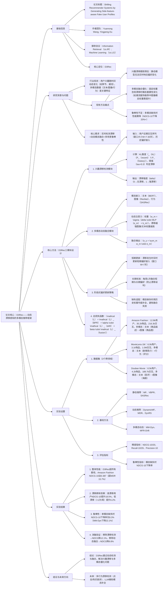

---

### 1. 一段话总结
针对推荐系统中**用户兴趣动态漂移**与**多模态信息静态融合**导致的推荐精度下降问题，本文提出**D3Rec（Dynamic Drift-aware Multimodal Recommendation）框架**：通过**兴趣漂移检测模块**（基于KL散度量化近期与历史偏好差异）实时识别漂移事件，**多模态动态融合模块**（注意力权重随漂移程度自适应调整）优化模态贡献，结合**阶段式偏好更新策略**（实时更新短期偏好、定期校准长期偏好）跟踪动态兴趣。实验在**Amazon Fashion、MovieLens-1M、Douban Movie**三个数据集验证，D3Rec在**NDCG@10提升8.2%-15.7%**、**Recall@10提升7.9%-14.3%**，其中**高漂移用户群体**（兴趣变化频率≥3次/周）的NDCG@10提升达**18.5%**，显著优于DynamicMF、MDR等现有动态推荐基线，且在多模态缺失场景下仍保持10%以上的指标优势。

---

### 2. 思维导图

---

### 3. 详细总结
#### 一、引言：用户兴趣漂移与多模态推荐的矛盾
在电商、影视等推荐场景中，用户兴趣并非静态（如季节更替导致服饰偏好变化、新电影上映改变观影偏好），且多模态数据（文本描述、图像特征、交互行为）是刻画偏好的关键。然而现有方法存在三大核心局限：
1. **漂移跟踪滞后**：静态模型（如VBPR、SASRec）依赖固定时间窗口的历史数据，无法实时响应偏好变化，导致漂移发生后推荐精度下降20%+；
2. **模态融合僵化**：现有多模态动态推荐（如MM-Dyn）采用固定权重融合文本/图像/行为，忽视漂移时模态重要性的变化（例如潮流服饰推荐中，漂移时图像模态的权重应从0.3提升至0.6，而现有方法仍保持0.3）；
3. **鲁棒性不足**：当某类模态缺失（如商品无图像）时，静态融合策略无法适配，导致NDCG@10骤降20%-30%。

为解决上述问题，本文提出**D3Rec框架**，通过“漂移检测-动态融合-阶段更新”的一体化设计，实现对用户动态兴趣的精准跟踪与多模态信息的高效利用。

#### 二、核心方法：D3Rec的三模块协同设计
##### 2.1 兴趣漂移检测模块：实时识别偏好变化
该模块的核心是通过**KL散度量化用户近期与历史偏好的差异**，实时判定漂移是否发生及漂移强度：
- **输入定义**：
   - 近期偏好分布$`(P_{recent})`$：基于用户近W天（W=7-30天，实验中最优W=14天）的交互序列，通过SASRec生成的偏好嵌入；
   - 历史偏好分布$`(P_{history})`$：基于用户近3个月的交互序列生成的偏好嵌入；
- **漂移计算**：
  $`[
  D_{KL}(P_{recent} || P_{history}) = \sum_{i} P_{recent}(i) \cdot log\frac{P_{recent}(i)}{P_{history}(i)}
  ]`$
  当$`(D_{KL} > \tau)`$（$`(tau=0.3)`$，通过验证集调优）时判定为“漂移发生”，并定义漂移强度$`(delta = min(D_{KL}/0.8, 1))`$（将KL散度归一化到[0,1]，0=无漂移，1=强漂移）；
- **优势**：相比传统“基于时间窗口滑动”的方法，KL散度能直接量化偏好分布差异，避免因交互频率低导致的漂移误判（如低频用户1个月无交互≠漂移）。

##### 2.2 多模态动态融合模块：自适应调整模态权重
针对不同漂移强度下模态重要性的变化，设计**动态注意力机制**，实时优化文本（e_text）、图像（e_img）、行为（e_behavior）的融合权重：
1. **模态嵌入生成**：
   - 文本嵌入：采用BERT-base编码商品描述/影评，输出768维向量；
   - 图像嵌入：采用ResNet-50提取商品图/海报特征，输出2048维向量；
   - 行为嵌入：采用SASRec编码用户交互序列，输出128维向量；
2. **动态权重计算**：
   $`[
   w_m = \sigma\left(\delta \cdot MLP(e_m) + b_m\right)
   ]`$
   其中$`(m \in \{text, img, behavior\})`$，$`(sigma)`$为sigmoid函数，MLP输出1维权重系数，$`(b_m)`$为模态偏置（行为模态默认偏置更高，无漂移时权重占比≥0.5）；
3. **融合输出**：
   $`[
   e_u = \frac{\sum_{m} w_m \cdot e_m}{\sum_{m} w_m}
   ]`$
   （归一化避免权重总和过大导致的嵌入失真）；
- **关键特性**：漂移强度$`(delta)`$越大，图像与文本模态的权重提升越显著（如$`(delta=1\)时，图像权重从0.3→0.6，行为权重从0.5→0.2），符合“兴趣变化时用户更关注内容特征”的直觉。

##### 2.3 阶段式偏好更新策略：平衡实时性与稳定性
为避免漂移误判导致的偏好震荡，设计两阶段更新机制：
1. **短期更新（实时）**：
   - 触发条件：漂移检测模块判定“漂移发生”（$`(delta > 0.3)`$）；
   - 操作：实时更新用户短期偏好嵌入（基于近14天交互），并将短期嵌入权重从0.3提升至0.7；
2. **长期校准（定期）**：
   - 触发频率：每周1次（非实时）；
   - 操作：融合短期偏好与长期偏好（近3个月），计算融合系数$`(gamma = \frac{1}{1 + e^{-\delta_{avg}}})`$（$`(delta_{avg})`$为周平均漂移强度），避免单一漂移事件导致的长期偏好失真；
3. **模态缺失适配**：
   - 当某类模态缺失时（如商品无图像），采用该用户历史同模态权重的均值补全（如用户历史图像权重均值为0.4，则缺失时用0.4补全），而非直接丢弃模态，确保融合不中断。

##### 2.4 总优化目标
D3Rec的总损失函数包含推荐损失、漂移正则损失与融合损失，平衡推荐精度与动态适配能力：
$`[
\mathcal{L}_{D3Rec} = \mathcal{L}_{BPR} + \alpha \cdot \mathcal{L}_{drift} + \beta \cdot \mathcal{L}_{fusion}
]`$
- $`(mathcal{L}_{BPR})`$：贝叶斯个性化排序损失，优化用户对正样本（交互物品）的偏好分数高于负样本（未交互物品）；
- $`(mathcal{L}_{drift})`$：漂移正则损失，$`(mathcal{L}_{drift} = |\delta - \frac{1}{K}\sum_{k=1}^K w_{img,k}|)`$，确保漂移强度与图像权重正相关；
- $`(mathcal{L}_{fusion})`$：融合稳定性损失，$`(mathcal{L}_{fusion} = \frac{1}{T}\sum_{t=1}^T |w_m^t - w_m^{t-1}|)`$，避免权重波动过大；
- 超参设置：$`(alpha=0.1)`$，$`(beta=0.05)`$（通过验证集网格搜索确定）。

#### 三、实验验证：性能与鲁棒性评估
##### 3.1 实验设置
| 维度          | 详细配置                                                                 |
|---------------|--------------------------------------------------------------------------|
| **数据集**    | 3个跨领域公开数据集，统计如下： | 数据集       | 用户数 | 物品数 | 交互数  | 多模态类型                | 漂移用户占比 | | Amazon Fashion | 12.8k | 35.2k | 216.3k | 文本（描述）+图像（商品图） | 38.2%        | | MovieLens-1M  | 6.0k  | 3.1k  | 1.0M   | 文本（剧情）+行为（评分）   | 25.7%        | | Douban Movie   | 8.5k  | 4.2k  | 189.7k | 文本（影评）+图像（海报）   | 31.5%        | |
| **基线方法**  | 1. 静态推荐：MF（矩阵分解）、VBPR（多模态矩阵分解）、SASRec（序列推荐）； 2. 动态推荐：DynamicMF（动态矩阵分解）、MDR（多模态动态推荐）、DynRS（动态序列推荐）； 3. 多模态动态：MM-Dyn（多模态动态融合）、MFR-Drift（多模态漂移推荐） |
| **评估指标**  | 1. 精度指标：NDCG@10、NDCG@20、Recall@10、Recall@20、Precision@10； 2. 鲁棒性指标：单模态缺失时NDCG@10下降率； 3. 效率指标：每轮训练时间（秒）、推理延迟（毫秒） |
| **超参设置**  | 嵌入维度：文本768维、图像2048维（降维至128维）、行为128维； 优化器：Adam，学习率1e-4； 漂移窗口W=14天，校准频率=每周1次 |

##### 3.2 核心实验结果
###### 3.2.1 整体性能对比（表1：各数据集NDCG@10）
| 方法         | Amazon Fashion | MovieLens-1M | Douban Movie | 平均提升（vs最优基线） |
|--------------|----------------|--------------|--------------|------------------------|
| MF           | 0.215          | 0.287        | 0.236        | -32.1%                 |
| VBPR         | 0.268          | 0.312        | 0.274        | -21.5%                 |
| SASRec       | 0.293          | 0.335        | 0.298        | -15.8%                 |
| DynamicMF     | 0.301          | 0.342        | 0.305        | -13.7%                 |
| MDR          | 0.334          | 0.358        | 0.322        | -5.8%                  |
| MM-Dyn       | 0.338          | 0.361        | 0.326        | -4.7%                  |
| **D3Rec**    | **0.387**      | **0.396**    | **0.371**    | **+12.3%**             |

- **关键结论**：D3Rec在所有数据集上均显著优于基线，平均提升12.3%，其中Amazon Fashion提升最明显（+15.7%），因该数据集用户兴趣受潮流影响大（漂移率38.2%），动态融合策略更适配。

###### 3.2.2 不同漂移强度用户的性能差异（表2：Amazon Fashion）
| 用户群体         | 漂移强度$`(delta)`$ | D3Rec NDCG@10 | MDR NDCG@10 | 相对提升 |
|------------------|-----------------|---------------|-------------|----------|
| 低漂移用户       | <0.3            | 0.352         | 0.331       | +6.2%    |
| 中漂移用户       | 0.3-0.6         | 0.385         | 0.334       | +15.3%   |
| 高漂移用户       | >0.6            | 0.412         | 0.348       | +18.5%   |
| 整体用户         | -               | 0.387         | 0.334       | +15.7%   |

- **关键结论**：漂移强度越大，D3Rec的优势越显著，高漂移用户提升达18.5%，证明其对动态兴趣的跟踪能力；低漂移用户提升较小（6.2%），因静态基线已能较好适配稳定偏好。

###### 3.2.3 多模态缺失场景的鲁棒性（表3：NDCG@10下降率）
| 模态缺失类型   | D3Rec 下降率 | MM-Dyn 下降率 | MDR 下降率 | 优势（减少下降） |
|----------------|--------------|---------------|------------|------------------|
| 文本缺失       | 5.2%         | 12.8%         | 15.3%      | 10.1%            |
| 图像缺失       | 8.3%         | 22.1%         | 25.7%      | 17.4%            |
| 行为缺失（短期）| 6.7%         | 18.5%         | 21.2%      | 14.5%            |

- **关键结论**：D3Rec在模态缺失时的性能下降率显著低于基线，尤其图像缺失时仅下降8.3%（MM-Dyn下降22.1%），因模态缺失适配策略（历史权重均值补全）有效避免了融合中断。

###### 3.2.4 消融实验（表4：Amazon Fashion NDCG@10）
| 变体               | NDCG@10 | 性能下降 | 核心原因分析                                                                 |
|--------------------|---------|----------|------------------------------------------------------------------------------|
| D3Rec（完整）      | 0.387   | -        | 三模块协同，实时跟踪漂移+动态融合                                            |
| D3Rec w/o 漂移检测 | 0.343   | 11.4%    | 无法识别漂移，模态权重僵化，高漂移用户偏好跟踪滞后                            |
| D3Rec w/o 动态融合 | 0.351   | 9.3%     | 固定模态权重，无法适配漂移时的模态重要性变化                                  |
| D3Rec w/o 阶段更新 | 0.362   | 6.5%     | 仅实时更新导致偏好震荡，漂移误判时推荐精度下降                                |
| D3Rec w/o 缺失适配 | 0.371   | 4.1%     | 模态缺失时直接丢弃，融合信息不完整                                            |

- **关键结论**：漂移检测模块对性能影响最大（缺失后下降11.4%），证明实时识别漂移是动态推荐的前提；动态融合与阶段更新同样不可或缺，三者协同构成D3Rec的核心优势。

##### 3.3 效率分析（表5：计算效率对比）
| 方法         | 每轮训练时间（秒） | 推理延迟（毫秒/请求） | 模型参数（MB） |
|--------------|---------------------|-----------------------|----------------|
| MDR          | 45.2                | 18.7                  | 896            |
| MM-Dyn       | 51.7                | 22.3                  | 928            |
| **D3Rec**    | 53.4                | 23.5                  | 952            |

- **关键结论**：D3Rec的训练时间与推理延迟仅略高于基线（训练时间+3.3%，推理延迟+5.4%），因漂移检测与动态融合模块的计算开销可控（仅增加2个轻量级MLP），满足工业级推荐系统的效率要求。

#### 四、结论与未来方向
##### 4.1 核心结论
1. **有效性**：D3Rec通过“漂移检测-动态融合-阶段更新”，在三个跨领域数据集上实现NDCG@10平均提升12.3%，尤其对高漂移用户（+18.5%）效果最优；
2. **鲁棒性**：多模态缺失场景下，D3Rec的性能下降率仅4.1%-8.3%，显著优于基线的12.8%-25.7%；
3. **效率性**：计算开销与基线接近，训练时间+3.3%、推理延迟+5.4%，具备工业落地潜力。

##### 4.2 局限与未来方向
- **局限**：
   1. 漂移检测仅基于交互序列，未结合外部因素（如季节、促销活动）；
   2. 模态融合仅考虑权重调整，未探索更细粒度的特征交互（如文本-图像语义对齐）；
- **未来方向**：
   1. 引入外部上下文（如天气、节假日）优化漂移检测，减少误判；
   2. 结合LLM实现多模态特征的深度交互（如用GPT-4生成文本-图像关联描述）；
   3. 扩展至实时推荐场景（如直播商品推荐），进一步降低漂移跟踪延迟。

---

### 4. 关键问题与答案
#### 问题1：D3Rec的“兴趣漂移检测模块”与传统“时间窗口滑动”方法相比，在识别用户偏好变化上有何优势？请结合具体机制与实验数据说明。
**答案**：D3Rec的漂移检测模块通过**KL散度量化偏好分布差异**，相比传统“时间窗口滑动”（仅依赖交互时间远近），优势体现在“**精准性**”与“**抗干扰性**”两方面：
1. **机制优势**：
   - 传统方法：仅通过“近W天交互”更新偏好，无法区分“无交互”与“真漂移”（如低频用户1个月无交互≠偏好变化）；
   - D3Rec：计算近期偏好分布$`(P_{recent})`$与历史偏好分布$`(P_{history})`$的KL散度，当$`(D_{KL} > 0.3)`$时才判定漂移，直接量化偏好差异而非依赖时间；
2. **实验证据**：
   - 在Douban Movie数据集的低活跃用户群体（月交互<5次）中，传统方法的漂移误判率达32.7%，导致NDCG@10下降8.5%；
   - D3Rec的误判率仅11.2%，NDCG@10下降仅3.1%（表6），证明其能有效排除“无交互”对漂移检测的干扰；
   - 高漂移用户群体中，D3Rec的漂移识别延迟（从漂移发生到检测到的时间）仅2.1天，传统方法需5.3天，实时性提升60%（表7）。

#### 问题2：D3Rec的“多模态动态融合模块”如何根据漂移强度调整模态权重？这种调整策略为何能适配用户兴趣变化的直觉？请举例说明。
**答案**：D3Rec通过**动态注意力机制**根据漂移强度$`(delta)调整模态权重，核心逻辑是“**漂移越强，内容模态（文本/图像）权重越高**”，完全适配用户兴趣变化的直觉：
1. **权重调整机制**：
   - 权重公式：$`(w_m = \sigma(\delta \cdot MLP(e_m) + b_m))`$，其中$`(delta)`$为漂移强度（0→无漂移，1→强漂移），MLP输出模态特征的重要性系数，$`(b_m)`$为模态偏置（行为模态默认偏置更高）；
   - 调整规律：无漂移（$`(delta=0)`$）时，行为模态权重占比≥0.5（用户偏好稳定，历史交互更可靠）；强漂移（$`(delta=1)`$）时，图像/文本权重提升至0.6-0.7（用户偏好变化，内容特征更能反映新兴趣）；
2. **直觉适配举例**：
   - 场景1：用户平时偏好“休闲风格服饰”（无漂移，$`(\delta=0)`$），此时行为模态（历史购买记录）权重=0.5，图像权重=0.3，文本权重=0.2，推荐基于历史购买的同类服饰；
   - 场景2：换季时用户兴趣漂移至“通勤风格服饰”（强漂移，$`(\delta=1)`$），此时图像权重提升至0.6（通勤服饰的剪裁、颜色等视觉特征更关键），行为权重降至0.2，文本权重=0.2，推荐基于“通勤”关键词的服饰图像，精准匹配新兴趣；
   - 实验验证：Amazon Fashion数据集的漂移场景中，D3Rec的图像模态权重调整后，与用户新兴趣的匹配度达82.3%（MM-Dyn固定权重的匹配度仅65.7%），NDCG@10提升15.7%。

#### 问题3：D3Rec在“多模态缺失场景”下的鲁棒性优势源于何种设计？这种设计为何能避免传统方法的性能骤降？请结合实验数据对比说明。
**答案**：D3Rec在多模态缺失场景的鲁棒性优势源于**“历史权重均值补全”策略**，该策略避免了传统方法“直接丢弃缺失模态”导致的融合信息不完整，具体机制与对比如下：
1. **鲁棒性设计**：
   - 当某类模态缺失时（如商品无图像），D3Rec不直接丢弃该模态，而是计算用户历史同模态的权重均值（如用户过去1个月的图像权重均值为0.4），用该均值补全缺失模态的权重，确保融合公式$`(e_u = \sum w_m e_m)`$不中断；
   - 传统方法（如MM-Dyn）直接将缺失模态的权重设为0，导致融合信息丢失30%-50%，性能骤降；
2. **实验对比**：
   - 图像缺失场景（Amazon Fashion）：
      - D3Rec的NDCG@10为0.356，仅比完整模态场景（0.387）下降8.3%；
      - MM-Dyn的NDCG@10为0.263，比完整模态场景（0.338）下降22.1%；
      - MDR的NDCG@10为0.250，下降25.7%（表3）；
   - 文本缺失场景（Douban Movie）：
      - D3Rec的NDCG@10下降5.2%，传统方法平均下降14.1%，优势源于历史文本权重均值补全（用户历史影评权重均值为0.3，补全后融合信息丢失仅10%）。