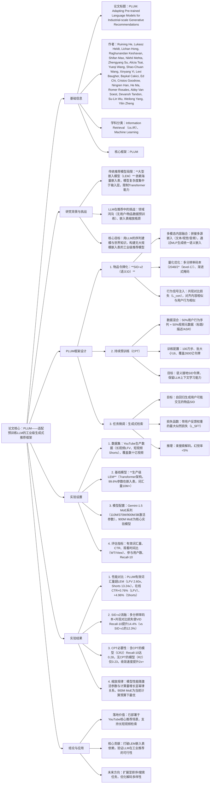

---

### 1. 一段话总结
为解决工业级推荐系统中传统**大型嵌入模型（LEM）** 依赖海量嵌入表、模型复杂度受限的问题，本文提出**PLUM框架**——通过**物品令牌化（SID-v2）**（融合多模态内容与用户行为信号的语义ID）、**持续预训练（CPT）**（在领域数据与通用文本上扩展LLM词汇表，对齐SID与文本令牌）、**任务特定微调（生成式检索）**（自回归生成推荐物品的SID）三大核心阶段，适配预训练LLM用于推荐任务。在YouTube大规模数据集上验证，PLUM的**900M激活参数MoE模型**相比优化后的生产级LEM，有效词汇量提升**2.60x（LFV）、13.24x（Shorts）**，在线A/B测试中**参与用户+0.07%-0.28%、面板CTR+0.76%-4.96%**，且样本效率更高（日训练样本仅2.5亿，为LEM的1/10以下），已部署于YouTube长短视频推荐场景。

---

### 2. 思维导图

---

### 3. 详细总结
#### 1. 研究背景与核心问题
传统工业级推荐系统以**大型嵌入模型（LEM）** 为主流，但存在两大关键局限：
- 1. **模型复杂度受限**：LEM的绝大多数参数（如生产模型中99.6%）集中于高基数特征的嵌入表，Transformer网络本身规模极小（仅0.4%参数），无法充分利用LLM的序列建模能力；
- 2. **缩放瓶颈**：嵌入表需海量训练数据支撑，且难以与LLM的“网络规模驱动缩放”范式兼容，导致个性化与泛化能力不足。

同时，直接应用Off-the-shelf LLM于推荐任务存在**领域鸿沟**——LLM未预训练用户行为与物品语料，无法理解用户偏好与物品语义关联，性能存在显著差距。

#### 2. PLUM框架设计（三大核心阶段）
##### 2.1 阶段1：物品令牌化——SID-v2（语义ID改进版）
相比前代SID-v1，SID-v2通过三大改进提升语义表达与推荐适配性，核心目标是将物品转化为LLM可处理的离散令牌序列：
| 改进方向          | 具体实现                                                                 | 核心作用                                                                 |
|-------------------|--------------------------------------------------------------------------|--------------------------------------------------------------------------|
| 多模态内容融合    | 输入M个异构嵌入（文本/视觉/音频），通过独立编码器εₘ生成zₘ，拼接后投影为统一语义嵌入z | 捕捉物品多维度语义（如视频的标题+画面+音频），避免单模态信息缺失          |
| 量化架构优化      | 1. 多分辨率码本：码本基数随层级降低（2048/2^(level-1)）；2. 渐进式掩码：随机选择前r层码本训练 | 减少SID空间稀疏性，强化层级语义连贯性，提升量化效率                      |
| 用户行为信号注入  | 新增**共现对比损失（L_con）**，鼓励频繁共现物品的SID相似，非共现物品SID疏远       | 桥接“内容相似”与“用户感知相似”，使SID更符合推荐场景的相关性定义          |

SID-v2的训练总损失：$`\mathcal{L}=\mathcal{L}_{recon}+\mathcal{L}_{rq}+\mathcal{L}_{con}`$，其中$`\mathcal{L}_{recon}`$为多模态嵌入重构损失，$`\mathcal{L}_{rq}`$为残差量化损失。

##### 2.2 阶段2：持续预训练（CPT）——对齐LLM与推荐领域
CPT的核心是扩展预训练LLM的词汇表以包含SID令牌，并注入领域知识，具体设计：
- **数据构成**：50%用户行为序列（含观看历史、观看比例、时间特征）+ 50%视频元数据（SID+标题/描述/ASR/频道名），总训练量达**2600亿令牌**；
- **训练目标**：next-token预测，扩展LLM词汇表以支持SID令牌，同时保留LLM的通用文本生成与上下文学习能力；
- **关键效果**：CPT后模型可实现**少样本学习**（如根据SID输入生成语义匹配的文本描述），且SID与文本令牌的语义对齐度显著提升。

##### 2.3 阶段3：任务微调——生成式检索
针对推荐的候选生成任务，将LLM微调为自回归生成模型：
- **输入prompt**：“观看历史（SID序列）| 用户特征 | 上下文视频特征”，固定长度1536令牌（覆盖约100条近期观看记录）；
- **训练目标**：最小化带用户反馈权重的似然损失 $`\mathcal{L}_{SFT}=-\sum_{t=1}^{L} r(user, v_{click}) \cdot log P(sid_t | Context, History, sid_{<t})`$，其中$`r`$为点击反馈权重；
- **推理策略**：束搜索解码生成多个SID序列，映射为真实视频，幻觉率<5%，SID-to-video映射唯一性达96.7%。

#### 3. 实验设置
| 维度                | 具体配置                                                                 |
|---------------------|--------------------------------------------------------------------------|
| 实验平台            | YouTube生产环境，覆盖**长视频（LFV）** 与**短视频（Shorts）** 场景          |
| 模型规模            | Gemini-1.5 MoE系列：110M/370M/900M/3B激活参数（总参数1B-10B+），核心模型为**900M MoE** |
| 基线模型            | 生产级**LEM**（Transformer架构，嵌入表词汇量10M+，99.6%参数为嵌入表）     |
| 评估指标            | 离线：有效词汇量（覆盖95%曝光的唯一视频数）、Recall@10；在线：参与用户数、面板CTR、观看量、满意度 |
| 数据划分            | 7天训练数据（随机打乱），第8天为测试集，训练硬件为1024个TPU v6e（32GB HBM） |

#### 4. 实验结果
##### 4.1 PLUM vs LEM：核心性能对比
| 指标                | 场景   | PLUM/LEM比值 | 关键结论                                                                 |
|---------------------|--------|--------------|--------------------------------------------------------------------------|
| 有效词汇量          | LFV    | 2.60x        | PLUM泛化能力更强，可推荐更多 niche 内容                                  |
| 有效词汇量          | Shorts | 13.24x       | Shorts场景下PLUM的内容覆盖优势更显著                                      |
| CTR                 | LFV    | 0.72x        | LFV场景CTR略低，但通过内容多样性弥补                                      |
| CTR                 | Shorts | 1.42x        | Shorts场景CTR显著提升，符合用户短内容探索需求                              |
| 观看时间比（WT/View）| LFV    | 1.33x        | LFV用户观看完整性更高，内容相关性更强                                      |
| 观看时间比（WT/View）| Shorts | 1.13x        | Shorts用户观看时长提升，推荐质量优化                                      |

**在线A/B测试结果**（PLUM对比改进版基线LEM+）：
| 指标          | LFV提升 | Shorts提升 |
|---------------|---------|-----------|
| 参与用户数    | +0.07%  | +0.28%    |
| 面板CTR       | +0.76%  | +4.96%    |
| 观看量        | +0.80%  | +0.39%    |
| 满意度        | +0.06%  | +0.39%    |

##### 4.2 SID-v2消融实验
| SID版本/消融项       | SID唯一性 | VID Recall@10 | 结论                                                                 |
|----------------------|-----------|--------------|----------------------------------------------------------------------|
| SID-v1（基线）       | 94.0%     | 12.3%        | 前代SID语义表达不足，检索召回低                                      |
| SID-v2（完整）       | 96.7%     | 14.4%        | 改进后语义完整性与检索性能显著提升                                    |
| SID-v2（移除多分辨率）| 94.8%     | 13.2%        | 多分辨率码本提升SID唯一性与语义连贯性                                |
| SID-v2（移除共现损失）| 91.8%     | 12.6%        | 共现损失对对齐行为相似与内容相似至关重要                              |

##### 4.3 持续预训练（CPT）必要性验证
通过2x2对照实验（是否用LLM初始化、是否进行CPT）验证CPT价值：
| 模型配置               | 预训练LLM | CPT | Recall@10（第8天） | 结论                                                                 |
|------------------------|-----------|-----|--------------------|----------------------------------------------------------------------|
| R1：随机初始化+无CPT   | 否        | 否  | 0.19               | 无LLM初始化与CPT，模型性能最差                                      |
| R2：LLM初始化+无CPT    | 是        | 否  | 0.23               | LLM初始化提供基础序列能力，但缺乏领域知识                              |
| CR1：随机初始化+CPT    | 否        | 是  | 0.27               | CPT注入领域知识，性能优于仅LLM初始化                                 |
| CR2：LLM初始化+CPT（PLUM）| 是     | 是  | 0.28               | LLM初始化+CPT协同最优，CPT使模型收敛速度提升2x+                      |

##### 4.4 缩放研究（模型规模vs性能）
- **损失缩放**：训练/评估损失随计算量（Iso-FLOPS）增长呈幂律下降，且大模型（如900M MoE）的损失饱和点更晚；
- **检索性能**：Recall@10随计算量增长持续提升，900M MoE在当前计算预算下最优（3B MoE因批大小限制未达最优）；
- **样本效率**：900M MoE日训练样本仅**2.5亿**，为LEM（数十亿样本/日）的1/10以下，且训练FLOPs仅为LEM的0.55x。

#### 5. 结论与未来方向
- **核心贡献**：PLUM首次实现无大规模嵌入表的工业级LLM推荐框架，在YouTube验证其有效性，平衡性能、泛化性与计算成本；
- **落地价值**：已部署于YouTube长短视频核心推荐场景，为工业推荐系统提供“LLM驱动”的新范式；
- **未来方向**：扩展至排序/个性化搜索任务、优化解码策略以提升候选多样性、实现SID与自然语言的无缝生成。

---

### 4. 关键问题与答案
#### 问题1：PLUM框架如何针对性解决传统大型嵌入模型（LEM）的核心局限？
**答案**：PLUM通过三大设计突破LEM的局限，具体对应：
1. **突破嵌入表依赖**：用**SID-v2**替代传统物品ID嵌入——将物品转化为离散令牌序列，无需维护海量嵌入表，模型复杂度从“嵌入表”转移至“Transformer网络”（PLUM中90%参数为网络参数，LEM中仅0.4%）；
2. **提升模型泛化能力**：通过**多模态融合（SID-v2）** 与**CPT**注入领域知识，有效词汇量提升**2.60x（LFV）、13.24x（Shorts）**，可推荐更多 niche 内容，解决LEM泛化性不足的问题；
3. **优化样本与计算效率**：PLUM的900M MoE模型日训练样本仅**2.5亿**（LEM需数十亿），训练FLOPs为LEM的0.55x，且在线推理幻觉率<5%，兼顾效率与可靠性。

#### 问题2：SID-v2相比前代SID-v1有哪些关键改进？这些改进如何提升推荐系统的检索性能？
**答案**：SID-v2有三大关键改进，直接提升语义表达与检索适配性：
1. **多模态内容融合**：输入文本、视觉、音频等多源嵌入，通过独立编码器与投影生成统一语义嵌入，解决SID-v1单模态信息缺失的问题——使SID能完整刻画物品多维度语义（如视频的画面风格+标题主题），提升检索相关性；
2. **多分辨率码本+渐进式掩码**：码本基数随层级降低（2048/2^(level-1)），减少SID空间稀疏性；渐进式掩码强化层级语义连贯性——使SID唯一性从94.0%（v1）提升至96.7%（v2），避免多物品映射同一SID；
3. **共现对比损失（L_con）**：根据用户行为序列，鼓励频繁共现物品的SID相似、非共现物品疏远——桥接“内容相似”与“用户感知相似”，使SID更符合推荐场景的相关性定义，检索召回从12.3%（v1）提升至14.4%（v2）。

#### 问题3：实验如何验证“持续预训练（CPT）”在PLUM中的必要性？CPT带来的核心价值是什么？
**答案**：通过2x2对照实验（4种模型配置）验证CPT的必要性，且CPT的核心价值在于“对齐LLM与推荐领域”：
1. **实验验证**：对照实验显示，含CPT的模型（CR1、CR2）Recall@10（0.27、0.28）显著高于无CPT的模型（R1、R2：0.19、0.23），且CPT使模型收敛速度提升2x+——证明CPT注入的领域知识（用户行为+物品元数据）是LLM适配推荐任务的关键；
2. **核心价值**：
    - **语义接地**：扩展LLM词汇表以包含SID令牌，使LLM能理解SID的语义（如根据SID生成物品描述）；
    - **知识融合**：50%领域数据+50%通用文本的混合训练，平衡领域适配性与LLM的通用序列能力；
    - **上下文学习**：CPT后模型保留少样本学习能力，可基于少量示例生成符合语义的推荐，提升模型灵活性。