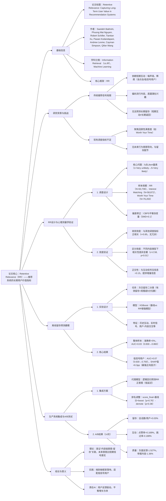

---

### 1. 一段话总结
针对推荐系统依赖**短期互动信号（点击、点赞）** 噪声大、无法反映长期用户留存的核心痛点，本文提出**Retentive Relevance（RR）**——一种基于调查的内容级反馈指标，通过询问用户“是否可能返回平台查看类似内容”直接捕捉**未来行为意图**，而非短期满意度。经心理测量学验证（收敛效度\(r=0.58-0.63\)、区分效度显著），离线建模显示RR预测次日留存时，准确率较基线提升**5.0个百分点**（78.0%→83.0%），低信号用户AUC提升**0.07**（0.630→0.700），显著优于互动信号与其他调查指标；将RR通过代理模型集成到生产排序系统后，大规模A/B测试实现用户会话数+**0.03%**、负面反馈-**1.527%**、举报内容-**1.36%**，同时提升内容质量，验证了其在平衡平台增长与用户长期价值中的有效性，为负责任AI推荐提供新范式。

---

### 2. 思维导图

---

### 3. 详细总结
#### 一、引言：推荐系统的长期价值痛点
1. **传统互动信号的固有缺陷**  
   工业推荐系统长期依赖**短期互动信号**（点击、点赞、停留时间），但存在三大问题：
   - 噪声高：用户互动未必代表真实偏好（如误点击、好奇性点击）；
   - 稀疏性：新用户/低活跃用户（低信号用户）互动数据不足，模型难以捕捉偏好；
   - 短期偏向：无法关联长期用户留存，导致“短期互动高但留存低”的矛盾（如用户点击低质量内容后不再返回）。

2. **现有调查指标的局限**  
   已有的调查反馈（如Interest Matching“内容是否匹配兴趣”、Worth Your Time“是否值得时间”）聚焦**回顾性满意度**，仅评估“已发生的体验”，未捕捉用户“是否愿意返回平台”的未来行为意图，无法支撑长期留存优化目标。

3. **研究核心目标**  
   提出**Retentive Relevance（RR）**——一种聚焦未来行为意图的内容级调查指标，通过严谨验证（心理测量学+离线建模）与生产集成，解决“短期信号无法预测长期留存”的核心问题。

#### 二、Retentive Relevance的设计与验证
##### 2.1 调查设计与数据收集
为确保RR的可靠性与代表性，实验采用严格的调查设计与偏差控制：

| 设计维度                | 具体实施方案                                                                 |
|-------------------------|------------------------------------------------------------------------------|
| **核心问题**            | “How likely or unlikely are you to return to [Platform] to view more posts like this?”（5点Likert量表：1=Very unlikely，5=Very likely，含中性中点3） |
| **样本覆盖**            | 2024年12月-2025年1月，18个国家，分层抽样（活跃/低活跃用户各50%），避免抽样偏差 |
| **实施细节**            | 视频推荐后弹窗，含可播放缩略图（减少回忆偏差），支持跳过，随机触发（覆盖所有推荐位置） |
| **偏差修正**            | 采用**协变量平衡倾向得分（CBPS）**，纳入用户demographics、平台 tenure、互动模式等协变量，修正后所有协变量标准化均值差|SMD|<0.1，确保样本代表性 |
| **样本规模**            | RR：N=63,708；对比指标Interest Matching：N=58,872；Worth Your Time：N=76,263 |

##### 2.2 心理测量学验证（确保指标有效性）
1. **收敛效度**：验证RR与理论相关指标的一致性  
   RR与其他调查指标存在显著正相关，但未达冗余阈值（r<0.85）：
   - 与Worth Your Time（内容价值）：r=0.63（p<0.001，95%CI[0.71,0.75]）；
   - 与Interest Matching（兴趣匹配）：r=0.58（p<0.001，95%CI[0.66,0.70]），证明RR与“内容价值”“兴趣匹配”存在合理概念重叠，但不冗余。

2. **区分效度**：验证RR与其他指标的独特性  
   RR在不同内容类型下与其他指标的相关性差异显著（z>2.58, p<0.01）：
   - 实用型内容（学习、DIY）：RR与Worth Your Time相关性更高（r=0.69 vs r=0.55），因这类内容的“价值感”更影响返回意图；
   - 兴趣型内容（明星、科技）：RR与Interest Matching相关性更高（r=0.65 vs r=0.51），因这类内容的“兴趣匹配”更关键，证明RR能适配不同场景的价值判断逻辑。

3. **与互动信号的正交性**  
   通过**互信息（MI）** 分析RR与传统互动信号的独立性：RR与点赞（MI=0.038）、收藏（MI=0.004）、分享（MI=0.003）的互信息均<0.15（如图2），说明RR捕捉的“未来意图”信息无法由互动信号推断，为推荐系统提供独特增量价值。

#### 三、离线建模：RR对留存预测的优势
##### 3.1 实验设计（聚焦次日留存预测）
- **任务定义**：次日留存二分类，y=1表示用户次日观看视频数超过活跃用户的5分位数（排除“偶然返回”，定义为“有效留存”）；
- **模型架构**：采用XGBoost梯度提升分类器（工业常用，抗噪声能力强），对比两组模型：
   - 基线模型：仅含传统特征（历史互动、实时信号、内容元数据、demographics）；
   - 增强模型：基线特征+RR调查信号；
- **评估方式**：10折分层交叉验证（保持留存类比例），核心指标为**准确率**与**ROC AUC**。

##### 3.2 核心结果（RR显著提升留存预测能力）
| 模型配置                | 整体样本性能                |                  | 低信号用户性能（互动稀疏）  |                  |
|-------------------------|-----------------------------|------------------|-------------------------|------------------|
|                         | 准确率（%）±95%CI          | ROC AUC±95%CI    | 准确率（%）±95%CI        | ROC AUC±95%CI    |
| 基线模型（无调查信号）  | 78.0 ± 0.3                  | 0.830 ± 0.005    | 73.0 ± 1.3              | 0.630 ± 0.013    |
| 基线+Retentive Relevance | 83.0 ± 0.3***               | 0.860 ± 0.005*** | 76.0 ± 1.5***           | 0.700 ± 0.025*** |
| 基线+Worth Your Time   | 78.0 ± 0.4                  | 0.828 ± 0.006    | 73.2 ± 1.4              | 0.632 ± 0.015    |
| 基线+Interest Matching | 78.2 ± 0.3                  | 0.838 ± 0.005    | 73.1 ± 1.3              | 0.635 ± 0.014    |

注：***p<0.001（vs基线），RR是唯一能显著提升留存预测的调查指标，且对低信号用户的提升更显著（AUC+0.07 vs 整体+0.03）。

##### 3.3 特征重要性分析（SHAP值）
通过SHAP（Shapley Additive exPlanations）量化RR对留存预测的贡献：
- **整体用户**：RR的“Unlikely”响应是第二大负向预测因子（-2.1个百分点留存概率），仅次于“当日互动量”，证明负面RR信号对留存的强警示作用；
- **低信号用户**：RR的“Very Likely”响应是最强正向预测因子（+8.3个百分点留存概率），远超点赞（+0.9）、分享（+0.46）等互动信号，凸显RR在“数据稀疏场景”的不可替代性——低信号用户缺乏互动数据，RR的直接意图声明成为最可靠的预测依据。

#### 四、生产系统集成与在线A/B测试
##### 4.1 生产集成方案（从调查指标到排序信号）
1. **RR代理模型（解决实时性问题）**  
   调查仅覆盖部分内容，需实时预测所有内容的RR值：
   - 任务：二分类预测用户对未见过内容的RR正意图（4-5分=1，1-2分=0，排除中性3分，因中性标签降低模型区分度）；
   - 模型选择：逻辑回归（生产友好，低延迟，适配毫秒级排序）；
   - 特征输入：行为预测分（如点击概率）、用户互动率、内容元数据（主题、创作者）、负反馈指标（跳过率）；
   - 损失函数：正则化逻辑损失（加入L2正则化，避免过拟合）。

2. **排名分数调整（平衡精度与稳定性）**  
   为避免RR对现有排序系统冲击过大，设计校准化分数调整规则：  
   $`[score_{final}(u, v) = score_{base}(u, v) + boost(u, v) - demote(u, v)]`$
   - **正向boost**：当RR预测概率$`(\hat{p}>0.76)`$（经离线验证，此阈值对应80%正精度，即80%预测为“正意图”的内容确实获得用户RR高分），叠加固定系数$`(\alpha)`$，提升排名；
   - **负向demote**：当RR预测概率$`(\hat{p}<0.38)`$（对应60%负精度），按$`(\beta \cdot (\tau_{demote}-\hat{p}))`$扣分（概率越低，扣分越多）；
   - **中性区间**：$`(0.38 \leq \hat{p} \leq 0.76)`$不调整，保障排序稳定性。

##### 4.2 在线A/B测试结果（14天，社交平台视频推荐）
实验在日活亿级社交平台展开，对比“基线系统”与“RR增强系统”，核心结果如下：

| 指标类别    | 具体指标                | 变化（% Δ ± 95% CI）       | 业务意义                     |
|-------------|-------------------------|----------------------------|------------------------------|
| **用户留存**| 会话数/用户             | +0.030 ± 0.026             | 长期用户粘性显著提升，符合RR设计目标 |
| **用户互动**| 沟通行为（评论/私信）    | +0.052 ± 0.039             | 用户主动互动增加，内容参与度提升 |
|             | 点赞率                  | +0.169 ± 0.100             | 内容认可度提升，无“留存-互动”trade-off |
|             | 视频跳过率              | -0.188 ± 0.085             | 内容匹配度提升，用户无需频繁跳过 |
| **内容质量**| 举报内容占比            | -1.36 ± 0.11               | 低质量内容曝光减少，平台生态优化 |
|             | 负面反馈率（如“不感兴趣”）| -1.527 ± 0.095             | 用户不满情绪降低，体验更优     |
|             | “不感兴趣”信号率        | -2.6 ± 1.3                 | 内容相关性显著提升，减少用户反感 |

所有指标均满足统计显著性（p<0.05），证明RR集成不仅提升长期留存，还同步优化互动质量与内容生态，无指标冲突，实现“用户-平台-内容”三方共赢。

#### 五、结论与意义
1. **理论贡献**
   - 首次建立“内容级用户意图-长期留存”的实证关联，验证**未来行为意图**（RR）比短期互动信号、回顾性满意度更能预测留存，为推荐系统长期价值优化提供理论依据；
   - 完善调查指标的心理测量学验证框架，确保推荐系统中“用户反馈信号”的可靠性。

2. **实践价值**
   - 提供从“调查设计→离线验证→生产集成”的端到端框架，适配工业级大规模部署（如日活亿级平台）；
   - 特别解决低信号用户的留存预测难题，为冷启动、低活跃用户个性化提供关键信号。

3. **负责任AI意义**
   - 通过**直接用户反馈**驱动算法优化，提升推荐系统的透明度与可解释性（用户意图可直接追溯）；
   - 实现“短期体验-长期留存-内容质量”的协同优化，避免算法陷入“短期互动最大化”的短视陷阱，为负责任AI推荐系统提供新范式。

**局限与未来方向**：当前RR仅评估单条推荐的意图，未覆盖会话级连续推荐的整体意图；未来可扩展至多模态推荐（如图文、直播），并通过纵向跟踪研究用户意图的时间演化规律。

---

### 4. 关键问题与答案
#### 问题1：Retentive Relevance（RR）相比传统互动信号和其他调查指标，核心差异体现在哪两个维度？这种差异为何能让RR更精准预测长期留存？
**答案**：RR的核心差异体现在**信号导向**与**预测目标**两个维度，这是其留存预测优势的根源：
1. **信号导向差异**：
   - 传统互动信号（点击、点赞）是**间接行为导向**，需通过“行为推断偏好”（如点击≠喜欢），噪声高且易受位置偏差、好奇性点击干扰；
   - 其他调查指标（如Worth Your Time）是**回顾性体验导向**，仅评估“已发生的内容价值”，与“未来是否返回”无直接关联；
   - RR是**未来意图导向**，基于计划行为理论（TPB），直接询问“是否返回”，信号与留存目标（用户次日返回）的语义距离最短，无需间接推断。

2. **预测目标差异**：  
   传统信号与调查指标聚焦“短期价值”（如当前互动、当前满意度），而RR聚焦“长期留存”（未来行为），与推荐系统的核心商业目标（用户生命周期价值）更对齐。实证显示，RR对次日留存的预测AUC达0.860，显著高于互动信号（基线AUC 0.830），证明其导向优势。

#### 问题2：离线实验中，Retentive Relevance对“低信号用户”的留存预测优势为何远大于普通用户？这一发现对推荐系统冷启动问题有何启示？
**答案**：RR对低信号用户的优势源于“数据依赖差异”，这为冷启动问题提供关键解决方案：
1. **低信号用户的核心痛点**：传统模型依赖**历史互动数据**（如28天观看量、点击记录），但低信号用户（新用户/低活跃用户）此类数据稀疏，模型无法捕捉偏好，导致留存预测AUC仅0.630；
2. **RR的独特价值**：RR通过**直接调查反馈**获取用户意图，无需依赖大量历史行为——即使是新用户，只要完成1次推荐后的调查，即可提供可靠的意图信号。离线实验显示，低信号用户加入RR后AUC提升0.07（0.630→0.700），SHAP值达+8.3pp（最强正向因子），远超点赞（+0.9pp）等互动信号；
3. **对冷启动的启示**：RR可作为冷启动用户的“核心补充信号”——新用户注册后，通过少量推荐后的调查（如前3次推荐），即可快速建立意图模型，缓解“新用户无数据可用”的困境，提升冷启动阶段的留存率。

#### 问题3：将Retentive Relevance从“调查指标”落地为“生产排序信号”，关键技术设计是什么？这些设计如何平衡“预测精度”与“系统稳定性”？
**答案**：RR落地的关键设计聚焦“实时性”与“风险控制”，通过三步实现精度与稳定性的平衡：
1. **代理模型设计（解决实时性）**：
   - 问题：调查仅覆盖部分内容，无法实时预测所有内容的RR值；
   - 设计：采用**逻辑回归模型**（而非复杂深度学习模型），兼顾预测精度与生产低延迟（适配毫秒级排序）；特征纳入行为预测分、内容元数据等易获取信号，确保模型在无调查数据时仍能可靠预测；
   - 效果：代理模型对RR正意图的预测精度达80%，满足生产需求。

2. **校准化排名调整（控制风险）**：
   - 正向boost阈值（0.76）：仅对高置信度正意图内容（80%精度）提升排名，避免“误提低质量内容”；
   - 负向demote阈值（0.38）：仅对高置信度负意图内容（60%精度）扣分，且扣分幅度与“负意图概率”正相关（概率越低，扣分越多），避免“过度打压潜在优质内容”；
   - 中性区间（0.38-0.76）：不调整排名，保障现有排序系统的稳定性，避免RR对业务造成冲击。

3. **A/B测试验证（量化平衡效果）**：  
   在线实验显示，RR集成后会话数+0.03%（精度目标），同时未导致互动指标下降（跳过率-0.188%），证明“精度-稳定性”平衡有效——既利用RR提升长期留存，又不破坏现有系统的短期体验。