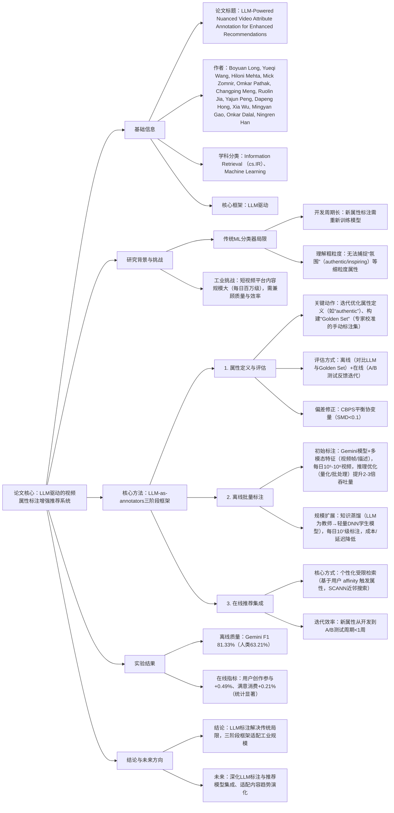

---

### 1. 一段话总结
针对传统机器学习（ML）分类器在视频推荐内容理解中存在的**开发周期长**与**缺乏细粒度属性捕捉**（如“氛围”类属性）的核心问题，本文提出**LLM-as-annotators框架**，以Google **Gemini系列模型**为核心，通过“属性定义与评估→离线批量标注→在线推荐集成”三阶段 workflow 实现工业级短视频属性标注：先通过迭代优化属性定义与“Golden Set”验证确保标注质量，再利用**推理优化（量化/批处理）** 与**知识蒸馏**将标注规模从每日10⁵-10⁶视频扩展至10⁷级，最终通过**个性化受限检索**集成到在线推荐系统。实验显示，LLM离线标注F1-Score达**81.33%**（人类标注仅63.21%），在线A/B测试实现用户创作参与+**0.49%**、满意消费+**0.21%**，有效提升推荐精准度与用户体验。

---

### 2. 思维导图

---

### 3. 详细总结
#### 1. 研究背景与核心问题
传统视频推荐系统的内容理解依赖**机器学习（ML）分类器**，但存在两大关键局限，无法满足工业级短视频平台需求：
- **开发周期长**：新增一个内容属性（如“calming”氛围）需重新设计特征、训练模型，迭代效率低；
- **理解粗粒度**：仅能捕捉“类别”（如“美食”“游戏”）等高阶属性，无法识别“authentic（真实感）”“inspiring（激励性）”等细粒度“氛围”属性，而这类属性对个性化推荐至关重要。

同时，短视频平台（如YouTube）每日新增内容规模达百万级，传统方法难以平衡**标注质量**与**标注效率**，亟需更灵活、可扩展的内容理解方案。

#### 2. 核心方法：LLM-as-annotators三阶段框架
以**Google Gemini系列模型**（如Gemini 2.5 Pro）为核心，设计端到端 workflow，覆盖“标注定义→规模落地→推荐集成”全链路，具体如下：

##### 2.1 阶段1：属性定义与评估（确保标注有效性）
该阶段为后续标注奠定质量基础，核心是解决“属性定义模糊”与“标注质量验证”问题：
- **关键动作1：迭代优化属性定义**  
  组织内部专家通过讨论校准，明确细粒度属性的边界（如“authentic”初始定义排除高剪辑vlog，后修正为“优先创作者真实表达，而非剪辑程度”），避免LLM与人类理解偏差；
- **关键动作2：构建“Golden Set”**  
  由专家手动标注高质量样本集（如数百条视频），确保**评分一致性**（提升Inter-Rater Reliability），作为LLM标注的离线评估基准；
- **评估闭环**：先通过离线指标（Precision/Recall/F1）对比LLM与Golden Set的一致性，再结合**在线A/B测试**反馈（如用户是否喜欢该属性推荐），迭代优化属性定义与LLM提示词。

##### 2.2 阶段2：离线批量标注（平衡质量与规模）
需实现“从少量高质量标注到全量覆盖”的 scaling，核心挑战是**成本控制**与**低延迟**，解决方案分两步：
1. **初始高质量标注（每日10⁵-10⁶视频）**
   - 输入：视频多模态特征（采样帧、标题/描述文本、LLM提示词）；
   - 效率优化：采用**模型量化**（如GPTQ）、**批大小调优**、**模型分片**，吞吐量较基线提升2-3倍，降低直接LLM推理成本；
2. **全量规模扩展（每日10⁷级标注）**
   - 核心技术：**知识蒸馏**（Knowledge Distillation）；
   - 流程：以LLM标注结果（含概率分数）为“Silver Set”（教师标签），训练轻量级DNN“学生模型”（仅用预计算视频嵌入等紧凑特征），学生模型 latency 仅为LLM的1/100，成本降低90%以上，且标注质量仅轻微下降（F1损失<5%）；
   - 迭代逻辑：新属性先通过LLM标注小批量验证价值，在线A/B测试确认收益后，再用蒸馏扩展全量。

##### 2.3 阶段3：在线推荐集成（转化标注价值）
将离线标注的细粒度属性融入实时推荐，核心方式为**个性化受限检索（Personalized Restricted Retrieval）**：
- 实现逻辑：
   1. 为每个属性（如“energetic”）构建专属内容词表；
   2. 基于用户 affinity 模型（预测用户对属性的偏好）触发对应属性检索；
   3. 采用**SCANN近邻搜索**在属性词表内筛选候选，结合Transformer序列检索模型优化排序；
- 迭代效率：通过紧密集成标注库与推荐系统，新属性从开发到在线A/B测试的周期缩短至**1周内**，支持快速验证。

#### 3. 实验结果（工业级验证）
实验基于大型短视频推荐平台，从离线标注质量与在线用户指标两方面验证效果，关键数据如下：

##### 3.1 离线标注质量对比（以“氛围”类属性为例）
| 标注主体       | Precision（%） | Recall（%） | F1-Score（%） | 核心优势                     |
|----------------|----------------|-------------|---------------|------------------------------|
| Google Gemini 2.5 Pro | 85.03          | 77.94       | 81.33         | 细粒度理解强、一致性高       |
| 第三方人类标注者     | 76.82          | 53.69       | 63.21         | 主观偏差大、一致性低         |

*注：人类标注者为第三方供应商，受预算与周期限制，代表传统标注上限；LLM标注无需任务微调，仅通过提示词优化。*

##### 3.2 在线A/B测试结果（某“氛围”属性案例）
| 核心指标               | 提升幅度（%） | 统计显著性 | 业务意义                     |
|------------------------|---------------|------------|------------------------------|
| 用户创作参与率         | +0.49         | p<0.05     | 提升平台内容生态活跃度       |
| 满意消费率（用户停留达标） | +0.21         | p<0.05     | 增强推荐相关性与用户满意度   |

#### 4. 结论与未来方向
- **核心结论**：LLM-as-annotators框架通过三阶段 workflow，解决了传统ML分类器的周期长与细粒度理解不足问题，在工业级平台实现“质量-效率-规模”的平衡；
- **未来方向**：1. 深化LLM标注与推荐模型的融合（如将标注作为排序特征）；2. 设计动态属性更新机制，适配内容趋势演化（如新兴“氛围”属性）。

---

### 4. 关键问题与答案
#### 问题1：传统ML分类器在视频内容理解中存在哪些核心局限？LLM-as-annotators框架通过哪些设计针对性解决这些局限？
**答案**：传统ML分类器的核心局限有两点：
1. **开发周期长**：新增一个内容属性（如“inspiring”）需重新设计特征工程、训练模型，迭代周期通常>1个月；
2. **细粒度理解缺失**：仅能识别“类别”等高阶属性，无法捕捉“氛围”“真实感”等主观细粒度属性，而这类属性对个性化推荐至关重要。

LLM框架的针对性解决方案：
- 解决“周期长”：通过**灵活提示词优化**替代模型重训，新属性从定义到验证周期缩短至1周内，无需特征工程；
- 解决“细粒度缺失”：利用LLM（如Gemini）的**多模态理解与世界知识**，通过“Golden Set”校准提示词，精准捕捉“氛围”类属性（如区分“authentic”的vlog与普通视频）；
- 额外保障：通过“离线Golden Set验证+在线A/B测试”的闭环，确保LLM标注质量与业务价值对齐。

#### 问题2：离线批量标注阶段如何实现“从少量高质量到全量覆盖”的 scaling？知识蒸馏在其中扮演什么关键角色？
**答案**：离线标注的 scaling 分两步实现，知识蒸馏是全量扩展的核心技术：
1. **初始高质量标注（每日10⁵-10⁶视频）**：  
   选择高价值视频（新发布、高流量），用Gemini模型结合多模态特征（帧+文本）标注，通过**推理优化**（量化、批处理、分片）提升2-3倍吞吐量，控制直接LLM推理成本；
2. **全量扩展（每日10⁷级标注）**：  
   核心依赖**知识蒸馏**，具体流程：
   - 教师模型：Gemini标注结果（含概率分数）构成“Silver Set”，提供高质量标签；
   - 学生模型：训练轻量级DNN（仅用预计算视频嵌入等紧凑特征），复制教师的标注逻辑；
   - 价值：学生模型 latency 仅为LLM的1/100，成本降低90%+，标注质量仅损失<5%，实现全量视频覆盖。

知识蒸馏的关键作用：打破“高质量标注”与“大规模覆盖”的矛盾，使LLM的细粒度理解能力从“小批量验证”落地为“全量可用”，适配工业级内容规模。

#### 问题3：LLM标注的细粒度属性如何集成到在线推荐系统？在线A/B测试的核心结果与业务价值是什么？
**答案**：在线集成与实验结果如下：
1. **在线集成方式**：采用**个性化受限检索（Personalized Restricted Retrieval）**，具体逻辑：
   - 属性词表：为每个LLM标注属性（如“calming”）构建专属内容词表；
   - 触发逻辑：通过用户 affinity 模型预测用户对属性的偏好，动态触发对应属性的检索；
   - 候选筛选：用SCANN近邻搜索在属性词表内筛选候选，结合Transformer序列模型优化排序，确保推荐个性化；
2. **在线A/B测试核心结果**（以某“氛围”属性为例）：
   - 用户创作参与率+0.49%（p<0.05）：用户因推荐更符合偏好的内容，更愿意创作分享，提升平台生态活跃度；
   - 满意消费率+0.21%（p<0.05）：用户停留时间达标率提升，说明推荐相关性增强，直接改善用户体验；
3. **业务价值**：实现“用户体验-平台生态”双增益，证明LLM标注的细粒度属性不仅能提升推荐精准度，还能驱动用户主动参与，为平台长期增长提供支撑。