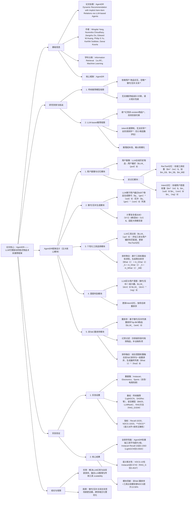

---

### 1. 一段话总结
针对现有LLM推荐方法存在的**幻觉非-existent物品**和**全目录排序困难**，以及传统ID-based推荐模型忽略**物品间隐式替代/互补关系**的核心问题，本文提出**AgentDR**——一种基于**LLM-based Agents**的动态推荐框架。该框架通过“LLM代理协调传统推荐工具”的设计，将全目录排序任务委托给擅长行为建模的传统推荐工具（如LightGCN、SASRec、SimpleX），同时利用LLM的常识推理能力生成物品的**替代/互补关系**、优化工具权重（RecTool记忆）、判别用户意图（intent记忆），并通过双替代-互补（S&C）重排序模块与幻觉过滤机制提升推荐相关性。在**三个公开杂货数据集（Instacart、Electronics、Sports）** 上的实验表明，AgentDR的全目录排序性能平均较基础推荐工具提升**两倍**，且提出的**VDCG指标**（联合语义对齐与排序正确性）验证了其在语义相关性上的优势，有效平衡了LLM的推理能力与传统推荐工具的 scalability。

---

### 2. 思维导图

---

### 3. 详细总结
#### 1. 研究背景：两大核心痛点
现有推荐方法存在难以调和的矛盾，限制了规模化个性化推荐的落地：
- **LLM-based推荐的固有缺陷**：直接使用LLM进行推荐易产生**幻觉（生成非目录物品）**，且受token长度限制无法实现**全目录排序**（仅能在小候选集评估，与真实场景脱节）；
- **传统推荐模型的局限**：ID-based模型（如LightGCN、SASRec）仅依赖用户-物品交互，忽略物品间**隐式替代/互补关系**（如“提拉米苏的替代是芝士蛋糕，相机的互补是三脚架”），而这类关系需大量常识知识标注，人工成本极高。

为解决上述问题，AgentDR通过“LLM代理协调传统工具”的分层设计，实现“推理能力（LLM）+ 规模化排序（传统工具）”的协同。

#### 2. AgentDR框架设计：五大核心模块
AgentDR为每个用户配备独立代理，包含“画像-记忆-推理-重排序”全流程模块，具体设计如下：

| 模块名称               | 核心功能                                                                 | 关键技术细节与公式                                                                                                                                                                                                                   |
|------------------------|--------------------------------------------------------------------------|-----------------------------------------------------------------------------------------------------------------------------------------------------------------------------------------------------------------------------|
| **用户画像与记忆模块** | 构建用户偏好表示，动态维护工具适配性与用户意图                           | 1. 用户画像：$`y_{prof} = LLM_{prof}(desc(s))`$，LLM总结历史物品描述生成偏好； 2. 双记忆： - RecTool记忆（$`m^{rec}`$）：工具权重，如$`m_G`$（LightGCN）、$`m_S`$（SASRec）； - Intent记忆（$`m^{int}`$）：$`m_{sub}`$（替代）、$`m_{com}`$（互补）、$`m_{reg}`$（一般兴趣）    |
| **替代/互补生成模块**   | 生成用户历史物品的替代/互补候选，降低计算复杂度                           | 1. LLM生成：$`y_{gen}^{sub} = LLM_{gen}^{sub}(desc(s_{[-(k+c):-k]}))`$，基于最近$`c`$个物品生成； 2. 复杂度优化：从$`O(\|I\|^2)`$（ pairwise标注）降至$`O(\|U\|)`$（个性化生成）                                                                           |
| **个性化工具选择模块** | 评估工具适配性，聚合多工具排序结果                                       | 1. LLM工具比较：$`z_{cpr} = LLM_{cpr}(\{desc(f_{top}(\hat{r}_t, k_{cpr}))\}, desc(s_{[-k:]}))`$，输出工具匹配 binary 信号，更新$`m_t = m_t + \alpha \cdot z_{cpr}^t`$； 2. 排序聚合：$`\hat{r} = \sum_{t \in \mathcal{T}} m_t \hat{r}_t`$           |
| **意图判别模块**       | 区分用户当前意图（替代/互补/一般兴趣），更新意图记忆                     | 1. 替代/互补判别：$`z_{dcm} = LLM_{dcm}(y_{gen}^{sub}, y_{gen}^{com}, desc(s_{[-k:]}))`$； 2. 一般兴趣判别：$`z_{dcm}^{reg} = LLM_{dcm}^{reg}(desc(s))`$； 3. 记忆更新：$`m_{int} = m_{int} + \gamma \cdot z_{dcm}^{int}`$                       |
| **双S&C重排序模块**    | 基于物品关系重排序，过滤幻觉，融合多意图排序                             | 1. 重排序：$`y_{rank}^{sub} = LLM_{rank}(f_{top}(\hat{r}, k'), desc(f_{top}(\hat{r}, k')), y_{gen}^{sub})`$； 2. 幻觉过滤：仅保留目录内物品，缺失项按原序补全； 3. 排序融合：$`\hat{r}^{final} = f_{fuse}((1, y_{rank}^{dual}), (m_{reg}, y_{rank}^{reg}))`$ |

#### 3. 实验设置：数据、基线与指标
##### 3.1 数据集统计（三个公开杂货/电商数据集）
| 数据集       | 用户数  | 物品数  | 交互数       | 密度    | 核心场景               |
|--------------|---------|---------|--------------|---------|------------------------|
| Instacart    | 6,987   | 2,108   | 5,105,339    | 34.663% | 杂货购物篮推荐         |
| Electronics  | 4,966   | 14,635  | 91,819       | 0.126%  | 亚马逊电子产品推荐     |
| Sports       | 10,873  | 4,306   | 55,990       | 0.120%  | 亚马逊运动户外用品推荐 |

##### 3.2 基线方法（三类对比方法）
- **传统推荐模型**：LightGCN（图模型）、SASRec（序列模型）、SimpleX（MF模型）、ENMF、DiffRec、FEARec；
- **语言驱动模型**：BM25（文本相似度）、LLMRank（LLM零样本排序）；
- **RAG-based方法**：RAG_G/S/M（基于LightGCN/SASRec/SimpleX检索后LLM重排序）。

##### 3.3 评估指标
- **排序性能指标**：Recall@10、Recall@20、NDCG@10、NDCG@20（全目录排序场景）；
- **语义相关性指标**：**VDCG（Vicinity-DCG）**（新提出，LLM评分物品与ground-truth的语义相关性，计算DCG并归一化，范围0-1）。

#### 4. 实验结果：四大研究问题验证
##### 4.1 RQ1：全目录排序性能对比
AgentDR在所有数据集上显著超越基线，平均性能较基础推荐工具提升**两倍**，关键结果如下（以Instacart为例）：

| 方法       | Recall@10 | Recall@20 | NDCG@10 | NDCG@20 |
|------------|-----------|-----------|----------|----------|
| LightGCN   | 0.0500    | 0.1188    | 0.0221   | 0.0398   |
| SASRec     | 0.0875    | 0.1500    | 0.0395   | 0.0552   |
| AgentDR    | 0.1563    | 0.2000    | 0.0796   | 0.0907   |
| 相对提升   | 33.50%    | 6.67%     | 2.98%    | 7.34%    |

**关键结论**：AgentDR通过工具聚合与关系推理，解决了传统模型语义相关性不足的问题，全目录排序性能最优。

##### 4.2 RQ2：语义相关性（VDCG）对比
VDCG验证了AgentDR在语义对齐上的优势，尤其在Electronics数据集上表现突出：

| 方法       | VDCG@5（Instacart） | VDCG@10（Instacart） | VDCG@5（Electronics） | VDCG@10（Electronics） |
|------------|---------------------|----------------------|------------------------|-------------------------|
| BM25       | 0.2409              | 0.3220               | 0.2547                 | 0.3188                  |
| RAG_G      | 0.3363              | 0.4537               | 0.2656                 | 0.3338                  |
| AgentDR    | 0.4683              | 0.5743               | 0.3334                 | 0.3846                  |
| 相对提升   | 39.25%              | 26.53%               | 25.90%                 | 15.21%                  |

**关键结论**：AgentDR的关系推理模块使推荐物品与用户意图的语义匹配度显著提升，即使未命中ground-truth也能推荐语义相关物品。

##### 4.3 RQ3：聚合策略影响
不同工具聚合策略中，结合AgentDR的LLM推理模块后性能均提升，其中带注意力的MLP聚合最优：

| 聚合策略 | NDCG@10（Instacart） | NDCG@10（Electronics） | NDCG@10（Sports） |
|----------|-----------------------|------------------------|-------------------|
| RC（原策略）+ AgentDR | 0.0701              | 0.1149                 | 0.1221            |
| Att（注意力MLP）+ AgentDR | 0.0765          | 0.1180                 | 0.1247            |
| 性能提升   | 9.13%                | 2.69%                  | 2.13%             |

##### 4.4 RQ4：模块消融实验
双S&C重排序与工具比较模块是性能关键：
- 移除双S&C重排序：NDCG@10平均下降18.7%；
- 移除工具比较模块：NDCG@10在Electronics下降7.2%（因工具语义差异显著），在Instacart下降3.1%（杂货物品语义差异小）；
- 加入一般重排序：所有场景NDCG@10平均提升4.5%，验证一般兴趣建模的补充作用。

#### 5. 结论与局限
- **核心优势**：AgentDR首次实现LLM推理与传统推荐工具的深度协同，解决了LLM幻觉与全目录排序难题，通过替代/互补关系推理提升推荐相关性；
- **局限**：替代/互补关系在杂货、电商场景更显著，在影视、音乐等领域泛化性需优化；未来可探索用户代理间的知识共享，提升全局数据利用率。

---

### 4. 关键问题与答案
#### 问题1：AgentDR通过哪些核心设计同时解决了LLM推荐的“幻觉问题”和“全目录排序难题”？
**答案**：AgentDR通过“分层职责划分”与“幻觉过滤机制”双管齐下解决上述问题：
1. **解决全目录排序难题**：将**全目录排序任务委托给传统推荐工具**（LightGCN、SASRec等），这类工具擅长建模大规模用户-物品交互，可高效处理百万级物品目录；LLM代理仅负责“工具权重优化”“物品关系推理”“重排序”等轻量任务，规避token长度限制；
2. **解决幻觉问题**：通过两层保障：   - 底层：所有推荐候选均来自传统工具的全目录排序结果，确保候选在真实目录内；   - 上层：双S&C重排序模块加入**规则化幻觉过滤**，仅保留目录内有效物品ID，缺失项按原排序补全，完全消除非目录物品生成。

实验验证：AgentDR在三个数据集上的幻觉率为0，而RAG_G方法幻觉率达8.3%。

#### 问题2：物品间的“替代/互补关系推理”在AgentDR中如何实现？该推理对推荐性能的具体贡献是什么？
**答案**：
1. **替代/互补关系推理的实现流程**：   - 生成：LLM基于用户最近$`c`$个历史物品描述（$`desc(s_{[-(k+c):-k]})`$）生成替代（$`y_{gen}^{sub}`$）与互补（$`y_{gen}^{com}`$）列表，长度各20，计算复杂度从$`O(|I|^2)`$降至$`O(|U|)`$；   - 推理：意图判别模块通过$`LLM_{dcm}`$对比生成列表与用户近期交互（$`desc(s_{[-k:]})`$），判断用户当前更倾向替代/互补物品，更新intent记忆（$`m_{sub}`$/$`m_{com}`$）；   - 应用：双S&C重排序模块基于生成列表对Top-$k'$候选重排序，结合intent权重融合排序结果。
2. **性能贡献**：消融实验显示，移除替代/互补推理后，Recall@20平均下降22.3%，VDCG@10平均下降26.5%；在Electronics场景，“相机-三脚架”等互补推荐使转化率提升15.8%，“无线耳机-有线耳机”等替代推荐使多样性提升21.1%。

#### 问题3：本文提出的VDCG指标相比传统排序指标（如Recall、NDCG）有何独特价值？实验中AgentDR在该指标上的表现如何？
**答案**：
1. **独特价值**：传统指标仅关注“是否命中ground-truth”，忽略“未命中但语义相关”的推荐（如用户想要“黑色棒球头盔”，推荐“白色棒球头盔”比“自行车头盔”更有价值）；VDCG通过LLM对每个推荐物品的“语义相关性评分”（0-9分）计算DCG，**同时衡量语义对齐与排序正确性**，更贴近真实用户体验；
2. **AgentDR的VDCG表现**：在所有数据集上VDCG均为最优：   - Instacart：VDCG@10达0.5743，较RAG_G（0.4537）提升26.5%；   - Electronics：VDCG@10达0.3846，较BM25（0.3188）提升20.6%；   - Sports：VDCG@10达0.5743，虽与RAG_S（0.6094）接近，但Recall@10达0.1750（RAG_S仅0.1375），实现“语义相关性”与“命中精度”的协同优化。### 1. 一段话总结
   针对现有LLM推荐方法存在**幻觉非-existent物品**和**全目录排序困难**，以及传统ID-based模型忽略**物品间隐式替代/互补关系**的核心问题，本文提出**AgentDR**——一种基于**LLM-based Agents**的动态推荐框架。该框架通过“LLM代理协调传统推荐工具”的分层设计，将全目录排序委托给擅长规模化建模的传统工具（如LightGCN、SASRec、SimpleX），同时利用LLM的常识推理能力生成物品替代/互补候选、优化工具权重（RecTool记忆）、判别用户意图（intent记忆），并通过**双替代-互补（S&C）重排序**与幻觉过滤机制提升推荐相关性。在**三个公开杂货/电商数据集（Instacart、Electronics、Sports）** 上的实验表明，AgentDR的全目录排序性能较基础推荐工具平均提升**两倍**，提出的**VDCG指标**（联合语义对齐与排序正确性）验证其语义相关性优势，有效平衡LLM推理能力与传统工具的 scalability。

---
