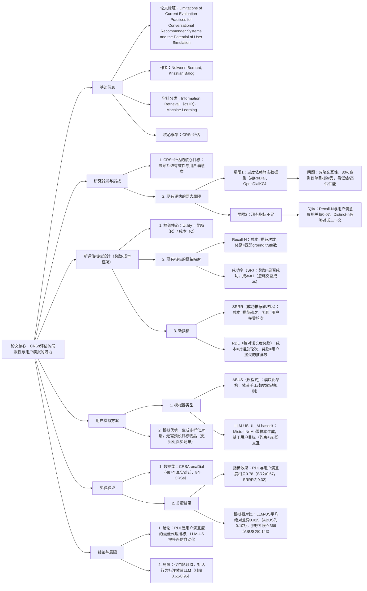

---

### 1. 一段话总结
针对当前对话推荐系统（CRSs）评估中**过度依赖静态测试集**（如ReDial、OpenDialKG）和**现有指标（如Recall@N）与用户满意度脱节**的核心局限，本文提出以**奖励-成本框架**为基础的用户中心评估指标（**SRRR、RDL**），并探索用户模拟的自动化评估潜力。实验表明，新指标中**Reward-per-Dialogue-Length（RDL）与用户满意度的Kendall相关系数达0.78**（显著高于Recall@1的0.07）；对比议程式（ABUS）与LLM-based（LLM-US）用户模拟器，**LLM-US更可靠**，其生成对话的RDL与真实用户结果平均绝对差异仅0.015（ABUS为0.107），且对CRSs排序的Kendall相关达0.366（ABUS为0.143）。最终通过重新评估9个现有CRSs，发现部分基于传统指标的结论不再成立，证实新评估范式的必要性。

---

### 2. 思维导图

---

### 3. 详细总结
#### 1. 研究背景与CRSs评估现状
对话推荐系统（CRSs）的核心目标是通过多轮对话帮助用户满足推荐需求，但当前评估范式存在严重缺陷，难以反映真实用户体验。
- **主流评估流程**：基于静态数据集（如ReDial、OpenDialKG），分三步：①从测试对话提取输入（上下文）与输出（预期回复/推荐）；②CRS生成回复与推荐；③按Turn级指标（如Recall@N）聚合评估。
- **核心数据集**：实验使用**CRSArenaDial数据集**，含467个真实用户与9个CRSs的对话，涵盖5类架构（CRB-CRS、KBRD、BARCOR、UniCRS、ChatCRS），且标注用户满意度（满意/沮丧）。

#### 2. 当前CRSs评估的两大局限
##### 2.1 局限1：过度依赖静态数据集
- **交互性缺失**：静态数据集预设固定对话流程，忽略CRSs的动态交互本质，例如ReDial中80%案例仅含1个目标物品，与真实场景（用户无特定目标，寻求偏好匹配推荐）脱节。
- **性能偏差**：数据中物品重复标注（如已提及物品作为ground truth）导致评估结果高估；对话模式单一（如OpenDialKG的知识图谱依赖）限制评估泛化性。

##### 2.2 局限2：现有评估指标与用户满意度脱节
现有指标多源于静态任务（IR、NLG），未考虑对话的交互成本与用户效用，具体问题如下表：
| 现有指标   | 核心问题                                                                 | 与用户满意度Kendall相关系数 |
|------------|--------------------------------------------------------------------------|------------------------------|
| Recall@N   | 仅关注推荐匹配，忽略对话成本；N值（10/25/50）与用户实际需求（精简推荐）矛盾 | 0.07（Recall@1）              |
| Distinct-n | 仅评估语言多样性，与推荐效用无关                                         | 未报告（文档证实无显著相关性） |
| 成功率（SR）| 仅判断是否成功推荐，忽略多轮交互成本                                     | 0.67                          |

#### 3. 基于奖励-成本框架的新评估指标
##### 3.1 框架定义
以用户交互的**奖励（R）**（如接受推荐、获取有用信息）和**成本（C）**（如对话轮次、认知负荷）为核心，定义效用：  
$`[ \text{Utility} = \frac{R}{C} ]`$  
聚合方式为**宏平均**（先评估单对话，再平均所有对话），与传统微平均（Turn级聚合）形成区别。

##### 3.2 新指标设计
| 指标名称                  | 奖励（R）                          | 成本（C）                  | 核心优势                                  | 与用户满意度Kendall相关系数 |
|---------------------------|-----------------------------------|---------------------------|-------------------------------------------|------------------------------|
| SRRR（成功推荐轮次比）    | 用户接受的推荐轮次数量            | 对话中推荐轮次总数        | 考虑多轮推荐的认知成本，避免单一成功判断  | 0.32                          |
| RDL（每对话长度奖励）     | 用户接受的推荐物品总数            | 对话总轮次                | 覆盖全对话成本，直接反映“效用/ effort比”  | 0.78                          |

#### 4. CRSs评估实验结果
实验基于9个CRSs（训练数据为ReDial或OpenDialKG），关键发现如下：
1. **新指标优势**：RDL对CRSs的排序与用户满意度最一致，例如**ChatCRS_OpenDialKG**在RDL中排名第一（0.037），与用户满意度排名（0.523）完全匹配，而Recall@1中排名第二（0.310）的BARCOR_OpenDialKG，用户满意度仅0.145。
2. **数据集影响**：相同架构的CRSs中，**ReDial训练的模型（如ChatCRS_ReDial）普遍优于OpenDialKG训练版**（除ChatCRS外），与传统Recall@1结论相反，证实静态指标的误导性。
3. **CRS性能差距**：所有CRSs的用户满意度均较低（最高0.523），且检索式CRS（如CRB-CRS_ReDial）在RDL中排名中上（0.023），优于部分生成式CRS（如KBRD_ReDial的0.008）。

#### 5. 用户模拟的自动化评估探索
为解决真实用户评估的高成本问题，本文对比两种用户模拟器：
##### 5.1 模拟器类型
| 模拟器   | 核心架构                                                                 | 交互逻辑                                                                 |
|----------|--------------------------------------------------------------------------|--------------------------------------------------------------------------|
| ABUS     | 议程式（模块化：NLU/NLG+规则对话管理器）                                 | 基于预设目标（约束+请求），依赖手工/数据驱动规则更新议程                     |
| LLM-US   | LLM-based（Mistral NeMo零样本提示）                                      | 先判断对话是否推进目标，再生成回复，无需预设规则                         |

##### 5.2 模拟实验结果
生成200个对话/（模拟器-CRS）对，以真实用户RDL为基准，结果如下：
| 评估维度         | ABUS                  | LLM-US                | 结论                                  |
|------------------|-----------------------|-----------------------|---------------------------------------|
| 与真实RDL平均差异 | 0.107                 | 0.015                 | LLM-US更贴近真实用户性能              |
| CRS排序Kendall相关 | 0.143                 | 0.366                 | LLM-US更能复现真实CRS排名            |
| 异常案例处理     | KBRD_OpenDialKG RDL 0.298（真实0.004） | 无显著异常            | ABUS易高估低性能CRS                  |

#### 6. 讨论与局限
- **核心贡献**：提出奖励-成本评估框架，验证LLM-based用户模拟的潜力，修正部分传统评估结论；
- **局限性**：①仅覆盖电影领域，泛化性待验证；②对话行为标注依赖LLM（Accept精度0.61，Reject精度0.77）；③未考虑回复时间、认知负荷等复杂成本因素。

---

### 4. 关键问题与答案
#### 问题1：当前CRSs评估依赖静态数据集的核心缺陷是什么？为何会导致评估结果偏差？
**答案**：核心缺陷是**静态数据集忽略CRSs的交互本质**，具体表现为两点：①数据中80%案例仅含1个目标物品，与真实场景（用户无特定目标，寻求偏好匹配）脱节，易导致性能低估（如多相关物品未被标注）；②物品重复标注（已提及物品作为ground truth），导致性能高估（如CRSs推荐已讨论物品被判定为成功）。例如ReDial数据中，KBRD_OpenDialKG的Recall@1达0.231，但其真实用户满意度仅0.017，证实静态数据的评估偏差。

#### 问题2：新提出的RDL指标为何能比Recall@N更好地反映用户满意度？请结合实验数据说明。
**答案**：RDL（每对话长度奖励）通过**“奖励-成本”双维度设计**解决Recall@N的核心缺陷：①Recall@N仅关注推荐匹配，忽略对话成本（如10个推荐需用户多轮评估），而RDL的成本为“对话总轮次”，奖励为“用户接受的推荐数”，直接反映“效用/ effort比”；②Recall@N基于静态ground truth，与用户真实接受行为无关，而RDL基于对话行为中的“Accept”意图标注，更贴近用户体验。实验数据显示，RDL与用户满意度的**Kendall相关系数达0.78**，而Recall@1仅为0.07，且RDL能正确识别用户满意度最高的ChatCRS_OpenDialKG（RDL 0.037），而Recall@1中排名第一的BARCOR_OpenDialKG（0.312）用户满意度仅0.145。

#### 问题3：对比ABUS与LLM-US两种用户模拟器，其核心差异与评估效果差异是什么？LLM-US的优势源于何处？
**答案**：①核心差异：ABUS是**规则驱动的议程式模拟器**，依赖手工/数据驱动规则更新对话议程；LLM-US是**LLM-based模拟器**，通过零样本提示判断对话推进性并生成回复，无需预设规则。②评估效果差异：LLM-US与真实用户RDL的**平均绝对差异为0.015**（ABUS为0.107），对CRSs排序的Kendall相关系数为0.366（ABUS为0.143），且ABUS易高估低性能CRS（如KBRD_OpenDialKG的RDL 0.298，真实仅0.004）。③LLM-US的优势源于其**动态交互能力**：无需预设目标物品，可基于用户目标（如“2016年妮可·基德曼主演电影+获取剧情”）生成多样化对话，更贴近真实用户的无特定目标交互模式，而ABUS的规则依赖导致交互僵硬，易偏离真实行为。