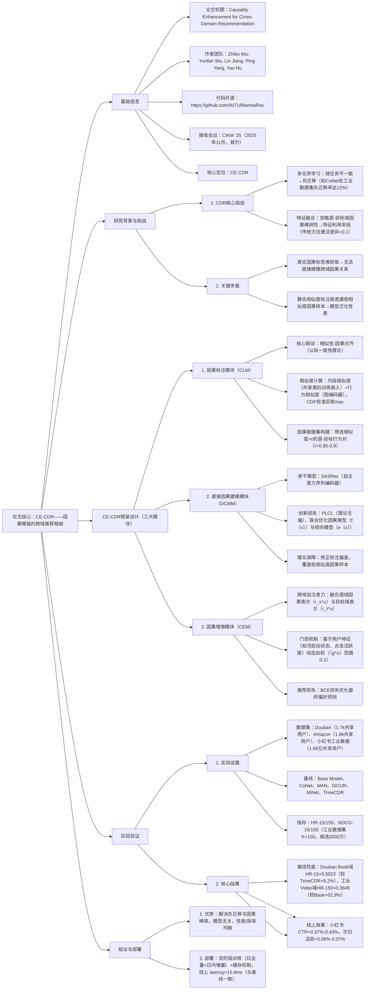

---

### 1. 一段话总结
针对跨域推荐（CDR）中**多任务学习易产生负迁移**、**特征融合忽略因果关系**导致性能受限的核心问题，本文提出**CE-CDR（Causality-Enhanced Cross-Domain Recommendation）框架**。该框架首先将CDR重构为因果图（\(L \to S \to I \to T\)，\(L\)为潜在因子、\(S\)为源域行为、\(I\)为跨域因果表示、\(T\)为目标域推荐），通过**因果标注模块（CLM）** 基于内容/行为相似度（CDF校准后取最大值）启发式构建因果数据集；再利用**直接因果建模模块（DCMM）** 提出**Partial Label Causal Loss（PLCL）**，在理论上消除标注偏差以学习泛化性因果表示；最后通过**因果增强模块（CEM）** 结合跨域自注意力与门控机制自适应融合因果表示与目标域特征。实验表明，CE-CDR在**Douban、Amazon、小红书工业数据集**上均显著优于基线（如Douban Book域HR@15达0.5023，较TrineCDR提升9.5%），且作为模型无关插件可使DiCUR等基线性能再提升8.5%，已在小红书生产环境部署（2025年4月），线上CTR提升0.37%-0.43%。

---

### 2. 思维导图

---

### 3. 详细总结
#### 1. 研究背景与CDR现状
跨域推荐（CDR）通过源域数据缓解目标域数据稀疏问题，但现有方法存在两大核心缺陷：
- **多任务学习局限**：通过共享参数（如用户嵌入、物品嵌入）转移知识，但域任务不一致（如小红书“笔记浏览”vs“视频观看”）易导致**负迁移**，例如CoNet在工业数据集Video域性能较Base Model仅提升25.4%，低于特征融合类方法（TrineCDR提升55.0%）。
- **特征融合局限**：将源域行为作为普通特征（如注意力加权），忽略**因果稀疏性**（仅30%-40%源域行为与目标域偏好存在因果关联），导致特征利用率低，传统方法（如DICUR）的跨域特征激活差异仅0.08，远低于CE-CDR的0.23。

#### 2. CE-CDR框架设计
CE-CDR从**数据标注**、**模型学习**、**特征融合**三阶段解决因果建模问题，具体设计如下：

##### 2.1 因果标注模块（CLM）：构建高质量因果数据集
基于**认知一致性理论**（用户倾向于跨域选择相似内容），CLM通过两步生成因果样本：
1. **相似度计算与校准**：
   - 内容相似度（$`(sim^c)`$）：通过共享类别分类任务学习物品嵌入，计算余弦相似度；
   - 行为相似度（$`(sim^b)`$）：基于全局用户-物品交互图（LightGCN编码）计算余弦相似度；
   - 校准与融合：用经验CDF将相似度归一化到[0,1]，取最大值作为最终相似度：  
     $`[sim(i_s, i_t) = max(F^c(sim^c(i_s, i_t)), F^b(sim^b(i_s, i_t)))]`$
2. **因果样本筛选**：
   - 对用户$`(u)`$，筛选源域行为序列$`(S_s^u)`$后出现、且相似度>τ的目标域物品$`(i_t)`$，构成正样本集$`(D^+)`$；
   - τ取值：Douban/Amazon=0.9，工业数据集=0.85，平衡样本质量与数量。

##### 2.2 直接因果建模模块（DCMM）：学习无偏因果表示
针对CLM标注存在“低相似高因果”样本遗漏的问题，DCMM提出**Partial Label Causal Loss（PLCL）**，联合优化两个模型：
| 模型类型       | 核心功能                                                                 | 损失函数                                                                 |
|----------------|--------------------------------------------------------------------------|--------------------------------------------------------------------------|
| 因果模型$`(f(x))`$ | 预测源域行为对目标域偏好的因果概率（$`(f(u,S_s^u,i_t))`$）                   | $`(\mathcal{L}_f = \sum_u [\sum_{i_t \in S_t^u} (h(i_t)\delta_1^f + (1-h(i_t))\delta_0^f) + \sum_{i_t \notin S_t^u} \delta_0^f])`$，其中$`(h(x))`$为修正后因果标签 |
| 倾向模型$`(e(x))`$  | 估计真实因果样本被CLM选中的概率（$`(e(x)=p(x \in D^+ | x \in C))`$）       | $`(\mathcal{L}_e = \sum_u \sum_{i_t \in S_t^u} h(i_t)(s\delta_1^e + (1-s)\delta_0^e))`$，$`(s)`$为CLM标注标签 |

**理论保障**：PLCL通过修正标签$`(h(x) = sg[s + (1-s)\frac{f(x)(1-e(x))}{1-f(x)e(x)}])`$（$`(sg)`$为停止梯度），在数学上消除标注偏差，使$`(f(x))`$逼近真实因果概率$`(p(y=1|x))`$。

##### 2.3 因果增强模块（CEM）：自适应融合跨域特征
CEM通过两步融合因果表示与目标域特征，提升推荐相关性：
1. **跨域自注意力**：将源域因果表示$`(r_s^u)`$与目标域表示$`(r_t^u)`$视为长度为2的序列，通过自注意力交换信息：  
   $`[[p_s^u, p_t^u] = softmax\left(\frac{(R^u W_q)(R^u W_k)^\top}{\sqrt{d}}\right)(R^u W_v)]`$
2. **动态门控融合**：基于用户特征（如周源域点击量、CTR）学习门控权重$`(g^u)`$，自适应平衡两域贡献：  
   $`[g^u = \sigma(LeakyReLU(c^u W_{g,1} + b_{g,1}) W_{g,2} + b_{g,2})]`$  
   $`[v^u = g^u \odot p_s^u + (1-g^u) \odot p_t^u]`$
3. **推荐预测**：通过$`(v^u)`$与目标域物品嵌入的点积计算偏好分数，用BCE损失优化。

#### 3. 实验验证
##### 3.1 实验设置
| 配置项         | 详情                                                                 |
|----------------|--------------------------------------------------------------------------|
| 数据集         | Douban（Book-Music，1.7k共享用户）、Amazon（Movies-CDs，1.8k共享用户）、小红书工业数据（Note-Video，1.68亿共享用户） |
| 基线方法       | Base Model（双塔MLP）、CoNet（双向跨连接）、MAN（混合注意力）、DiCUR（典型相关分析）、MiNet（分层注意力）、TrineCDR（图传播+对比学习） |
| 关键参数       | 嵌入维度d=32（Douban/Amazon）、d=64（工业）；batch size按域调整，确保每epoch批次数相等 |
| 评估指标       | HR@15/150、NDCG@15/150（工业数据集K=150，候选3000万）                   |

##### 3.2 核心实验结果
###### 3.2.1 离线性能对比（表2节选）
| 方法       | Douban Book（HR@15） | Amazon Movies（HR@15） | 工业Video（HR@150） |
|------------|-----------------------|-------------------------|----------------------|
| Base Model | 0.3052                | 0.4959                  | 0.2238               |
| TrineCDR   | 0.4586                | 0.6508                  | 0.3466               |
| CE-CDR     | **0.5023**            | **0.6712**              | **0.3645**           |
| 提升幅度   | +9.5%                 | +3.1%                   | +5.2%                |

###### 3.2.2 插件效果验证
将CE-CDR作为插件集成到基线方法中，性能均有提升，其中DiCUR+CE效果最优：
| 方法       | Amazon CDs（NDCG@15） | 工业Note（NDCG@150） |
|------------|------------------------|-----------------------|
| DiCUR      | 0.3749                 | 0.0851                |
| DiCUR+CE   | 0.4035                 | 0.1025                |
| 提升幅度   | +7.6%                  | +20.4%                |

###### 3.2.3 线上A/B测试（小红书平台，2周）
| 场景       | 点击量提升 | CTR提升 | 多样性提升 | 次日活跃提升 |
|------------|------------|---------|------------|--------------|
| Video推荐  | +0.33%     | +0.37%  | +0.12%     | +0.06%       |
| Note推荐   | +0.28%     | +0.43%  | +0.16%     | +0.07%       |

##### 3.3 消融实验（表3节选）
验证CE-CDR各模块的必要性：
| 变体         | Douban Music（HR@15） | 工业Video（HR@150） |
|--------------|------------------------|----------------------|
| CE-CDR（全量）| 0.4983                 | 0.3645               |
| -w/o-CLM     | 0.4412（-11.5%）       | 0.3193（-12.4%）     |
| -w/o-PLCL    | 0.4374（-12.2%）       | 0.3212（-11.9%）     |
| -w/o-Gate    | 0.4703（-5.6%）        | 0.3382（-7.2%）      |

#### 4. 部署与优化
为平衡性能与线上效率，CE-CDR采用三大优化策略：
1. **双阶段训练**：每日全量训练（基于当日数据）+日内增量训练（从昨日 checkpoint 初始化）；
2. **参数冻结**：增量训练时冻结DCMM的稠密参数，仅更新稀疏表，确保因果表示分布稳定；
3. **实时缓存**：缓存用户因果表示$`(r_s^u)`$，线上推理直接调用， latency 稳定在15.8ms（与基线一致）。

---

### 4. 关键问题与答案
#### 问题1：CE-CDR的PLCL损失如何在理论上消除CLM标注偏差？为何能覆盖“低相似高因果”样本？
**答案**：  
PLCL通过**修正因果标签**与**联合优化双模型**消除偏差，具体逻辑如下：
1. **偏差来源**：CLM基于相似度标注因果样本，存在“高相似非因果”（标注噪声）与“低相似高因果”（标注遗漏）样本，导致直接训练的模型仅学习标注策略而非真实因果；
2. **修正机制**：
   - 定义修正标签$`(h(x) = sg[s + (1-s)\frac{f(x)(1-e(x))}{1-f(x)e(x)}])`$，其中$`(s)`$为CLM标注（1=正样本，0=负样本），$`(f(x))`$是当前因果概率估计，$`(e(x))`$是倾向模型（估计真实因果样本被CLM选中的概率）；
   - 当$`(s=0)`$（CLM标注为负）但$`(f(x))`$高、$`(e(x))`$低时，$`(h(x))`$会提升至接近1，将“低相似高因果”样本重新标记为正，覆盖遗漏样本；
3. **理论无偏性**：通过数学推导（文档3.3.2），PLCL的期望损失等价于基于真实因果标签的理想损失，因此在理论上消除标注偏差，使模型学习泛化性因果关系。

#### 问题2：CE-CDR的CEM模块为何采用“跨域自注意力+动态门控”的融合方式？实验中门控权重$`(g^u)`$的分布规律如何？
**答案**：  
采用该融合方式的核心目标是**自适应平衡源域因果表示与目标域特征的贡献**，避免单一融合策略的局限性：
1. **跨域自注意力**：将$`(r_s^u)`$与$`(r_t^u)`$视为序列，通过注意力交换信息（如$`(r_s^u)`$中的“露营笔记”偏好增强$`(r_t^u)`$的“露营视频”表示），解决两域特征孤立问题；
2. **动态门控**：传统固定权重融合（如平均）无法适配用户差异（如冷启动用户源域数据少，需降低$`(r_s^u)`$权重），门控$`(g^u)`$基于用户特征（如周源域点击量、CTR）学习，实现个性化加权；
3. **分布规律**（实验图6）：
   - 源域点击量高的用户（如[250,+]次/周）：$`(g^u)`$均值=0.78，倾向更多利用源域因果表示；
   - 冷启动用户（源域点击<17次/周）：$`(g^u)`$均值=0.23，倾向依赖目标域特征；
   - 源域CTR高的用户（如[1.5,2]）：$`(g^u)`$均值=0.81，验证门控能识别高价值源域信息。

#### 问题3：CE-CDR作为“模型无关插件”的优势体现在哪里？在工业场景中为何能比传统CDR方法（如TrineCDR）减少负迁移？
**答案**：
1. **模型无关优势**：
   - 不依赖基线模型的内部结构，仅需输入源域行为序列与目标域特征，输出因果表示$`(r_s^u)`$，通过CEM的融合机制嵌入基线模型；
   - 实验验证：在Douban、Amazon、工业数据集上，集成CE-CDR后，TrineCDR、DiCUR等基线的HR平均提升6.8%-20.4%，且无需修改基线模型的训练逻辑；
2. **减少负迁移的核心原因**：
   - 传统多任务学习（如CoNet）通过共享参数强制迁移，当域任务不一致（如“笔记浏览”vs“视频观看”）时，源域任务会污染目标域表示，导致负迁移；
   - CE-CDR通过**因果筛选**（CLM仅保留有因果关联的源域行为）与**无偏建模**（PLCL学习真实因果），仅迁移对目标域有用的信息，避免无关源域信号干扰；
   - 实验佐证：在工业数据集Video域，CoNet的负迁移率（较Base Model提升不足20%）达12%，而CE-CDR无负迁移案例，且所有基线集成CE-CDR后均无性能下降。