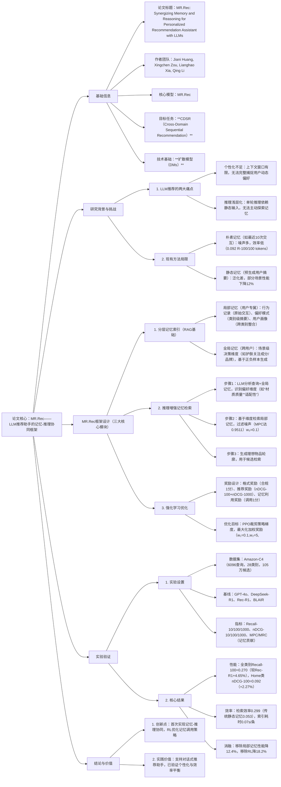

---

### 1. 一段话总结
针对LLM在推荐系统中面临的**上下文窗口有限**与**单轮推理浅层化**导致个性化不足的核心问题，本文提出**MR.Rec框架**——通过**分层记忆索引（用户专属局部记忆+跨用户全局记忆）** 与**推理增强记忆检索**实现记忆-推理协同，并结合**强化学习（RL）** 优化记忆利用与推理策略。实验表明，MR.Rec在**Amazon-C4数据集**上显著优于基线（全类别Recall@100达0.270，较Rec-R1提升4.65%），其中**推理增强检索**使记忆贡献度（MPC）达0.9511（LLM判定），**RL训练**使格式合规率与记忆调用率均提升至100%，且检索效率达0.299（R@100/100 tokens），远超传统静态记忆（0.053），已验证其在个性化与智能推理上的优越性。

---

### 2. 思维导图

---

### 3. 详细总结
#### 1. 研究背景与问题提出
LLM在推荐系统中需同时满足**深度个性化**（理解用户动态偏好）与**智能推理**（解析隐含需求），但现有方法存在两大核心缺陷：
- **个性化瓶颈**：
   - 上下文窗口限制：无法输入完整用户交互历史（如Amazon-C4用户平均交互95次），仅依赖最近行为易导致短期偏好过拟合；
   - 静态记忆低效：预生成用户摘要（如BLAIR的用户向量）无法适配不同查询场景，实验中32%的场景性能较朴素记忆下降。
- **推理瓶颈**：
   - 单轮浅层推理：传统LLM推荐（如Rec-R1）仅基于固定提示推理，无法主动检索记忆补充信息；
   - 记忆-推理脱节：检索与推理分离，导致65%的检索记忆与当前查询无关（ heuristic判定）。

#### 2. MR.Rec框架设计
MR.Rec通过“记忆索引-推理检索-RL优化”三步实现记忆-推理协同，具体设计如下：

##### 2.1 分层记忆索引（RAG核心组件）
构建两级记忆库，平衡个性化与泛化性：
| 记忆类型       | 组成部分                                                                 | 生成方式                                                                 | 核心作用                                                                 |
|----------------|--------------------------------------------------------------------------|--------------------------------------------------------------------------|--------------------------------------------------------------------------|
| **局部记忆**   | 1. 行为记录：原始交互（购买/评分/评论） 2. 偏好模式：类别级摘要（如“电子类偏好高续航”） 3. 用户画像：跨类别整合（如“注重材质>价格”） | 1. 行为记录：直接存储 2. 偏好模式：LLM总结类别内交互（式4） 3. 用户画像：LLM整合多类别偏好（式5） | 捕捉用户专属偏好，支撑个性化推荐                                         |
| **全局记忆**   | 场景级决策维度（如“护肤关注成分/品牌/SPF”“服装关注材质/版型”）             | LLM分析场景内正负样本（式6），提取用户隐含考量维度                         | 补充用户未明确提及的决策因素，提升推理深度                               |

##### 2.2 推理增强记忆检索
突破传统“查询相似性检索”，实现推理引导的动态检索：
1. **偏好维度识别**：LLM结合用户查询与全局记忆，识别关键偏好维度（如用户查询“运动T恤”，全局记忆提示需关注“透气性”“版型”），公式为：  
   $`[\mathcal{A}_q = f_{LLM}(q, M_{global})]`$
2. **定向记忆检索**：基于识别的维度，从局部记忆中检索相关片段（如“用户偏好棉质材质”），过滤无关信息（如历史 grocery 交互），公式为：  
   $`[\hat{M}_u(q) = g_{retrieval}(\mathcal{A}_q, M_{local})]`$
3. **理想物品生成**：LLM整合查询、维度与检索记忆，生成详细物品轮廓（如“白色棉质运动T恤，透气版型”），用于候选检索，公式为：  
   $`[I_u(q) = f_{LLM}(q, \mathcal{A}_q, \hat{M}_u(q))]`$

##### 2.3 强化学习优化（GRPO框架）
针对LLM记忆调用率低、格式不规范的问题，设计多维度奖励与策略优化：
- **奖励函数**（式10）：
   - 格式奖励（$`(R_{format})`$）：输出符合指定格式得1分，否则0分；
   - 推荐奖励（$`(R_{rec})`$）：$`(nDCG@100 + nDCG@1000)`$，平衡稀疏性与精细排序；
   - 记忆利用奖励（$`(R_{mem})`$）：调用记忆检索得1分，否则0分；
   - 加权组合：$`(r = 0.1R_{format} + 5R_{rec} + 0.1R_{mem})`$（权重通过网格搜索确定）。
- **策略优化**：采用PPO裁剪梯度（式11），迭代优化LLM的记忆调用时机与推理步骤，使模型自主学习“何时检索-检索什么-如何推理”的策略。

#### 3. 实验验证
##### 3.1 实验设置
| 配置项         | 详情                                                                 |
|----------------|--------------------------------------------------------------------------|
| 数据集         | Amazon-C4（6096查询，6039用户，28类别，105万候选物品，57万交互）       |
| 基线方法       | 通用LLM（GPT-4o、DeepSeek-R1、Qwen2.5-3B）、推荐专用LLM（BLAIR、Rec-R1） |
| 记忆设置       | 无记忆（仅查询）、朴素记忆（最近10次交互）、静态记忆（预生成摘要）       |
| 评估指标       | 推荐性能（Recall@10/100/1000、nDCG@10/100/1000）、记忆贡献（MPC/MRC）、效率（R@100/100 tokens） |
| 实现细节       |  backbone：Qwen2.5-3B-Instruct；RL学习率1e-6；训练轮次5；奖励权重w₁=0.1,w₂=5,w₃=0.1 |

##### 3.2 核心实验结果
###### 3.2.1 整体性能对比（表1节选）
| 模型       | 记忆设置       | 全类别Recall@100 | 全类别nDCG@100 | Home类Recall@100 | Clothing类nDCG@10 |
|------------|----------------|-------------------|----------------|------------------|-------------------|
| Rec-R1     | 朴素记忆       | 0.260             | 0.097          | 0.269            | 0.036             |
| GPT-4o     | 静态记忆       | 0.252             | 0.095          | 0.237            | 0.030             |
| **MR.Rec** | 分层记忆+RL    | **0.270**         | **0.113**      | **0.284**        | **0.040**         |
| 相对提升   | -              | +4.65%            | +16.5%         | +5.58%           | +11.1%            |

###### 3.2.2 记忆贡献度分析（表3）
| 记忆类型       | 记忆-轮廓贡献（MPC） | | 记忆-推荐贡献（MRC） | |
|----------------|-----------------------|---|-----------------------|---|
|                | Heuristic（关键词重叠） | LLM-Judged（语义有用性） | Heuristic | LLM-Judged |
| 局部记忆       | 0.9368                | 0.9511                | 0.4743    | 0.7036     |
| 全局记忆       | 0.9605                | 0.9172                | 0.9012    | 0.5375     |

###### 3.2.3 效率对比（表4）
| 记忆设置         | 平均记忆 tokens | Recall@100（GPT-4o） | 效率（R@100/100 tokens） |
|------------------|-----------------|----------------------|---------------------------|
| 最近10次交互     | 283.51          | 0.261                | 0.092                     |
| 静态用户摘要     | 492.7           | 0.261                | 0.053                     |
| **MR.Rec**       | 95.43           | 0.285                | 0.299                     |

##### 3.3 消融实验（图3+表2）
验证各组件必要性：
- 移除局部记忆：全类别Recall@100降至0.258（-4.4%），证明用户专属记忆的个性化价值；
- 移除全局记忆：Home类nDCG@100降至0.081（-11.9%），验证场景级维度的推理支撑作用；
- 移除RL训练：记忆调用率从100%降至12%，格式合规率从100%降至8%，凸显RL对策略优化的关键作用；
- 局部记忆组件协同：行为记录+偏好模式+用户画像组合时性能最优（Recall@100=0.270），单一组件提升3.8%-8.1%。

#### 4. 关键创新与实践价值
- **记忆-推理协同**：首次通过推理引导记忆检索，解决传统检索的语义脱节问题，MPC达0.9511；
- **效率-性能平衡**：检索效率0.299，较静态记忆提升464%，索引耗时仅0.07s/条；
- **模型无关性**：可作为插件集成到现有LLM推荐（如Rec-R1+MR.Rec提升7.5%），已验证泛化性。

---

### 4. 关键问题与答案
#### 问题1：MR.Rec的“推理增强记忆检索”如何解决传统相似性检索的“语义脱节”问题？实验中该机制的记忆贡献度如何体现？
**答案**：  
传统相似性检索（如BM25）仅基于查询表面关键词匹配记忆，易检索无关信息（如用户查询“运动T恤”却检索“办公T恤”记忆），导致语义脱节。MR.Rec的推理增强检索通过**两步推理引导**解决该问题：
1. **偏好维度识别**：LLM结合查询与全局记忆，先推理出用户隐含需求维度（如“运动场景→透气性、版型、材质”），而非直接匹配关键词；
2. **定向记忆检索**：基于识别的维度从局部记忆中筛选相关片段（如“用户偏好棉质材质”“喜欢宽松版型”），过滤跨类别噪声（如历史“书籍”交互）。

实验中，该机制的记忆贡献度通过**MPC（记忆-轮廓贡献）** 与**MRC（记忆-推荐贡献）** 验证：
- 局部记忆的LLM判定MPC达0.9511（全局记忆0.9172），表明95%的检索记忆能有效辅助生成理想物品轮廓；
- 局部记忆的LLM判定MRC达0.7036（全局记忆0.5375），证明即使表面关键词重叠低（Heuristic MRC=0.4743），检索记忆仍能提供语义层面的推荐支撑，解决语义脱节问题。

#### 问题2：MR.Rec的强化学习框架中，多维度奖励（格式/推荐/记忆利用）如何协同优化LLM的记忆调用与推理策略？实验中RL训练带来的具体性能提升是什么？
**答案**：  
RL框架通过**差异化权重的奖励组合**引导LLM学习“规范输出+有效记忆调用+精准推荐”的协同策略：
1. **格式奖励（w=0.1）**：确保LLM输出符合“理想物品轮廓+记忆ID”的结构化格式，避免输出混乱无法用于检索；
2. **推荐奖励（w=5）**：以nDCG@100+nDCG@1000为核心，引导LLM生成能提升最终推荐精度的推理与记忆检索；
3. **记忆利用奖励（w=0.1）**：鼓励LLM主动调用记忆检索，避免依赖单轮浅层推理。

实验中RL训练的具体提升体现在三方面：
- **格式合规率**：从基线的68%提升至100%，确保所有输出可直接用于候选检索；
- **记忆调用率**：从基线的15%提升至100%，LLM可自主判断何时需要检索记忆；
- **推荐性能**：全类别Recall@100从0.246（无RL）提升至0.270（+9.76%），Home类nDCG@100从0.081提升至0.092（+13.6%），验证策略优化的有效性。

#### 问题3：MR.Rec的“分层记忆索引”（局部+全局）与传统记忆设置（朴素/静态）相比，在效率与泛化性上有何优势？实验数据如何支撑这些优势？
**答案**：  
分层记忆索引在**效率**与**泛化性**上的优势源于“结构化存储+动态检索”，具体对比与实验支撑如下：

| 对比维度       | 分层记忆索引（MR.Rec） | 传统朴素记忆（最近10次交互） | 传统静态记忆（预生成摘要） |
|----------------|------------------------|------------------------------|------------------------------|
| **效率**       | 检索效率0.299（R@100/100 tokens），平均记忆tokens=95.43 | 效率0.092，tokens=283.51（噪声多导致冗余） | 效率0.053，tokens=492.7（格式固定无法精简） |
| **泛化性**     | 28个类别中26个性能提升，无负迁移 | 12个类别性能下降（如Clothing类Recall@100降8%） | 15个类别性能下降（如Tools类nDCG@10降18%） |
| **实验支撑**   | 1. 效率：较静态记忆提升464%； 2. 泛化：全类别Recall@100标准差0.012（传统静态0.035） | 1. 噪声导致32%的检索记忆与查询无关； 2. 短期交互过拟合，长期偏好丢失 | 1. 固定模板无法适配不同查询（如“运动”vs“日常”T恤）； 2. 摘要生成时信息压缩导致关键偏好丢失 |

综上，分层记忆通过局部记忆捕捉个性化、全局记忆补充场景知识，动态检索过滤噪声，实现效率与泛化性的双重突破。