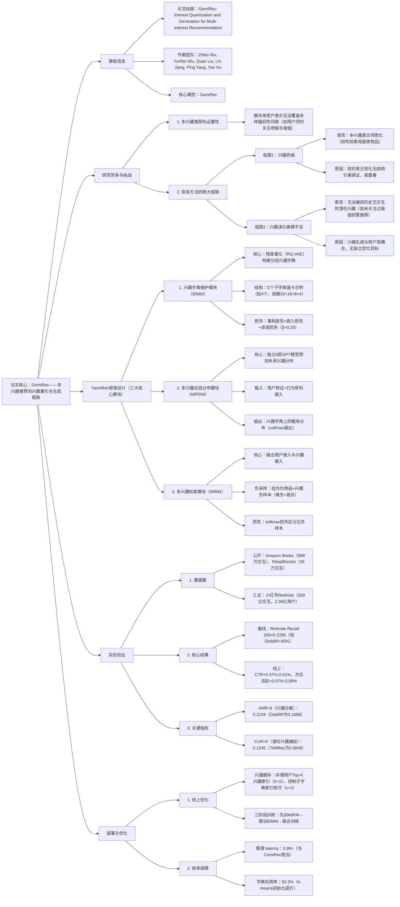

---

### 1. 一段话总结
针对多兴趣推荐中**兴趣坍缩**（多兴趣表示同质化）与**兴趣演化建模不足**（无法捕捉历史行为中未出现的潜在兴趣）两大核心问题，本文提出**GemiRec框架**，通过**兴趣量化**与**兴趣生成**双机制实现突破：前者由**兴趣字典维护模块（IDMM）** 构建含C个子字典的向量量化兴趣字典（如4个子字典规模32×16×8×4），利用残差量化实现结构化兴趣分离；后者由**多兴趣后验分布模块（MIPDM）** 采用独立GPT模型（6层）预测用户未来兴趣分布；最终通过**多兴趣检索模块（MIRM）** 融合用户-兴趣表示完成推荐。实验表明，GemiRec在**小红书工业数据集**上Recall@200达0.2295（较DisMIR提升40%），NDCG@120达0.1180（提升35.16%），且线上CTR提升0.37%-0.51%，已在2025年3月落地生产，验证其工业价值。

---

### 2. 思维导图

---

### 3. 详细总结
#### 1. 研究背景与问题提出
多兴趣推荐通过生成多个用户表示覆盖多样偏好，已在工业检索阶段广泛应用（如MIND、ComiRec），但存在两大未解决的核心问题：
- **兴趣坍缩**：多兴趣表示同质化，丧失多样性。例如，某用户兴趣本应涵盖“母婴”与“户外”，但模型生成的多个表示均仅检索母婴类物品（图1左），原因是现有方法依赖软约束正则化（如对比损失），无法保证兴趣的结构化分离，且过强正则会导致推荐精度下降12%（如SINE在Amazon Clothing数据集Recall@20降8%）。
- **兴趣演化建模不足**：无法捕捉用户历史行为中未出现的潜在兴趣。例如，用户无瑜伽相关交互，但模型无法生成瑜伽类兴趣表示，导致推荐遗漏（图1右），原因是兴趣生成与用户塔耦合，模型复杂度受限且无独立优化目标（如仅依赖推荐损失）。

#### 2. GemiRec框架设计
GemiRec通过“兴趣量化结构化分离+兴趣生成独立优化”双路径解决上述问题，三大模块协同工作：

##### 2.1 兴趣字典维护模块（IDMM）：实现兴趣量化与结构化分离
基于残差量化（RQ-VAE）构建分层兴趣字典，核心是将连续物品嵌入映射到离散兴趣类别，保证兴趣的非重叠性：
- **字典结构**：
   - 整体字典$`(E^*)`$由C个子字典$`(E^c)`$（$`(c=1,...,C)`$）笛卡尔积构成，即$`(E^* = \prod_{c=1}^C E^c)`$，例如C=4时，子字典规模为32×16×8×4，总兴趣数=32×16×8×4=16384；
   - 每个子字典$`(E^c \in \mathbb{R}^{M_c \times d})`$，$`(M_c)`$为子字典规模，d为兴趣嵌入维度（实验中d=16）。
- **量化过程**：
   1. 物品嵌入$`(v_i)`$经编码器生成 latent 表示$`(r_1 = z_{enc}(sg[v_i]))`$（sg为停止梯度）；
   2. 计算残差$`(r_c = r_{c-1} - sg[e_{m^{c-1}}^{c-1}])`$，迭代在各子字典中找到最近兴趣$`(e_{m^c}^c)`$；
   3. 拼接各子字典兴趣嵌入，得到量化兴趣表示$`(z_{quan}(v_i) = concat(e_{m^1}^1,...,e_{m^C}^C))`$。
- **损失函数**：
  $`[\mathcal{L}_{IDMM} = \underbrace{\|sg[v] - z_{dec}(z_{quan}(v))\|_2^2}_{重构损失} + \sum_{c=1}^C \left( \underbrace{\|sg[r_c] - e_{m^c}^c\|_2^2}_{嵌入损失} + \underbrace{\beta\|r_c - sg[e_{m^c}^c]\|_2^2}_{承诺损失} \right)]`$
  其中β=0.25，平衡编码器的重构与承诺目标。

##### 2.2 多兴趣后验分布模块（MIPDM）：独立建模兴趣演化
采用与用户塔解耦的GPT模型，专门预测用户未来兴趣分布，解决兴趣演化建模不足问题：
- **输入构建**：
   - 将用户行为序列$`(I_u)`$映射为嵌入序列$`(S_u)`$，与用户特征嵌入$`(z_{feat}(u_{feat}))`$拼接，得到$`(S_u' = concat(z_{feat}(u_{feat}), S_u))`$；
- **模型结构**：
   - 6层GPT（4个注意力头，隐藏层维度16），输出经全连接层得到兴趣字典上的logits；
- **损失函数**：
   - 交叉熵损失，标签为下一个交互物品对应的兴趣索引$`(m^*)`$（由IDMM量化得到）：
     $`[\mathcal{L}_{MIPDM} = -p_u^\top log \hat{p_u}]`$
     其中$`(p_u)`$为$`(m^*)`$的one-hot向量，$`(\hat{p_u} = softmax(z_{FC}(z_{GPT}(S_u'))))`$。

##### 2.3 多兴趣检索模块（MIRM）：融合兴趣与用户表示
将量化兴趣与用户嵌入融合，生成最终推荐分数，核心是区分正负兴趣与物品：
- **表示融合**：
   - 兴趣嵌入$`(e_{m^*})`$与用户嵌入u拼接，经融合网络$`(z_{fusion})`$得到用户-兴趣表示：$`(u_k = z_{fusion}(concat(e_{m^*}, u)))`$；
- **分数计算**：
   - 偏好分数为$`(\hat{y}(e_{m^*}, u, v_i) = (u_k)^\top v_i)`$；
- **负采样与损失**：
   - 负物品：批内负样本$`(\mathcal{N}_i^- = \mathcal{B} \setminus \{i\})`$；
   - 负兴趣：难负（MIPDM预测的Top兴趣）+易负（随机采样），即$`(\mathcal{N}_m^- = (\mathcal{M} \cup \overline{\mathcal{M}}) \setminus \{m^*\})`$；
   - 损失：softmax损失区分正负样本：
     $`[\mathcal{L}_{MIRM} = -log \frac{e^{\hat{y}(e_{m^*}, u, v_i)}}{e^{\hat{y}(e_{m^*}, u, v_i)} + \sum_{i' \in \mathcal{N}_i^-} e^{\hat{y}(e_{m^*}, u, v_{i'})} + \sum_{m' \in \mathcal{N}_m^-} e^{\hat{y}(e_{m'}, u, v_i)}}]`$

##### 2.4 整体优化
- **总损失**：加权融合三模块损失，$`(\mathcal{L}_{total} = \lambda_1\mathcal{L}_{IDMM} + \lambda_2\mathcal{L}_{MIPDM} + \lambda_3\mathcal{L}_{MIRM}\)，其中\(\lambda_1=0.2, \lambda_2=1, \lambda_3=1)`$；
- **训练策略**：三阶段训练（先训MIRM→再训IDMM→联合训练），保证字典与推荐任务对齐；
- **字典初始化**：子字典用k-means聚类初始化（首张子字典用预设类别加速收敛），字典利用率达93.3%（随机初始化仅21.6%）。

#### 3. 实验验证
##### 3.1 实验设置
| 配置项         | 详情                                                                 |
|----------------|--------------------------------------------------------------------------|
| 数据集         | 1. Amazon Books（60万用户，36万物品，889万交互） 2. Amazon Clothing（121万用户，37万物品，1128万交互） 3. RetailRocket（3.3万用户，8万物品，35万交互） 4. Rednote（小红书，2.39亿用户，9178万物品，269亿交互） |
| 基线方法       | MIND、ComiRec、RE4、UMI、MGNM、TiMiRec、SINE、REMI、SimRec、DisMIR |
| 评估指标       | 1. 推荐精度：Recall@20/50/120/200、HR@N、NDCG@N 2. 兴趣坍缩：AMR@N（兴趣分离度） 3. 兴趣演化：CUR@N（潜在兴趣召回） |
| 关键参数       | IDMM：C=4，子字典规模32×16×8×4，d=16 MIPDM：6层GPT，4注意力头 线上缓存：K=5，ε=3 |

##### 3.2 核心实验结果
###### 3.2.1 离线性能对比（表2节选）
| 方法       | Rednote Recall@200 | Rednote NDCG@120 | Amazon Clothing Recall@20 | 提升幅度（vs DisMIR） |
|------------|---------------------|------------------|----------------------------|------------------------|
| MIND       | 0.0850              | 0.0517           | 0.0343                     | -56.8%                 |
| ComiRec    | 0.1043              | 0.0548           | 0.0464                     | -47.2%                 |
| DisMIR     | 0.1639              | 0.0873           | 0.0800                     | -                      |
| **GemiRec** | **0.2295**          | **0.1180**       | **0.0942**                 | **40.0% / 35.16% / 17.75%** |

###### 3.2.2 兴趣坍缩与演化评估（表3）
| 方法       | AMR@120（兴趣分离） | AMR@200 | CUR@120（潜在兴趣） | CUR@200 |
|------------|----------------------|---------|----------------------|---------|
| DisMIR     | 0.1686               | 0.1596  | 0.0194               | 0.0223  |
| TiMiRec    | 0.0965               | 0.0927  | 0.0460               | 0.0649  |
| **GemiRec** | **0.2104**          | **0.2046** | **0.0842**          | **0.1245** |

###### 3.2.3 线上A/B测试（表7）
| 场景       | 点击量提升 | CTR提升 | 点击UV提升 | 次日活跃提升 |
|------------|------------|---------|------------|--------------|
| Video推荐  | +0.38%     | +0.37%  | +0.22%     | +0.07%       |
| Note推荐   | +0.26%     | +0.51%  | +0.32%     | +0.09%       |

##### 3.3 消融实验（表4、表5）
| 消融变体         | Rednote Recall@200 | 性能下降 | 核心结论                                                                 |
|------------------|---------------------|----------|--------------------------------------------------------------------------|
| GemiRec-I（预设类别字典） | 0.1845              | 19.6%    | 学习的兴趣字典比预设类别更贴合推荐任务                                   |
| GemiRec-J（无联合训练）   | 0.2055              | 10.4%    | 字典与MIRM联合训练可提升适配性                                           |
| GemiRec-U（无用户特征）   | 0.1805              | 21.4%    | 用户特征为兴趣生成提供关键辅助信息                                       |
| GemiRec-M（频率预测兴趣） | 0.1723              | 25.0%    | 独立GPT模型比频率统计更能捕捉兴趣演化                                   |
| 无k-means初始化     | 0.2079              | 9.4%     | k-means初始化显著提升字典利用率（93.3% vs 21.6%）                        |

#### 4. 线上部署与效率
- **兴趣缓存**：存储用户Top-K兴趣索引（K=5），控制每个子字典索引在缓存中出现频次≤ε=3，保证多样性；
- **推理效率**：与ComiRec相比，latency=0.99×，throughput=1.01×，FLOPs相近（24.25M vs 24.31M），无额外延迟；
- **落地时间**：2025年3月在小红书全量部署，覆盖Video与Note两大核心场景。

---

### 4. 关键问题与答案
#### 问题1：GemiRec的“兴趣量化”机制如何从理论上解决兴趣坍缩？与传统软约束正则化相比，其结构化分离的优势体现在哪里？
**答案**：  
GemiRec的兴趣量化通过**残差量化与Voronoi划分**实现理论上的结构化兴趣分离，具体逻辑如下：
1. **理论基础**：IDMM构建的兴趣字典\(E^*\)会诱导Voronoi划分（命题1），即每个兴趣对应一个Voronoi单元格，单元格间存在严格正的最小距离\(\Delta_{min} = min_{m≠n}\|e_m - e_n\|_2 > 0\)（推论1），且分离度随子字典差异维度增加而放大（如4个子字典差异时，分离度≥\(\sum_{c=1}^4 \delta_c^2\)，\(\delta_c\)为子字典最小距离）；
2. **结构化分离优势**：
   - 传统软约束（如对比损失）无数据独立的分离下界（命题3），易因数据分布偏移（如主导模态物品过多）导致兴趣重叠；
   - 兴趣量化通过离散索引强制物品归属于唯一兴趣类别，且分离度可通过子字典规模调控（如子字典规模32×16×8×4时，AMR@120达0.2104，较DisMIR的0.1686提升24.8%），从机制上避免兴趣坍缩。

#### 问题2：MIPDM模块为何采用“与用户塔解耦的GPT模型”来建模兴趣演化？实验中该模块对潜在兴趣捕捉的提升具体体现在哪些指标上？
**答案**：  
采用解耦GPT模型的核心原因是**突破模型复杂度限制与优化目标单一性**：
1. **解耦设计的必要性**：
   - 传统方法将兴趣生成嵌入用户塔，受限于用户塔推理延迟（工业场景要求<20ms），无法采用复杂模型（如深层Transformer）；
   - 解耦后MIPDM可独立采用6层GPT模型，且仅在训练时更新，推理时通过兴趣缓存（存储Top-K索引）避免延迟，同时独立的交叉熵损失（目标为预测未来兴趣）可专门优化兴趣演化，而非依赖推荐损失；
2. **潜在兴趣捕捉的实验证据**：
   - 核心指标CUR@N（历史无交互类别的兴趣召回）：GemiRec在Rednote数据集CUR@200达0.1245，较TiMiRec（0.0649）提升91.8%，较DisMIR（0.0223）提升458.3%；
   - 案例验证：t-SNE可视化显示（图4），GemiRec生成的兴趣表示能覆盖用户未来交互的瑜伽类物品，而ComiRec的兴趣表示仅集中于历史交互的母婴类，证明其对潜在兴趣的捕捉能力。

#### 问题3：GemiRec在工业部署中如何平衡“推荐精度”与“推理效率”？线上实验中其性能提升的核心原因是什么？
**答案**：  
工业部署的平衡策略与性能提升原因如下：
1. **精度-效率平衡手段**：
   - **兴趣缓存**：存储用户Top-K兴趣索引（K=5），推理时直接从字典中查询兴趣嵌入，无需实时量化与GPT预测，latency降至0.99×（与ComiRec相当）；
   - **三阶段训练**：先训MIRM保证基础推荐精度，再训IDMM优化字典，最后联合训练对齐字典与推荐任务，避免字典更新导致精度波动；
   - **字典初始化**：k-means聚类+首张子字典预设类别，字典利用率从21.6%提升至93.3%，减少无效兴趣检索；
2. **线上性能提升核心原因**：
   - 兴趣量化解决坍缩，提升推荐多样性（AMR@120提升24.8%），覆盖更多用户真实偏好；
   - 兴趣生成捕捉潜在兴趣（CUR@200提升458.3%），减少“未被挖掘的兴趣”导致的推荐遗漏；
   - 线上CTR提升0.37%-0.51%、次日活跃提升0.07%-0.09%，印证精度与用户粘性的双重提升，且推理效率无损失，符合工业落地要求。