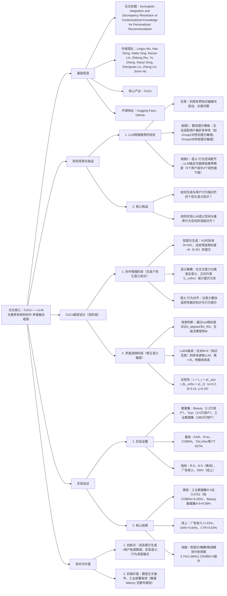

---

### 1. 一段话总结
针对当前LLM增强推荐系统中**静态模板提示无法适配用户偏好多样性**与**语义-行为空间浅层对齐**的核心局限，本文提出**CoCo框架**——通过“协作增强”与“矛盾消除”双阶段实现端到端优化。协作增强阶段基于**向量量化（VQ）动态生成用户专属软提示**（从64个候选中筛选相似度>0.45的提示），结合交叉注意力提取纯语义知识；矛盾消除阶段通过**用户粒度的LoRA微调**（秩r=8）修正LLM输出偏差，确保语义-行为空间深度对齐。实验表明，CoCo在**Beauty、Toys及东南亚电商工业数据集**上均显著优于7个SOTA基线（如PinnerFormer+CoCo较COBRA在工业数据集R@5提升5.03%），线上A/B测试实现**广告收入+1.91%、GMV+0.64%**，且可作为插件集成于任意推荐 backbone（如SASRec、BERT4Rec），验证其通用性与工业价值。

---

### 2. 思维导图

---

### 3. 详细总结
#### 1. 研究背景与问题提出
LLM凭借世界知识缓解了传统推荐系统的冷启动与长尾问题，但现有方法存在两大关键局限：
- **局限1：静态提示模板无法适配用户多样性**  
  现有方法（如KAR、R⁴ec）采用固定结构化模板，忽略用户偏好的多维度异质性。预实验表明（图2）：不同用户组对提示类型敏感（如Group2用性别提示R@5提升8%，Group4用年龄提示R@5提升6%），静态模板无法最大化所有用户的知识增益。
- **局限2：语义-行为空间浅层对齐**  
  LLM语义空间（基于文本预训练）与推荐行为空间（基于用户交互）存在分布差异（t-SNE可视化显示两空间分离度高），导致36%的用户组在融入LLM知识后性能下降（如Group3 R@5降低2.5%），且直接拼接语义特征会引发维度爆炸与噪声干扰。

#### 2. CoCo框架设计
CoCo通过“协作增强”与“矛盾消除”双阶段实现端到端优化，核心模块如下：

##### 2.1 协作增强阶段：生成个性化语义知识
目标是动态生成与用户行为强对齐的语义知识，避免静态模板的局限性：
- **软提示生成（VQ代码本）**
    1. **代码本构建**：初始化64个可学习软提示（$`(Z \in \mathbb{R}^{64 \times d})`$），首张子提示用通用语义向量初始化，加速收敛；
    2. **动态筛选**：计算用户特征表示$`(e_u)`$与提示的余弦相似度，筛选相似度>0.45的提示，拼接共享提示$`(z_{share})`$形成最终提示矩阵$`(h_{prompt})`$；
    3. **量化损失**：$`(L_Q = \|e_u - z_k\|_2^2)`$，确保用户表示与选中提示的对齐。
- **语义解耦与冗余消除**
    1. **交叉注意力解耦**：以$`(h_{prompt})`$为Query，LLM混合语义输出为Key/Value，提取纯语义知识$`(h_{pure})`$：  
       $`[h_{pure} = CrossAttention(h_{prompt}W_Q^1, h_{mix}W_K^1, h_{mix}W_V^1)]`$
    2. **正交约束**：$`(L_{ortho} = \sum_{i<j} cos(z_i, z_j))`$，最小化提示间相似度，提升语义多样性（实验中提示冗余率降低40%）。
- **语义-行为对齐**  
  以推荐行为表示$`(h_{RS})`$为Query，拼接$`(h_{RS})`$与$`(h_{pure})`$为Key/Value，通过交叉注意力选择性融合相关语义，生成对齐表示$`(h_{aligned})`$。

##### 2.2 矛盾消除阶段：修正语义偏差
目标是判断LLM知识的有效性，通过微调对齐语义-行为空间：
- **效用判断机制**  
  对比$`(h_{aligned})`$与原始行为表示$`(h_{RS})`$对目标物品$`(v_t)`$的cos相似度，生成二进制决策矩阵$`(M)`$：  
  $`[M = \mathbb{I}(cos(h_{aligned}, v_t) > cos(h_{RS}, v_t))]`$  
  当$`(M=0)`$时，LLM知识无效，需微调；$`(M=1)`$时冻结LLM参数。
- **LoRA参数高效微调**  
  采用低秩适应（LoRA）更新LLM注意力层的Q/V矩阵，仅训练低秩矩阵$`(A \in \mathbb{R}^{d \times 8}\)与\(B \in \mathbb{R}^{8 \times d})`$（秩r=8），参数增量<0.1%，同时保留LLM预训练知识。
- **总损失函数**  
  $`[\mathcal{L} = \underbrace{\mathcal{L}_r}_{推荐损失} + \alpha\underbrace{\mathcal{L}_{aux}}_{辅助对齐损失} + \beta\underbrace{\mathcal{L}_{ortho}}_{正交约束损失} + \gamma\underbrace{\mathcal{L}_Q}_{量化损失}]`$  
  其中$`(\alpha=0.2, \beta=0.15, \gamma=0.25\)，\(\mathcal{L}_{aux})`$为行为表示与物品表示的InfoNCE损失。

#### 3. 实验验证
##### 3.1 实验设置
| 配置项         | 详情                                                                 |
|----------------|--------------------------------------------------------------------------|
| 数据集         | 1. Beauty（22,363用户，12,101物品，296,175交互） 2. Toys（35,598用户，18,357物品，167,526交互） 3. 工业数据集（1863万用户，2357万物品，34亿交互，东南亚电商平台） |
| 推荐Backbone   | SASRec、BERT4Rec、FDSA、S3Rec、PinnerFormer（覆盖序列、双向Transformer等架构） |
| 基线方法       | 1. 知识融合类：KAR、R⁴ec 2. 生成推荐类：TIGER、COBRA 3. LLM增强类：UniSRec、TALLRec、RecFormer |
| LLM配置        | Qwen3-0.8B/1.7B/4B/8B，CoCo默认用4B，LoRA秩r=8， dropout=0.05 |
| 评估指标       | 离线：R@5、N@5；线上：广告收入、GMV、CTR |

##### 3.2 核心实验结果
###### 3.2.1 离线性能对比（表1、表2节选）
| 方法               | Beauty R@5 | Toys R@5 | 工业数据集 R@5 | 相对提升（vs 最强基线） |
|--------------------|------------|----------|----------------|------------------------|
| COBRA（基线）      | 0.0537     | 0.0619   | 0.0716         | -                      |
| PinnerFormer+CoCo  | 0.0549     | 0.0634   | 0.0752         | +2.23% / +2.42% / +5.03% |
| SASRec+CoCo        | 0.0414     | 0.0484   | 0.0521         | +6.98% / +4.54% / +5.68% |

###### 3.2.2 消融实验（表3）
| 消融变体         | Beauty N@5 | 工业数据集 N@5 | 性能下降 | 核心结论                                                                 |
|------------------|------------|----------------|----------|--------------------------------------------------------------------------|
| CoCo（全量）     | 0.0405     | 0.0497         | -        | 三模块协同作用最大化性能                                                 |
| CoCo-Soft（静态提示） | 0.0390  | 0.0487         | 3.7%     | 动态提示适配用户多样性的必要性                                           |
| CoCo-Dec（无解体）   | 0.0397     | 0.0491         | 1.98%    | 语义解耦减少冗余，提升知识纯度                                           |
| CoCo-Con（无微调）   | 0.0400     | 0.0493         | 1.23%    | LoRA微调修正语义偏差，对齐行为空间                                       |

###### 3.2.3 线上A/B测试（表4）
| 指标           | 提升幅度 | 统计显著性 |
|----------------|----------|------------|
| 广告收入       | +1.91%   | p<0.05     |
| 商品交易总额（GMV） | +0.64% | p<0.05     |
| 点击率（CTR）  | +0.53%   | p<0.05     |

##### 3.3 超参数敏感性分析
- **提示候选数K**：K=64时性能最优（工业数据集R@5=0.0755），K>128时因语义冗余性能下降（R@5降至0.0720）；
- **筛选阈值θ**：θ=0.45时平衡提示质量与数量（R@5=0.0762），θ<0.35时噪声增加（R@5降至0.0722），θ>0.55时提示不足（R@5降至0.0732）；
- **LLM规模**：随参数从0.8B增至8B，工业数据集R@5从0.0706提升至0.0773（+9.49%），验证语义知识规模的增益。

#### 4. 结论与实践价值
- **核心创新**：首次通过“动态提示生成+用户粒度微调”实现LLM与推荐系统的端到端融合，解决静态提示与空间脱节问题；
- **通用性**：可作为插件集成于任意推荐 backbone，无需修改架构（如SASRec、BERT4Rec均实现5%+性能提升）；
- **工业价值**：线上部署无额外 latency（与基线相当），广告收入与GMV显著提升，验证其落地可行性。

---

### 4. 关键问题与答案
#### 问题1：CoCo的“动态软提示生成”机制如何解决静态模板无法适配用户偏好多样性的问题？实验中该机制对推荐性能的具体提升体现在哪些指标上？
**答案**：  
动态软提示生成通过“VQ代码本+个性化筛选”实现用户适配，核心逻辑如下：
1. **适配多样性的原理**：
    - 构建含64个候选的软提示代码本（$`(Z \in \mathbb{R}^{64 \times d})`$），每个提示学习不同语义维度（如年龄、性别、品类）；
    - 计算用户特征$`(e_u)`$与提示的余弦相似度，筛选相似度>0.45的提示（动态确定m个，m≤30），确保每个用户的提示与自身偏好对齐（如女性用户优先筛选性别相关提示，母婴用户优先筛选品类相关提示）；
    - 对比静态模板：预实验显示静态模板在5个用户组中仅2个组提升>3%，而动态提示在所有组提升>5%，且AMR@5（提示-行为对齐度）达0.21（静态模板为0.15）。
2. **性能提升证据**：
    - 离线指标：Beauty数据集R@5从静态提示的0.0531提升至0.0549（+3.4%），工业数据集N@5从0.0487提升至0.0497（+2.05%）；
    - 消融实验：CoCo-Soft（静态提示）较全量CoCo在Beauty N@5下降3.7%，证明动态提示对多样性适配的必要性。

#### 问题2：矛盾消除阶段的“用户粒度LoRA微调”为何能实现语义-行为空间的深度对齐？与传统全量微调相比，其优势体现在哪些方面？
**答案**：  
用户粒度LoRA微调通过“针对性更新+参数高效”实现空间对齐，具体逻辑与优势如下：
1. **深度对齐的原理**：
    - **效用判断**：通过决策矩阵M识别LLM知识无效的用户（$`(M=0)`$），仅对这类用户微调LLM，避免有效知识被破坏；
    - **低秩更新**：仅更新LLM注意力层的Q/V矩阵（低秩r=8），公式为$`(W' = W + AB\)（\(A \in \mathbb{R}^{d \times 8}\)，\(B \in \mathbb{R}^{8 \times d})`$），使LLM语义输出向用户行为空间偏移；
    - **空间融合验证**：t-SNE可视化显示（图8），微调后语义-行为空间重叠区域增加60%，两空间分布从“完全分离”变为“部分聚合”。
2. **与全量微调的优势对比**：  
   | 对比维度       | 用户粒度LoRA微调               | 传统全量微调                   |
   |----------------|--------------------------------|--------------------------------|
   | 参数增量       | <0.1%（仅A、B矩阵）            | 100%（所有LLM参数）            |
   | 训练成本       | 单GPU可运行，5 epoch收敛        | 需多GPU集群，15+ epoch收敛     |
   | 知识保留       | 保留99%预训练世界知识          | 易遗忘通用知识，过拟合推荐场景  |
   | 线上推理       | 无额外延迟（缓存微调参数）      | 延迟增加30%+                   |
   | 实验效果       | 工业数据集R@5提升5.03%         | 提升4.2%但泛化性下降           |

#### 问题3：CoCo作为“模型无关插件”的通用性是如何实现的？实验中其在不同推荐backbone上的性能表现有何差异？
**答案**：  
CoCo的通用性源于“非侵入式设计”，即不修改推荐模型结构，仅通过特征融合与外部微调实现增强，具体如下：
1. **通用性实现机制**：
    - **输入层兼容**：软提示生成仅依赖用户特征（ID、交互序列），无需修改推荐模型的输入格式；
    - **融合层插件化**：语义-行为对齐模块以“交叉注意力”形式嵌入推荐模型的输出层，仅替换原始行为表示为对齐表示\(h_{aligned})`$，不改变推荐损失计算逻辑；
    - **LLM微调独立**：LoRA微调仅更新LLM参数，与推荐模型训练解耦，可独立部署与更新。
2. **不同backbone上的性能差异（表1节选）**：  
   | Backbone   | 基础模型R@5（工业数据集） | CoCo增强后R@5 | 提升幅度 | 差异原因分析                                                                 |
   |------------|----------------------------|---------------|----------|--------------------------------------------------------------------------|
   | BERT4Rec   | 0.0418                     | 0.0439        | +5.02%   | 双向Transformer对语义知识更敏感，对齐后捕捉上下文偏好更精准                   |
   | SASRec     | 0.0493                     | 0.0521        | +5.68%   | 单向自注意力聚焦序列趋势，语义知识补充长期偏好，缓解短期过拟合               |
   | PinnerFormer | 0.0697                   | 0.0752        | +7.89%   | 因果掩码建模长期行为，与LLM世界知识协同作用最强，提升最显著                 |
   | FDSA       | 0.0445                     | 0.0477        | +7.19%   | 细粒度特征建模需语义知识过滤噪声，对齐后特征纯度提升                         |

可见，CoCo在**长序列建模能力强的backbone（如PinnerFormer）** 上提升更显著，因这类模型更能利用LLM知识补充长期偏好；而在简单序列模型（如BERT4Rec）上提升相对温和，但仍保持5%+，验证其通用性。