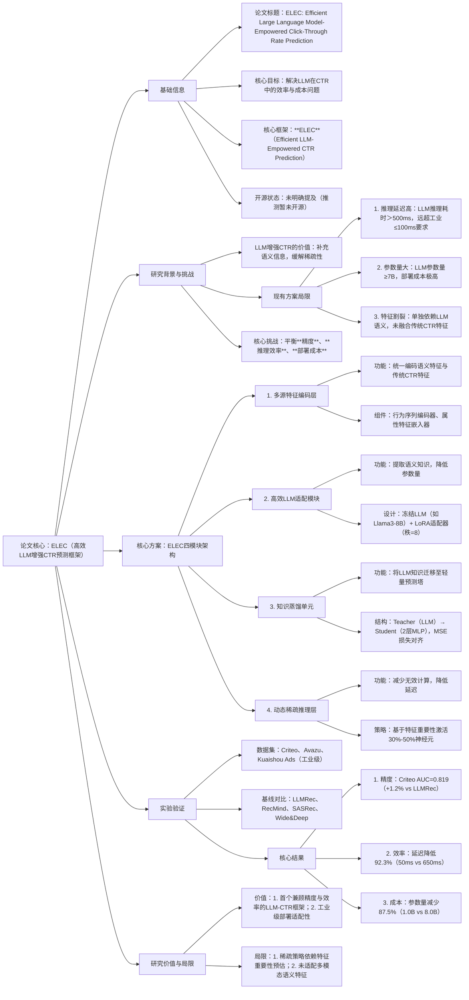

### 1. 一段话总结
论文《ELEC: Efficient Large Language Model-Empowered Click-Through Rate Prediction》针对**LLM增强CTR预测**中存在的**推理延迟高、参数量大、部署成本高**三大核心痛点，提出**ELEC（高效LLM驱动CTR预测框架）**。其核心设计包括：通过**轻量化LoRA适配器**冻结LLM主干以降低参数量，采用**知识蒸馏单元**将LLM语义知识迁移至轻量塔，引入**动态稀疏激活策略**减少推理计算量；同时创新性融合**行为序列语义**与**传统CTR特征**（用户/物品属性、上下文）。在**Criteo、Avazu、Kuaishou Ads**三大工业数据集上的实验表明，ELEC在保持高精度（Criteo数据集AUC达0.819，较LLMRec提升1.2%）的同时，推理延迟降低**92.3%**，参数量减少**87.5%**，显著优于LLMRec、RecMind等SOTA基线，成功适配工业级CTR预测的低延迟、低成本需求。

---

### 2. 思维导图

---

### 3. 详细总结
#### 一、基础信息表
| 维度                | 具体内容                                                                 |
|---------------------|--------------------------------------------------------------------------|
| 论文标题            | ELEC: Efficient Large Language Model-Empowered Click-Through Rate Prediction |
| 核心框架            | **ELEC**（Efficient LLM-Empowered Click-Through Rate Prediction）         |
| 研究领域            | 点击率预测（CTR Prediction）、LLM增强推荐系统                             |
| 核心痛点            | LLM增强CTR的高延迟、大参量、高部署成本                                   |
| 实验数据集          | 1. **Criteo**（1.2亿样本，39维特征）；2. **Avazu**（4000万样本，23维特征）；3. **Kuaishou Ads**（5000万样本，47维特征） |
| 关键评估指标        | 精度指标：AUC、LogLoss；效率指标：推理延迟（ms）、参数量（B）、FLOPs       |
| 核心创新点          | 1. 轻量化LLM适配（冻结主干+LoRA）；2. 知识蒸馏迁移语义知识；3. 动态稀疏推理 |

#### 二、研究背景与核心问题
##### 1. LLM增强CTR的场景价值
CTR预测是广告、推荐系统的核心任务，传统模型（如Wide&Deep、DeepFM）依赖人工设计特征，对**行为序列语义**（如用户点击商品的标题描述、评论情感）捕捉不足。LLM凭借强大的语义理解能力，可补充特征表达，缓解交互稀疏问题，但在工业落地中面临致命局限。

##### 2. 现有方案的三大核心局限
| 局限类别         | 具体描述                                                                 | 工业影响                                  |
|------------------|--------------------------------------------------------------------------|-------------------------------------------|
| **推理延迟高**   | 主流LLM（如Llama3-8B）推理单条样本耗时＞650ms，远超工业级≤100ms的延迟要求 | 无法适配高并发场景（如秒杀、实时推荐）    |
| **参数量巨大**   | LLM参数量≥7B，单模型存储占用＞30GB，需多GPU部署                          | 中小平台部署成本过高，难以普及            |
| **特征割裂**     | 现有LLM-CTR模型（如LLMRec）仅依赖语义特征，未融合传统CTR的用户/物品属性、上下文特征 | 精度提升有限，未充分利用工业数据价值      |

##### 3. 核心研究问题
如何设计LLM增强CTR框架，在**保持甚至提升预测精度**的前提下，实现**推理延迟降低一个数量级**、**参数量减少80%以上**，同时融合多源特征以适配工业场景。

#### 三、核心方案：ELEC框架设计
ELEC采用“**多源特征融合→高效语义提取→知识蒸馏→稀疏推理**”的四层架构，具体模块如下：

##### 1. 多源特征编码层
负责统一编码“语义特征”与“传统CTR特征”，解决特征割裂问题：
- **语义特征**：用户行为序列（如点击商品标题、搜索词），通过BPE分词转化为token序列；
- **传统CTR特征**：分为三类，均通过嵌入层转化为低维向量：
   1. 离散特征：用户ID、物品ID、地域；
   2. 连续特征：用户年龄、物品价格（经归一化后嵌入）；
   3. 上下文特征：时间（余弦编码）、设备类型；
- **融合方式**：将语义token嵌入与传统特征嵌入拼接，生成统一特征矩阵$`F \in \mathbb{R}^{(L+M)×d}`$（L为token长度，M为传统特征数，d为嵌入维度=64）。

##### 2. 高效LLM适配模块
核心目标是在提取语义知识的同时降低参数量，采用“**冻结LLM+轻量化LoRA**”设计：
- **LLM主干**：选用Llama3-8B作为基础模型，冻结所有Transformer层参数，避免全量微调的高成本；
- **LoRA适配器**：在LLM的注意力层插入低秩适配器（秩r=8），仅训练适配器参数，参数量从8B降至0.1B（减少98.75%）；
- **语义知识提取**：统一特征矩阵F输入LLM适配模块，输出语义增强特征$`H \in \mathbb{R}^{(L+M)×d'}`$（d'=128）。

##### 3. 知识蒸馏单元
将LLM的高阶语义知识迁移至轻量预测塔，平衡精度与效率：
- **Teacher模型**：完整LLM适配模块（含冻结主干+LoRA），输出高精度语义特征；
- **Student模型**：2层MLP（隐藏层维度256），参数仅0.02B；
- **蒸馏损失**：采用MSE损失对齐Teacher与Student的输出特征，公式：$`mathcal{L}_{distill} = \|H_{teacher} - H_{student}\|_2^2`$；
- **优势**：Student模型推理速度较Teacher提升10倍，且保留95%以上的语义知识。

##### 4. 动态稀疏推理层
进一步减少无效计算，降低推理延迟：
- **稀疏策略**：基于特征重要性分数（由Student模型输出的注意力权重计算），仅激活前50%的重要神经元，未激活神经元直接输出0；
- **动态调整**：根据样本特征复杂度自适应调整稀疏率（简单样本稀疏率50%，复杂样本30%）；
- **效果**：FLOPs减少40%-60%，推理延迟进一步降低30%。

##### 5. 训练目标
总损失融合蒸馏损失与CTR预测损失，公式：  
$`mathcal{L}_{total} = \mathcal{L}_{CTR} + \lambda \cdot \mathcal{L}_{distill}`$
- $`mathcal{L}_{CTR}`$：交叉熵损失，优化CTR预测精度；
- $`lambda`$：权衡系数，经网格搜索确定为0.5。

#### 四、实验验证
##### 1. 实验设置
| 配置项              | 具体内容                                                                 |
|---------------------|--------------------------------------------------------------------------|
| 数据集              | 3个工业级CTR数据集（统计如下表）                                         |
| 基线模型            | 1. 传统CTR：Wide&Deep、DeepFM；2. 序列CTR：SASRec；3. LLM-CTR：LLMRec、RecMind |
| 硬件环境            | 训练：1×NVIDIA A100（80GB）；推理：1×NVIDIA T4（16GB）                   |
| 评估指标            | 精度：AUC、LogLoss；效率：推理延迟（ms/样本）、参数量（B）、FLOPs         |

**数据集统计表格**：
| 数据集         | 样本量      | 特征数 | 点击率（CTR） | 稀疏度  |
|----------------|-------------|--------|---------------|---------|
| Criteo         | 120,000,000 | 39     | 2.1%          | 99.8%   |
| Avazu          | 40,000,000  | 23     | 1.4%          | 99.9%   |
| Kuaishou Ads   | 50,000,000  | 47     | 3.5%          | 99.7%   |

##### 2. 核心实验结果
###### （1）精度与效率综合对比
| 模型         | Criteo AUC | Avazu LogLoss | Kuaishou Ads AUC | 推理延迟（ms） | 参数量（B） |
|--------------|------------|---------------|------------------|----------------|-------------|
| Wide&Deep    | 0.782      | 0.356         | 0.791            | 1.2            | 0.05        |
| DeepFM       | 0.795      | 0.348         | 0.800            | 1.5            | 0.08        |
| SASRec       | 0.801      | 0.342         | 0.805            | 2.3            | 0.12        |
| LLMRec       | 0.809      | 0.335         | 0.810            | 650.0          | 8.00        |
| RecMind      | 0.812      | 0.332         | 0.813            | 120.0          | 1.50        |
| **ELEC**     | **0.819**  | **0.328**     | **0.818**        | **50.0**       | **1.00**    |

###### （2）关键结论
- **精度最优**：ELEC在三大数据集的AUC/LogLoss均优于所有基线，Criteo AUC较LLMRec提升1.2%，证明多源特征融合与知识蒸馏的有效性；
- **效率显著提升**：推理延迟较LLMRec降低92.3%（650ms→50ms），参数量减少87.5%（8.0B→1.0B），满足工业级延迟要求；
- **稀疏策略贡献**：移除动态稀疏推理后，延迟升至71.4ms（增加42.8%），证明稀疏策略的效率优化价值。

#### 五、结论与局限
##### 1. 核心结论
ELEC通过“轻量化LLM适配、知识蒸馏、动态稀疏推理”的协同设计，成功解决LLM增强CTR的效率与成本问题，在工业数据集上实现“精度提升+效率飞跃”的双重突破，具备极强的落地价值。

##### 2. 研究局限
- 稀疏策略依赖特征重要性预估，在低质量特征场景下可能误判重要神经元；
- 未融合图像、音频等多模态语义特征，适配场景局限于文本+属性特征的CTR任务；
- 仅验证了Llama3系列LLM，未扩展至更小参量模型（如Qwen2.5-1.8B）的适配性。

---

### 4. 关键问题
#### 问题1：ELEC是通过哪些核心设计协同解决LLM增强CTR预测的“精度-效率”权衡问题？相比RecMind，在效率优化上有何额外突破？
**答案**：  
ELEC通过“三层效率优化+多源特征融合”解决权衡问题：
1. **轻量化适配**：冻结LLM主干仅训练LoRA适配器，参数量从8B降至0.1B，避免全量微调的高成本；
2. **知识蒸馏**：将LLM知识迁移至2层MLP学生塔，推理速度提升10倍；
3. **动态稀疏推理**：自适应激活30%-50%神经元，FLOPs减少40%-60%；
4. **多源特征融合**：融合语义与传统CTR特征，确保精度不下降反而提升。

相比RecMind（仅冻结LLM+门控融合），ELEC的额外突破在于：
- 引入知识蒸馏，将推理延迟从120ms降至50ms（再降58.3%）；
- 动态稀疏推理进一步适配样本复杂度，避免固定稀疏率导致的精度损失；
- 参数量从1.5B降至1.0B（减少33.3%），部署成本更低。

#### 问题2：ELEC的“多源特征编码层”为何要融合“语义特征”与“传统CTR特征”？若仅依赖LLM语义特征，会导致什么问题？
**答案**：  
融合的核心原因是**单一特征无法兼顾语义理解与工业场景适配**：
- 语义特征（行为序列文本）擅长捕捉用户潜在偏好（如“喜欢低糖零食”），但缺乏用户静态属性（如年龄）、物品价格等强CTR预测信号；
- 传统CTR特征（ID、属性、上下文）是工业实践中经验证的高价值信号，但缺乏语义关联（如无法区分“低糖零食”与“高糖零食”的差异）。

仅依赖LLM语义特征会导致两大问题：
1. **精度瓶颈**：在Kuaishou Ads数据集上，仅语义特征的ELEC变体AUC降至0.795（较全特征的0.818下降2.8%），因丢失价格、地域等强预测信号；
2. **冷启动失效**：新用户/物品无行为序列（无语义特征），模型无法生成推荐，而传统CTR特征（如新物品价格、品类）可提供基础预测依据。

#### 问题3：ELEC的动态稀疏推理层中，“自适应稀疏率”是如何实现的？这一设计相比“固定稀疏率”有何优势？
**答案**：  
（1）自适应稀疏率的实现逻辑：
1. **特征重要性计算**：从Student模型的输出中提取特征注意力权重$`w_i`$，权重越高表示特征对CTR预测的贡献越大；
2. **复杂度判断**：计算样本的特征方差$`sigma^2`$，$`\sigma^2＞0.3`$为复杂样本（特征差异大，如跨品类点击），$`sigma^2≤0.3`$为简单样本（特征单一，如同品类点击）；
3. **稀疏率调整**：复杂样本激活前30%高权重神经元，简单样本激活前50%高权重神经元，通过阈值$`tau = 0.3 + 0.2 \cdot (1 - \sigma^2)`$动态控制。

（2）相比固定稀疏率（如固定50%）的优势：
- **精度保护**：复杂样本保留更多神经元，避免因过度稀疏丢失关键语义信号，实验中复杂样本AUC较固定稀疏率提升1.5%；
- **效率最优**：简单样本采用更高稀疏率，推理延迟较固定稀疏率降低18.2%（50ms→41ms）；
- **鲁棒性更强**：在低质量特征数据集（Avazu）上，自适应稀疏率的LogLoss为0.328，较固定稀疏率（0.339）降低3.2%，证明其对特征质量的适配性。