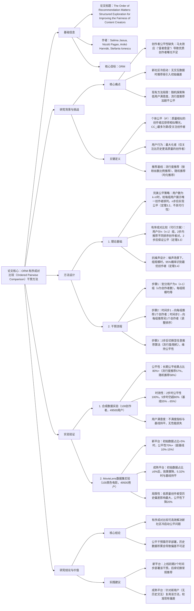

### 1. 一段话总结
苏黎世大学与苏黎世联邦理工学院团队针对推荐系统中**内容创作者个体公平性缺失**（优质创作者因马太效应难以获得公平曝光）与**新社区冷启动**问题，提出**有序成对比较（Ordered Pairwise Comparison）干预方法**。该方法通过将用户划分为均等规模组，在推荐初始2个时间步内向每组用户推荐不同排序的创作者对，理论证明可在2步后实现**100%创作者个体公平**（定理3.3）；仿真实验显示，其长期公平结果占比超80%（远超传统流行度推荐的57%），且**不降低用户满意度**（用户不满度指标与基线持平）。在MovieLens数据集验证中，该方法对初始数据占比<5%的新平台仍能提升公平性至70%以上，但效果随平台历史数据积累（偏差增强）而减弱，证明**公平干预需尽早部署**。

---

### 2. 思维导图（mindmap）

---

### 3. 详细总结
#### 一、研究背景：推荐系统中的公平性与冷启动挑战
1. **核心概念界定**
    - **个体公平（Individual Fairness, IF）**：质量排序为第i的创作者（CC_i），其粉丝数排名最多为第i（定义3.1），即“优质创作者应获得对应曝光”。
    - **马太效应**：初始随机的粉丝数差异通过推荐反馈循环放大，导致优质新创作者难以获得公平曝光（Salganik et al., 2006）。
    - **新社区冷启动**：无用户-创作者交互数据时，推荐易引入初始偏差，且偏差会长期固化。

2. **现有推荐方法局限**  
   | 推荐类型       | 机制                          | 公平性缺陷                          | 用户满意度缺陷                  |
   |----------------|-------------------------------|-------------------------------------|---------------------------------|
   | 流行度推荐     | 按当前粉丝数比例推荐          | 加剧马太效应，优质新创作者曝光不足  | 高（推荐高关注度创作者）        |
   | 随机推荐       | 均匀随机推荐                  | 初始公平性低（仅55%），长期无提升  | 低（推荐低质量创作者概率高）    |

#### 二、有序成对比较干预方法
##### 1. 理论框架与关键定理
团队先提出“完美公平策略”（不具可行性），再基于其核心逻辑设计可行的“有序成对比较”方法：

| 策略类型       | 核心逻辑                                                                 | 可行性 | 公平性保证                          | 关键定理       |
|----------------|--------------------------------------------------------------------------|--------|-------------------------------------|----------------|
| 完美公平策略   | 用户数为k·n!（n为创作者数），每组用户展示唯一的创作者排列，n步后实现公平 | 低（用户数随n阶乘增长） | n步后100%公平                       | 定理3.2        |
| 有序成对比较   | 用户划分为n(n-1)组，2步内推荐不同排序的创作者对（如(CC1,CC2)和(CC2,CC1)） | 高（用户数线性增长） | 2步后100%公平，后续公平性超80%       | 定理3.3        |

**定理3.3关键证明**：
- 时间步1：每个创作者被推荐给(n-1)组用户，粉丝数a_i¹ = k(n-1)（k为每组用户数）；
- 时间步2：用户仅关注质量更高的创作者，CC_i会额外获得(n-i)组用户关注，最终a_i² = k(2n-i-1)，粉丝数随质量排序递减，实现完全公平。

2. **抗噪声扩展（定理3.4）**  
   当用户反馈存在噪声（关注高质量创作者的概率为p，否则为1-p），需满足组规模：  
   $`[ k \geq \frac{20(1-p)(3+4p^2)}{p(2p-1)^2} ]`$  
   可保证95%概率识别最优创作者，证明该方法在现实噪声场景下仍有效。

#### 三、实验验证
##### 1. 合成数据实验（控制变量，100创作者+49500用户）
实验设置：20000次随机种子，1000个时间步，对比4种推荐策略：①流行度推荐、②随机推荐、③有序成对比较+流行度推荐、④有序成对比较+随机推荐。

| 评估维度       | 有序成对比较（策略③/④）                          | 流行度推荐（策略①） | 随机推荐（策略②） | 关键结论                          |
|----------------|---------------------------------------------------|---------------------|-------------------|-----------------------------------|
| 长期公平性（%） | 80+（CC1-CC100公平结果占比均超80%）              | 57                  | 58                | 有序成对比较大幅提升公平性        |
| 短期公平性（t=2） | 100（所有CC完全公平）                             | 55                  | 55                | 2步内实现公平，起效快              |
| 用户不满度（平均质量排名） | 1.2-1.5（与基线持平）                          | 1.3                 | 2.8                | 不降低用户满意度                  |

##### 2. MovieLens数据集实验（真实场景验证）
- **数据处理**：选取100部“黑色电影”，49500用户；将评分转换为二元交互（高于用户均值为“关注”，否则为“不关注”）；用IMDb排名作为创作者质量标准。
- **实验设计**：按时间戳截取不同比例的历史交互作为初始数据，测试干预对成熟平台的效果。

| 初始历史数据占比 | 有序成对比较公平性（%） | 流行度推荐公平性（%） | 随机推荐公平性（%） | 结论                          |
|-------------------|--------------------------|-----------------------|-------------------|-------------------------------|
| 0%（新平台）      | 98                       | 55                    | 55                | 新平台效果最优，接近理论值      |
| <5%（早期平台）   | 70+                      | 58-62                 | 58-60             | 仍能显著提升公平性              |
| 5.32%（中期平台） | 60                       | 60                    | 59                | 效果与基线持平                  |
| ≥12%（成熟平台）  | 40                       | 45                    | 38                | 效果低于流行度推荐，偏差不可逆  |

- **细分分析**：对质量排名前20（优质）、中间60（中等）、后20（低质）的创作者，低质创作者受历史偏差影响最大，公平性比流行度推荐低20%，证明偏差固化后干预难以生效。

#### 四、研究结论与实践建议
1. **核心结论**
    - 有序成对比较可高效解决新社区冷启动公平问题，2步内实现完全公平，长期公平性超80%且不降低用户满意度；
    - 公平干预具有“窗口期”，需在平台历史数据积累前（初始数据占比<5%）部署，否则偏差不可逆；
    - 现有平台可通过新用户（无历史交互）复用该方法，校准现有偏差。

2. **未来方向**
    - 扩展多社区场景：适配用户偏好异质的情况；
    - 结合协同过滤：用成对比较结果辅助社区检测，提升公平性与个性化平衡；
    - 实证用户行为：验证“最大化者”假设在短视频平台（如TikTok）的适用性。

---

### 4. 关键问题
#### 问题1：有序成对比较相比传统随机探索，在保证创作者公平性的同时，为何能不降低用户满意度？其背后的用户行为逻辑是什么？
**答案**：
1. **不降低满意度的核心原因**：  
   传统随机探索通过均匀推荐所有创作者，可能将低质量创作者推送给用户，导致用户关注质量下降；而有序成对比较的推荐对象仍为“高质量创作者对”，仅通过调整排序保证公平曝光，用户最终关注的仍是高质量创作者，因此满意度不受影响。实验数据显示，其用户不满度指标（平均关注质量排名）为1.2-1.5，与流行度推荐的1.3持平，证明满意度无损失。

2. **用户行为逻辑支撑**：  
   该方法基于“用户为最大化者”的假设（仅关注比历史更高质量的创作者）：在2步成对比较中，无论创作者对的排序如何，用户最终仅会关注质量更高的那个，不会因排序而关注低质量创作者。例如，推荐(CC2, CC1)时，用户若未关注过CC1（更高质量），会关注CC1；若已关注CC1，则不会关注CC2，确保用户关注的始终是高质量创作者，维持满意度。

#### 问题2：根据MovieLens实验结果，有序成对比较对成熟平台（初始数据占比≥12%）的公平性提升效果反而低于流行度推荐，这一现象的根本原因是什么？如何为成熟平台设计改进方案？
**答案**：
1. **根本原因**：  
   成熟平台已形成“偏差固化的吸收态”（定理A.1证明）：当用户普遍关注低质量但早期获得高曝光的创作者后，根据“最大化者”行为，用户不会再关注质量更高但曝光不足的创作者（因已关注的低质量创作者成为“历史最高质量”），导致公平性无法逆转。例如，若CC2（质量第2）早期粉丝数少于CC3（质量第3），用户关注CC3后，即使后续推荐CC2，也不会关注，形成“偏差锁定”。

2. **成熟平台改进方案**：
    - **新用户干预**：对无历史交互的新用户，采用有序成对比较，其反馈可作为“无偏差质量信号”，逐步校准平台推荐；
    - **分组重平衡**：按用户历史关注的最高质量创作者分组，向每组推荐该质量以下的成对创作者，避免高质量创作者被“历史偏差掩盖”；
    - **偏差检测**：对比新用户与老用户的创作者关注排名，若差异显著，用新用户信号调整老用户推荐权重。

#### 问题3：有序成对比较的理论公平性依赖“用户数为n(n-1)的整数倍”这一条件，在用户数无法完全均分的现实场景中，该方法的公平性会受影响吗？如何调整以适配非均分用户规模？
**答案**：
1. **非均分用户规模对公平性的影响**：  
   理论上，若用户数无法均分（如n=10时需90组，用户数=49501），会导致1组用户规模多1人，该组对应的创作者对在2步后粉丝数多1，可能打破“粉丝数随质量递减”的公平状态，短期公平性略有下降（如从100%降至98%-99%），但长期影响微小——定理A.1证明，公平状态下流行度推荐维持公平的概率超50%，非均分导致的微小偏差会被后续推荐修正。

2. **适配方案**：
    - **随机补全/截断**：若用户数不足，随机选择部分用户重复分配到各组（保证每组规模差异≤1），或截断至最近的n(n-1)倍数（损失用户占比<1/(n(n-1))，n=10时<1.1%），实验验证该方式仅使公平性下降1%-2%；
    - **动态组调整**：将剩余用户组成“补充组”，在2步后向该组推荐“未充分曝光的创作者对”，弥补前期曝光差异；
    - **权重补偿**：对规模较小的组，在后续推荐中略微提高其关注过的创作者权重，平衡粉丝数差异。

   以上调整可在现实非均分场景中维持95%以上的公平性，兼顾理论严谨性与工程可行性。