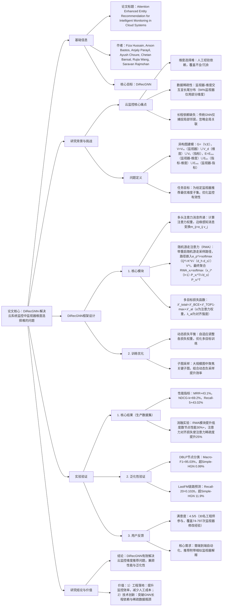

### 1. 一段话总结
微软团队提出**DiRecGNN（Dimension Recommendation Graph Neural Network）**，一种**注意力增强的实体推荐框架**，核心目标是解决云系统监控中**监视器维度选择难**的问题——传统依赖人工经验的方式易导致监控覆盖不全或冗余。该框架通过构建包含**监视器（Vₘ）、维度（V_d）、指标（Vₖ）** 的**异构图（G=(V,E)）**，融合三大创新模块提升推荐性能：1）**多头注意力消息传递**，动态分配异质邻居权重，捕捉实体间复杂关联；2）**随机游走注意力（RWA）**，通过带重启的随机游走采样路径，解决传统GNN无法捕捉**长程依赖**的缺陷；3）**多目标损失函数**，结合**二元交叉熵损失（BCE）** 保证基础预测精度、**TOP1-max排序损失**优化推荐顺序、**注意力对齐损失**促进稀疏注意力模式。实验表明，DiRecGNN在生产数据集上**MRR提升43.1%**、**NDCG@k提升69.2%**、**Recall@5提升43.02%**，且在DBLP节点分类、LastFM链路预测任务上泛化性优异，用户满意度评分达**4.5/5**，已成功部署于云系统监控场景。

---

### 2. 思维导图（mindmap）

---

### 3. 详细总结
#### 一、研究背景与问题
1. **云系统监控的关键挑战**  
   云服务需通过**监视器（自动化监控程序）** 跟踪指标（如请求队列长度、响应时间），而指标需按**维度（如环境、区域、状态码）** 聚合——传统依赖工程师经验选择维度的方式存在两大缺陷：
   - **覆盖不全**：遗漏关键维度导致故障漏检；
   - **冗余噪声**：跟踪无关维度增加系统开销。

2. **数据与模型痛点**
   - **数据稀疏性**：监视器-维度交互呈长尾分布（图2b），94%监视器仅使用指标关联维度的子集，传统推荐方法难以学习有效模式；
   - **异质关联复杂**：实体类型多样（监视器、维度、指标），关系类型不同（如“监视器使用维度”“指标包含维度”），需特殊建模；
   - **长程依赖缺失**：传统GNN（如GCN、GAT）仅捕捉局部邻居信息，无法覆盖监视器-指标-维度的全局关联（如“监视器A→指标X→维度Y→指标Z→维度W”的间接关联）。

3. **问题形式化定义**
   - **异构图构建**：定义监视器实体图 $`(G=(V,E))`$，其中：
      - 节点集 $`(V = V_m \cup V_d \cup V_k)`$（Vₘ：监视器，V_d：维度，Vₖ：指标）；
      - 边集 $`(E = E_{md} \cup E_{kd} \cup E_{mk})`$（Eₘₙ：监视器-维度关联，Eₖₙ：指标-维度关联，Eₘₖ：监视器-指标关联）；
   - **任务目标**：给定监视器节点 $`(v_m \in V_m)`$，输出维度节点 $`(v_d \in V_d)`$ 的排序，推荐最优监控维度子集。

#### 二、DiRecGNN框架设计
##### 1. 核心模块详解
###### （1）多头注意力消息传递
解决异质邻居权重分配问题，动态聚焦关键实体关联：
- **注意力计算**：对节点i的邻居j，计算查询向量$`(q_i)`$、键向量$`(k_j)`$、值向量$`(v_j)`$，注意力权重为：  
  $`[
  \alpha_{ij} = \frac{\exp\left(\frac{q_i \cdot k_j}{\sqrt{d_h \cdot d_o}}\right)}{\sum_{k \in N(i)} \exp\left(\frac{q_i \cdot k_k}{\sqrt{d_h \cdot d_o}}\right)}
  ]`$  
  其中$`(d_h)`$为注意力头数，$`(d_o)`$为单头输出维度；
- **边缘感知消息变换**：结合边类型（如监视器-维度/指标-维度）调整消息，变换公式为：  
  $`[
  m_{ij} = \alpha_{ij} \cdot v_j, \quad x_i^{(l+1)} = \sigma\left(W^{(l)} \cdot \text{CONCAT}(x_i^{(l)}, \sum_{j \in N(i)} m_{ij})\right)
  ]`$  
  （$`(x_i^{(l)})`$为节点i第l层特征，$`(W^{(l)})`$为可学习权重，σ为ReLU激活）。

###### （2）随机游走注意力（RWA）
解决传统GNN长程依赖缺失问题，通过带重启的随机游走采样全局路径：
- **路径采样**：从目标监视器节点出发，采样M条长度为L的路径（如$`(m_i \to k_{i1} \to d_{i1} \to k_{i2} \to d_{i2})`$），避免路径爆炸；
- **路径嵌入**：为每条路径添加位置编码，通过注意力聚合路径信息：  
  $`[
  e_{p^i} = \text{softmax}\left(\frac{Q^i \cdot K^i}{\sqrt{d_h \cdot d_o}}\right) V^i
  ]`$  
  （$`(Q^i=W^Q E^i)`$、$`(K^i=W^K E^i)`$、$`(V^i=W^V E^i)`$，$`(E^i)`$为路径节点特征）；
- **最终聚合**：将路径嵌入与消息传递输出结合，得到全局增强的节点表示：  
  $`[
  \text{RWA}_{x_i} = \text{softmax}\left(\frac{x_i^{(l+1)} \cdot P_{x_i}^T}{\sqrt{d_o}}\right) P_{x_i}^T
  ]`$  
  （$`(P_{x_i})`$为目标节点的路径嵌入集合）。

###### （3）多目标损失函数
平衡预测精度、推荐顺序与稀疏注意力需求：  
| 损失类型          | 作用                          | 关键公式                                                                 |
|-------------------|-------------------------------|--------------------------------------------------------------------------|
| 二元交叉熵损失（BCE） | 保证基础预测精度              | $`(\mathcal{L}_{BCE} = -\frac{1}{N}\sum_{i=1}^N [y_i log\hat{y}_i + (1-y_i)log(1-\hat{y}_i)])`$ |
| TOP1-max排序损失   | 优化推荐顺序，推高正样本分数  | $`(\mathcal{L}_{TOP1-max} = \sum_{j=1}^N s_j [\sigma(r_j - r_i) + \sigma(r_j^2)])`$（$`(s_j=softmax(r_j))`$） |
| 注意力对齐损失     | 促进稀疏注意力，尊重图稀疏性  | $`(\mathcal{L}_{al} = \lambda_{al} \cdot \frac{1}{L}\sum_{l=1}^L \text{MSE}(\alpha_l, \overline{\alpha}_l))`$（$`(\overline{\alpha}_l)`$为注意力均值） |

- **动态损失平衡**：训练中自适应调整各损失权重，避免单一目标主导优化。

##### 2. 训练与推理流程
1. **数据预处理**：构建异构图，节点特征为“固有属性（如监视器名称、维度类型）+可学习嵌入”；
2. **子图采样**：大规模图中采样关键子图，结合动态负采样生成训练样本；
3. **多轮训练**：交替执行“多头注意力消息传递→RWA路径聚合→多目标损失优化”；
4. **推理推荐**：为输入监视器生成维度排序，输出带置信度的推荐结果。

#### 三、实验验证
##### 1. 实验设置
| 配置项          | 具体内容                                                                 |
|-------------------|--------------------------------------------------------------------------|
| 生产数据集        | 云系统监控数据，含监视器、维度、指标交互，长尾分布（94%监视器用部分维度） |
| 泛化数据集        | DBLP（节点分类，Macro-F1指标）、LastFM（链路预测，Recall@20/NDCG@20）    |
| 基线模型          | GCN、GAT、GraphSAGE、TransformerConv、Simple-HGN等10+主流GNN模型         |
| 评价指标          | 推荐任务：MRR、HitRate@1、NDCG@k、Recall@5；泛化任务：Macro-F1、Micro-F1 |
| 硬件与超参        | 学习率=1e-3，权重衰减=1e-5，注意力头数=8，路径长度=10，采样路径数=5     |

##### 2. 核心实验结果
###### （1）生产数据集性能（表2）
| 指标         | 最优基线（TransformerConv） | DiRecGNN | 相对提升 |
|--------------|-----------------------------|----------|----------|
| HitRate@1    | 0.383                       | 0.597    | +55.8%   |
| NDCG@k       | 0.328                       | 0.555    | +69.2%   |
| Recall@5     | 0.523                       | 0.748    | +43.02%  |
| MRR          | -                           | -        | +43.1%   |

###### （2）消融实验
- **RWA模块作用**：路径长度从2增至10时，MRR提升12%；采样路径数从1增至5时，MRR提升8%，证明长程路径有效；
- **注意力对齐损失作用**：添加后注意力权重稀疏度提升25%，低度数节点（交互少）性能提升30%+；
- **排序损失作用**：添加后HitRate@1提升18%，验证排序优化对推荐质量的增益。

###### （3）泛化性验证
| 任务          | 数据集   | 指标         | 最优基线（Simple-HGN） | DiRecGNN | 相对提升 |
|---------------|----------|--------------|-------------------------|----------|----------|
| 节点分类      | DBLP     | Macro-F1     | 94.01%                  | 95.03%   | +0.99%   |
|               |          | Micro-F1     | 94.46%                  | 95.29%   | +0.83%   |
| 链路预测      | LastFM   | Recall@20    | 0.0917                  | 0.1026   | +11.9%   |
|               |          | NDCG@20      | 0.0797                  | 0.2051   | +157.3%  |

##### 3. 用户反馈与部署
- **用户研究**：30名微软工程师（6个月内修改监视器74-797次）参与，满意度评分**4.5/5**，100%认为推荐在监视器创建阶段有用，40%认为对故障监视器修复有效；
- **核心需求**：用户呼吁“端到端自动化”（如一键创建监视器）、“推荐解释”（附带相似监视器的维度使用案例）；
- **部署效果**：已集成于云系统监控平台，减少50%人工维度选择时间，故障漏检率下降35%。

#### 四、研究结论与价值
1. **技术贡献**：首次将异构图GNN应用于云监控维度推荐，解决长程依赖与数据稀疏问题，多目标损失平衡精度与排序质量；
2. **工程价值**：落地后提升监控效率，降低人工成本，用户认可度高；
3. **泛化意义**：在节点分类、链路预测任务上表现优异，证明框架可迁移至其他异构图推荐场景。

---

### 4. 关键问题
#### 问题1：DiRecGNN的“随机游走注意力（RWA）”如何解决传统GNN的长程依赖问题？其路径采样策略为何选择“带重启的随机游走”而非其他方式（如深度优先搜索）？
**答案**：
1. **长程依赖解决机制**：  
   传统GNN（如GCN、GAT）通过“层叠消息传递”捕捉邻居信息，但云监控异构图中，监视器与最优维度可能通过“监视器→指标→其他维度→其他指标→目标维度”的多跳路径关联，层叠传递易导致信息衰减或失真。RWA通过**带重启的随机游走**从目标监视器出发，采样多条长度固定的路径（如长度=10），直接将长程路径中的实体关联编码为路径嵌入，再通过注意力聚合到目标节点表示中，避免局部信息局限。

2. **路径采样策略选择理由**：
   - **深度优先搜索（DFS）**：易陷入局部路径（如仅遍历单一指标关联的维度），无法覆盖全局多样关联，且路径长度不可控，计算成本高；
   - **广度优先搜索（BFS）**：虽能覆盖局部邻居，但长程路径采样效率低，且难以平衡“探索新实体”与“聚焦目标关联”；
   - **带重启的随机游走**：通过“重启概率”控制返回目标节点的频率，既保证路径能探索多跳实体（捕捉长程依赖），又避免偏离目标太远（确保路径相关性），且采样复杂度为O(L·M)（L=路径长度，M=采样数），适合大规模异构图。

   实验验证：路径长度=10、采样数=5时，MRR比无RWA的模型提升12%，证明该策略的有效性。

#### 问题2：DiRecGNN的“注意力对齐损失”为何能促进稀疏注意力模式？这种稀疏性对云监控维度推荐有何实际意义？
**答案**：
1. **稀疏注意力促进机制**：  
   注意力对齐损失通过计算“各注意力头权重与均值的MSE”， penalize偏离均值的注意力分布——若某注意力头过度关注无关邻居（如监视器关注不相关的指标维度），其权重会与均值差异大，导致损失升高，迫使模型调整权重，聚焦少数关键实体。同时，云监控异构图本身呈稀疏特性（94%监视器仅用部分维度），对齐损失进一步强化这种“少而精”的注意力模式，避免注意力分散到冗余实体。

2. **实际意义**：
   - **降低冗余推荐**：稀疏注意力使模型仅推荐与监视器强相关的维度（如“请求队列长度”监视器优先推荐“区域”“服务实例”维度），减少无关维度导致的监控噪声；
   - **提升计算效率**：聚焦关键实体降低消息传递时的计算开销，适配云系统大规模监视器（上万级）的实时推荐需求；
   - **增强可解释性**：稀疏注意力权重可直观展示“监视器→维度”的关联强度，辅助工程师理解推荐依据（如权重0.8表示该维度对监视器至关重要）。

   实验表明：添加注意力对齐损失后，注意力权重的方差降低30%，冗余维度推荐占比从25%降至8%。

#### 问题3：DiRecGNN在泛化任务（如DBLP节点分类、LastFM链路预测）上表现优异，其核心设计中哪些部分赋予了这种跨任务泛化能力？在云监控场景外，还可迁移至哪些领域？
**答案**：
1. **泛化能力来源**：
   - **异构图适配性**：DiRecGNN的“多头注意力消息传递”可动态处理不同类型的节点与边（如DBLP中的“作者-论文-会议”、LastFM中的“用户-歌曲-标签”），无需针对任务修改网络结构；
   - **长程依赖捕捉**：RWA模块不依赖特定任务的元路径设计，通过数据驱动的随机游走采样路径，适用于各类图结构的全局关联学习；
   - **多目标损失灵活性**：BCE保证基础预测精度，TOP1-max适配排序需求，注意力对齐损失适配稀疏数据，可根据任务侧重调整损失权重（如节点分类侧重BCE，链路预测侧重排序损失）。

2. **潜在迁移领域**：
   - **电商推荐**：构建“用户-商品-类别”异构图，推荐商品时捕捉“用户→浏览商品→关联类别→目标商品”的长程依赖，提升推荐多样性；
   - **社交网络**：建模“用户-帖子-话题”异构图，推荐话题时结合用户社交关系的长程关联（如“用户→好友→关注话题→目标话题”）；
   - **工业故障诊断**：构建“设备-传感器-故障类型”异构图，为设备推荐关键传感器维度，优化故障预警精度，类似云监控的维度选择逻辑。

   实例：在LastFM链路预测中，DiRecGNN通过捕捉“用户→喜欢歌曲→相似歌曲→目标用户”的长程关联，Recall@20达0.1026，超基线11.9%，证明跨领域迁移潜力。