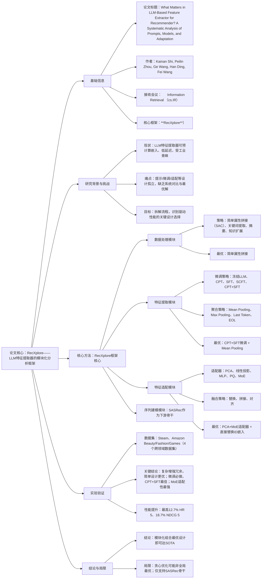

### 1. 一段话总结
针对**LLM作为特征提取器增强序列推荐（SRS）** 时，现有方法在提示设计、模型微调、特征适配等环节缺乏系统对比的问题，研究提出**RecXplore模块化分析框架**，将该流程分解为**数据处理、特征提取、特征适配、序列建模**四大模块。通过在4个公开数据集上的受控实验发现：**简单属性拼接**是最优数据处理策略，**CPT+SFT两阶段微调+Mean Pooling**的特征提取效果最佳，**PCA+MoE混合适配器**适配性能最优，且语义嵌入足够丰富时可直接替换ID嵌入。将这些最优设计组合后，RecXplore相比强基线实现了最高**12.7%的HR@5**和**18.7%的NDCG@5**相对提升，证实了模块化基准分析的实用价值。

---

### 2. 思维导图

---

### 3. 详细总结
#### 一、研究背景与动机
1.  **LLM在推荐中的两大范式**
- **LLM中心化范式**：以LLM为核心直接生成推荐结果，依赖生成能力但实时推理成本高。
- **LLM特征提取器范式**：用LLM生成语义嵌入增强传统推荐模型，可离线预计算嵌入，低延迟且易集成，更适用于工业部署。
2.  **核心问题**：现有特征提取器范式的设计（如提示构建、微调策略、特征适配）多孤立研究，缺乏统一框架对比，无法明确“哪些设计真正驱动性能”，也难以形成标准化实践。
3.  **研究目标**：提出模块化框架RecXplore，系统拆解流程并量化各设计选择的影响，挖掘最优组合方案。

#### 二、RecXplore框架设计
框架将“LLM特征提取器增强推荐”流程拆解为4个串行模块，数据流转为“原始属性→文本输入→语义嵌入→适配嵌入→推荐结果”，各模块可独立调优。

| 模块名称 | 核心功能 | 研究的设计选择 |
|----------|----------|----------------|
| **数据处理** | 将item属性（标题、品牌等）转为LLM输入文本 | 1. 简单属性拼接（SAC） 2. LLM增强：关键词提取、摘要、知识扩展 |
| **特征提取** | LLM生成item语义嵌入 | 1. 微调策略：冻结LLM、CPT、SFT、SCFT、CPT+SFT 2. 聚合策略：Mean/Max Pooling、Last Token、EOL |
| **特征适配** | 降维+空间对齐，适配下游模型 | 1. 适配器：PCA、线性投影、MLP、PQ、MoE 2. ID嵌入融合：替换、拼接、对齐 |
| **序列建模** | 建模用户行为序列 | 固定为SASRec（主流且性能强的序列推荐骨干） |

#### 三、实验设计与关键发现
##### 3.1 实验基础设置
- **数据集**：4个跨领域公开数据集，统计如下表：
  | 数据集 | 领域 | 核心特征 | 数据规模特征 |
  |--------|------|----------|--------------|
  | Steam | 游戏 | 用户-游戏交互 | 含丰富的游戏描述属性 |
  | Amazon Beauty | 美妆 | 商品标题、品牌、类别 | 高维度属性数据 |
  | Amazon Fashion | 时尚 | 商品细节、分类 | 强语义属性需求 |
  | Amazon Games | 游戏 | 商品评论、属性 | 多源文本信息 |
- **基线模型**：传统序列模型（GRU4Rec、BERT4Rec、SASRec）、LLM增强模型（SAID、LLMESR、LLMEMB）。
- **骨干LLM**：LLaMA-7B（预实验中性能优于BERT、RoBERTa）。
- **评估指标**：HR@K（命中率）、NDCG@K（归一化折损累积增益），K=5、10。

##### 3.2 核心研究问题（RQ1-RQ6）与发现
1.  **RQ1：数据处理策略的影响**
- 发现：**简单属性拼接（SAC）最优**，复杂增强（如摘要、知识扩展）性能无提升甚至下降（Beauty数据集SAC的N@5=0.3110，摘要策略仅0.3017）。
- 原因：下游LLM已具备强语义理解能力，额外处理易引入噪声。

2.  **RQ2：特征聚合策略的影响**
- 发现：**Mean Pooling始终最优**，Max Pooling性能最差。
- 数据佐证：Steam数据集Mean Pooling的HR@5=0.5592，Max Pooling仅0.4511；Beauty数据集Mean Pooling的N@5=0.3110，Last Token仅0.2806。
- 原因：Mean Pooling融合所有token信息，更全面；Max Pooling过度聚焦孤立特征。

3.  **RQ3：LLM微调策略的影响**
- 发现：**任何微调均优于冻结LLM**，且**CPT+SFT两阶段微调最优**。
- 数据佐证：Games数据集CPT+SFT的HR@5=0.6140，冻结LLM仅0.5442；Steam数据集CPT+SFT的N@5=0.4427，SCFT仅0.4383。
- 原因：CPT先适配推荐领域知识，SFT再优化任务目标，形成“领域-任务”双重适配。

4.  **RQ4：特征适配策略的影响**
- 发现：**MoE适配器性能最佳**，且**PCA预处理可增强MoE效果**。
- 数据佐证：Beauty数据集PCA+MoE的HR@5=0.5066，线性适配器仅0.4750；Games数据集PCA+MoE的N@5=0.4896，MLP适配器仅0.4836。
- 原因：MoE动态适配输入语义，PCA降维可减少冗余干扰。

5.  **RQ5：ID嵌入融合的必要性**
- 发现：**适配器能力决定是否需要ID嵌入**。
   - 强适配器（MoE）：语义嵌入足够丰富，**直接替换ID嵌入最优**（Games数据集MoE+替换的HR@5=0.6464，拼接仅0.6338）。
   - 弱适配器（线性）：需融合ID嵌入，拼接/对齐策略更优（Fashion数据集线性+拼接的N@5=0.4819，替换仅0.5105）。

6.  **RQ6：最优组合的性能（RecXplore）**
- 最优组合：SAC（数据处理）+ CPT+SFT+Mean Pooling（特征提取）+ PCA+MoE（特征适配）+ 替换ID嵌入（融合）。
- 性能：全面超越所有基线，最高**12.7%的HR@5**（Games数据集，基线LLMEMB的HR@5=0.5654，RecXplore=0.6464）和**18.7%的NDCG@5**（Games数据集，基线LLMEMB的N@5=0.4126，RecXplore=0.4896）。

#### 四、结论与局限
1.  **结论**：RecXplore的模块化分析可明确最优设计选择，无需复杂架构，仅组合现有成熟技术即可达SOTA性能，为LLM增强推荐提供标准化实践。
2.  **局限**：
- 采用贪心优化，可能错过全局最优组合；
- 仅基于SASRec骨干，未扩展至Mamba、扩散模型等新型序列模型；
- 未考虑动态数据场景下的嵌入更新问题。

---

### 4. 关键问题
#### 问题1：RecXplore框架的核心设计思路与学术/工业价值是什么？
**答案**：核心设计思路是**“模块化拆解+受控实验”**，将“LLM特征提取器增强推荐”这一复杂流程解耦为数据处理、特征提取、特征适配、序列建模4个独立模块，通过固定其他模块仅改变目标模块设计的受控实验，量化各选择的性能影响。  
学术价值：首次建立该范式的统一分析框架，解决了现有研究“孤立设计、缺乏对比”的问题，明确了驱动性能的关键因素；  
工业价值：提供可直接复用的最优实践（如SAC数据处理、CPT+SFT微调），且离线预计算嵌入+轻量适配的流程满足低延迟需求，易集成到现有系统。

#### 问题2：RecXplore框架中各核心模块的最优设计选择是什么？背后的共性逻辑是什么？
**答案**：各模块最优设计如下：
1. 数据处理：简单属性拼接（SAC）；
2. 特征提取：CPT+SFT两阶段微调 + Mean Pooling聚合；
3. 特征适配：PCA预处理 + MoE适配器；
4. 融合策略：直接替换ID嵌入（当适配器为MoE时）。  
   共性逻辑是**“以最小冗余保留最大语义信息”**：
- 数据处理避免过度加工引入噪声；
- 特征提取通过“领域适配+任务优化”强化语义，Mean Pooling全面保留token信息；
- 特征适配用PCA降维去冗余，MoE动态捕捉关键语义；
- 语义足够丰富时舍弃ID嵌入，避免信息冗余。

#### 问题3：RecXplore相比现有LLM增强推荐基线，性能优势具体体现在哪些维度？有量化数据支撑吗？
**答案**：性能优势体现在**跨数据集稳定性、关键指标提升幅度、效率适配性**三个维度，量化数据如下：
1. 跨数据集稳定性：在Steam、Beauty、Fashion、Games 4个领域数据集上，RecXplore的HR@5、NDCG@5均排名第一，无领域适配短板（如Fashion数据集HR@5=0.5544，基线LLMESR=0.5167；Steam数据集N@5=0.4612，基线LLMEMB=0.4302）。
2. 关键指标提升幅度：在Games数据集（语义需求高）上实现最大增益，HR@5相对提升12.7%（0.5654→0.6464），NDCG@5相对提升18.7%（0.4126→0.4896）；在Beauty数据集（属性密集）上N@5提升14.4%（0.3340→0.3957）。
3. 效率适配性：采用离线预计算语义嵌入+轻量MoE适配器，推理阶段无需调用LLM，延迟与传统SASRec相当，远低于LLM中心化范式。