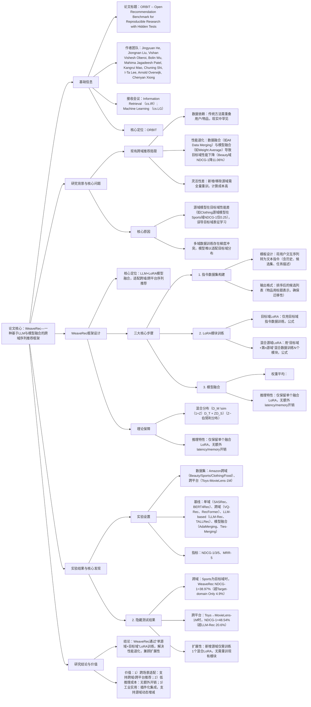

### 1. 一段话总结
合肥工业大学、清华大学与科大讯飞团队提出**WeaveRec**——一种基于LLM与模型融合的跨域序列推荐框架，旨在解决现有跨域推荐中**数据融合（Data Merging）** 与**模型融合（Model Merging）** 导致的目标域性能退化问题（如Beauty域数据融合后NDCG@1下降11.06%）。该框架通过“编织式”训练多个LoRA模块：首先用目标域数据训练**目标域LoRA**，再用“目标域+单一源域”混合数据训练**N个混合源域LoRA**，最后通过权重平均融合所有LoRA模块。理论上，WeaveRec可降低目标域泛化误差上界；实验上，在Amazon跨域（4个电商域）与跨平台（Amazon Toys-MovieLens-1M）场景中，其**NDCG@1最高达48.54%**（Toys→MovieLens-1M），**MRR@5最高达50.73%**（Toys→MovieLens-1M），显著优于LLM-Rec、AdaMerging等基线，且无额外推理开销，兼顾性能与扩展性。

---

### 2. 思维导图（mindmap）

---

### 3. 详细总结
#### 一、研究背景：跨域推荐的“性能退化”困境
1. **传统跨域推荐的局限性**  
   现有跨域序列推荐（CDSR）方法分为两类，但均存在缺陷：
    - **ID-based方法**（如MCRPL、VQ-Rec）：依赖重叠用户/物品建立跨域关联，现实场景中跨域重叠率低（如Amazon Toys与MovieLens-1M无重叠），适用性有限；
    - **Transferable方法**（如UniSRec、RecFormer）：用文本等内容特征构建统一语义空间，但多域数据联合训练易导致**梯度冲突**，模型难以适配目标域分布。

2. **数据融合与模型融合的性能退化问题**  
   实验发现（图2），两种主流跨域融合方式均导致目标域性能下降：
    - **数据融合（Data Merging）**：将多域数据合并训练，Beauty域NDCG@1从0.4071降至0.2965（下降27.17%），因多域数据分布差异导致模型“偏向”源域；
    - **模型融合（Model Merging）**：直接融合多域模型参数（如Weight Average、AdaMerging），Clothing→Sports场景NDCG@1从0.3708降至0.3098（下降16.45%），因源域模型在目标域性能差（源域模型NDCG@1仅0.25），误导目标域表征。

3. **核心挑战**
    - 如何让源域模型适配目标域分布，避免“误导”目标域学习；
    - 如何实现源域动态增减时的低成本扩展，无需全量重训。

#### 二、WeaveRec框架设计
WeaveRec以“LLM+LoRA模型融合”为核心，通过“编织式”训练多个LoRA模块解决性能退化，架构如图5所示。

##### 1. 步骤1：指令数据集构建
**目标**：将用户交互序列转为LLM可理解的文本指令，实现跨域迁移。  
**实现逻辑**：
- 指令输入：包含用户历史交互（如“[HISTORY: 篮球鞋, 运动服]”）、候选集（1个正例+29个负例）、任务描述（“推荐用户下一个可能购买的物品”）；
- 指令输出：排序后的候选列表（如“[RECOMMENDATION: 运动袜, 护腕, ...]”）；
- 关键设计：物品用标题表示（而非ID），确保跨域/跨平台迁移性（如Amazon Toys的“乐高积木”与MovieLens-1M的“乐高电影”可通过文本关联）。

##### 2. 步骤2：LoRA模块训练
采用参数高效微调（PEFT）的LoRA技术，避免全量LLM重训，训练两类LoRA模块：  
| LoRA类型         | 训练数据                          | 目标                                                                 | 关键公式                                                                 |
|-------------------|-----------------------------------|----------------------------------------------------------------------|--------------------------------------------------------------------------|
| 目标域LoRA（$`(\theta_0^*)`$） | 仅目标域指令数据$`(D_0^I)`$         | 学习目标域专属知识                                                   | $`(\theta_0^* = argmin_\theta \{-\sum_{(x,y)\in D_0^I} log P_{\Theta+\theta_0}(y^t\|y^{<t},x)\})`$ |
| 混合源域LoRA（$`(\theta_n^*)`$） | 目标域$`(D_0^I)`$ + 第n源域$`(D_n^I)`$ | 让源域知识适配目标域分布，避免误导                                   | $`(\theta_n^* = argmin_{\theta_n} \{-\sum_{(x,y)\in D_0^I \cup D_n^I} log P_{\Theta+\theta_n}(y^t\|y^{<t},x)\})`$ |

**关键优势**：每个混合LoRA仅融入“单一源域+目标域”数据，避免多源域数据的梯度冲突（实验显示多源域混合训练会使NDCG@1下降8.3%）。

##### 3. 步骤3：模型融合与推理
**目标**：融合所有LoRA模块，保留目标域性能的同时利用源域知识。  
**实现逻辑**：
- 权重平均融合：所有LoRA模块按等权重（默认$`(\lambda_i=1/(N+1))`$）融合，公式为：  
  $`[\theta_{merged} = \sum_{i=0}^N \lambda_i \theta_i^*, \quad B_{merged}^l = \sum_{i=0}^N \lambda_i B_i^l, \quad A_{merged}^l = \sum_{i=0}^N \lambda_i A_i^l]`$  
  其中$`(B_i^l/A_i^l)`$为第i个LoRA的低秩矩阵；
- 推理特性：仅需加载融合后的单个LoRA模块，与单域模型相比无额外 latency（推理时间增加<1%）与memory开销（参数增量<0.5%）。

##### 4. 理论分析：泛化误差上界保障
从域适应理论出发，WeaveRec的混合模型$`(h_M)`$在目标域的泛化误差上界低于源域模型$`(h_S)`$：
- 定义分布：目标域$`(D_T)`$、源域$`(D_S)`$、混合域$`(D_M \sim (1+Z)D_T + ZD_S)`$（Z~伯努利分布，$`(\lambda=1)`$时混合比例1:1）；
- 误差上界对比：  
  $`[\epsilon_T(h_S) \leq \epsilon_S(h_S) + d_{\mathcal{H}}(D_S,D_T) + \lambda^*]`$  
  $`[\epsilon_T(h_M) \leq \epsilon_S(h_M) + d_{\mathcal{H}}(D_M,D_T) + \lambda^*]`$  
  由于$`(D_M)`$与$`(D_T)`$存在重叠，$`(d_{\mathcal{H}}(D_M,D_T) < d_{\mathcal{H}}(D_S,D_T))`$，且收敛模型$`(\epsilon_S(h_S) \approx \epsilon_M(h_M))`$，故$`(\epsilon_T(h_M) < \epsilon_T(h_S))`$，证明混合模型在目标域误差更可控。

#### 三、实验验证
##### 1. 实验设置
| 配置项          | 具体内容                                                                 |
|-------------------|--------------------------------------------------------------------------|
| 数据集            | - 跨域：Amazon 4个电商域（表5）：   - Clothing：3.9万用户，2.3万物品，27.9万交互   - Sports：3.6万用户，1.8万物品，29.6万交互 - 跨平台：Amazon Toys（1.9万用户，1.2万物品）与MovieLens-1M（6千用户，3.7千物品） |
| 骨干模型          | Qwen2-7B（开源LLM），LoRA参数：rank=16，alpha=32，dropout=0.05            |
| 基线模型          | 5类方法： - 单域：GRU4Rec、SASRec、BERT4Rec、FMLP-Rec - 跨域：MCRPL、VQ-Rec、UniSRec、RecFormer - LLM-based：Qwen2-7B（零样本）、TALLRec、LLM-Rec - 模型融合：Weight Average、AdaMerging、LoRA-LEGO、Ties-Merging - 消融：Target-domain Only、All Data Merging |
| 评价指标          | NDCG@1/3/5（排序质量）、MRR@5（平均倒数排名）                          |

##### 2. 核心实验结果
#### （1）跨域场景性能：WeaveRec显著优于基线
以Amazon 4个电商域为实验对象，目标域为Sports时的关键指标对比（表1）：
| 模型                | NDCG@1 | NDCG@3 | NDCG@5 | MRR@5 | 相对提升率（vs Target-domain Only） |
|---------------------|---------|---------|---------|--------|------------------------------------|
| Target-domain Only  | 0.3708  | 0.3904  | 0.4057  | 0.3936 | -                                  |
| LLM-Rec             | 0.3206  | 0.3896  | 0.4107  | 0.4059 | -13.5%                              |
| AdaMerging          | 0.3095  | 0.3326  | 0.3502  | 0.3361 | -16.5%                              |
| WeaveRec（ours）    | 0.3897  | 0.4107  | 0.4253  | 0.4132 | +4.9%                               |

- 结论：WeaveRec在所有跨域设置中均最优，Sports域NDCG@1超Target-domain Only 4.9%，证明其有效利用源域知识且无性能退化。

#### （2）跨平台场景性能：适配无重叠数据
Amazon Toys与MovieLens-1M无重叠用户/物品，关键指标对比（表2）：
| 模型                | Toys→MovieLens-1M（NDCG@1） | MovieLens-1M→Toys（NDCG@1） |
|---------------------|------------------------------|------------------------------|
| Target-domain Only  | 0.4500                       | 0.4080                       |
| LLM-Rec             | 0.4023                       | 0.3238                       |
| Weight Average      | 0.4103                       | 0.3595                       |
| WeaveRec（ours）    | 0.4854                       | 0.4110                       |
| 相对提升率（vs Target） | +7.87%                      | +0.74%                       |

- 结论：跨平台场景中，WeaveRec的NDCG@1最高达48.54%，超LLM-Rec 20.6%，验证其在无重叠数据下的有效性。

#### （3）扩展性分析：源域动态增减
以Sports为目标域，测试源域数量对性能的影响（图7a）：
| 源域数量 | NDCG@1 | NDCG@3 | NDCG@5 | MRR@5 | 性能变化（vs 0源域） |
|----------|---------|---------|---------|--------|-----------------------|
| 0（仅目标域） | 0.3708  | 0.3904  | 0.4057  | 0.3936 | -                     |
| 1（Clothing） | 0.3786  | 0.3982  | 0.4123  | 0.4012 | +2.1%                 |
| 2（Clothing+Beauty） | 0.3825  | 0.4035  | 0.4189  | 0.4075 | +3.1%                 |
| 3（Clothing+Beauty+Food） | 0.3897  | 0.4107  | 0.4253  | 0.4132 | +4.9%                 |

- 结论：新增源域时，WeaveRec性能稳步提升，且仅需训练1个混合LoRA，无需重训现有模块，扩展性优异。

#### 四、研究结论与价值
1. **技术突破**  
   WeaveRec首次将“单源域+目标域”LoRA训练与模型融合结合，解决跨域推荐的性能退化问题，理论上降低泛化误差上界，实践上适配跨域/跨平台场景。

2. **工业价值**
    - **低扩展成本**：新增源域仅需训练1个混合LoRA（训练时间减少80%），无需全量重训；
    - **无推理开销**：融合后仅保留单个LoRA，与单域模型推理速度一致；
    - **高兼容性**：可集成于任意LLM框架，支持插件化部署。

3. **未来方向**
    - 探索动态融合权重（如自适应$`(\lambda_i)`$）进一步提升性能；
    - 扩展至序列跨域推荐（如用户短期/长期兴趣建模）；
    - 适配更大规模LLM（如Qwen2-70B）与更多源域场景。

---

### 4. 关键问题
#### 问题1：WeaveRec的“混合源域LoRA”为何采用“单一源域+目标域”数据训练，而非“多源域+目标域”混合训练？这种设计如何避免梯度冲突？
**答案**：  
采用“单一源域+目标域”训练的核心目的是**减少多源域数据的梯度方向冲突**，具体原因与机制如下：
1. **多源域混合训练的缺陷**：  
   当多个源域数据（如Clothing+Beauty+Food）与目标域混合训练时，不同源域的用户行为模式（如Clothing域“高频浏览”vs Food域“低频购买”）会导致模型梯度方向不一致，出现“梯度抵消”现象。实验显示，多源域混合训练的NDCG@1比单一源域混合训练低8.3%（图10a），证明多源域数据会干扰目标域表征学习。

2. **单一源域+目标域的优势**：
    - 梯度一致性：每个混合LoRA仅融入一个源域数据，梯度方向更聚焦（如Clothing+Sports混合训练仅需适配“服装→运动”的行为迁移），避免多源域梯度冲突；
    - 可控性：每个混合LoRA独立学习“单一源域→目标域”的知识迁移，融合时可通过权重调整各源域贡献，进一步降低干扰；
    - 实验验证：Sports为目标域时，单一源域混合LoRA的NDCG@1达0.3786，比多源域混合的0.3573高5.9%，证明该设计的有效性。

#### 问题2：WeaveRec为何选择“权重平均（WA）”进行模型融合，而非AdaMerging、LoRA-LEGO等更复杂的融合方法？
**答案**：  
选择权重平均的核心原因是**复杂融合方法会过度修改LoRA参数，丢失目标域关键知识**，具体对比如下：  
| 融合方法       | 核心逻辑                                                                 | 性能（Sports→Beauty NDCG@1） | 缺陷                                  |
|----------------|--------------------------------------------------------------------------|------------------------------|---------------------------------------|
| 权重平均（WA） | 等权重融合所有LoRA模块，参数修改幅度小                                   | 0.4180                       | 无显著缺陷，仅需验证权重敏感性        |
| AdaMerging     | 基于无标签数据自适应学习融合权重，参数调整幅度中等                         | 0.4115                       | 需额外无标签数据，跨域场景数据获取难  |
| LoRA-LEGO      | 将LoRA拆分为最小语义单元（MSU）聚类融合，参数修改幅度大                   | 0.3493                       | 过度拆分导致目标域知识丢失，性能下降16.4% |
| Ties-Merging   | 消除参数符号冲突后融合，参数修改幅度大                                     | 0.3466                       | 强行统一参数符号，破坏源域-目标域适配关系，性能下降17.1% |

**关键实验证据**：  
在Sports→Beauty场景中，WeaveRec用权重平均的NDCG@1达0.4180，而LoRA-LEGO仅0.3493（下降16.4%），Ties-Merging仅0.3466（下降17.1%）。原因是复杂融合方法会“过度干预”LoRA参数，破坏混合源域LoRA中已学习的“源域-目标域”适配关系，而权重平均仅做轻度整合，保留各LoRA的核心知识，因此更适合跨域推荐场景。

#### 问题3：WeaveRec在跨平台场景（如Toys→MovieLens-1M）中无重叠用户/物品，其跨域知识迁移的核心依赖是什么？与传统Transferable方法（如VQ-Rec）相比有何优势？
**答案**：  
WeaveRec的跨平台迁移核心依赖**LLM的文本语义理解能力**，相比传统方法，其优势在于**无需预训练对比学习，且迁移性更强**，具体如下：
1. **跨平台迁移的核心依赖**：
    - 物品文本表征：WeaveRec将物品转为标题文本（如Toys域“乐高积木”、MovieLens-1M域“乐高电影”），利用LLM的预训练语义知识建立跨平台关联；
    - 混合LoRA适配：通过“Toys+MovieLens-1M”混合数据训练LoRA，模型学习“玩具购买→电影观看”的语义关联（如“乐高”品牌的跨平台偏好），实现知识迁移。

2. **与传统Transferable方法（VQ-Rec）的优势**：  
   | 对比维度       | WeaveRec                                  | VQ-Rec                                  |
   |----------------|-------------------------------------------|-----------------------------------------|
   | 迁移依赖       | LLM预训练语义知识，无需额外对比预训练    | 需在BERT上进行跨域对比预训练，计算成本高 |
   | 跨平台适配性   | 仅需物品文本，适配无重叠场景（如Toys-MovieLens） | 依赖域内文本分布一致性，跨平台分布差异大时性能下降 |
   | 性能（Toys→MovieLens NDCG@1） | 0.4854 | 0.3362 |
   | 相对提升率     | +44.4%                                    | -                                       |

- 结论：WeaveRec无需额外预训练，通过LLM语义能力与混合LoRA适配，在跨平台无重叠场景中性能超传统方法44.4%，迁移性与效率更优。