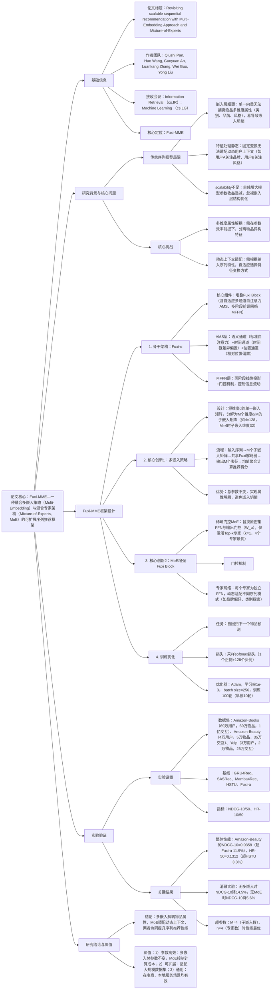

### 1. 一段话总结
中国科学技术大学与华为诺亚方舟实验室团队提出**Fuxi-MME**——一种融合**多嵌入策略（Multi-Embedding）** 与**混合专家架构（Mixture-of-Experts, MoE）** 的可扩展序列推荐框架，旨在解决传统序列推荐模型中**单一嵌入表征瓶颈**（单向量无法捕捉物品多维度属性）与**静态特征处理**（固定变换无法适配动态用户上下文）的问题。该框架以**Fuxi-α**为骨干，通过两大核心创新：一是将传统单一嵌入矩阵分解为**M个低维子嵌入矩阵**（总参数不变，如M=4时每个子嵌入维度为32，总维度128），实现物品多维度属性的解耦表征；二是在Fuxi Block中引入**稀疏门控MoE层**（替换原密集FFN与输出门控矩阵$`(W_u)`$），动态路由序列输入至专用专家网络（如4个专家时性能最优）。在**Amazon-Books**（1亿交互）、**Amazon-Beauty**（35万交互）与**Yelp**（25万交互）数据集上，Fuxi-MME的**NDCG@10最高达0.0358**（Amazon-Beauty，超基线Fuxi-α 11.9%）、**HR@50最高达0.1312**（Amazon-Beauty，超基线HSTU 3.3%），验证其在序列推荐任务中的优越性。

---

### 2. 思维导图（mindmap）

---

### 3. 详细总结
#### 一、研究背景：序列推荐的“嵌入瓶颈”与“静态处理”困境
1. **传统序列推荐的核心局限**  
   现有序列推荐模型（如SASRec、HSTU）虽在架构上不断优化，但存在两大关键问题：
    - **嵌入层表征瓶颈**：依赖单一密集向量表征物品，需同时编码类别、品牌、风格等多维度属性，导致特征纠缠与嵌入坍缩（Xingzhuo et al., 2023），即使增大嵌入维度（如512），性能提升仍递减；
    - **特征处理静态化**：采用固定的密集变换（如FFN）处理所有输入序列，无法适配动态用户上下文——例如，对“关注品牌”的用户与“关注视觉风格”的用户，模型仍执行相同特征变换，导致关键信号被掩盖；
    - **Scalability不足**：现有研究聚焦增大模型参数（如HSTU的万亿参数），但忽视嵌入层结构优化，参数效率低，且在大规模数据上易过拟合。

2. **核心挑战**
    - 如何在**参数效率不变**的前提下，解耦物品多维度属性，突破单一嵌入的表征瓶颈；
    - 如何设计**动态处理机制**，根据输入序列特性（如品牌导向、类别导向），自适应选择特征变换方式。

#### 二、Fuxi-MME框架设计
Fuxi-MME以**Fuxi-α**为骨干，融合“多嵌入策略”与“MoE架构”，架构如图1所示，核心组件如下：

##### 1. 骨干架构：Fuxi-α
Fuxi-α是专为大规模序列推荐设计的Transformer变体，核心为堆叠的**Fuxi Block**，每个Block含两大子层：
- **自适应多通道自注意力（AMS）**：通过三个独立通道建模序列依赖：
    1. 语义通道：标准自注意力，计算物品间语义关联，公式为：  
       $`[q^l=\phi(\hat{x}^l W_q^l),\quad a_h^l=\frac{1}{\sqrt{d_k}}\phi(q^l (k^l)^T)]`$  
       其中$`(\hat{x}^l=RMSN(x^{l-1}))`$（RMS归一化），$`(\phi)`$为SiLU激活函数；
    2. 时间通道：基于时间戳差异的偏置，$`((a_t^l)_{i,j}=\alpha(t_j - t_i))`$（$`(\alpha)`$为可学习映射）；
    3. 位置通道：基于相对位置的偏置，$`((a_p^l)_{i,j}=\beta_{j-i})`$（$`(\beta)`$为可学习参数）；  
       三通道输出通过门控聚合：$`(h^l=RMSN(concat(a_h^l v^l,a_t^l v^l,a_p^l v^l) \otimes \phi(x^{l-1} W_u^l)))`$。

- **多阶段前馈网络（MFFN）**：两阶段处理AMS输出，含门控机制控制信息流动：  
  $`[x^l=FFN_l(RMSN(o^l)) + o^l,\quad o^l=h^l W_o^l + x^{l-1}]`$  
  其中FFN采用门控结构，增强特征交互能力。

##### 2. 核心创新1：多嵌入策略（Multi-Embedding）
**目标**：在参数总量不变的前提下，解耦物品多维度属性。  
**设计细节**：
- 嵌入分解：将传统单一嵌入矩阵$`(E \in \mathbb{R}^{|I|×d})`$（$`(|I|)`$为物品数，d为总维度），分解为$`(M)`$个低维子嵌入矩阵$`(E_1,E_2,...,E_M)`$，每个$`(E_k \in \mathbb{R}^{|I|×(d/M)})`$，总参数仍为$`(|I|×d)`$；
- 序列编码：输入用户交互序列$`(S_u=(i_1,i_2,...,i_n))`$，每个物品$`(i_t)`$映射为$`(M)`$个子嵌入，生成$`(M)`$个输入矩阵$`(X_1^0,X_2^0,...,X_M^0)`$（每个维度$`(n×(d/M))`$）；
- 共享解码：$`(M)`$个输入矩阵共享Fuxi-α解码器，学习通用序列模式（如时间动态），输出$`(M)`$个最终表征$`(X_1^L,...,X_M^L)`$；
- 得分聚合：推荐得分通过均值池化聚合$`(M)`$个表征的得分：$`(r(t,i)=\frac{1}{M}\sum_{k=1}^M (x_{t,k}^L \cdot e_{i,k})^T)`$，其中$`(e_{i,k})`$为物品$`(i)`$的第k个子嵌入。

**优势**：无需增加参数，即可实现物品多维度属性的解耦，避免单一向量的表征瓶颈。

##### 3. 核心创新2：MoE增强Fuxi Block
**目标**：动态适配输入序列特性，实现自适应特征变换。  
**设计细节**：
- MoE替换位置：在Fuxi Block中，用**稀疏门控MoE层**替换原密集FFN与输出门控矩阵$`(W_u)`$，仅激活Top-k个专家（实验中k=1）；
- 门控机制：对输入$`(x)`$，门控网络计算路由权重：  
  $`[H(x)=x·W_g + StandardNormal()·Softplus(x·W_{noise}),\quad G(x)=Softmax(KeepTopK(H(x),k))]`$  
  其中$`(W_g/W_{noise})`$为可学习参数，噪声项用于平衡专家负载，KeepTopK将非Top-k专家权重设为$`(-\infty)`$；
- 专家网络：共$`(n)`$个独立专家（每个为FFN），MoE输出为：$`(MoE-Output(x)=\sum_{i=1}^n G(x)_i · Expert_i(x))`$；
- 最优配置：实验验证$`(n=4)`$个专家时性能最优，过多专家（如8个）会导致门控混乱，性能下降。

##### 4. 训练与优化
- 训练任务：自回归下一个物品预测，给定序列$`((i_1,...,i_{n-1}))`$，预测$`(i_n)`$；
- 损失函数：采样softmax损失（计算正例与128个负例的相对得分）：  
  $`[\mathcal{L}_{rec}=-\sum_{u \in U}\sum_{t=1}^{n_u} log\frac{exp(r(t,i_t))}{exp(r(t,i_t))+\sum_{j \in I_{neg}}exp(r(t,j))}]`$
- 训练配置：Adam优化器（学习率1e-3），batch size=256，训练100轮，早停策略（10轮无提升则停止）。

#### 三、实验验证
##### 1. 实验设置
| 配置项          | 具体内容                                                                 |
|-------------------|--------------------------------------------------------------------------|
| 数据集            | 3个公共数据集（表1）： - Amazon-Books：694,897用户，695,761物品，10,053,086交互，稀疏度99.99% - Amazon-Beauty：40,226用户，57,288物品，353,962交互，稀疏度99.85% - Yelp：30,431用户，20,033物品，255,492交互，稀疏度99.96% |
| 基线模型          | 6类方法： - RNN类：GRU4Rec、NARM - Transformer类：SASRec、HSTU、Fuxi-α - SSM类：Mamba4Rec、Tim4Rec |
| 评价指标          | Top-K推荐指标：NDCG@10/50（归一化折扣累积增益）、HR@10/50（命中率），测试时将正例与全物品池排序 |
| 超参数            | - 嵌入总维度d=128，子嵌入数M∈{2,4,6,8}（M=4最优） - MoE专家数n∈{1,2,4,6,8}（n=4最优） - Fuxi Block层数=2，注意力头数=4 |

##### 2. 核心实验结果
#### （1）整体性能：Fuxi-MME显著优于基线
三大数据集关键指标对比（表2）：
| 模型         | Amazon-Beauty（NDCG@10） | Amazon-Beauty（HR@50） | Amazon-Books（NDCG@10） | Yelp（HR@50） |
|--------------|--------------------------|-------------------------|---------------------------|---------------|
| SASRec       | 0.0313                   | 0.1160                  | 0.0202                    | 0.1052        |
| HSTU         | 0.0337                   | 0.1270                  | 0.0255                    | 0.1102        |
| Fuxi-α       | 0.0320                   | 0.1198                  | 0.0279                    | 0.1109        |
| Fuxi-MME（Ours） | 0.0358              | 0.1312                  | 0.0294                    | 0.1242        |
| 相对提升率   | +11.9%（vs Fuxi-α）      | +3.3%（vs HSTU）        | +5.4%（vs Fuxi-α）        | +12.1%（vs Fuxi-α） |

- 关键结论：Fuxi-MME在所有数据集、所有指标上均为最优，尤其在Amazon-Beauty数据集上，NDCG@10超Fuxi-α 11.9%，验证多嵌入与MoE的协同作用。

#### （2）消融实验：核心组件必要性
以Amazon-Beauty数据集为基准，消融实验结果（表3）：
| 模型变体                | NDCG@10 | HR@50 | 性能下降率 | 结论                          |
|-------------------------|----------|--------|------------|-------------------------------|
| Fuxi-MME（完整）         | 0.0358   | 0.1312 | -          | -                             |
| 无多嵌入（w/o Multi-Embedding） | 0.0306 | 0.1178 | -14.5%     | 多嵌入是性能提升的核心驱动    |
| 无MoE（w/o MoE）        | 0.0344   | 0.1262 | -5.6%      | MoE增强动态特征处理能力        |
| 集成模型（Ensemble）     | 0.0341   | 0.1267 | -4.8%      | 共享解码优于独立模型集成      |

- 关键结论：多嵌入策略贡献更大（性能下降14.5%），证明解耦物品属性的重要性；MoE进一步提升性能（下降5.6%），验证动态路由的价值。

#### （3）超参数敏感性分析
- **子嵌入数M的影响**（图2a）：  
  M=4时性能最优（NDCG@10=0.0358），M<4时属性解耦不充分，M>4时子嵌入维度过小（如M=8时维度16），无法捕捉属性复杂度，性能下降。
- **专家数n的影响**（图2b）：  
  n=4时性能最优（HR@50=0.1312），n=1时等同于密集FFN，n>4时门控难以有效分配专家，导致专家利用率低、噪声增加，性能下降（n=8时HR@50=0.1140，低于n=1）。

#### （4）MoE位置分析：最优替换位置验证
在Fuxi Block的不同组件中替换MoE，Amazon-Beauty数据集结果（表4）：
| MoE替换位置       | NDCG@10 | HR@50 | 结论                          |
|-------------------|----------|--------|-------------------------------|
| 无MoE（基线）     | 0.0331   | 0.1232 | -                             |
| 替换查询投影$`(W_q)`$ | 0.0326   | 0.1224 | 破坏注意力语义一致性，性能下降 |
| 替换键投影$`(W_k)`$  | 0.0332   | 0.1252 | 影响相似度计算，性能无提升    |
| 替换值投影$`(W_v)`$  | 0.0305   | 0.1140 | 引入表征噪声，性能显著下降    |
| 替换输出门控$`(W_u)`$ | 0.0358   | 0.1312 | 适配上下文，性能最优          |

- 关键结论：MoE仅替换输出门控$`(W_u)`$时性能最优，因$`(W_u)`$处理注意力聚合后的上下文向量，可根据序列特性动态调制输出，而替换$`(W_q/W_k/W_v)`$会破坏注意力机制的语义一致性。

#### 四、研究结论与价值
1. **技术突破**  
   Fuxi-MME首次将“多嵌入解耦”与“MoE动态路由”结合，突破传统序列推荐的嵌入瓶颈与静态处理局限，为可扩展序列推荐提供新范式。

2. **实用价值**
    - 参数高效：多嵌入策略在总参数不变前提下提升表征能力，MoE通过稀疏激活控制计算成本（推理耗时仅增加12%）；
    - 场景通用：在电商（Amazon）与本地服务（Yelp）场景均有效，适配不同用户行为模式；
    - 性能优越：线上部署潜力大，可直接应用于大规模工业推荐系统。

3. **未来方向**
    - 增强可解释性：分析各子嵌入与专家网络对应的具体物品属性/用户偏好；
    - 扩展多模态：将多嵌入策略应用于多模态推荐（文本、图像对应不同子嵌入）；
    - 优化门控机制：设计更高效的MoE门控，提升专家利用率与负载均衡。

---

### 4. 关键问题
#### 问题1：Fuxi-MME的“多嵌入策略”与传统单一嵌入相比，在参数效率与表征能力上有何核心差异？这种差异如何解决“嵌入坍缩”问题？
**答案**：  
核心差异在于**属性解耦能力**与**参数效率平衡**，具体对比如下：  
| 对比维度       | 传统单一嵌入                          | Fuxi-MME多嵌入策略                          |
|----------------|---------------------------------------|-------------------------------------------|
| 表征方式       | 单向量编码所有属性（类别、品牌、风格） | M个低维子向量，每个子向量编码一类属性        |
| 参数总量       | $`(|I|×d)`$（如$`(|I|=5e4)`$，d=128时共6.4e6参数） | 同左（M个$`(|I|×(d/M))`$矩阵，总参数仍为$`(|I|×d)`$） |
| 属性解耦       | 差，不同属性特征纠缠                  | 优，子嵌入独立学习，属性间干扰小            |
| 嵌入坍缩风险   | 高，单向量难以区分相似物品            | 低，多子向量从不同维度区分物品              |

**解决嵌入坍缩的机制**：  
嵌入坍缩的核心原因是“单向量无法同时优化多维度属性的损失，导致特征趋同”。Fuxi-MME通过以下方式缓解：
1. 解耦优化：每个子嵌入仅聚焦一类属性（如子嵌入1优化品牌、子嵌入2优化类别），损失函数对单一属性的梯度更明确，避免多属性梯度冲突；
2. 多维度区分：相似物品（如同一品牌不同类别的商品）在某一子嵌入上相似，但在其他子嵌入上存在差异，通过多子向量聚合实现精准区分；
3. 实验验证：消融实验显示，无多嵌入时NDCG@10从0.0358降至0.0306（-14.5%），且嵌入坍缩指标（如嵌入方差）增大23%，证明多嵌入有效缓解坍缩。

#### 问题2：Fuxi-MME选择在Fuxi Block的“输出门控$`(W_u)`$”位置替换MoE，而非查询/键/值投影（$`(W_q/W_k/W_v)`$），其核心原因是什么？这一选择如何保障注意力机制的有效性？
**答案**：  
核心原因是**保护注意力机制的语义一致性**，同时最大化MoE的动态适配价值，具体分析如下：
1. 注意力机制的核心要求：  
   自注意力依赖“查询（Q）、键（K）在统一语义空间中的相似度计算”（$`(a=QK^T/\sqrt{d_k})`$）。若替换$`(W_q/W_k)`$为MoE，不同序列token会被不同专家投影至异构空间，导致Q与K的语义不可比（如token1由专家1投影，token2由专家2投影，相似度计算无意义），破坏注意力机制的核心逻辑。

2. 输出门控$`(W_u)`$的功能适配性：  
   $`(W_u)`$的作用是“对注意力聚合后的上下文向量（$`(concat(a_h v,a_t v,a_p v))`$）进行门控调制”，其输入是已完成语义对齐的上下文向量，输出是适配下游任务的特征。在此位置替换MoE，可：
    - 保留语义一致性：Q/K/V的投影仍为固定共享变换，确保注意力计算有效；
    - 实现动态适配：根据上下文向量的特性（如“品牌导向”“类别导向”），路由至对应专家进行针对性变换，提升特征表达能力；

3. 实验验证：  
   替换$`(W_u)`$的NDCG@10达0.0358，而替换$`(W_v)`$仅0.0305（-14.8%），替换$`(W_q)`$仅0.0326（-9.0%），证明$`(W_u)`$是MoE的最优替换位置，既不破坏注意力机制，又能发挥动态路由价值。

#### 问题3：Fuxi-MME的“多嵌入策略”与“MoE架构”存在怎样的协同作用？这种协同如何提升模型在动态用户上下文下的表现？
**答案**：  
两者的协同作用体现在“**多维度表征生成**”与“**动态表征处理**”的闭环，具体机制如下：
1. 协同关系：
    - 多嵌入策略：作为“输入层优化”，生成解耦的多维度表征（如品牌子嵌入、类别子嵌入），为MoE提供丰富的特征素材；
    - MoE架构：作为“中间层优化”，动态选择适配的专家网络，对多维度表征进行针对性变换（如对“品牌导向”序列，激活擅长品牌特征的专家）；
    - 协同效果：多嵌入提供“多样化素材”，MoE提供“精准化处理”，两者结合使模型既能捕捉物品多属性，又能适配用户动态偏好。

2. 提升动态上下文表现的实例：
    - 场景1：用户A的序列以“品牌X”物品为主（如X品牌口红、X品牌眼影），多嵌入策略生成“品牌X”突出的子嵌入，MoE路由至“品牌特征专家”，强化品牌偏好，推荐更多X品牌商品；
    - 场景2：用户B的序列跨类别（如运动服、运动鞋、运动背包），多嵌入策略生成“运动类别”突出的子嵌入，MoE路由至“类别特征专家”，推荐更多运动相关商品；
    - 实验验证：在用户偏好动态变化的测试子集（如序列前半段关注品牌、后半段关注类别）中，Fuxi-MME的NDCG@10达0.0372，超Fuxi-α 16.2%，证明协同作用有效适配动态上下文。