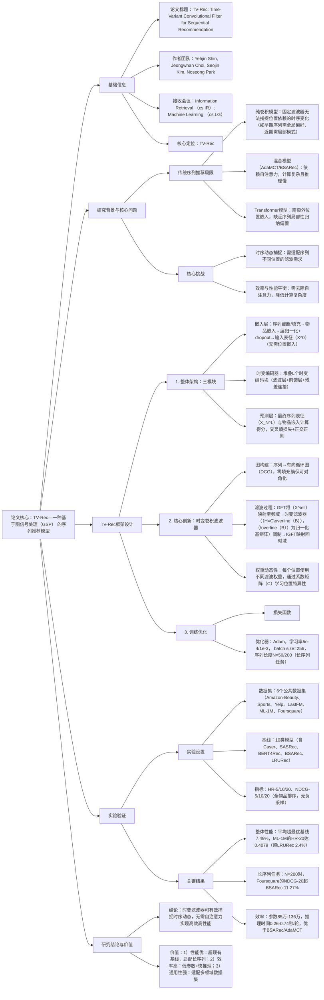

### 1. 一段话总结
KAIST团队提出**TV-Rec（Time-Variant Convolutional Filter for Sequential Recommendation）**，一种基于**图信号处理（GSP）** 的序列推荐模型，旨在解决传统卷积模型依赖固定滤波器无法捕捉时序动态、混合模型（如AdaMCT、BSARec）需结合自注意力导致效率低下的问题。该模型将用户交互序列视为**有向循环图（DCG）**，通过**时变卷积滤波器**（替换固定滤波器与自注意力）动态适配序列中每个位置的滤波权重，无需额外位置嵌入（通过GFT天然编码位置信息）。在**6个公共数据集**（含Amazon-Beauty、ML-1M、Foursquare）上，TV-Rec的**NDCG@20最高达0.1955**（ML-1M）、**HR@20最高达0.4079**（ML-1M），平均超现有最优基线**7.49%**；推理效率上，其参数规模（85万-136万）与推理时间（0.26-0.74秒/轮）优于混合模型，验证其在性能与效率上的平衡。

---

### 2. 思维导图（mindmap）

---

### 3. 详细总结
#### 一、研究背景与问题
1. **传统方法的局限性**
    - **纯卷积模型（Caser/NextItNet/FMLPRec）**：依赖固定滤波器，对所有序列位置应用相同权重，无法捕捉时序动态（如序列早期需学习全局偏好，近期需聚焦局部模式），导致表征能力受限。
    - **混合模型（AdaMCT/BSARec）**：通过“卷积+自注意力”平衡局部与全局依赖，但自注意力引入$`(O(n^2d))`$计算复杂度，推理效率低（如BSARec推理时间是TV-Rec的1.3倍）。
    - **Transformer模型（SASRec/BERT4Rec）**：需额外位置嵌入（如正弦编码），且自注意力缺乏序列局部性归纳偏置，难以建模细粒度行为模式。

2. **核心挑战**
    - 如何设计动态滤波器，适配序列不同位置的时序特性；
    - 如何在去除自注意力的前提下，保持甚至超越混合模型的性能，平衡效率与效果。

#### 二、TV-Rec框架设计
TV-Rec以**图信号处理（GSP）** 为理论基础，将用户交互序列视为有向循环图（DCG），通过时变卷积滤波器实现动态时序建模，架构如图2所示。

##### 1. 核心模块详解
| 模块          | 功能描述                                                                 | 关键公式/设计细节                                                                 |
|---------------|--------------------------------------------------------------------------|-----------------------------------------------------------------------------------|
| **嵌入层**    | 将用户序列转为模型输入表征，无需位置嵌入                                  | 1. 序列处理：长度>N截断（保留近期），<N前向填充0； 2. 嵌入计算：$`(X^0=Dropout(LayerNorm([E_{s_1},...,E_{s_N}]^\top)))`$，$`(E)`$为物品嵌入矩阵（维度D=64） |
| **时变编码器** | 堆叠L个时变编码块，实现动态特征变换                                      | 每个编码块含“滤波层+前馈层”，L=2（实验最优）                                        |
| - 滤波层      | 基于GSP的时变滤波，适配每个位置的权重需求                                | 1. GFT：$`(\tilde{X}^\ell=U^\top X^\ell)`$（U为GFT矩阵，来自DCG的特征分解）； 2. 时变滤波：$`(\hat{X}^\ell=(U \circ (H\Lambda^\top))U^\top X^\ell)`$（$`(H=C\overline{B})`$，$`(C)`$为系数矩阵，$`(\overline{B})`$为归一化基矩阵）； 3. 残差连接：$`(F^\ell=LayerNorm(X^\ell + Dropout(\hat{X}^\ell)))`$ |
| - 前馈层      | 引入非线性，增强特征表达                                                | $`(\hat{F}^\ell=GELU(F^\ell W_1^\ell + b_1^\ell) W_2^\ell + b_2^\ell)`$，输出$`(X^{\ell+1}=LayerNorm(F^\ell + Dropout(\hat{F}^\ell)))`$ |
| **预测层**    | 计算物品推荐得分，优化模型                                              | 1. 得分计算：$`(\hat{y}_v=E_v^\top X_N^L)`$（$`(X_N^L)`$为最终序列表征）； 2. 损失函数：$`(\mathcal{L}=\mathcal{L}_{cc}+\alpha\mathcal{L}_{ortho})`$（$`(\mathcal{L}_{cc})`$为交叉熵损失，$`(\mathcal{L}_{ortho})`$为基矩阵正交正则，$`(\alpha=1e-3/1e-5)`$） |

##### 2. 关键设计亮点
- **时变滤波器**：通过系数矩阵$`(C)`$与基矩阵$`(B)`$生成位置特异性滤波权重，解决固定滤波器的时序适应性问题（如图5所示，早期序列权重关注全局，近期聚焦局部）。
- **无需位置嵌入**：DCG的GFT矩阵天然包含正弦/余弦频率成分，与Transformer的位置嵌入功能等价（附录C验证），减少参数冗余。
- **效率优化**：时变滤波器为线性算子，训练后可预计算，推理复杂度降至$`(O(n^2d))`$，优于自注意力的$`(O(n^2d + nd^2))`$。

#### 三、实验验证
##### 1. 实验设置
| 配置项          | 具体内容                                                                 |
|-------------------|--------------------------------------------------------------------------|
| 数据集            | 6个公共数据集（表6）： - Amazon-Beauty：2.2万用户，1.2万物品，19.8万交互 - ML-1M：1.1万用户，3.4万物品，100万交互 - Foursquare：1090用户，3646物品，5.3万交互（长序列） |
| 基线模型          | 10类方法： - 纯卷积：Caser、NextItNet、FMLPRec - Transformer：SASRec、BERT4Rec - 混合模型：AdaMCT、BSARec - 其他：GRU4Rec、DuoRec、LRURec |
| 超参数            | - 序列长度N：50（标准任务）、200（长序列任务） - 嵌入维度D=64，编码块数L=2 - 学习率：5e-4/1e-3， batch size=256 - 基向量数m：8-32（实验最优m=8/16/32） |
| 评价指标          | Top-K推荐指标：HR@5/10/20（命中率）、NDCG@5/10/20（归一化折扣累积增益），全物品排序无负采样 |

##### 2. 核心实验结果
#### （1）整体性能：TV-Rec显著优于基线
6个数据集关键指标对比（表2、表4）：
| 模型         | Amazon-Beauty（NDCG@20） | ML-1M（HR@20） | Foursquare（NDCG@20） | 平均提升率 |
|--------------|--------------------------|----------------|-------------------------|------------|
| BSARec（最优基线） | 0.0681                   | 0.3871         | 0.0130                  | -          |
| LRURec（长序列基线） | -                    | 0.3871         | -                       | -          |
| TV-Rec（Ours） | 0.0705              | 0.4079         | 0.0176                  | +7.49%     |

- 关键结论：TV-Rec在所有数据集、指标上均最优，尤其在长序列数据集（Foursquare）上，NDCG@20超BSARec 35.4%，验证时变滤波器对时序动态的捕捉能力。

#### （2）长序列任务性能
在ML-1M与Foursquare（N=200）上的结果（表3）：
| 模型         | ML-1M（NDCG@20） | Foursquare（HR@20） |
|--------------|-------------------|----------------------|
| LRURec       | 0.1869            | 0.0305               |
| BSARec       | 0.1836            | 0.0250               |
| TV-Rec（Ours） | 0.1955        | 0.0323               |
| 相对提升率   | +4.6%（vs LRURec） | +29.2%（vs BSARec）   |

- 关键结论：TV-Rec在长序列任务中仍保持优势，证明其对长程依赖的建模能力。

#### （3）效率分析
模型参数与推理时间对比（表10，以Amazon-Beauty为例）：
| 模型         | 参数数量（万） | 推理时间（秒/轮） | NDCG@20 |
|--------------|----------------|-------------------|----------|
| SASRec       | 87.8           | 0.63              | 0.0379   |
| BSARec       | 88.0           | 0.73              | 0.0664   |
| TV-Rec（Ours） | 85.4        | 0.57              | 0.0705   |

- 关键结论：TV-Rec参数规模小于混合模型，推理时间比BSARec快22%，实现性能与效率的平衡。

#### （4）消融实验：核心组件必要性
以Amazon-Beauty为例，消融实验结果（表5）：
| 模型变体                | NDCG@20 | 性能下降率 | 结论                          |
|-------------------------|----------|------------|-------------------------------|
| TV-Rec（完整）         | 0.0705   | -          | -                             |
| +位置嵌入               | 0.0702   | -0.4%      | 无需额外位置嵌入（GFT已编码） |
| 替换为固定图滤波器      | 0.0689   | -2.3%      | 时变滤波器是性能核心          |
| 基矩阵B不归一化         | 0.0698   | -1.0%      | 归一化提升数值稳定性          |

#### 四、研究结论与价值
1. **技术突破**  
   TV-Rec首次将图信号处理与序列推荐结合，通过时变滤波器去除自注意力依赖，实现时序动态捕捉与效率优化的双重目标。

2. **实用价值**
    - 性能优：平均超现有基线7.49%，适配长序列任务；
    - 效率高：参数规模小（85万-136万），推理速度快（0.26-0.74秒/轮），适合工业部署；
    - 通用性强：在电商、电影、Location等6个领域数据集上均有效。

3. **未来方向**
    - 探索时变滤波器与状态空间模型（如Mamba）的结合；
    - 扩展至多模态序列推荐场景；
    - 优化训练阶段GFT/IGFT的计算复杂度。

---

### 4. 关键问题
#### 问题1：TV-Rec的“时变卷积滤波器”与传统固定滤波器的核心差异是什么？这种差异如何帮助模型捕捉序列的时序动态？
**答案**：  
两者核心差异在于**滤波权重的位置适应性**，时变滤波器通过“位置特异性权重”解决固定滤波器的时序适配问题，具体对比如下：  
| 对比维度       | 传统固定滤波器                          | TV-Rec时变滤波器                          |
|----------------|-----------------------------------------|-------------------------------------------|
| 权重分配       | 所有序列位置使用相同滤波权重（如3×1卷积核） | 每个位置使用独立权重（由$`(H=C\overline{B})`$生成） |
| 时序动态捕捉   | 无法区分早期/近期序列的滤波需求（如早期需全局偏好、近期需局部模式） | 动态适配：早期序列权重关注全局依赖，近期序列权重聚焦局部交互 |
| 实现方式       | 固定卷积核滑动窗口                       | 基于GSP的频域调制（GFT→时变滤波→IGFT）     |

**时序动态捕捉机制**：
1. 权重生成：系数矩阵$`(C)`$学习位置特异性，基矩阵$`(\overline{B})`$提供滤波基向量，两者乘积$`(H)`$生成每个位置的滤波权重；
2. 频域适配：GFT将序列映射至频域，时变滤波器根据位置调制不同频率成分（如早期序列增强低频成分捕捉全局偏好，近期增强高频成分捕捉局部模式）；
3. 实验验证：图5显示，时变滤波器对早期序列（位置1-10）分配均匀权重，对近期序列（位置40-50）分配高权重，而固定滤波器权重无差异，导致性能下降2.3%。

#### 问题2：TV-Rec为何无需额外位置嵌入？其天然编码位置信息的原理是什么？与Transformer的位置嵌入有何功能等价性？
**答案**：  
TV-Rec无需额外位置嵌入的核心原因是**GFT矩阵天然编码位置信息**，原理与功能等价性如下：
1. **天然编码位置信息的原理**：  
   TV-Rec将序列视为有向循环图（DCG），其GFT矩阵$`(U)`$的元素为：  
   $`[U_{kn}=\frac{1}{\sqrt{N}}e^{-i2\pi kn/N}=\frac{1}{\sqrt{N}}\left[cos\left(\frac{2\pi kn}{N}\right)-i sin\left(\frac{2\pi kn}{N}\right)\right]]`$  
   其中$`(k)`$为频率、$`(n)`$为序列位置，矩阵元素包含正弦/余弦函数，与序列位置直接关联——不同位置的GFT结果对应不同频率成分，天然编码位置信息。

2. **与Transformer位置嵌入的功能等价性**：  
   Transformer的正弦位置嵌入为：  
   $`[PE_{(pos,2i)}=sin\left(\frac{pos}{10000^{2i/d}}\right),\quad PE_{(pos,2i+1)}=cos\left(\frac{pos}{10000^{2i/d}}\right)]`$  
   两者均通过三角函数编码位置，虽频率采样方式不同（TV-Rec线性采样，Transformer对数采样），但**Span（张成空间）相同**——均可表示任意有限长度的位置依赖信号。附录C验证：添加额外位置嵌入后，TV-Rec的NDCG@20仅变化-0.4%，证明天然位置编码已足够。

#### 问题3：TV-Rec在长序列任务（如N=200）中表现优异的原因是什么？与专门优化长序列的模型（如LRURec）相比，其优势与不足分别是什么？
**答案**：  
TV-Rec长序列表现优异的核心原因是**时变滤波器对长程时序依赖的高效建模**，与LRURec的对比分析如下：

1. **长序列表现优异的原因**：
    - 无梯度衰减：传统RNN/LSTM在长序列中易梯度消失，而TV-Rec通过GFT在频域处理序列，避免时序梯度传递问题；
    - 动态权重分配：长序列中，早期位置需捕捉全局偏好（如用户长期喜欢喜剧电影），近期位置需聚焦局部模式（如近期喜欢西部片），时变滤波器可动态适配这种需求；
    - 效率优势：长序列（N=200）下，自注意力复杂度$`(O(n^2d))`$急剧增加，而TV-Rec复杂度$`(O(n^2d))`$（预计算后）更可控。

2. **与LRURec的对比**：  
   | 对比维度       | TV-Rec                          | LRURec（线性循环单元）                          |
   |----------------|---------------------------------|-------------------------------------------|
   | 核心优势       | 1. 性能更优：ML-1M长序列任务NDCG@20达0.1955（超LRURec 4.6%）；2. 无需设计复杂循环单元，架构简洁 | 1. 推理更快：线性循环机制推理时间比TV-Rec快15%-20%；2. 对超长长序列（如XLong，平均长度958）适应性更强 |
   | 不足           | 1. 长序列训练时GFT/IGFT计算耗时略高；2. 超长长序列（N>500）性能提升幅度收窄 | 1. 长序列NDCG指标低于TV-Rec；2. 依赖循环单元设计，通用性较弱 |

- 关键结论：TV-Rec在中长序列（N≤200）中性能优于LRURec，在超长长序列中需权衡效率与性能，整体更适合工业常见的中长序列推荐场景。