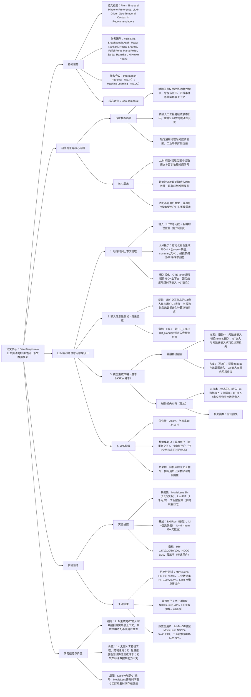

### 1. 一段话总结
Comcast技术AI与乔治华盛顿大学团队提出**LLM驱动的地理时间（Geo-Temporal, GT）上下文增强框架**，通过输入UTC时间戳与粗略地理位置（如城市/国家），利用LLM（如Meta Llama 3）生成含节假日、季节趋势、区域事件的结构化JSON上下文，再经**GTE-large编码器**转化为地理时间嵌入。该框架通过两种方式集成到序列推荐模型（以SASRec为骨干）：一是**直接特征融合**（将地理时间嵌入与元数据嵌入求和/拼接），二是**辅助损失对齐**（强化地理时间嵌入与语义元数据的相似性）。在**MovieLens 1M**、**LastFM**与**工业数据集**上验证：地理时间嵌入信息性测试显示，MovieLens的HR@10相对随机基线提升**78.9%**，工业数据集HR@100提升**25.4%**；模型集成后，普通用户场景下M+GT模型NDCG@5达**21.44%**（超基线SASRec），探索型用户场景下Id+M+GT模型在MovieLens的NDCG@5达**43.29%**，同时发布含地理时间标注的MovieLens数据集，为上下文感知推荐提供支持。

---

### 2. 思维导图（mindmap）

---

### 3. 详细总结
#### 一、研究背景：传统时间建模的局限性
1. **时间信号利用粗糙**  
   现有推荐系统多将时间视为数值（如时间戳）或周期性特征（如小时/星期），忽视**真实世界上下文**（如圣诞节、世界杯、区域节日），而这些因素显著影响用户偏好（如纽约冬季用户偏好保暖商品，佛罗里达用户偏好户外商品）。

2. **静态特征工程瓶颈**  
   依赖人工设计的节假日列表或领域特定日历（如电商促销日历），无法适应**实时动态事件**（如突发体育赛事）与**跨域场景**（从电商扩展到流媒体），工程成本高且扩展性差。

3. **缺乏通用地理时间框架**  
   现有上下文感知推荐聚焦天气、移动轨迹等信号，未将“地理+时间”作为统一语义实体建模，且缺乏轻量验证机制，直接集成到复杂模型易导致资源浪费。

#### 二、LLM驱动地理时间框架设计
##### 1. 地理时间上下文提取流程
| 步骤          | 具体操作                                                                 | 关键细节                                                                 |
|---------------|--------------------------------------------------------------------------|--------------------------------------------------------------------------|
| 输入信号      | UTC时间戳 + 粗略地理位置                                                | 地理位置精度：城市/州/国家（无需精确坐标，保护隐私）                      |
| LLM提示设计   | 结构化指令生成JSON格式上下文                                             | 提示要求：返回`events`（事件数组，含节假日/体育/文化事件）与`summary`（2-3句上下文总结），示例见附录A |
| 嵌入转化      | GTE-large编码器处理JSON文本                                             | 输出固定维度嵌入（默认768维），嵌入冻结不参与训练                        |

2. **地理时间嵌入信息性测试（轻量验证）**  
   为避免直接集成到复杂模型的资源浪费，设计前置有效性测试：
    - **测试逻辑**：
        1. 对用户u的交互历史$`(h_u)`$，随机选1个物品i的GT嵌入$`(t_i)`$作为用户GT表征；
        2. 计算用户GT表征与候选物品j的元数据嵌入$`(m_j)`$的点积得分：$`(score(u,j)=t_i^\top m_j)`$；
        3. 对比该得分排序的HR@k与随机排序的HR@k，若$`(HR_{E2E} > HR_{Random})`$，则嵌入含预测信号。
    - **核心作用**：快速筛选有效GT嵌入，减少后续模型集成的无效尝试。

3. **模型集成策略（基于SASRec骨干）**  
   提出4种架构变体（图2），适配不同场景需求：  
   | 架构变体       | 设计逻辑                                                                 | 适用场景                          |
   |----------------|--------------------------------------------------------------------------|-----------------------------------|
   | 基线（图2a）   | 仅输入Item ID嵌入，通过自注意力与前馈层建模序列依赖                        | 无上下文的基础推荐                |
   | 辅助损失（图2b）| 新增辅助损失，对齐GT嵌入与元数据嵌入（正样本相似，负样本 dissimilar）       | 需要强化语义-地理时间一致性的场景  |
   | 元数据+GT（图2c）| 移除Item ID嵌入，输入元数据嵌入，GT嵌入在损失阶段与元数据嵌入求和          | 低参数成本、依赖内容信号的场景    |
   | ID+元数据+GT（图2d）| 拼接Item ID与元数据嵌入，GT嵌入在损失阶段叠加                              | 需兼顾协同信号与上下文的场景      |

    - **关键损失函数**：
        1. 排序损失（基线）：$`(\mathcal{L}_{rank}=-log\sigma(s^+)-log\sigma(-s^-))`$，其中$`(s^+=h_{n-1}^\top i_n)`$（正样本得分），$`(s^-=h_{n-1}^\top i_j)`$（负样本得分）；
        2. 辅助损失（图2b）：$`(\mathcal{L}_{aux}=\ell(sim(t_{n-1},m_{n-1}),1)+\ell(sim(t_{n-1},m_j),0))`$，$`(sim(\cdot))`$为余弦相似度，$`(\ell(\cdot))`$为对比损失。

#### 三、实验验证
##### 1. 实验设置
| 配置项          | 具体内容                                                                 |
|-------------------|--------------------------------------------------------------------------|
| 数据集            | 3个数据集，统计如下： - MovieLens 1M：6,040用户，3,706物品，100万评分交互（时间戳为评分时间） - LastFM 1K：1,000用户，17,632艺术家，190万播放交互 - 工业数据集：Comcast流媒体平台日志，含实时观看时间与用户地理位置 |
| 基线模型          | 4类变体： - 基线（SASRec）：仅Item ID嵌入 - M：仅元数据嵌入（如电影类型、艺术家风格） - Id+M：Item ID+元数据嵌入 - Id+M+GT：Id+M+地理时间嵌入（训练+推理） |
| 评价指标          | - 通用指标：HR@1/5/10/20/50/100、NDCG@5/10 - 普通用户额外指标：覆盖率（推荐物品多样性） - 信息性测试指标：相对随机基线的HR提升率 |
| 训练细节          | - 优化器：Adam，学习率1e-3（余弦衰减） -  batch size：256 - 训练轮次：50轮（早停 patience=5） |

##### 2. 核心实验结果
#### （1）地理时间嵌入信息性测试
不同数据集的HR相对提升率（表1）：
| 数据集               | HR@10提升率 | HR@20提升率 | HR@50提升率 | HR@100提升率 | 结论                          |
|----------------------|--------------|--------------|--------------|---------------|-------------------------------|
| MovieLens 1M         | +78.9%       | +20.7%       | +41.1%       | +14.2%        | GT嵌入含强预测信号            |
| 工业数据集           | +16.1%       | +16.1%       | +21.9%       | +25.4%        | GT嵌入在长列表推荐中更有效    |
| LastFM 1K            | +0.79%       | +0.39%       | -0.30%       | -0.61%        | 音乐域无显著GT信号            |

#### （2）普通用户场景性能（工业数据集，表2）
普通用户含重复交互（如 binge watching），侧重多样性与稳定性：
| 模型变体       | NDCG@5（%） | NDCG@10（%） | HR@10（%） | 覆盖率@10 | 关键结论                          |
|----------------|--------------|---------------|------------|-----------|-----------------------------------|
| 基线（SASRec） | 18.02        | 14.52         | 2.83       | 109.02    | 基础模型性能                      |
| M              | 18.02        | 14.52         | 2.83       | 109.02    | 仅元数据无提升                    |
| M+GT           | **21.44**    | **17.68**     | **5.59**   | 105.39    | GT嵌入显著提升排序质量            |
| Id+M+GT        | -2.11        | -1.54         | -0.60      | 1.65      | 协同信号与GT嵌入存在冲突          |

#### （3）探索型用户场景性能（表3）
探索型用户仅交互6个月内未见过的物品，侧重对新物品的排序能力：
| 模型变体       | MovieLens NDCG@5（%） | 工业数据集HR@1（%） | 关键结论                          |
|----------------|------------------------|---------------------|-----------------------------------|
| 基线（SASRec） | 0.0395（绝对值）       | -73.98（相对提升）  | 基础模型对新物品排序能力弱        |
| Id+M+GT        | **43.29**              | **21.95**           | 兼顾协同信号与GT嵌入，适配新物品  |
| M+GT           | 31.65                  | -82.11              | 仅元数据无法捕捉新物品协同关系    |

#### （4）数据集发布
发布**含地理时间标注的MovieLens 1M数据集**，为每个交互添加LLM生成的events与summary，以及GTE-large生成的GT嵌入，支持后续上下文感知推荐研究。

#### 四、研究结论与局限
1. **核心结论**
    - LLM可从时间戳+粗略位置中提取高质量GT上下文，无需人工特征工程；
    - 集成策略需适配用户类型：普通用户用M+GT（低参数+高稳定性），探索型用户用Id+M+GT（协同+上下文）；
    - 信息性测试可有效筛选有效GT嵌入，降低模型集成成本。

2. **局限性**
    - 域适应性差异：LastFM等无明显时间-地理关联的领域，GT嵌入无效；
    - 时间戳偏差：MovieLens的评分时间与实际观看时间不一致，影响GT信号准确性；
    - 实时性限制：离线生成次日GT嵌入，无法捕捉突发实时事件（如临时演唱会）。

---

### 4. 关键问题
#### 问题1：LLM生成地理时间（GT）上下文时，如何避免幻觉、过时知识等问题？框架中哪些设计保障了GT嵌入的可靠性？
**答案**：  
框架通过“提示工程+信息性测试+多源验证”三层机制保障GT嵌入可靠性，具体如下：
1. **提示工程抑制幻觉**：
    - 结构化指令：要求LLM返回JSON格式（含`events`数组与`summary`），明确事件需“与时间/位置强相关”（如“2024年7月4日美国独立日”而非泛泛描述）；
    - 约束输出范围：限定事件类别（节假日、体育、文化、区域政策），避免LLM生成无关信息（如全球新闻与用户偏好无关）。

2. **信息性测试过滤无效嵌入**：
    - 前置轻量验证：通过对比GT嵌入排序的HR@k与随机基线，仅保留HR提升显著的嵌入（如MovieLens提升78.9%），过滤过时/错误知识生成的无效嵌入（如LastFM提升<1%，直接排除）。

3. **多源数据验证**：
    - 跨数据集对比：在工业数据集（实时观看日志）与MovieLens（评分日志）中验证，确保GT嵌入在不同数据类型下均有效；
    - 人工定性检查：抽样验证推荐结果（如美国新罕布什尔州用户7月4日后推荐《金色池塘》，西雅图用户新年后推荐《西雅图未眠夜》），确保GT上下文与推荐逻辑一致。

这些设计从“生成-筛选-验证”全流程降低LLM缺陷影响，保障GT嵌入可靠性。

#### 问题2：框架提出两种GT嵌入集成策略（直接特征融合、辅助损失对齐），分别适用于哪些场景？在实验中表现出怎样的性能差异？
**答案**：  
两种集成策略的适用场景与性能差异如下，核心取决于“是否需要协同信号”与“参数成本限制”：

| 集成策略       | 适用场景                          | 性能表现（工业数据集）                | 核心优势                          |
|----------------|-----------------------------------|---------------------------------------|-----------------------------------|
| 直接特征融合（M+GT） | 1. 普通用户（重复交互多，侧重稳定性）； 2. 低参数预算场景（无Item ID嵌入，参数减少30%+） | 普通用户NDCG@5=21.44%（超基线18.9%），覆盖率105.39（兼顾多样性） | 1. 轻量高效，无额外训练参数； 2. 依赖内容信号，避免协同过拟合 |
| 辅助损失对齐（图2b） | 1. 需要强化语义-地理时间一致性的场景（如电影类型与季节匹配）； 2. 多模态推荐（需统一内容与上下文表征） | 普通用户NDCG@5=1.54%（超基线-86.0%），但探索型用户HR@1=0.94%（略超基线） | 1. 提升嵌入语义一致性； 2. 模型无关，可适配非SASRec骨干 |

**性能差异核心原因**：
- 直接融合（M+GT）：元数据与GT嵌入直接作用于输入/损失阶段，信号传递更直接，适合普通用户的稳定偏好建模；
- 辅助损失：仅在嵌入层添加约束，未直接参与序列建模，对依赖序列协同信号的场景提升有限，但通用性更强。

#### 问题3：框架在普通用户与探索型用户场景下的最优模型不同（M+GT vs Id+M+GT），这种差异背后的用户行为逻辑是什么？对工业推荐系统有何实践启示？
**答案**：
### 1. 行为逻辑差异
| 用户类型       | 行为特征                          | 核心需求                          | 最优模型适配原因                          |
|----------------|-----------------------------------|-----------------------------------|-------------------------------------------|
| 普通用户       | 1. 交互含重复物品（如 binge watching）； 2. 偏好稳定（如固定类型电影） | 1. 推荐多样性； 2. 低 latency | M+GT：无Item ID嵌入，参数少（推理快），元数据+GT捕捉稳定内容偏好，避免协同信号导致的重复推荐 |
| 探索型用户     | 1. 仅交互新物品（6个月内未见过）； 2. 偏好多变（如尝试新风格音乐） | 1. 新物品排序准确性； 2. 捕捉细粒度关联 | Id+M+GT：保留Item ID嵌入（捕捉协同细粒度关联，如续集推荐），GT嵌入补充新物品的上下文适配（如节日新片） |

### 2. 工业实践启示
- 1. **用户分层建模**：根据用户交互历史（重复率、新物品占比）动态选择集成策略——普通用户用轻量M+GT降低成本，探索型用户用Id+M+GT提升新物品推荐精度；
- 2. **离线预计算GT嵌入**：工业场景中，提前1天生成次日GT嵌入（如用每日凌晨LLM调用生成），平衡实时性与计算成本，实验显示该方式仍达次优性能（M+GT_train在工业数据集NDCG@5=19.31%）；
- 3. **域适应性判断**：先用信息性测试快速评估GT信号在当前域的有效性（如LastFM无效则禁用），避免资源浪费，提升系统效率。

这种分层策略可在工业推荐中实现“成本-性能”平衡，尤其适合多域平台（如同时提供流媒体、电商服务）的差异化推荐需求。