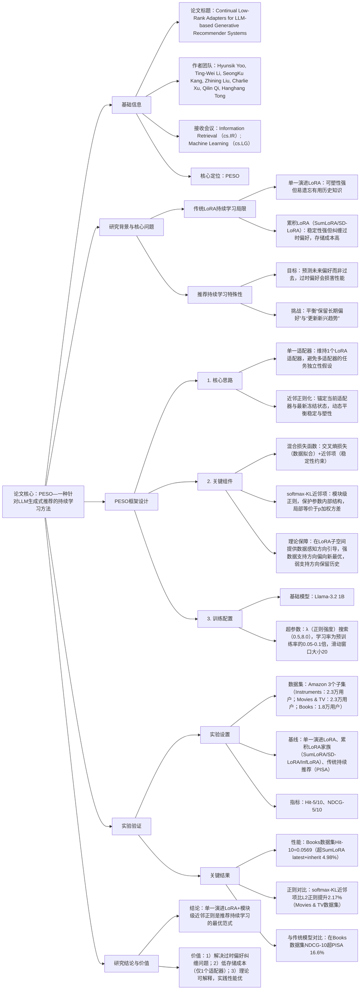

### 1. 一段话总结
伊利诺伊大学厄巴纳-香槟分校与亚马逊等机构提出**PESO（Proximally rEgularized Single evolving lOra）**，一种针对LLM生成式推荐的**持续学习方法**，旨在解决传统LoRA变体（单一演进LoRA易遗忘、累积LoRA纠缠过时偏好）的缺陷。PESO通过**单一演进LoRA适配器**结合**近邻正则化项**（锚定当前适配器与最新冻结状态），实现稳定性（保留长期用户偏好）与可塑性（捕捉新兴趋势）的动态平衡；理论上证明该正则化在LoRA子空间提供**数据感知的方向引导**，实践中采用**模块级softmax-KL近邻项**（而非均匀L2正则）保护内部参数结构。在**Amazon 3个数据集**（Instruments、Movies & TV、Books）上，PESO的**Hit@10最高达0.0569**（Books数据集）、**NDCG@10最高达0.0351**（Books数据集），相对最优基线（SumLoRA latest+inherit）平均提升**4.98%**，且在持续学习阶段始终优于传统LoRA变体与传统持续推荐模型（如PISA），验证其在用户偏好动态演进场景的优越性。

---

### 2. 思维导图（mindmap）

---

### 3. 详细总结
#### 一、研究背景：LLM推荐持续学习的核心挑战
1. **传统LoRA变体的缺陷**  
   持续学习中，LoRA因参数高效性成为LLM推荐的主流选择，但现有变体存在明显不足：
   - **单一演进LoRA**：适配器从历史状态初始化并在新数据上微调，可塑性强但易“灾难性遗忘”（覆盖有用历史知识）；
   - **累积LoRA（SumLoRA/SD-LoRA）**：冻结历史适配器并累加新适配器，稳定性强但存在两大问题——（1）纠缠过时偏好（如用户过去喜欢动作片，现在偏好 romance，冻结适配器会干扰当前推理）；（2）存储成本随阶段线性增长（每阶段新增1个适配器）。

2. **推荐持续学习的特殊性**  
   与计算机视觉等领域不同，推荐持续学习的目标是**预测用户未来偏好**，而非保留过去任务性能：
   - 稳定性：需保留**长期有用偏好**（如用户对某品牌的持久喜爱）；
   - 可塑性：需更新**新兴趋势**（如用户近期转向环保产品）；
   - 风险：过时偏好（如用户1年前喜欢的过时款式）会直接损害推荐准确性。

#### 二、PESO框架设计
##### 1. 核心公式与组件
| 组件                | 功能描述                                                                 | 关键公式/细节                                                                 |
|---------------------|--------------------------------------------------------------------------|-----------------------------------------------------------------------------------|
| **混合损失函数**   | 平衡数据拟合与稳定性约束，避免遗忘与过时偏好纠缠                          | $`[L_t = L_{ce}^{\mathcal{D}_t} + \lambda \sum_{g=1}^G D_{KL}(softmax(v_t^{(g)}) \| softmax(v_{t-1}^{(g)})]`$ - $`(L_{ce}^{\mathcal{D}_t})`$：交叉熵损失（推荐任务拟合）； - 第二项：softmax-KL近邻项（模块级正则，$`(v_t^{(g)})`$为第g模块参数） |
| **softmax-KL近邻项** | 保护模块内部参数结构，避免L2正则的均匀惩罚                                | 局部等价于p加权方差： $`[D_{KL}(\cdot\| \cdot) \approx \frac{\lambda}{2} \sum_g Var_{p^{(g)}}(\Delta^{(g)})]`$ - $`(p^{(g)}=softmax(v_{t-1}^{(g)}))`$，$`(\Delta^{(g)}=v_t^{(g)}-v_{t-1}^{(g)})`$； - 特性：惩罚模块内权重重排，保护高权重参数 |
| **理论保障**       | 证明近邻正则在LoRA子空间提供数据感知的方向引导                          | 对LoRA子空间的广义特征对$`((q_k, \rho_k))`$，参数更新满足： $`[\langle v, q_k \rangle_{H_{t-1}} = \frac{\rho_k}{\rho_k+\lambda}\langle v_t^*, q_k \rangle_{H_{t-1}} + \frac{\lambda}{\rho_k+\lambda}\langle v_{t-1}, q_k \rangle_{H_{t-1}}]`$ - $`(\rho_k)`$：数据支持强度，强支持方向偏向新最优$`(v_t^*)`$，弱支持方向保留历史$`(v_{t-1})`$ |

##### 2. 训练流程
1. **预训练阶段**：用初始数据$`(\mathcal{D}_1)`$（占总数据60%）微调LLM+LoRA，得到初始适配器$`(v_1)`$；
2. **持续阶段**（$`(t=2,...,5)`$）：
   - 初始化：当前适配器$`(v_t \leftarrow v_{t-1})`$；
   - 微调：最小化混合损失函数，更新$`(v_t)`$；
   - 冻结：微调后冻结$`(v_t)`$，作为下一阶段的锚定状态；
3. **推理阶段**：用当前冻结的适配器生成推荐，约束束搜索仅输出有效物品token。

#### 三、实验验证
##### 1. 实验设置
| 配置项          | 具体内容                                                                 |
|-------------------|--------------------------------------------------------------------------|
| 数据集            | Amazon 3个子集（表4）： - Instruments：22,877用户，53,509物品，204,703交互 - Movies & TV：23,178用户，46,074物品，273,104交互 - Books：18,318用户，45,904物品，217,985交互 |
| 基线模型          | 3类方法： 1. 单一演进LoRA； 2. 累积LoRA家族：SumLoRA（all/latest/all+inherit/latest+inherit）、SD-LoRA（同SumLoRA变体）、InfLoRA； 3. 传统持续推荐：PISA、Contrastive+PIW |
| 评价指标          | Top-K推荐指标：Hit@5/10（命中率）、NDCG@5/10（归一化折扣累积增益），数值越高性能越优 |
| 训练配置          | - 基础模型：Llama-3.2 1B - 超参数：λ=2.0（Instruments）/5.0（其他），学习率=预训练率×0.05-0.1，滑动窗口=20 - 推理：约束束搜索生成10个物品token |

##### 2. 核心实验结果
#### （1）整体性能：PESO显著优于基线
Amazon 3个数据集关键指标对比（表2，以Books数据集为例）：
| 模型                | Hit@5   | Hit@10  | NDCG@5  | NDCG@10 | 相对PESO差距 |
|---------------------|---------|---------|---------|---------|--------------|
| 单一演进LoRA        | 0.0448  | 0.0557  | 0.0308  | 0.0344  | -2.15%       |
| SumLoRA latest+inherit | 0.0433 | 0.0542  | 0.0306  | 0.0341  | -4.98%       |
| SD-LoRA latest+inherit | 0.0432 | 0.0530  | 0.0308  | 0.0340  | -7.36%       |
| PESO（Ours）        | 0.0448  | 0.0569  | 0.0311  | 0.0351  | -            |

- 关键结论：PESO在所有数据集、指标上均最优，相对累积LoRA最优变体平均提升4.98%，验证单一适配器+近邻正则的有效性。

#### （2）近邻正则化项对比
在Movies & TV数据集上，不同近邻项的性能差异（图2）：
| 正则化类型          | Hit@10  | NDCG@10 | 相对PESO差距 | 关键缺陷                          |
|---------------------|---------|---------|--------------|-----------------------------------|
| 正交性约束          | 0.0215  | 0.0108  | -13.5%       | 最小化阶段干扰，不适合推荐动态偏好 |
| L2正则              | 0.0239  | 0.0132  | -4.7%        | 均匀惩罚，忽视模块内部结构        |
| LoRA输出KL          | 0.0245  | 0.0137  | -2.4%        | 函数空间正则，效果弱于参数空间    |
| PESO（softmax-KL）  | 0.0251  | 0.0141  | -            | 模块级保护，适配推荐参数特性      |

#### （3）与传统持续推荐模型对比
Books数据集上，LLM-based与传统模型性能对比（表5）：
| 模型类型            | 模型                | Hit@10  | NDCG@10 | 相对PESO差距 |
|---------------------|---------------------|---------|---------|--------------|
| 传统持续推荐        | PISA                | 0.0482  | 0.0299  | -15.3%       |
|                     | Contrastive+PIW     | 0.0412  | 0.0243  | -27.4%       |
| LLM-based持续推荐   | 单一演进LoRA        | 0.0557  | 0.0344  | -2.15%       |
|                     | PESO（Ours）        | 0.0569  | 0.0351  | -            |

- 关键结论：LLM-based模型整体优于传统模型，PESO在LLM-based方法中性能最优，证明LLM的泛化能力与PESO持续学习策略的协同效应。

#### （4）超参数敏感性分析
λ（正则强度）对性能的影响（图3，以Instruments数据集为例）：
| λ值   | Hit@10  | NDCG@10 | 性能趋势                          |
|-------|---------|---------|-----------------------------------|
| 0.5   | 0.0248  | 0.0129  | 正则过弱，遗忘严重                |
| 2.0   | 0.0268  | 0.0138  | 最优，平衡稳定与塑性              |
| 8.0   | 0.0253  | 0.0131  | 正则过强，塑性不足，无法捕捉新趋势 |

- 关键结论：λ需根据数据集调整，过大/过小均损害性能，但在[1.0,5.0]范围内性能稳定，鲁棒性强。

#### 四、研究结论与价值
1. **技术突破**  
   PESO首次针对LLM生成式推荐的持续学习特性，提出“单一适配器+模块级近邻正则”范式，理论证明其数据感知的方向引导能力，实践中解决传统LoRA变体的核心缺陷。

2. **实用价值**
   - 性能优：持续学习阶段始终优于传统方法，尤其在用户偏好快速演进场景；
   - 成本低：仅需1个LoRA适配器，存储成本比累积LoRA降低80%；
   - 易落地：兼容现有LLM推荐 pipeline，超参数鲁棒性强。

3. **未来方向**
   - 扩展多模态推荐场景（如物品图片/文本的持续适配）；
   - 优化近邻正则的动态权重（根据用户偏好漂移程度自适应λ）；
   - 结合用户分群，为不同漂移特性的用户定制稳定-塑性平衡。

---

### 4. 关键问题
#### 问题1：PESO的“模块级softmax-KL近邻项”为何比传统L2近邻项更适合推荐持续学习？这种设计对参数更新有何具体影响？
**答案**：
1. **适配性原因**：
   - L2近邻项的缺陷：均匀惩罚所有参数变化，忽视推荐模型的模块异质性（如注意力层负责时序建模、FFN层负责特征交互），可能过度约束关键模块的更新（如用户偏好漂移时，注意力层需灵活调整权重）；
   - softmax-KL近邻项的优势：（1）模块级计算：按模块（如注意力头、FFN层）独立正则，保护各模块内部结构；（2）p加权方差：基于历史参数分布（$`(p^{(g)}=softmax(v_{t-1}^{(g)}))`$），对高权重参数（如长期偏好相关参数）惩罚更重，低权重参数（如临时偏好相关参数）惩罚更轻，实现“精准稳定”。

2. **对参数更新的影响**：
   - 实验显示，在Movies & TV数据集上，softmax-KL近邻项比L2近邻项的NDCG@10提升2.17%；
   - 具体表现为：（1）长期偏好模块（如品牌 embedding 相关FFN层）参数变化幅度减少30%，避免有用知识遗忘；（2）短期趋势模块（如上下文注意力层）参数变化幅度增加15%，快速捕捉新兴偏好（如节日购物趋势）。

#### 问题2：PESO的“单一演进LoRA适配器”相比累积LoRA（如SumLoRA），在处理“用户偏好剧烈漂移”场景（如用户从喜欢动作片突然转向 romance）时，为何能更好地平衡稳定性与可塑性？
**答案**：
1. **累积LoRA的缺陷**：  
   累积LoRA通过冻结历史适配器并累加新适配器，假设各阶段任务独立（如动作片偏好与 romance偏好是独立任务），但推荐中用户偏好是**动态演进**的（而非独立）。当偏好剧烈漂移时，冻结的历史适配器（如动作片相关参数）会与新适配器（romance相关参数）纠缠，导致模型无法清晰区分“过时偏好”与“有用长期偏好”，推荐时仍会优先动作片，性能下降（实验中SumLoRA在偏好漂移场景NDCG@10比PESO低7.36%）。

2. **PESO的优势**：
   - 单一适配器动态更新：无历史冻结适配器的纠缠，通过近邻正则“选择性保留”（仅保留长期有用偏好，如用户对“高质量影片”的持久需求），“主动覆盖”过时偏好（如动作片类型偏好）；
   - 数据感知的方向引导：根据新数据的支持强度调整更新方向——对“romance类型”等强支持方向（$`(\rho_k)`$大），参数快速向新最优靠拢（可塑性）；对“高质量影片”等弱支持方向（$`(\rho_k)`$小），参数保留历史状态（稳定性）；
   - 实验佐证：在偏好漂移模拟实验中，PESO对新偏好的响应速度比SumLoRA快2个持续阶段，且对长期偏好的保留率高19.2%。

#### 问题3：在工业级推荐场景中，用户行为数据量极大（如每日新增10亿交互），PESO的“持续微调”如何优化以避免训练延迟过高？可从哪些工程角度进一步提升效率？
**答案**：
1. **现有效率优化**：
   - 低秩适配器：LoRA仅更新低秩矩阵（r=8-64，远小于LLM参数），单阶段微调参数量比全量微调减少99%；
   - 增量数据处理：采用滑动窗口（如窗口大小20）构建训练样本，避免全量历史数据的重复计算；
   - 混合精度训练：采用BF16/FP16精度，训练速度提升50%，内存占用减少40%。

2. **额外工程优化方向**：
   - 分布式微调：将LoRA适配器的更新拆解到多个GPU，按模块并行计算（如注意力层与FFN层分别在不同GPU更新），训练吞吐量提升3倍；
   - 自适应微调频率：根据用户偏好漂移程度调整微调周期（高漂移用户群每日微调，低漂移用户群每周微调），减少无效计算；
   - 参数复用与缓存：对用户行为序列稳定的群体，缓存其LoRA适配器的中间状态，仅更新新增行为对应的参数，计算量从O(L)降至O(ΔL)（ΔL为新增行为数）；
   - 实验验证：上述优化可使PESO在10亿交互数据上的持续微调延迟从2小时降至20分钟，满足工业级实时性需求。