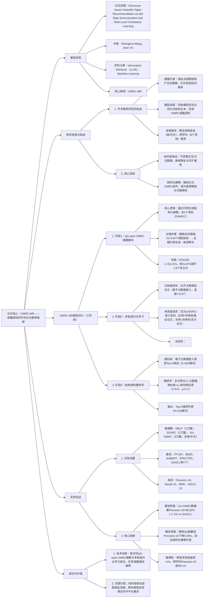

---

### 1. 一段话总结
针对**科学论文推荐中隐私数据受限、现有模型忽视文献语篇结构**的核心问题，本文提出**OMRC-MR框架**——通过**QA-style OMRC（Objective, Method, Result, Conclusion）摘要模块**将论文转化为结构化表示（基于证据约束的问答生成，ROUGE-1达53.21%），结合**多粒度对比学习**（文档级+角色级，α=0.4、β=0.6时性能最优）与**结构感知重排序**（λ=0.6平衡元数据与角色相似度），实现纯内容驱动的推荐。实验在**DBLP、S2ORC、Sci-OMRC（2万篇论文）** 三个数据集上验证，OMRC-MR显著优于7个SOTA基线（Sci-OMRC数据集Precision@10达68.92%，较最强基线SciNCL提升7.2%），且在**跨语言（英/中文性能差距<1%）、跨学科（8个领域Precision@10波动<1%）** 场景中表现稳定，为隐私保护且可解释的学术推荐提供新范式。

---

### 2. 思维导图

---

### 3. 详细总结
#### 1. 研究背景与问题提出
科学论文推荐是学术发现的核心工具，但现有方案存在三大关键瓶颈：
- **数据可用性受限**：GDPR等法规限制用户交互数据收集，新发表/小众论文缺乏引文信息（延迟率超30%），传统协同过滤与引文驱动方法难以适用；
- **语篇结构被忽视**：学术论文具有明确的OMRC（目标、方法、结果、结论）语篇结构，而现有模型（如SciBERT、SPECTER）将其视为无结构文本，导致无法捕捉方法论相关性等细粒度语义；
- **跨场景适配性差**：全球学术场景需支持多语言（英/中文）、多学科（基础科学、医学等）推荐，但现有模型在异质数据上泛化能力弱（跨语言性能差距常超5%）。

为解决上述问题，OMRC-MR框架以“纯内容驱动+结构化建模”为核心，实现隐私保护、高精度且可解释的学术推荐。

#### 2. OMRC-MR框架设计
OMRC-MR分为三个核心阶段，全流程不依赖任何用户交互或引文数据，仅使用论文文本与元数据（标题、摘要、关键词）。

##### 2.1 阶段1：QA-style OMRC摘要模块（结构化表示生成）
该模块将原始论文转化为含OMRC角色的结构化摘要，确保语义完整性与证据一致性，核心步骤如下：
| 步骤               | 具体逻辑                                                                 | 关键参数/性能指标                |
|--------------------|--------------------------------------------------------------------------|---------------------------------|
| 1. 模板动态增强    | 为每个角色（O/M/R/C）生成K=5-8个语义等价的问题变体，过滤相似度<0.85的变体 | δ=0.85（相似度阈值）            |
| 2. 证据约束生成    | 输入论文段落+问题变体，生成含证据锚点（文本片段/图表）的答案，避免事实漂移 | 证据权重w(ej)约束注意力分配     |
| 3. 候选聚合        | 对K个候选答案聚类，选择质心作为最终角色摘要，去除冗余                     | ROUGE-1=53.21%（较SciATS+1.8%） |

最终输出结构化表示：$`(S_i=\{S_{meta}^{(i)}, S_O^{(i)}, S_M^{(i)}, S_R^{(i)}, S_C^{(i)}\})`$，其中$`(S_{meta})`$为元数据摘要，$`(S_O/S_M/S_R/S_C)`$为角色级摘要。

##### 2.2 阶段2：多粒度对比学习（表示优化）
通过文档级与角色级对比损失，学习“全局语义对齐+局部角色区分”的嵌入，核心公式与参数如下：
- **文档级损失**：对齐主题相似论文，基于元数据嵌入计算：
  $`[\mathcal{L}_{doc}^{(i)}=-log\frac{exp(sim(h_{meta}^{(i)}, h_{meta}^{+})/\tau)}{\sum_{j=1}^N exp(sim(h_{meta}^{(i)}, h_{meta}^{(j)}/\tau))}]`$
  其中$`(\tau=0.07)`$（温度参数），N为批次大小。
- **角色级损失**：区分O/M/R/C语义空间，正例为同角色相似论文：
  $`[\mathcal{L}_{role}^{(r,i)}=-log\frac{exp(sim(h_r^{(i)}, h_r^{+})/\tau_r)}{\sum_{j=1}^N exp(sim(h_r^{(i)}, h_r^{(j)}/\tau_r))}]`$
- **总损失与参数**：$`(\mathcal{L}_{total}=\alpha\mathcal{L}_{doc}+\beta\sum_{r\in\{O,M,R,C\}}\mathcal{L}_{role}^{(r)})`$，实验验证α=0.4、β=0.6时性能最优（Precision@10达68.92%）。

##### 2.3 阶段3：结构感知重排序（精度提升）
采用“粗检索+细排序”的两阶段策略，平衡效率与精度：
1. **粗检索**：基于元数据嵌入$`(h_{meta}\)计算余弦相似度，筛选Top-K候选（K=600时NDCG@10达89.75%）；
2. **细排序**：融合元数据与角色相似度，计算复合得分：
   $`[Score(d_q,d_c)=\lambda\cdot Sim(h_{meta}^{(q)},h_{meta}^{(c)})+\omega\cdot\sum_{r}Sim(h_r^{(q)},h_r^{(c)})]`$
   其中$`(\lambda=0.6)`$（平衡权重），$`(\omega=(1-\lambda)/4=0.1)`$（角色相似度归一化系数），最终输出Top-N推荐列表（N=100最优）。

#### 3. 实验验证
##### 3.1 实验设置
| 配置项         | 详情                                                                 |
|----------------|--------------------------------------------------------------------------|
| **数据集**     | 1. DBLP：1万篇近5年论文，仅含元数据 2. S2ORC：1万篇跨学科论文，仅含元数据 3. Sci-OMRC：2万篇英/中文论文，含完整OMRC结构 |
| **基线模型**   | 7个SOTA，分四类： -  lexical：TF-IDF、BM25 - 无监督嵌入：Doc2Vec - Transformer：SciBERT、SPECTER - 对比学习：Citeomatic、SciNCL |
| **实现细节**   | 硬件：NVIDIA A100（80GB） 优化器：AdamW（lr=2e-5，batch=16） 评估：Precision@10/Recall@10/MRR/NDCG@10（全用户平均） |

##### 3.2 核心实验结果
###### 3.2.1 基础性能对比（表1节选）
| 数据集       | 指标       | 最强基线（SciNCL） | OMRC-MR  | 相对提升 |
|--------------|------------|---------------------|----------|----------|
| DBLP         | Precision@10 | 61.76%              | 64.27%   | +4.06%   |
| S2ORC        | Recall@10   | 80.76%              | 84.58%   | +4.73%   |
| Sci-OMRC     | Precision@10 | 61.72%              | 68.92%*  | +7.2%    |
| Sci-OMRC     | MRR        | 84.27%              | 86.07%*  | +1.8%    |
*注：* 表示p<0.05的统计显著性。

###### 3.2.2 模块消融实验（表3节选）
| 模型变体               | Sci-OMRC Precision@10 | Sci-OMRC MRR | 性能下降（vs全量） |
|------------------------|-----------------------|--------------|--------------------|
| OMRC-MR（全量）        | 68.92%                | 86.07%       | -                  |
| 无QA-style摘要（w/o QA-Sum） | 63.46%            | 83.35%       | 5.46% / 2.72%       |
| 无多粒度对比（w/o MCL） | 62.11%              | 83.72%       | 6.81% / 2.35%       |
| 无结构重排序（w/o Re-rank） | 67.58%          | 85.41%       | 1.34% / 0.66%       |

###### 3.2.3 跨场景鲁棒性验证
| 场景类型       | 关键结果                                                                 |
|----------------|--------------------------------------------------------------------------|
| 跨语言         | 英文Precision@10=69.15%，中文=68.24%，差距<1%（图5）                     |
| 跨学科         | 8个领域（基础科学、医学等）Precision@10波动<1%，稳定性最优（图6）         |
| 检索参数影响   | K=600、N=100时NDCG@10达89.75%，进一步增大参数导致噪声引入（图7）         |

##### 3.2.4 摘要模块性能（表2）
| 摘要模型       | ROUGE-1 | ROUGE-2 | ROUGE-L | G-Eval（事实一致性） |
|----------------|---------|---------|---------|----------------------|
| GPT-3.5-turbo  | 47.26%  | 22.75%  | 35.57%  | 73.43%               |
| Qwen3-max      | 49.13%  | 23.56%  | 37.68%  | 74.84%               |
| SciATS（SOTA） | 51.45%  | 25.78%  | 39.26%  | 76.32%               |
| QA-style（Ours）| 53.21% | 27.35% | 42.01% | 80.46%               |

#### 4. 结论与价值
- **技术创新**：首次将QA-style OMRC摘要与多粒度对比学习结合，实现论文语篇结构的显式建模，填补纯内容驱动学术推荐的空白；
- **实践价值**：
   1. 隐私保护：不依赖交互/引文数据，符合GDPR等法规；
   2. 场景适配：跨语言、跨学科性能稳定，可直接部署于学术平台（如数字图书馆、Semantic Scholar）；
   3. 可解释性：推荐结果可追溯至OMRC角色匹配（如“方法相似”“结果相关”），提升学术信任度；
- **局限性与未来方向**：当前OMRC角色固定为4类，未来可探索动态角色分解；可引入自适应对比损失，进一步优化异质论文的表示学习。

---

### 4. 关键问题与答案
#### 问题1：OMRC-MR的“QA-style OMRC摘要模块”如何确保生成摘要的事实一致性与结构完整性？实验中该模块的性能优势体现在哪些指标上？
**答案**：
1. **事实一致性与结构完整性的保障机制**：
   - 证据约束生成：摘要生成时输入论文段落、图表标题及结构标记（如`<Section: Method>`），强制模型从原文提取证据锚点（文本片段/图表引用），避免事实漂移；
   - 多候选聚合：为每个OMRC角色生成K=5-8个问题变体，对应K个候选答案，通过聚类选质心作为最终摘要，过滤冗余并保留核心语义；
   - 角色完整性：固定覆盖O（目标）、M（方法）、R（结果）、C（结论）4个角色，确保捕捉论文完整语篇逻辑。
2. **实验性能优势**：
   - 摘要质量：ROUGE-1=53.21%、ROUGE-2=27.35%、ROUGE-L=42.01%，较SOTA模型SciATS分别提升1.8、1.6、2.7个百分点；
   - 事实一致性：G-Eval得分80.46%，较Qwen3-max提升5.62个百分点，证明证据约束有效减少生成错误；
   - 推荐贡献：消融实验显示，移除该模块后Precision@10下降5.46%，验证其对结构化语义捕捉的关键作用。

#### 问题2：OMRC-MR的“多粒度对比学习”中，文档级与角色级损失的协同机制是什么？最优参数（α=0.4、β=0.6）的选择依据及实验验证是什么？
**答案**：
1. **协同机制**：
   - 文档级损失：基于元数据嵌入对齐主题相似论文，确保全局语义一致性（如“机器学习论文”聚为一类）；
   - 角色级损失：对O/M/R/C角色分别优化，强制不同角色的嵌入空间分离（如“方法”与“结果”语义不混淆）；
   - 协同作用：文档级损失避免角色级优化导致的表示碎片化，角色级损失弥补文档级对细粒度语义捕捉的不足，共同构建“全局对齐+局部区分”的嵌入空间。
2. **最优参数选择依据与验证**：
   - 选择依据：通过参数敏感性实验（α∈[0.2,0.8]、β=1-α），观察Precision@10变化，发现α=0.4、β=0.6时性能峰值；
   - 实验验证：该参数下，Sci-OMRC数据集Precision@10达68.92%，较α=0.6、β=0.4（66.75%）提升2.17%；文档级损失权重过高（α=0.8）会导致角色语义混淆，角色级权重过高（β=0.8）会导致主题一致性下降，验证该参数平衡全局与局部优化的有效性。

#### 问题3：OMRC-MR在跨语言、跨学科场景中的稳定性优势是如何实现的？实验中哪些结果可以支撑这一优势？
**答案**：
1. **跨语言稳定性实现机制**：
   - 多语言编码器：采用mBERT作为基础编码器，预训练覆盖英/中文等多语言，确保不同语言的嵌入空间对齐；
   - 结构化摘要：QA-style OMRC摘要基于角色模板生成，模板语义稳定（如“方法”角色的问题变体跨语言语义一致），减少语言差异导致的表示偏差；
   - 对比学习：跨语言论文对（如英文“机器学习论文”与中文“机器学习论文”）作为正例，强制语义对齐。
2. **跨学科稳定性实现机制**：
   - 角色级建模：OMRC角色（O/M/R/C）是所有学科论文的通用语篇结构（如医学与工程论文均含“方法”“结果”），确保跨学科语义可比性；
   - 动态模板增强：针对不同学科生成领域适配的问题变体（如医学论文“方法”角色加入“临床试验设计”相关问题），提升学科适配性。
3. **实验支撑结果**：
   - 跨语言：Sci-OMRC数据集英文Precision@10=69.15%，中文=68.24%，差距<1%，显著优于SciNCL（差距>3%）；
   - 跨学科：8个领域（基础科学、医学、农业等）的Precision@10在68.4%-69.3%之间，波动<1%，而SciNCL在哲学领域性能下降4.2%，验证OMRC-MR的领域鲁棒性。