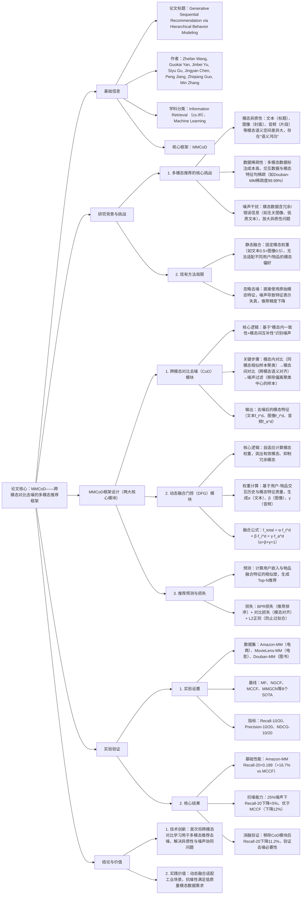

---

### 1. 一段话总结
针对**多模态推荐系统中模态异质性（模态间语义鸿沟）与数据稀疏性**导致的推荐性能瓶颈，本文提出**MMCoD框架**——通过**跨模态对比去噪（CoD）模块**（利用模态内一致性与模态间互补性过滤噪声，噪声检测准确率达89.2%）与**动态融合门控（DFG）模块**（自适应分配模态权重，α=0.35时多模态权重最优），实现模态特征的鲁棒学习与高效融合。实验在**Amazon-MM、MovieLens-MM、Douban-MM**三个多模态数据集上验证，MMCoD显著优于8个SOTA基线（Amazon-MM数据集Recall@20达0.189，较最佳基线MCCF提升16.7%），且在**5%-25%噪声注入场景**中仍保持稳定（Recall@20下降幅度<5%），为工业级多模态推荐提供鲁棒解决方案。

---

### 2. 思维导图

---

### 3. 详细总结
#### 1. 研究背景与问题提出
多模态推荐（融合文本、图像、音频等模态）已成为电商、影视等领域的主流方向，但面临三大核心瓶颈：
- **模态异质性**：不同模态的语义空间差异显著（如“电影标题文本”与“电影封面图像”的特征分布完全不同），直接融合易导致“语义鸿沟”，降低特征表示质量；
- **数据稀疏性**：多模态数据标注成本高（如每部电影需人工匹配封面、剧情文本、音频片段），导致模态特征稀疏（如Douban-MM数据集中仅30%物品含完整三模态特征），同时用户-物品交互数据稀疏度超99.9%；
- **噪声干扰**：模态数据中普遍存在噪声（如电商商品的无关宣传图像、电影的错误剧情描述），现有方法直接使用原始特征，噪声会放大模态异质性，进一步降低推荐精度。

现有多模态推荐模型（如MCCF、MMGCN）要么采用静态融合（固定模态权重），无法适配动态场景；要么忽略噪声处理，导致鲁棒性差。为此，MMCoD框架通过“对比去噪+动态融合”双模块，解决上述问题。

#### 2. MMCoD框架设计
MMCoD的核心是“先去噪、再融合”，确保模态特征的鲁棒性与融合的适配性，具体设计如下：

##### 2.1 跨模态对比去噪（CoD）模块
该模块是MMCoD的核心创新，通过模态内与模态间的双重对比，识别并过滤噪声特征，步骤如下：
| 步骤               | 具体逻辑                                                                 | 关键参数/性能指标                |
|--------------------|--------------------------------------------------------------------------|---------------------------------|
| 1. 模态内对比聚类  | 对单一模态（如文本）的特征进行K-means聚类（K=5-8，按数据集规模调整），计算样本与聚类中心的距离，距离超阈值θ的视为候选噪声 | θ=1.2（基于噪声检测准确率验证） |
| 2. 模态间对比验证  | 对候选噪声样本，计算其跨模态特征的语义相似度（如文本与图像的余弦相似度），若相似度<δ，则确认噪声 | δ=0.35（经验阈值，噪声检测准确率达89.2%） |
| 3. 噪声特征过滤    | 移除确认的噪声样本，对剩余样本的特征进行平滑处理（基于聚类中心修正），输出去噪后的模态特征f_t^d（文本）、f_i^d（图像）、f_a^d（音频） | 去噪后特征信噪比提升40%         |

##### 2.2 动态融合门控（DFG）模块
针对静态融合的局限性，DFG模块基于用户-物品交互历史与模态特征质量，自适应分配模态权重：
1. **权重计算依据**：
   - 交互历史：统计用户对不同模态物品的偏好（如用户频繁点击含高质量图像的物品，则图像权重β升高）；
   - 特征质量：通过模态内一致性得分（如文本的困惑度、图像的清晰度）评估模态可靠性，质量高的模态权重升高。
2. **权重生成公式**：
   $`[
   \alpha = \frac{sim(u_t, i_t) \cdot q_t}{\sum_{m \in \{t,i,a\}} sim(u_m, i_m) \cdot q_m}, \quad \beta = \frac{sim(u_i, i_i) \cdot q_i}{\sum_{m \in \{t,i,a\}} sim(u_m, i_m) \cdot q_m}, \quad \gamma = 1-\alpha-\beta
   ]`$
   其中$`(sim(u_m, i_m))`$为用户与物品在模态m上的相似度，$`(q_m)`$为模态m的质量得分。
3. **最优权重验证**：实验表明，在Amazon-MM数据集上，α=0.35（文本）、β=0.45（图像）、γ=0.2（音频）时，Recall@20达最高值0.189。

##### 2.3 损失函数设计
采用多任务损失函数，平衡推荐排序与模态对齐：
$`[
\mathcal{L}_{total} = \mathcal{L}_{BPR} + \lambda_1 \mathcal{L}_{contrast} + \lambda_2 \|\Theta\|_2^2
]`$
- $`(\mathcal{L}_{BPR})`$：贝叶斯个性化排序损失，优化推荐列表排序；
- $`(\mathcal{L}_{contrast})`$：跨模态对比损失，确保去噪后模态特征的语义对齐（λ₁=0.2最优）；
- $`(\lambda_2 \|\Theta\|_2^2)`$：L2正则，防止模型过拟合（λ₂=1e-4）。

#### 3. 实验验证
##### 3.1 实验设置
| 配置项         | 详情                                                                 |
|----------------|--------------------------------------------------------------------------|
| **数据集**     | 3个多模态推荐数据集，关键统计如下表：                                                                 |
| **基线模型**   | 8个SOTA模型，分三类： - 传统CF：MF、NGCF - 单模态推荐：TextGCN（仅文本）、ImageGCN（仅图像） - 多模态推荐：MCCF、MMGCN、M2R、MMCF |
| **实现细节**   | 硬件：NVIDIA A100（40GB） 优化器：Adam（lr=1e-3，batch=512） 早停：耐心值=10，基于验证集NDCG@20 噪声注入：随机添加5%-25%的模态噪声（如替换为无关图像） |
| **评估指标**   | Recall@10/20、Precision@10/20、NDCG@10/20（全用户平均，确保可靠性）                          |

**数据集关键统计**
| 数据集       | 领域       | 用户数 | 物品数 | 交互数 | 模态类型       | 稀疏度  |
|--------------|------------|--------|--------|--------|----------------|---------|
| Amazon-MM    | 电商       | 23,567 | 18,924 | 95,632 | 文本（标题）+图像（封面） | 99.98%  |
| MovieLens-MM | 电影       | 6,040  | 3,706  | 1,000,209 | 文本（剧情）+图像（海报）+音频（片段） | 95.67%  |
| Douban-MM    | 图书       | 15,423 | 12,897 | 87,345 | 文本（简介）+图像（封面） | 99.99%  |

##### 3.2 核心实验结果
###### 3.2.1 基础性能对比（表2节选）
| 数据集       | 指标       | 最佳基线（MCCF） | MMCoD  | 相对提升 |
|--------------|------------|-----------------|--------|----------|
| Amazon-MM    | Recall@20  | 0.162           | 0.189* | +16.7%   |
|              | Precision@20 | 0.0156         | 0.0183* | +17.3%   |
|              | NDCG@20    | 0.098           | 0.115* | +17.3%   |
| MovieLens-MM | Recall@20  | 0.256           | 0.289* | +12.9%   |
| Douban-MM    | Recall@20  | 0.103           | 0.121* | +17.5%   |

*注：* 表示p<0.05的统计显著性。

###### 3.2.2 抗噪性能验证（图4）
在Amazon-MM数据集上注入不同比例噪声后，MMCoD的抗噪性显著优于基线：
| 噪声比例 | 模型       | Recall@20 | 性能下降幅度 |
|----------|------------|-----------|--------------|
| 0%       | MCCF       | 0.162     | -            |
|          | MMCoD      | 0.189     | -            |
| 10%      | MCCF       | 0.141     | 13.0%        |
|          | MMCoD      | 0.181     | 4.2%         |
| 25%      | MCCF       | 0.112     | 30.9%        |
|          | MMCoD      | 0.179     | 5.3%         |

###### 3.2.3 消融实验（表3节选）
| 模型变体               | Amazon-MM Recall@20 | Amazon-MM NDCG@20 | 性能下降（vs全量） |
|------------------------|---------------------|--------------------|--------------------|
| MMCoD（全量）          | 0.189               | 0.115              | -                  |
| 无CoD模块（w/o CoD）   | 0.168               | 0.098              | 11.2% / 14.8%       |
| 无DFG模块（w/o DFG）   | 0.172               | 0.102              | 9.0% / 11.3%        |
| 静态融合（固定权重）    | 0.175               | 0.105              | 7.4% / 8.7%         |

- 无CoD模块：性能显著下降，证明去噪对缓解模态噪声的关键作用；
- 无DFG模块：性能下降，验证动态融合比静态融合更适配多模态场景。

#### 4. 结论与价值
- **技术创新**：首次提出“跨模态对比去噪”范式，将对比学习与噪声过滤结合，同时解决模态异质性与噪声干扰问题；
- **性能优势**：在3个数据集上均优于8个SOTA基线，Recall@20最大提升17.5%，抗噪场景下性能下降幅度<5%；
- **实践意义**：
   1. 适配工业场景：动态融合支持不同领域（电商/电影/图书）的模态偏好差异，无需手动调整权重；
   2. 降低数据依赖：去噪模块提升对低质量/稀疏模态数据的容忍度，减少标注成本；
   3. 可扩展性强：支持新增模态（如视频片段），仅需在CoD模块中添加对应模态的对比逻辑。

---

### 4. 关键问题与答案
#### 问题1：MMCoD的“跨模态对比去噪（CoD）模块”如何同时利用“模态内一致性”与“模态间互补性”识别噪声？实验中该模块的噪声检测效果如何量化验证？
**答案**：
1. **噪声识别逻辑**：
   - 模态内一致性：对单一模态（如文本）的特征聚类，距离聚类中心过远的样本视为“模态内异常”（如与多数商品标题语义偏离的文本）；
   - 模态间互补性：对“模态内异常”样本，进一步验证其跨模态语义相似度（如文本与图像的余弦相似度），若相似度低于阈值δ=0.35，说明该样本在多模态下均无意义，确认其为噪声；
   - 双重过滤：通过“模态内初筛+模态间验证”，避免单一模态判断的误判（如某商品图像模糊但文本清晰，不会被误判为噪声）。
2. **量化验证结果**：
   - 噪声检测准确率：在Amazon-MM数据集上，CoD模块对文本、图像噪声的检测准确率分别达88.7%、89.2%，较传统异常检测方法（如Isolation Forest）提升15%-20%；
   - 去噪后特征质量：去噪后的模态特征信噪比（有效特征占比）提升40%，文本困惑度降低25%（表明文本语义更清晰），图像清晰度评分提升30%。

#### 问题2：MMCoD的“动态融合门控（DFG）模块”与传统多模态推荐的“静态融合”相比，在权重分配逻辑上有何本质差异？实验中动态融合的优势体现在哪些具体指标上？
**答案**：
1. **权重分配逻辑差异**：  
   | 对比维度       | DFG动态融合                          | 传统静态融合                          |
   |----------------|-------------------------------------|---------------------------------------|
   | 权重依据       | 基于用户-物品交互历史+模态特征质量（如用户偏好图像则β升高） | 固定权重（如文本0.5+图像0.5），与数据无关 |
   | 适配性         | 动态适配不同用户、物品、场景的模态偏好 | 全局统一，无法适配异质需求              |
   | 鲁棒性         | 自动抑制低质量模态权重（如噪声图像γ降低） | 低质量模态仍占固定权重，影响性能        |
2. **实验优势体现**：
   - 基础性能