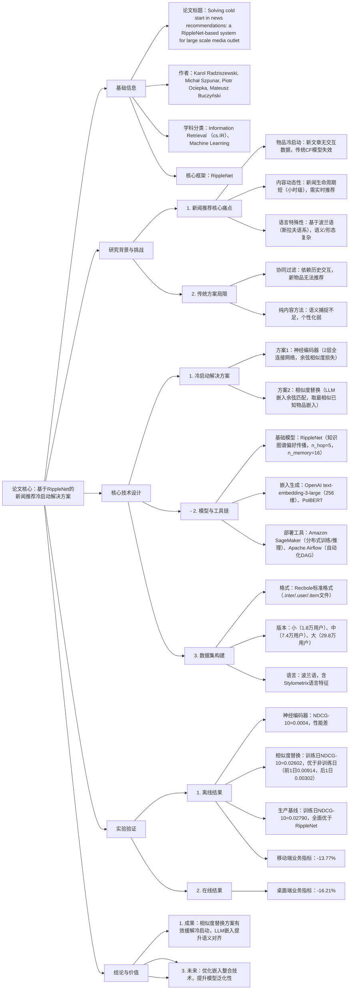

---

### 1. 一段话总结
为解决新闻推荐中**新物品冷启动**（无交互数据导致无法推荐）问题，波兰Onet.pl平台提出基于**RippleNet**的增强框架，核心通过**LLM生成语义嵌入**（如OpenAI embedding、PolBERT）与RippleNet实体嵌入对齐，设计两种冷启动方案——**神经编码器**（训练网络预测RippleNet嵌入，余弦相似度损失优化）与**相似度替换**（用LLM嵌入最相似已知物品的RippleNet嵌入），并基于**Amazon SageMaker**（分布式训练/推理）和**Apache Airflow**（自动化流水线）实现部署。实验基于真实波兰语新闻数据集（含小/中/大三个版本，最大版本训练集含29.8万用户、790万正交互）验证，**相似度替换方案**性能更优（训练日NDCG@10=0.02602），但整体仍低于生产基线（训练日NDCG@10=0.02790），且在线测试显示移动端/桌面端业务指标分别下降13.77%/16.21%，证明该框架能缓解冷启动但尚未达生产级性能，未来需优化嵌入整合技术。

---

### 2. 思维导图

---

### 3. 详细总结
#### 1. 研究背景与核心问题
新闻推荐领域因内容动态性强（新文章实时发布、生命周期短），面临**物品冷启动**这一核心挑战——新文章无用户交互数据，传统协同过滤（CF）模型无法生成推荐。此外，该研究基于波兰语新闻平台Onet.pl，需解决**斯拉夫语系特殊性**（语义复杂、形态多变）导致的内容理解难题，进一步增加推荐难度。

#### 2. 相关工作与理论基础
##### 2.1 冷启动问题解决方案
| 方案类型       | 核心逻辑                                                                 | 局限                                  |
|----------------|--------------------------------------------------------------------------|---------------------------------------|
| 内容驱动       | 基于物品属性（标题、分类）推荐，无需交互数据                              | 语义捕捉弱，个性化程度低              |
| 知识图谱驱动   | 利用物品在KG中的关联（如作者、主题）推荐                                  | 依赖KG完整性，新物品KG信息可能缺失    |
| 探索-利用权衡  | 用Bandit算法随机推荐新物品以收集反馈                                      | 初期推荐精度低，用户体验差            |
| RippleNet框架  | 基于KG传播用户偏好（“涟漪效应”），激活多跳实体捕捉深层关联                | 无法处理训练期不存在的新物品          |

##### 2.2 RippleNet核心原理
- **偏好传播机制**：以用户历史交互物品为起点，在KG中激活1跳（直接关联实体）、2跳（1跳实体的关联实体）...H跳实体，形成“涟漪集”；
- **推荐逻辑**：计算候选物品与用户涟漪集的交集强度，评估偏好得分；
- **冷启动缺陷**：仅能处理训练期已存在的实体，新物品无KG嵌入无法推荐。

#### 3. 数据与实验设置
##### 3.1 数据集详情（RASP推荐数据集）
| 数据集版本 | 数据划分 | 用户数  | 物品数  | 正交互数（点击） | 负交互数（仅曝光） | 时间范围                |
|------------|----------|---------|---------|------------------|--------------------|-------------------------|
| 小（Small） | 训练     | 18,727  | 20,794  | 498,973          | 4,823,570          | 2025.03.12-2025.04.14  |
|            | 验证     | 8,033   | 3,653   | 62,496           | 655,422            | 测试前3天               |
|            | 测试     | 7,560   | 2,845   | 52,160           | 456,302            | 最后3天                 |
| 中（Medium）| 训练     | 74,743  | 20,800  | 1,975,109         | 18,814,474         | 同上                    |
|            | 验证     | 32,393  | 3,653   | 247,652          | 2,616,881          | 同上                    |
|            | 测试     | 29,941  | 2,846   | 208,294          | 1,815,687          | 同上                    |
| 大（Big）   | 训练     | 298,526 | 20,800  | 7,900,163         | 75,702,502         | 同上                    |
|            | 验证     | 129,146 | 3,653   | 988,923           | 10,411,131         | 同上                    |
|            | 测试     | 119,654 | 2,846   | 827,126           | 7,233,277           | 同上                    |
- **关键特征**：
   - .inter文件：含点击标记（is_click）、时间特征（小时/工作日）、设备/地理位置信息；
   - .item文件：含文章文本（标题/正文）、LLM嵌入（256维）、Stylometrix语言特征；
   - .user文件：含用户10类阅读偏好占比、登录状态。

##### 3.2 模型与部署配置
| 组件               | 具体设置                                                                 |
|--------------------|--------------------------------------------------------------------------|
| RippleNet参数      | n_hop=5（传播跳数）、n_memory=16（记忆单元数）、lr=0.01、epochs=50（早停patience=5） |
| LLM嵌入            | OpenAI text-embedding-3-large（256维）、PolBERT（波兰语专用）             |
| 神经编码器         | 2层全连接网络，激活函数未提及，损失函数为余弦相似度（优于MSE）             |
| 部署工具链         | Amazon SageMaker（分布式训练/推理）、Apache Airflow（自动化DAG流水线）    |
| 评估指标           | 离线：NDCG@10、Precision@10、Recall@10；在线：业务指标（用户 engagement） |

#### 4. 核心实验结果
##### 4.1 离线评估（相似度替换方案 vs 生产基线）
| 模型                | 评估时间   | NDCG@10 | Precision@10 | Recall@10 |
|---------------------|------------|---------|--------------|-----------|
| 生产基线            | 训练前1天  | 0.01909 | 0.01127      | 0.03551   |
|                     | 训练当天   | 0.02790 | 0.01068      | 0.04313   |
|                     | 训练后1天  | 0.02199 | 0.03118      | -         |
| RippleNet+相似度替换 | 训练前1天  | 0.00914 | 0.00606      | 0.01683   |
|                     | 训练当天   | 0.02602 | 0.00137      | 0.04080   |
|                     | 训练后1天  | 0.00302 | 0.00455      | -         |
- **关键结论**：
   1. 神经编码器方案性能极差（NDCG@10=0.0004），未达实用标准；
   2. 相似度替换方案在训练日性能最优（NDCG@10=0.02602），但仍低于生产基线（0.02790）；
   3. RippleNet跨日泛化差：训练后1天NDCG@10仅0.00302，较训练前1天（0.00914）下降67%，因过度依赖训练期实体。

##### 4.2 在线评估
- 测试设计：分移动端/桌面端部署相似度替换模型，各训练1个专用模型；
- 结果：移动端业务指标（用户 engagement）下降13.77%，桌面端下降16.21%，与离线趋势一致，证明模型尚未达生产级性能。

#### 5. 结论与未来方向
- **核心成果**：
   1. 提出LLM嵌入与RippleNet对齐的冷启动方案，相似度替换能有效推荐新物品；
   2. 构建波兰语新闻数据集，支持Recbole格式，可直接用于基线对比；
   3. 实现自动化部署流水线，支持每日重训练以适配新闻动态性。
- **现存局限**：
   1. 性能低于生产基线，跨日泛化能力弱；
   2. 在线业务指标下降，用户体验受影响。
- **未来方向**：优化LLM嵌入与RippleNet嵌入的整合技术，提升模型泛化性；探索KG动态更新机制，适配新物品的KG关联。

---

### 4. 关键问题与答案
#### 问题1：该研究为何选择“相似度替换”而非“神经编码器”作为冷启动方案？两种方案的性能差异有哪些量化体现？
**答案**：
1. **选择原因**：
   - 神经编码器方案需训练额外网络预测RippleNet嵌入，存在过拟合风险，且实验中性能极差（NDCG@10=0.0004），无法满足推荐精度要求；
   - 相似度替换方案无需训练新网络，直接复用已知物品的RippleNet嵌入，逻辑简单且泛化性更强，实验中训练日NDCG@10=0.02602，远超神经编码器，接近生产基线（0.02790）。
2. **性能差异量化**：
   - 神经编码器：NDCG@10=0.0004、Precision@10=0.0002、Recall@10=0.0004，所有指标均处于极低水平；
   - 相似度替换：训练日NDCG@10=0.02602，是神经编码器的65倍，且Precision@10（0.00137）、Recall@10（0.04080）虽低于生产基线，但已具备实用潜力。

#### 问题2：RippleNet在新闻推荐中“跨日泛化差”的核心原因是什么？该问题对实际部署有哪些影响？
**答案**：
1. **泛化差的核心原因**：
   - RippleNet依赖训练期的KG实体与关系传播用户偏好，新物品（训练后1天发布）在训练期的KG中不存在，需依赖相似度替换方案匹配已知物品嵌入；
   - 新闻内容动态性强，训练后1天的新物品与训练期物品的语义差异大（如突发新闻主题未覆盖），导致相似度匹配精度下降，进而影响偏好传播效果（训练后1天NDCG@10从0.02602降至0.00302）。
2. **对部署的影响**：
   - 需每日重训练模型以纳入新物品的KG信息，增加计算成本与部署复杂度；
   - 训练后1天的推荐精度骤降，导致用户看到的相关内容减少，可能降低用户留存率（在线测试显示业务指标下降13.77%-16.21%）；
   - 无法应对突发新闻场景（如突发事件报道），因新物品语义与训练期差异过大，相似度匹配失效。

#### 问题3：该研究构建的波兰语新闻数据集有哪些独特价值？相比英文数据集，其在推荐模型训练中需注意哪些语言相关的优化？
**答案**：
1. **数据集独特价值**：
   - **语言稀缺性**：目前主流新闻推荐数据集多为英文，该数据集基于波兰语（斯拉夫语系），填补了小语种新闻推荐数据的空白；
   - **标注丰富性**：含Stylometrix语言特征（捕捉波兰语的句法、词汇复杂度）、LLM嵌入（256维语义表示）、多维度用户/物品属性（如地理位置、设备类型），支持细粒度建模；
   - **规模层次性**：提供小/中/大三个版本，适配不同实验需求（如小版本用于快速验证，大版本用于工业级模型训练）。
2. **语言相关优化**：
   - **语义嵌入选择**：需使用波兰语专用LLM（如PolBERT），而非通用英文模型（如GPT），避免语义捕捉偏差；
   - **特征工程**：需加入斯拉夫语系特有的形态特征（如名词变格、动词变位），通过Stylometrix工具量化语言复杂度，提升模型对波兰语内容的理解；
   - **KG构建**：需确保KG中的实体（如波兰语作者名、地名）与语言习惯匹配，避免因翻译或拼写差异导致的关联错误，影响RippleNet的偏好传播。