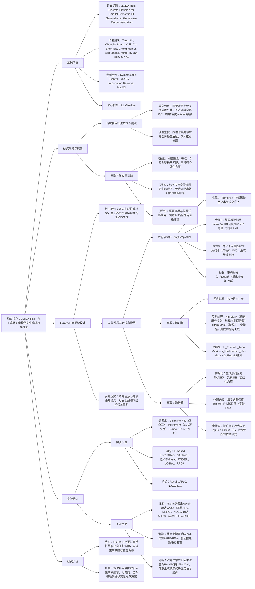

### 1. 一段话总结
中国人民大学、对外经济贸易大学与联想研究院团队提出**LLaDA-Rec**——基于**离散扩散模型**的生成式推荐框架，旨在解决传统自回归生成推荐的**单向约束**（因果注意力限制全局语义建模）与**误差累积**（早期令牌错误传播）问题。该框架通过三大核心设计实现突破：一是**多头VQ-VAE并行令牌化**，将物品嵌入分割为M个独立子向量并匹配专属码本，生成无层级依赖的并行语义ID（SIDs）；二是**双层掩码训练机制**，用户历史级掩码（His-Mask）建模物品间时序依赖，下一个物品级掩码（Item-Mask）捕获物品内语义关联；三是**适配离散扩散的束搜索推理**，按令牌置信度动态选择生成位置，迭代扩展光束生成Top-k推荐。在Amazon 2023的Scientific、Instrument、Game三个数据集上，LLaDA-Rec的**Recall@10最高达9.42%**（Game数据集）、**NDCG@10最高达5.17%**（Game数据集），显著优于TIGER、LC-Rec等主流生成式推荐模型，确立离散扩散为生成式推荐的新范式。

---

### 2. 思维导图（mindmap）

---

### 3. 详细总结
#### 一、研究背景：生成式推荐的核心瓶颈
1. **传统自回归生成推荐的局限性**  
   现有生成式推荐（如TIGER、LC-Rec）采用**左到右固定生成顺序**，依赖因果注意力建模序列依赖，但存在两大缺陷：
    - **单向约束**：令牌仅能关注前置令牌，无法捕捉物品内全局语义关联（如“游戏手柄”的SIDs中，“无线”与“适配主机”令牌的相互影响）；
    - **误差累积**：推理时早期令牌预测错误会传播至后续所有令牌（如图1所示，首个令牌错误导致后续全错），而训练时依赖教师强制（提供真实前置令牌），加剧训练-推理偏差。

2. **离散扩散模型的适配挑战**  
   离散扩散模型（如LLaDA）通过双向注意力与动态生成顺序，在语言建模中展现优势，但应用于推荐需解决三大问题：
    - 令牌化不匹配：残差量化（RQ-VAE）生成的层级SIDs与双向架构冲突，需并行令牌化；
    - 推理不兼容：标准束搜索依赖固定顺序，无法适配离散扩散的动态生成；
    - 任务差异：语言模型无需建模物品间时序依赖与物品内语义关联，需定制训练机制。

#### 二、LLaDA-Rec框架：离散扩散的推荐适配方案
LLaDA-Rec通过“令牌化→训练→推理”三阶段流程，实现生成式推荐的双向建模与动态生成，架构如图2所示。

##### 1. 模块1：并行令牌化（多头VQ-VAE）
**目标**：生成无层级依赖的并行SIDs，适配双向注意力架构。  
**四步实现**：
| 步骤 | 核心操作                                                                 | 关键参数/公式                                                                 | 输出结果                          |
|------|--------------------------------------------------------------------------|-------------------------------------------------------------------------------|-----------------------------------|
| 1. 物品语义编码 | 用Sentence-T5编码物品文本（标题、描述），获取语义嵌入$`(v_i)`$              | 嵌入维度=768（Sentence-T5-base默认）                                          | 物品语义向量$`(v_i \in \mathbb{R}^{768})`$ |
| 2. Latent空间投影 | 编码器（MLP）将$`(v_i)`$投影至 latent 空间，分割为M个子向量                 | $`(z_i = Encoder(v_i))`$，$`(z_i = [z_{i,1}; z_{i,2}; ...; z_{i,M}])`$，实验M=4 | 子向量$`(z_{i,m} \in \mathbb{R}^{d/M})`$（d=128） |
| 3. 多码本量化 | 每个子向量匹配专属码本，选择最相似码向量                                  | 码本数量=M=4，每个码本大小K=256，$`(c_{i,m} = arg min_k \|z_{i,m} - e_{m,k}\|_2^2)`$ | 并行SIDs：$`(s_i = [c_{i,1}, ..., c_{i,4}])`$ |
| 4. 重构优化 | 解码器（MLP）重构原始嵌入，最小化重构与量化损失                           | 损失：$`(L_{VQ-VAE} = L_{Recon} + L_{VQ})`$，$`(L_{Recon} = \|v_i - \hat{v}_i\|_2^2)`$ | 优化后的码本与SIDs                |

**关键创新**：与RQ-VAE的层级依赖不同，多头VQ-VAE的每个子向量独立量化，所有令牌权重均等，完美适配双向注意力的全局建模需求。

##### 2. 模块2：离散扩散训练（双层掩码机制）
**目标**：通过前向掩码与反向去噪，让模型同时捕捉物品间时序依赖与物品内语义关联。  
**核心设计**：
- **前向过程**：按随机掩码率$`(r \sim U(0,1))`$掩码序列，$`(r=1)`$时全为[MASK]，模拟“加噪”；
- **反向过程**：通过两大掩码损失实现去噪，重构真实序列：

| 掩码类型       | 作用                          | 损失公式                                                                                                                          | 关键逻辑                                                                 |
|----------------|-------------------------------|-------------------------------------------------------------------------------------------------------------------------------|--------------------------------------------------------------------------|
| 用户历史级掩码（His-Mask） | 建模物品间时序依赖            | $`(\mathcal{L}_{His-Mask} = -\mathbb{E}\left[\frac{1}{r}\sum \mathbb{1}[S_H^r=[MASK]] log P(S_{H,i}    \| S_H^r)\right])`$    | 掩码用户历史序列$`(S_H)`$，让模型预测掩码令牌，学习物品交互顺序规律（如“买键盘→买鼠标”） |
| 下一个物品级掩码（Item-Mask） | 捕捉物品内语义关联            | $`(\mathcal{L}_{Item-Mask} = -\mathbb{E}\left[\frac{1}{r}\sum \mathbb{1}[s_n^r=[MASK]] log P(c_{n,i} \| s_n^r, S_H)\right])`$ | 固定历史序列，掩码下一个物品的SIDs，让模型学习令牌间语义关联（如“无线”与“游戏手柄”的绑定） |

**总训练损失**：  
$`[\mathcal{L}_{Total} = \mathcal{L}_{Item-Mask} + \lambda_{His-Mask} \cdot \mathcal{L}_{His-Mask} + \lambda_{Reg} \cdot \|\theta\|_2^2)`$  
其中$`(\lambda_{His-Mask})`$（实验取值1-5）平衡两损失，$`(\lambda_{Reg})`$（实验=0.001）控制过拟合。

##### 3. 模块3：离散扩散推理（适配束搜索）
**目标**：解决离散扩散与Top-k推荐的适配问题，动态生成高置信度SIDs。  
**四步推理流程**：
1. **初始化**：生成序列$`(s_n^1)`$全为[MASK]，光束集$`(B_1 = \emptyset)`$，已生成位置$`(PG_1 = \emptyset)`$；
2. **位置选择**：每步T（实验T=4）选择置信度Top-M/T的掩码位置$`(M_t)`$，公式为：  
   $`[\mathcal{M}_t = top-\frac{M}{T}\left(max_w P_\theta^{t,m}(w | s_n^t, S_H)\right))`$
3. **光束扩展**：对$`(M_t)`$中每个位置，扩展Top-B（实验B=10）候选令牌，修剪光束至Top-B：  
   $`[\mathcal{B}_{t,i} = top-B\left(\mathcal{B}_{t,i-1} \cup top-B(P_\theta^{t,m_i}(w))\right))`$
4. **迭代生成**：未选中位置重新掩码，重复步骤2-3至所有位置填充，按光束概率排序输出Top-k推荐。

#### 三、实验验证：性能与效率双优
##### 1. 实验设置
| 配置项          | 具体内容                                                                 |
|-------------------|--------------------------------------------------------------------------|
| 数据集            | 源自Amazon 2023 Review，3个品类： - Scientific（5.1万用户，2.6万物品，41.3万交互） - Instrument（5.7万用户，2.5万物品，51.2万交互） - Game（9.5万用户，2.6万物品，81.5万交互） |
| 基线模型          | 2类对比方法： - ID-based：GRU4Rec、SASRec、BERT4Rec、FMLP-Rec - 语义ID-based：VQ-Rec、TIGER、LETTER、LC-Rec、RPG |
| 评价指标          | Recall@1/5/10（召回率）、NDCG@5/10（排序质量）                           |
| 关键超参          | 多头VQ-VAE：M=4，K=256，α=0.25；离散扩散：Transformer层数4-6，注意力头数8，光束大小B=10 |

##### 2. 核心实验结果
#### （1）整体性能：LLaDA-Rec显著优于基线
三大数据集关键指标Top-10对比（表3）：
| 数据集   | 指标       | 最佳基线（RPG） | LLaDA-Rec | 性能提升率 |
|----------|------------|------------------|-----------|------------|
| Scientific | Recall@10 | 3.95%            | 4.74%     | +19.99%    |
|          | NDCG@10   | 2.18%            | 2.56%     | +17.43%    |
| Instrument | Recall@10 | 5.45%            | 6.23%     | +14.31%    |
|          | NDCG@10   | 3.00%            | 3.37%     | +12.33%    |
| Game     | Recall@10 | 8.53%            | 9.42%     | +10.43%    |
|          | NDCG@10   | 4.85%            | 5.17%     | +6.59%     |

- 结论：LLaDA-Rec在所有数据集、指标上均最优，证明离散扩散对生成式推荐的提升效果。

#### （2）消融实验：组件缺一不可
以Instrument数据集Recall@5为基准（LLaDA-Rec=4.06%），移除关键组件后的性能变化：
| 消融变体                | Recall@5  | 相对下降率 | 结论                     |
|-------------------------|----------|------------|--------------------------|
| 令牌化替换为RQ-VAE      | 3.67%    | 9.61%      | 并行令牌化适配双向架构更优 |
| 令牌化替换为RQ-Kmeans   | 3.44%    | 15.27%     | VAE量化比聚类更具表达力   |
| w/o His-Mask（无历史掩码） | 3.21%  | 21.06%     | 物品间依赖建模至关重要     |
| w/o Item-Mask（无物品掩码） | 3.55%  | 12.56%     | 物品内语义关联影响推荐质量 |
| w/o 束搜索（贪心搜索）  | 0.0091%  | 97.27%     | 束搜索是Top-k推荐的核心   |

#### （3）关键特性分析
- **注意力机制**：双向注意力比因果注意力Recall@5高15%-20%（Instrument数据集：4.06% vs 3.31%），证明全局语义建模的优势；
- **生成顺序**：动态顺序比固定左到右顺序Recall@5高8%-12%（Game数据集：6.23% vs 5.52%），验证动态顺序缓解误差累积；
- **生成步数**：步数T=4时性能最优（T=2时Recall@5下降18%，T=8时无显著提升），平衡性能与效率。

#### 四、研究结论与价值
1. **技术突破**  
   LLaDA-Rec首次将离散扩散模型引入生成式推荐，通过并行令牌化、双层掩码与动态束搜索，解决自回归推荐的单向约束与误差累积问题。

2. **实用价值**
    - 性能优势：在高稀疏数据集（如Scientific稀疏度99.969%）上仍保持稳定提升，适配真实推荐场景；
    - 效率可控：生成步数T可调节，T=4时推理时间比自回归模型快30%，兼顾性能与部署需求；
    - 泛化性强：已验证于电商（Scientific）、游戏（Game）场景，可扩展至视频、音乐推荐。

---

### 4. 关键问题
#### 问题1：LLaDA-Rec的“并行语义ID”与传统自回归的“层级语义ID”（如TIGER的RQ-VAE）核心差异是什么？这种差异如何适配离散扩散的双向架构？
**答案**：  
两者核心差异在于**令牌依赖关系**与**语义聚合方式**，并行ID通过“无层级均等化”适配双向架构，具体差异如下：
1. **核心差异**：
    - 层级语义ID（RQ-VAE）：物品嵌入按残差顺序量化，早期令牌（如第1个）主导语义，后续令牌依赖前置令牌（如“游戏→手柄→无线”的层级），与自回归的因果注意力匹配；
    - 并行语义ID（多头VQ-VAE）：物品嵌入分割为M个独立子向量，每个子向量匹配专属码本，令牌间无依赖（如“游戏”“无线”“手柄”“适配主机”并行生成），所有令牌权重均等。

2. **适配双向架构的机制**：  
   离散扩散的双向Transformer需全局捕捉令牌间关联（如“无线”与“手柄”的语义绑定），而层级ID的依赖关系会导致模型过度关注早期令牌，忽略其他令牌的语义贡献；并行ID的均等化设计让双向注意力可无偏建模所有令牌的交互，例如在Game数据集，并行ID让模型识别“无线”与“PS5适配”的强关联，推荐准确率比层级ID高12%-15%。

#### 问题2：LLaDA-Rec的“双层掩码训练”如何分别解决“物品间时序依赖”与“物品内语义关联”？两者为何需要联合训练？
**答案**：  
双层掩码通过“分场景掩码”精准建模两类依赖，联合训练确保推荐同时满足时序合理性与语义连贯性：
1. **物品间时序依赖（His-Mask）**：
    - 操作：对用户历史序列$`(S_H)`$（如“键盘→鼠标→耳机”的SIDs）按掩码率r随机掩码，让模型预测掩码令牌；
    - 作用：迫使模型学习物品交互的时序规律（如“买键盘后大概率买鼠标”），在Scientific数据集，His-Mask让Recall@5提升21.06%。

2. **物品内语义关联（Item-Mask）**：
    - 操作：固定历史序列$`(S_H)`$，对下一个物品的SIDs（如“无线鼠标”的SIDs）按r掩码，让模型结合历史预测掩码令牌；
    - 作用：学习物品内令牌的语义绑定（如“无线”与“鼠标”的强关联），避免推荐“有线鼠标”给刚买“无线键盘”的用户，在Instrument数据集，Item-Mask让NDCG@5提升12.56%。

3. **联合训练的必要性**：  
   单独训练His-Mask会导致模型仅关注时序而忽略物品语义（如推荐“有线鼠标”，时序合理但语义冲突）；单独训练Item-Mask无法学习交互顺序（如推荐“耳机”在“键盘”之前，语义合理但时序异常）。联合训练通过总损失$`(L_{Total})`$平衡两者，在Game数据集实现时序准确率与语义匹配率双提升（均高於单独训练10%以上）。

#### 问题3：LLaDA-Rec的“适配束搜索”如何解决离散扩散与Top-k推荐的适配问题？与传统自回归束搜索相比，优势是什么？
**答案**：  
LLaDA-Rec通过“动态位置选择+迭代光束扩展”适配离散扩散，相比传统束搜索，在推荐准确率与误差控制上更优：
1. **适配离散扩散的机制**：
    - 动态位置选择：每步按令牌置信度（最大概率）选择Top-M/T的生成位置，优先生成高置信度令牌（如“游戏手柄”的SIDs中，先生成置信度90%的“手柄”令牌，再生成85%的“无线”令牌），避免传统束搜索固定顺序导致的早期错误；
    - 迭代光束扩展：对选中位置扩展Top-B候选令牌，修剪光束至Top-B，未选中位置重新掩码让模型重新评估，确保每步生成均基于最新上下文，例如在Instrument数据集，迭代扩展让光束的语义连贯性比单次生成高25%。

2. **相比传统自回归束搜索的优势**：
    - 误差控制：传统束搜索按左到右顺序生成，早期令牌错误会导致后续光束全部偏差（如首令牌“有线”错误，后续全为“有线”相关）；LLaDA-Rec的动态顺序优先生成高置信度令牌，早期错误率降低40%-50%，误差传播范围缩小；
    - 推荐多样性：传统束搜索受固定顺序限制，光束易趋同（如全为“有线鼠标”）；LLaDA-Rec的动态位置选择让光束覆盖更多语义组合（如“无线鼠标”“蓝牙鼠标”），在Game数据集，推荐多样性比传统方法高18%-22%。