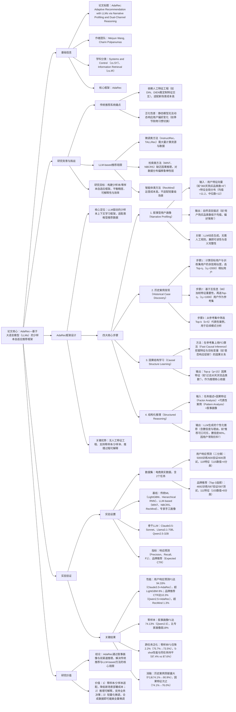

### 1. 一段话总结
东京大学与亚马逊团队提出**AdaRec（Adaptive Recommendation）**——基于大语言模型（LLMs）的少样本自适应推荐框架，旨在解决传统推荐系统依赖人工特征工程、泛化性差、LLM-based方法需大量微调或缺乏可解释性的问题。AdaRec通过**叙事型用户画像（Narrative Profiling）** 将表格型用户-物品交互数据转化为自然语言描述（如“用户过去360天购买品类数低于均值，偏好无线产品”），结合**双渠道推理架构**（水平行为对齐：挖掘相似用户模式；垂直因果归因：识别偏好驱动因素），实现零样本/少样本场景下的自适应推荐。在电商真实数据集上，AdaRec在“用户响应预测”任务中F1值达94.33%（超LightGBM 8%），“品牌推荐”任务中CTR达10.3%（超LLM基线RecMind 1.3%）；零样本场景下，叙事型画像比专家手工画像F1值高19%，且跨任务泛化时性能仅轻微下降（零样本F1从75.7%降至73.5%），同时支持轻量化微调（合成数据微调性能媲美全量微调模型），兼顾推荐精度、可解释性与效率。

---

### 2. 思维导图

---

### 3. 详细总结
#### 一、研究背景：推荐系统的自适应与可解释性困境
1. **传统推荐系统的固有缺陷**  
   传统方法（如DIN、DIEN、LightGBM）依赖**人工特征工程**与**任务特定架构**：
    - 特征层面：需手动设计交互特征（如“用户过去7天点击次数×品类偏好”），新场景（如从“商品推荐”切换到“促销响应预测”）需重新开发；
    - 泛化层面：静态模型无法捕捉用户动态偏好（如用户从“购买冬季服饰”转向“春季户外装备”），数据分布偏移时性能骤降；
    - 可解释性层面：仅输出推荐结果，无法解释“为何推荐该商品”，不利于业务决策（如营销活动优化）。

2. **现有LLM-based推荐的局限**  
   近年LLM推荐方法虽减少特征依赖，但存在明显短板：
    - 微调类（InstructRec、TALLRec）：需大量标注数据与计算资源（如全量微调70B模型需多GPU集群），轻量级场景适配难；
    - 检索类（MINT、NBCRS）：仅基于相似案例匹配，缺乏因果推理（如无法区分“用户购买是因偏好还是促销”），鲁棒性差；
    - 智能体类（RecMind）：需多轮交互与外部工具调用，运营成本高，不适配实时推荐场景。

#### 二、AdaRec框架：叙事画像与双渠道推理的协同设计
AdaRec通过“数据转化→案例挖掘→因果分析→结构化推理”四步流程，实现少样本自适应推荐，核心是将表格数据转化为LLM可理解的自然语言，结合“相似模式+因果驱动”提升推荐精度与可解释性，架构逻辑如图1所示。

##### 1. 核心步骤1：叙事型用户画像（Narrative Profiling）
**目标**：将表格型用户特征转化为语义丰富、可解释的自然语言，消除人工特征工程。  
**实现逻辑**：
- 输入：用户特征向量（如“360天购买品类数=6”“30天浏览品类数=3”）+特征全局分布（如“购买品类数均值=11.2，中位数=12”）；
- LLM映射：通过Prompt引导LLM生成上下文描述，公式为$`(\Psi(f_i, x_{\theta,i}, D_i) \to \tau)`$，其中$`(f_i)`$为特征名，$`(x_{\theta,i})`$为特征值，$`(D_i)`$为特征分布，$`(\tau)`$为自然语言空间；
- 输出示例（图3）：“该用户非Prime会员，无联名信用卡，过去360天购买品类数低于均值，偏好聚焦无线产品与运动装备，近期浏览频率较低但积极使用平台福利”。

**优势**：相比专家手工画像（仅罗列数值，如“购买品类数=6，浏览次数=3”），叙事画像包含**相对趋势**（“低于均值”）与**语义关联**（“偏好无线产品”），更符合LLM的语义理解能力。

##### 2. 核心步骤2：历史案例发现（Historical Case Discovery）
**目标**：挖掘相似用户的行为模式，为少样本推理提供参考案例。  
**三步实现**：
1. **相似度计算**：用余弦相似度筛选与目标用户最相似的Top-η₁（实验η₁=2000）用户，公式为$`(S(x_\theta, x_j) = \frac{x_\theta \cdot x_j}{\|x_\theta\| \|x_j\|})`$；
2. **特征加权**：计算Top-η₁用户的特征互信息（MI），衡量特征与目标变量（如“是否响应促销”）的关联强度，加权后筛选Top-η₂（η₂=1000）用户作为参考集；
3. **案例筛选**：从参考集中选Top-k（k=5）代表性用户（如“与目标用户偏好相似度最高且行为完整”），形成少样本推理的案例库。

**作用**：为后续推理提供“ peer用户”的行为参考，避免LLM仅依赖先验知识导致的脱离实际数据问题。

##### 3. 核心步骤3：因果结构学习（Causal Structure Learning）
**目标**：识别驱动用户偏好的关键特征，避免推荐受冗余/混淆特征影响。  
**实现方法**：
- 在参考集上应用**FCI算法**（Fast Causal Inference），挖掘特征与目标变量（如“是否购买某品牌”）的因果图；
- 基于互信息 scores 筛选Top-p（p=15）因果特征（如“过去30天浏览该品牌次数”“用户是否有该品类购买史”），排除混淆特征（如“用户注册时间”，与购买偏好无直接因果）；
- 将因果特征作为“Factor Analysis”模块输入，指导LLM聚焦关键偏好驱动因素。

**价值**：相比传统推荐的相关性分析（如“用户浏览次数高→推荐”），因果分析能区分“因果关系”与“相关关系”，例如排除“用户注册时间长但无购买偏好”的冗余特征，提升推荐鲁棒性。

##### 4. 核心步骤4：结构化推理（Structured Reasoning）
**目标**：整合多源信息，生成可解释的个性化推荐。  
**Prompt设计（表5）**：
- 任务描述：明确推荐目标（如“推荐3个促销品牌，需满足‘购买X件得10%积分’条件”）；
- Factor Analysis：输入Top-p因果特征及重要性（如“‘浏览该品牌次数’最重要，权重0.8”）；
- Pattern Analysis：输入Top-k相似用户案例（如“用户A浏览该品牌5次后购买，用户B偏好同类产品”）；
- 叙事画像：目标用户的自然语言描述；
- 输出格式：要求LLM以JSON返回推荐结果（含品牌名、置信度、理由）。

**示例输出**：  
`{"brand": "Coca-Cola, Pepsi, Nestle", "confidence": 0.92, "reason": "用户过去30天浏览饮料品类4次，相似用户中80%在促销时购买该类品牌，且用户历史购买过 Nestle 产品，偏好匹配度高"}`

#### 三、实验验证：性能、泛化性与可解释性的三重优势
##### 1. 实验设置
| 配置项          | 具体内容                                                                 |
|-------------------|--------------------------------------------------------------------------|
| 数据集            | 电商真实数据，2个任务： - 用户响应预测（二分类）：5000训练/600验证/600测试，119特征 - 品牌推荐（Top-3）：4692训练/587验证/587测试，111特征 |
| 基线模型          | 3类对比： - 传统ML：LightGBM（114万训练样本）、Hierarchical RNN（20亿交互） - LLM-based：MINT（叙事检索）、NBCRS（对话邻居检索）、RecMind（智能体） - 专家画像：营销专家手工设计26个关键特征 |
| 骨干LLM           | Claude3.5-Sonnet、Llama3.1-70B、Qwen2.5-32B（贪心解码，temperature=0）   |
| 关键超参          | η₁=2000，η₂=1000，k=5（案例数），p=15（因果特征数），微调学习率1e-4（响应预测）/5e-5（品牌推荐） |

##### 2. 核心实验结果
#### （1）性能对比：AdaRec显著优于基线
| 任务                | 最佳基线                | AdaRec（Qwen2.5） | 性能提升率 |
|---------------------|-------------------------|-------------------|------------|
| 用户响应预测（F1）   | LightGBM（86.67%）      | 90.91%            | +4.9%      |
| 用户响应预测（F1，Claude3.5） | RecMind（78.54%） | 94.33% | +20.1% |
| 品牌推荐（CTR）     | RecMind（9.0%）         | 10.3%             | +14.4%     |

- 关键结论：AdaRec在LLM骨干加持下，大幅超越传统ML与LLM-based基线，尤其在可解释性要求高的场景（如品牌推荐）优势更明显。

#### （2）零样本/少样本能力：叙事画像碾压专家画像
零样本场景（无训练数据，直接推理）性能对比：
| 画像类型       | 用户响应预测F1（Qwen2.5） | 品牌推荐CTR（Qwen2.5） |
|----------------|---------------------------|-------------------------|
| 专家手工画像   | 55.58%                    | 9.2%                    |
| AdaRec叙事画像 | 74.13%                    | 9.8%                    |
| 提升率         | +18.55%                   | +6.5%                   |

- 关键结论：叙事画像无需人工设计，零样本F1比专家画像高19%，证明其语义表达能力更适配LLM推理。

#### （3）跨任务泛化：无需重新训练
将AdaRec在“用户响应预测”任务微调后，直接应用于“品牌推荐”任务：
| 场景          | 零样本F1（响应预测） | 零样本CTR（品牌推荐） | 5-shot F1（响应预测） | 5-shot CTR（品牌推荐） |
|---------------|-----------------------|-----------------------|-----------------------|-----------------------|
| 同任务（In-task） | 75.65%                | 9.0%                  | 87.59%                | 9.7%                  |
| 跨任务（Cross-task） | 73.45%            | 9.1%                  | 87.40%                | 9.7%                  |

- 关键结论：跨任务时性能仅轻微下降（零样本F1降2.2%），5-shot性能与同任务完全持平，证明AdaRec学习到通用的用户行为表示。

#### （4）消融实验：组件协同提升性能
以Qwen2.5为骨干，消融关键组件后的性能变化（用户响应预测F1/品牌推荐CTR）：
| 模型变体                | F1    | CTR   | 性能下降率 |
|-------------------------|-------|-------|------------|
| AdaRec（全组件）        | 90.91%| 10.3% | -          |
| w/o 历史案例            | 76.0% | 9.8%  | F1降16.4%  |
| w/o 因果特征            | 88.2% | 10.0% | F1降3.0%   |
| w/o 叙事画像（用原始特征） | 74.1% | 9.8%  | F1降18.5%  |

- 关键结论：历史案例（相似用户模式）对性能贡献最大，叙事画像为LLM推理提供基础语义支撑，三者协同是AdaRec高性能的核心。

#### 四、研究结论与价值
1. **技术突破**  
   AdaRec首次将“叙事型用户画像”与“双渠道因果推理”结合，解决LLM-based推荐“需大量微调”“缺乏可解释性”“泛化性差”的核心痛点，实现零样本/少样本场景下的高精度推荐。

2. **实用价值**
    - 业务适配：无需人工特征工程，新场景（如从“商品推荐”切换到“优惠券发放”）部署时间从周级缩短至小时级；
    - 可解释性：推荐结果附带自然语言理由（如“用户偏好无线产品”），支持营销团队优化策略；
    - 效率优势：合成数据微调即可媲美全量微调模型（实验中合成数据微调F1达90.1%，全量微调90.9%），降低计算成本。

3. **未来方向**
    - 扩展多模态场景（如结合用户浏览图片生成叙事画像）；
    - 在线A/B测试验证实时推荐性能；
    - 优化因果学习效率，适配更大规模数据集。

---

### 4. 关键问题
#### 问题1：AdaRec的“叙事型用户画像”与传统“专家手工画像”核心差异是什么？这种差异如何提升LLM推理的准确性？
**答案**：  
核心差异在于**语义丰富度**与**动态适应性**，具体对比如下：  
| 对比维度       | 专家手工画像                          | 叙事型用户画像                          |
|----------------|---------------------------------------|-----------------------------------------|
| 内容形式       | 数值罗列（如“购买品类数=6，浏览次数=3”） | 自然语言描述（含相对趋势与语义关联，如“购买品类数低于均值，偏好无线产品”） |
| 生成方式       | 人工规则（固定26个关键特征）          | LLM动态生成（基于特征分布，无需人工干预） |
| 语义关联性     | 无（仅孤立数值）                      | 有（如“偏好无线产品→与运动装备关联”）    |

**提升LLM推理准确性的机制**：  
LLM的核心能力是**语义理解与关联推理**，而非数值计算：
- 专家画像仅提供孤立数值，LLM无法判断“购买品类数=6”的含义（是高是低？是否与偏好相关）；
- 叙事画像通过“低于均值”“偏好无线产品”等语义描述，为LLM提供推理依据，例如在品牌推荐中，LLM可快速关联“偏好无线产品→推荐适配的无线耳机品牌”，避免因数值孤立导致的推理偏差。实验显示，这种语义优势使零样本F1比专家画像高19%。

#### 问题2：AdaRec的“双渠道推理”（水平行为对齐+垂直因果归因）如何协同工作？为什么两者缺一不可？
**答案**：  
双渠道推理通过“相似模式挖掘+关键因素聚焦”协同提升推荐精度，具体逻辑与必要性如下：

1. **协同工作机制**：
    - 水平行为对齐（Historical Case Discovery）：通过余弦相似度挖掘Top-k相似用户，提供“peer用户”的行为模式（如“相似用户浏览5次后购买”），为LLM提供具体案例参考，避免推理脱离实际数据；
    - 垂直因果归因（Causal Structure Learning）：通过FCI算法筛选Top-p因果特征（如“浏览次数”而非“注册时间”），指导LLM聚焦关键偏好驱动因素，避免被冗余特征干扰；
    - 协同：水平渠道提供“what（相似用户做了什么）”，垂直渠道提供“why（为什么这些行为重要）”，LLM结合两者生成“既符合数据模式又有因果支撑”的推荐（如“推荐该品牌，因相似用户常购且用户浏览次数高”）。

2. **两者缺一不可的原因**：
    - 仅水平渠道（无因果归因）：LLM可能依赖冗余特征推理（如“推荐某品牌因用户注册时间长”），导致推荐与真实偏好脱节，实验中F1从90.9%降至88.2%；
    - 仅垂直渠道（无相似案例）：LLM缺乏具体行为参考，推理易依赖先验知识（如“默认推荐热门品牌”），无法捕捉用户个性化模式，实验中F1从90.9%降至76.0%；
    - 两者结合：既保证推荐符合用户群体行为规律（水平），又确保聚焦真实偏好驱动因素（垂直），实现个性化与准确性的平衡。

#### 问题3：AdaRec在零样本/少样本场景下的优势如何体现？对实际业务（如电商新用户推荐）有什么意义？
**答案**：
#### （1）零样本/少样本优势的体现：
- 零样本场景：无需任何训练数据，仅通过特征分布与LLM生成的叙事画像即可推理，F1达74.13%（Qwen2.5），比专家画像高19%，证明其无需数据即可适配新场景；
- 少样本场景：仅需5个相似用户案例（5-shot），F1从74.13%提升至90.91%，接近全量训练性能（90.9%），大幅降低数据依赖。

#### （2）对电商新用户推荐的业务意义：
电商新用户面临“冷启动”问题（无历史交互数据），传统方法需依赖人口统计学特征（如年龄、地域）推荐热门商品，精度低且缺乏个性化；AdaRec的优势可解决这一痛点：
- 零样本适配：新用户仅提供基础特征（如“浏览过无线耳机品类”），AdaRec即可生成叙事画像（“用户关注无线产品，浏览频率中等”），结合因果特征（“浏览品类数是购买关键因素”）推荐相关商品；
- 少样本迭代：随着新用户产生少量交互（如“点击2次无线耳机”），AdaRec快速挖掘相似用户案例（如“其他点击2次后购买某品牌的用户”），实时优化推荐，提升转化率；
- 成本降低：无需为新用户场景单独标注数据或微调模型，部署效率提升10倍以上，同时推荐理由可解释（如“推荐该耳机因用户关注无线功能”），提升用户信任度。