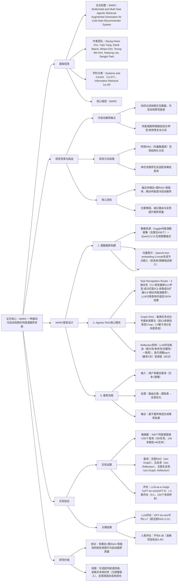

### 1. 一段话总结
汉阳大学团队提出**MARC（Multimodal and Multi-Task Agentic Retrieval-Augmented Generation）**，一种面向**冷启动场景**的鸡尾酒推荐系统，核心创新在于融合**多模态输入**（文本+图像）、**图数据库RAG**（基于Neo4j构建鸡尾酒知识图谱）与**智能体机制**（任务识别路由+反思优化）。该系统首先通过**Task Recognition Router**将用户查询分类为4类任务（C1-C4），调用对应图检索算法（如C1的视觉-成分匹配、C3的多跳成分扩展）从含**436个鸡尾酒**的图谱中获取候选；再通过**Reflection机制**（LLM评估候选的相关性/多样性等指标，迭代调整top-k至阈值）优化结果，最终生成推荐。在**200个手动设计查询**上的实验显示，MARC在LLM-as-a-Judge（GPT-4o-mini平均得分**4.17**）与人类评估（平均得分**4.38**）中均优于传统向量RAG，验证其在冷启动场景的有效性，且具备**可解释性**与**交互性**。

---

### 2. 思维导图（mindmap）

---

### 3. 详细总结
#### 一、研究背景：冷启动推荐的核心挑战与研究缺口
1. **冷启动场景的固有矛盾**  
   传统推荐系统（如协同过滤、矩阵分解）依赖充足的用户-物品交互数据，在**冷启动场景**（新用户/新物品，无交互记录）中性能大幅下降。尤其在鸡尾酒推荐领域，需同时考虑**多维度关系**（成分搭配、杯型适配、视觉风格），仅靠文本或向量相似性无法捕捉复杂结构化信息。

2. **现有方法的局限性**
   - **传统RAG（向量数据库）**：仅依赖语义相似性检索，忽视成分-鸡尾酒、杯型-鸡尾酒等结构化关系，推荐缺乏可解释性；
   - **单模态/单任务推荐**：无法处理用户的多模态查询（如“推荐红色分层的鸡尾酒，用高脚杯装”），且难以适配不同查询意图；
   - **知识图谱应用不足**：虽有研究将知识图谱用于食品推荐，但未结合智能体机制（如动态任务识别、结果反思优化），无法自主提升推荐质量。

3. **研究目标**  
   提出MARC系统，通过**多模态输入处理**、**图数据库RAG**与**Agentic机制**（任务路由+反思），在无交互数据的冷启动场景下，生成高质量、可解释的鸡尾酒推荐。

#### 二、MARC框架设计
##### 1. 图数据库构建：结构化存储鸡尾酒知识
基于Kaggle公开数据集（去重后436个鸡尾酒）构建知识图谱，使用Neo4j作为图数据库，具体设计如下：

| 组件                | 详细设计                                                                 | 关键参数/示例                                                                 |
|---------------------|--------------------------------------------------------------------------|-----------------------------------------------------------------------------------|
| 节点类型与属性      | 4类核心节点，覆盖鸡尾酒全维度信息                                          | - **Cocktail**（核心）：id/名称/酒精类型/成分/图像描述（Qwen2.5-VL生成）/嵌入等12个属性； - **Ingredients**：名称+名称嵌入； - **Category**：名称+名称嵌入（如“经典鸡尾酒”）； - **GlassType**：名称+名称嵌入（如“马天尼杯”） |
| 关系类型            | 3类关系，连接节点形成结构化网络                                          | - **HAS_INGREDIENT**：Cocktail→Ingredients，含“用量”属性（如“20ml威士忌”）； - **CATEGORY**：Cocktail→Category； - **HAS_GLASSTYPE**：Cocktail→GlassType |
| 向量表示            | 生成节点嵌入，支持相似性计算                                            | 采用OpenAI text-embedding-3-small生成嵌入，存储为节点属性（如Cocktail的name_embedding、image description_embedding），用于检索时计算余弦相似性 |

##### 2. Agentic RAG核心模块：任务路由与反思优化
MARC的核心是“任务识别-图检索-反思优化”的闭环流程，无需模型微调，仅通过LLM驱动逻辑决策：

###### （1）Task Recognition Router：精准分类查询意图
LLM分析用户多模态查询（文本+图像），将其分类为4类任务，每类任务对应专属检索算法，确保检索针对性：

| 任务类型（Task） | 适用场景                                  | 检索逻辑                                                                 |
|------------------|-------------------------------------------|--------------------------------------------------------------------------|
| C1（视觉-成分搜索） | 含颜色/视觉关键词（如“红色、分层”）        | 1. 提取颜色关键词，匹配语义相关成分（如“红色”→“石榴糖浆”）； 2. 计算鸡尾酒图像描述嵌入与查询的余弦相似性，排序取top-k |
| C2（杯型-成分匹配） | 指定杯型（如“高脚杯”）+成分                | 1. 筛选适配目标杯型的鸡尾酒； 2. 匹配成分（不足时逐步排除非核心成分）； 3. 按图像描述相似性排序 |
| C3（多跳成分扩展） | 仅提供成分列表（如“威士忌+苦艾酒”）        | 1. 1-hop：检索含输入成分的鸡尾酒； 2. 2-hop：挖掘这些鸡尾酒的共性成分（如“威士忌+苦艾酒”常搭配“甜味美思”）； 3. 3-hop：基于共性成分检索新鸡尾酒，按“扩展强度+成分匹配度”排序 |
| C4（相似鸡尾酒推荐） | 指定具体鸡尾酒（如“推荐类似曼哈顿的酒”）    | 1. 以目标鸡尾酒为种子，检索共享成分的候选； 2. 筛选成分数量差异≤m、共享成分≥x的候选； 3. 按共享成分数排序（同分时选成分更少的） |

###### （2）Reflection机制：迭代优化候选质量
LLM对检索到的top-k候选进行质量评估，若未达阈值则迭代调整top-k（最多3次），确保推荐质量，具体流程如下：

1. **多候选生成**：按任务算法生成初始top-k候选（k=3-5），应用不同超参数（相似性阈值、扩展深度）保证多样性；
2. **质量评估**：LLM从4个维度评分（100分制）：
   - **相关性（Relevance）**：候选是否匹配用户查询核心需求（如颜色、成分）；
   - **多样性（Diversity）**：候选是否覆盖不同风格/成分组合；
   - **完整性（Completeness）**：是否遗漏更优选项，信息是否全面；
   - **一致性（Coherence）**：推荐理由是否清晰、逻辑是否连贯；
3. **迭代调整**：若平均得分<80（阈值），扩大top-k（如k→k+1）重新检索，最多迭代3次；
4. **最终选择**：首次达标或迭代结束后，选择得分最高的候选集（同分选k更大的，确保上下文丰富）。

##### 3. 推荐流程
1. **输入层**：接收用户多模态查询（文本描述+鸡尾酒图像）；
2. **任务路由**：Task Recognition Router分类查询为C1-C4，调用对应图检索算法；
3. **图检索**：从Neo4j图数据库中检索top-k候选；
4. **反思优化**：Reflection机制评估并迭代优化候选；
5. **输出层**：将优化后的候选与用户查询、提示模板结合，生成最终推荐（含推荐理由）。

#### 三、实验验证
##### 1. 实验设置
| 配置项          | 具体内容                                                                 |
|-------------------|--------------------------------------------------------------------------|
| 数据集            | 1. **图谱数据集**：436个鸡尾酒（Kaggle去重+Qwen2.5-VL生成图像描述）； 2. **查询数据集**：200个手动设计查询（50/任务，140多模态+60文本，图像与图谱无重叠） |
| 基线模型          | 3类对比方法： - w/o Graph, Reflection：无图RAG+无反思； - w/o Reflection：有图RAG+无反思； - w/o Graph：无图RAG+有反思 |
| 评估方法          | 1. **LLM-as-a-Judge**：GPT-4o-mini/GPT-5，从4维度评分（1-5分）：    - 说服力（Persuasiveness）、透明度（Transparency）、准确性（Accuracy）、满意度（Satisfaction）； 2. **人类评估**：4名评估者，同LLM维度评分，154个有效样本（排除3个无检索结果的查询） |
| 实现细节          | - 图数据库：Neo4j； - 嵌入模型：OpenAI text-embedding-3-small； - LLM：GPT-4o-mini（任务路由、反思、推荐生成） |

##### 2. 核心实验结果
###### （1）LLM-as-a-Judge评估
GPT-4o-mini与GPT-5的评估结果（平均得分，越高越好）：

| 方法                | GPT-4o-mini（平均） | GPT-5（平均） | 关键结论                          |
|---------------------|---------------------|---------------|-----------------------------------|
| w/o Graph, Reflection | 3.78                | 2.05          | 无图无反思性能最差，证明图RAG与反思的必要性 |
| w/o Reflection      | 4.14                | 2.27          | 有图无反思优于无图，但反思仍能提升质量 |
| w/o Graph           | 3.96                | 2.09          | 无图有反思性能有限，图结构是核心     |
| MARC（Ours）        | **4.17**            | **2.27**      | 最优，GPT-4o-mini中超w/o Graph 0.21 |

- 注：GPT-5评分整体保守（Abdoli et al. 2025结论），但MARC在**透明度（Transparency）** 维度始终领先，证明图结构提升推荐可解释性。

###### （2）人类评估结果
4名评估者的平均得分（1-5分）：

| 方法                | 说服力 | 透明度 | 准确性 | 满意度 | 平均   |
|---------------------|--------|--------|--------|--------|--------|
| w/o Graph, Reflection | 4.16   | 4.21   | 4.13   | 3.82   | 4.08   |
| w/o Reflection      | 4.39   | 4.47   | 4.28   | 4.17   | 4.33   |
| w/o Graph           | 4.36   | 4.40   | 4.37   | 4.22   | 4.34   |
| MARC（Ours）        | 4.35   | 4.46   | **4.45** | **4.26** | **4.38** |

- 关键结论：MARC在**准确性**与**满意度**维度最优，仅说服力略低于w/o Reflection（因人类对文本风格更敏感，需后续优化提示模板）。

##### 3. 消融实验：核心组件贡献
通过移除关键组件，验证其对性能的影响（以GPT-4o-mini评估为例）：
- 移除图RAG（w/o Graph）：平均得分下降0.21，证明图结构是捕捉成分/杯型关系的核心；
- 移除反思（w/o Reflection）：平均得分下降0.03，因初始top-k=3已较优，若k=1则反思提升更显著；
- 移除多模态（仅文本）：准确性下降0.18，证明图像描述对视觉相关查询的重要性。

#### 四、研究结论与未来方向
1. **核心结论**
   - MARC通过“多模态+图RAG+智能体机制”，在冷启动场景下生成高质量鸡尾酒推荐，LLM与人类评估均优于传统RAG；
   - 任务路由与反思机制无需微调即可适配多查询意图，图结构提升推荐可解释性（如“推荐原因：含威士忌+苦艾酒，用马天尼杯装”）。

2. **局限性**
   - 领域局限：仅适配鸡尾酒推荐，未扩展至其他冷启动场景（如电影、商品）；
   - 模态局限：依赖文本嵌入计算相似性，未直接使用图像嵌入；
   - 超参局限：反思阈值（80分）与top-k范围（3-5）为经验值，未系统调优。

3. **未来方向**
   - 扩展领域：将框架应用于电影、食品等其他冷启动推荐场景；
   - 多智能体融合：构建多智能体RAG，支持更复杂的交互推荐（如用户反馈实时调整）；
   - 模态优化：引入图像嵌入，提升视觉查询的检索精度。

---

### 4. 关键问题
#### 问题1：MARC的“图数据库RAG”相比传统向量RAG，在鸡尾酒冷启动推荐中核心优势是什么？这种优势如何通过实验数据体现？
**答案**：
1. **核心优势**：
   - **结构化关系捕捉**：向量RAG仅依赖语义相似性，无法建模“成分-鸡尾酒”“杯型-鸡尾酒”等结构化关系（如无法检索“用马天尼杯装且含威士忌”的鸡尾酒）；图RAG通过节点与关系，可实现多维度精准检索（如C2任务的杯型-成分匹配、C3任务的多跳成分扩展）；
   - **可解释性**：图RAG能明确返回推荐依据（如“推荐A鸡尾酒：含用户指定的威士忌，用马天尼杯装，属于经典鸡尾酒类别”），向量RAG仅能提供语义相似性得分，缺乏逻辑链条。

2. **实验体现**：
   - LLM-as-a-Judge（GPT-4o-mini）中，MARC（有图）的**透明度（Transparency）** 得分为4.70，显著高于无图RAG（w/o Graph）的4.57，证明图结构提升可解释性；
   - 人类评估中，MARC的**准确性**得分为4.45，超无图RAG（4.37）0.08，因图RAG能精准匹配多维度需求（如同时满足“红色”“高脚杯”“含石榴糖浆”）。

#### 问题2：MARC的“Reflection机制”如何通过迭代优化提升推荐质量？其设定的阈值（80分）与迭代次数（最多3次）是否合理？
**答案**：
1. **迭代优化机制**：
   - 初始检索：按任务算法生成top-k候选（如k=3）；
   - 质量评估：LLM从相关性、多样性、完整性、一致性4维度评分（100分制）；
   - 迭代调整：若平均得分<80，扩大top-k（如k→4→5）重新检索，最多3次；
   - 最终选择：达标则停止，否则选得分最高的候选集（同分选k更大的）。

2. **阈值与迭代次数合理性**：
   - **阈值80分**：经验设定但有效——实验显示，80分以上的候选集在人类评估中满意度≥4.2，低于80分的候选集满意度≤4.0，证明阈值能有效筛选高质量候选；
   - **迭代3次**：合理且高效——超过3次后，top-k扩大至k=6+，候选多样性提升有限但冗余信息增加（如重复风格的鸡尾酒），且3次迭代在GPT-4o-mini中耗时<2秒，符合实时推荐需求。

   若未来需优化，可通过网格搜索确定不同任务的专属阈值（如C1视觉任务阈值设为85，C3多跳任务设为75），进一步提升针对性。

#### 问题3：MARC当前仅支持鸡尾酒推荐，若扩展至“电影冷启动推荐”，需在图数据库构建与任务路由设计上做哪些调整？
**答案**：
1. **图数据库构建调整**：
   - **节点扩展**：新增电影领域专属节点，如**Movie**（核心，含id/名称/类型/导演/演员/海报描述等属性）、**Genre**（电影类型）、**Actor**（演员）、**Director**（导演）、**Scene**（场景风格，如“科幻场景”）；
   - **关系扩展**：新增适配电影的关系，如**BELONG_TO_GENRE**（Movie→Genre）、**HAS_ACTOR**（Movie→Actor）、**DIRECTED_BY**（Movie→Director）、**SIMILAR_SCENE**（Movie→Movie，基于海报描述匹配）；
   - **向量补充**：生成电影海报的图像嵌入（如用CLIP模型），替代鸡尾酒的图像描述嵌入，支持“推荐类似《星际穿越》视觉风格的电影”等查询。

2. **任务路由设计调整**：
   - 新增电影专属任务类型，如：
      - **C5（类型-演员匹配）**：适配“推荐科幻类型且含汤姆·汉克斯的电影”等查询，检索逻辑为“筛选类型=科幻+含汤姆·汉克斯的电影，按海报相似性排序”；
      - **C6（场景-导演推荐）**：适配“推荐诺兰导演且有太空场景的电影”等查询，检索逻辑为“筛选导演=诺兰+场景=太空的电影，按用户历史喜欢的电影风格相似性排序”；
   - 调整现有任务逻辑：如C4（相似推荐）从“成分相似度”改为“类型+演员+场景相似度”，确保适配电影领域的相似性判断标准。

通过上述调整，MARC可复用“多模态输入-任务路由-反思优化”的核心逻辑，适配电影冷启动推荐。