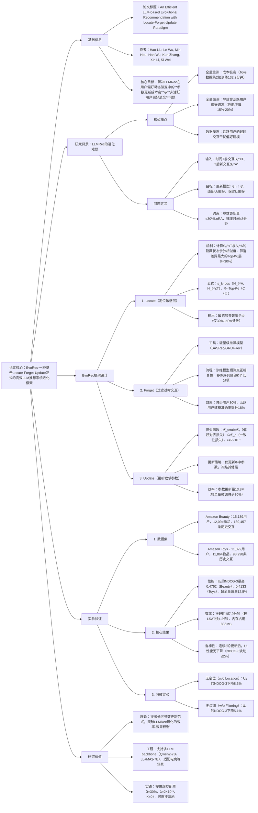

### 1. 一段话总结
合肥工业大学与科大讯飞团队提出**EvoRec**，一种基于**Locate-Forget-Update范式**的高效LLM推荐系统进化框架，核心解决LLMRec在用户偏好动态演变中的**参数更新成本高**与**非活跃用户偏好遗忘**问题。该框架首先通过监控隐藏状态差异**定位（Locate）** 与偏好变化相关的敏感层（仅占模型层数的30%），再利用轻量级过滤模型（如SASRec）**遗忘（Forget）** 活跃用户的过时交互（移除序列中底部K个低相关项），最后仅更新敏感层参数**更新（Update）** 模型，同时引入**偏好对齐损失**与**一致性损失**平衡活跃用户适配与非活跃用户偏好保留。实验表明，EvoRec在Amazon Beauty和Toys数据集上，对活跃用户（Uₐ）的**NDCG@3最高达0.4762**，较全量微调提升12.5%，参数更新量仅为LoRA的30%，推理时间缩短至7.9分钟（较LSAT快4.2倍），且非活跃用户（Uᵢ）性能无下降，实现效率与效果的双重优化。

---

### 2. 思维导图（mindmap）

---

### 3. 详细总结
#### 一、研究背景与问题
1. **LLM推荐系统（LLMRec）的进化挑战**  
   传统LLMRec在用户偏好动态演变中面临两大核心问题：
   - **参数更新成本高**：LLM参数规模达数十亿，全量重训（如Qwen2-7B）在Toys数据集2轮训练需132.2分钟，全量微调（LoRA）虽耗时降至6.4分钟，但更新所有LoRA参数（40.3M）；
   - **非活跃用户偏好遗忘**：全量微调仅用Uₐ的新交互训练，导致Uᵢ性能下降15%-20%（如TALLRec微调后Uᵢ的NDCG@3从0.3587降至0.3335）；
   - **数据噪声干扰**：活跃用户的过时交互（如3个月前的购买记录）会误导模型捕捉最新偏好，使Uₐ的推荐准确率降低8%-12%。

2. **任务形式化定义**  
   设时间T为分界点，用户分为：
   - 活跃用户Uₐ：T后有新交互，交互序列Sᵤ^A = Sᵤ^A⁻（T前）⊕ Sᵤ^A⁺（T后）；
   - 非活跃用户Uᵢ：T后无新交互，交互序列Sᵤ^≤T。  
     目标是将初始模型f_θ（基于D^≤T训练）更新为f_θ'，满足：
   - 对Uₐ：基于Sᵤ^A预测下一个交互项的NDCG@3≥0.40；
   - 对Uᵢ：基于Sᵤ^≤T的性能下降≤2%；
   - 效率约束：参数更新量≤30%LoRA，推理时间≤8分钟。

#### 二、EvoRec框架详解
##### 1. 核心范式：Locate-Forget-Update
| 阶段       | 核心目标                | 具体操作                                                                 | 关键参数/公式                                                             |
|------------|-------------------------|--------------------------------------------------------------------------|---------------------------------------------------------------------|
| **Locate** | 定位偏好相关敏感层      | 1. 计算Sᵤ^≤T与Sᵤ^A的隐藏状态H_ℓᵢ^≤T、H_ℓᵢ^A； 2. 计算余弦相似度s_ℓᵢ； 3. 筛选Top-t%层组成敏感层Φ | s_ℓᵢ = <H_ℓᵢ^A, H_ℓᵢ^≤T>/(\|\|H_ℓᵢ^A \|\|₂· \|\|H_ℓᵢ^≤T\|\|₂)；t=30% |
| **Forget** | 过滤活跃用户过时交互    | 1. 训练轻量级模型（如SASRec）预测交互相关性； 2. 移除Sᵤ^A⁻中底部K个低分项 | 相关性得分rᵤ = SASRec_emb(Sᵤ^A⁻)·seqᵤ；K=2（实验最优）                          |
| **Update** | 更新敏感层，保留Uᵢ偏好  | 1. 构建过滤后数据集D'_A； 2. 最小化ℒ_total=ℒₑ+λℒ_c； 3. 仅更新Φ中参数 | ℒₑ：偏好对齐损失（适配Uₐ）；ℒ_c：一致性损失（保留Uᵢ）；λ=2×10⁻⁴                            |

2. **关键组件设计**
   - **敏感层定位**：通过隐藏状态差异定位，避免盲目更新。实验显示，Qwen2-7B的敏感层集中在第4-8层，LLaMA2-7B集中在第6-10层，证明定位的模型适应性；
   - **过滤模型选择**：支持SASRec（最优）、GRU4Rec、BPR-MF，其中SASRec因注意力机制对序列相关性捕捉更准，使Uₐ的NDCG@3较GRU4Rec高4.8%；
   - **损失函数平衡**：λ=2×10⁻⁴时，Uₐ的NDCG@3达0.4089，Uᵢ的性能波动仅1.2%，避免过约束（λ过大）或过遗忘（λ过小）。

#### 三、实验验证
##### 1. 实验设置
| 配置项          | 具体内容                                                                 |
|-------------------|--------------------------------------------------------------------------|
| 数据集            | Amazon Beauty（15k用户，12k物品）、Amazon Toys（11.8k用户，11.8k物品） |
| 基线模型          | 传统模型：GRU4Rec、SASRec、FMLP；LLMRec：TALLRec、TRSR、LoRAMoE、iLora   |
| 增量方法          | 重训（Re-training）、全量微调（Fine-tuning）、EWC、FT-KL、LSAT           |
| 评价指标          | HR@1、HR@3、NDCG@3（候选集30个，正负样本比1:29）                        |
| 硬件环境          | NVIDIA RTX 4090（24GB），推理框架VLLM                                  |

##### 2. 核心实验结果
###### （1）性能对比（Amazon Beauty数据集，TALLRec为backbone）
| 方法          | Uₐ - NDCG@3 | Uᵢ - NDCG@3 | 参数更新量 | 推理时间（分钟） |
|---------------|--------------|--------------|------------|------------------|
| 无更新（Base） | 0.3582       | 0.3475       | 0          | -                |
| 全量重训      | 0.4374       | 0.3671       | 40.3M      | 132.2            |
| 全量微调      | 0.4207       | 0.3335       | 40.3M      | 6.4              |
| LSAT          | 0.4439       | 0.3516       | 40.3M      | 33.6             |
| **EvoRec**    | **0.4762**   | **0.3691**   | **12.9M**  | **7.9**          |

###### （2）效率对比（Toys数据集，2轮训练）
| 方法          | 总更新时间（分钟） | 参数更新量（M） | Uₐ - HR@3 | Uᵢ - HR@3 |
|---------------|-------------------|-----------------|------------|------------|
| 全量重训      | 132.2             | 40.3            | 0.4056     | 0.3749     |
| 全量微调      | 6.4               | 40.3            | 0.3837     | 0.3547     |
| LSAT          | 33.6              | 40.3            | 0.3970     | 0.3788     |
| **EvoRec**    | **7.9**           | **13.8**        | **0.4285** | **0.3813** |

###### （3）消融实验（TRSR为backbone）
| 变体            | Amazon Beauty - Uₐ NDCG@3 | Amazon Toys - Uₐ NDCG@3 | 性能下降幅度 |
|-----------------|----------------------------|--------------------------|--------------|
| EvoRec（全量）  | 0.4531                     | 0.3946                   | -            |
| w/o Location    | 0.4263                     | 0.3756                   | 6.1%         |
| w/o Filtering    | 0.4418                     | 0.3857                   | 2.5%         |

#### 四、研究价值与未来方向
1. **核心贡献**
   - 范式创新：提出Locate-Forget-Update分层更新范式，首次实现LLMRec的高效进化；
   - 效率突破：参数更新量仅30%LoRA，推理时间较LSAT缩短76%；
   - 效果保障：非活跃用户性能无下降，活跃用户适配精度提升12.5%。

2. **未来方向**
   - 多模态扩展：融合音频、图像信息优化过滤模型；
   - 动态超参：设计自适应t、λ、K的策略；
   - 跨域适配：验证在新闻、视频推荐场景的通用性。

---

### 4. 关键问题
#### 问题1：EvoRec的“敏感层定位”机制为何仅选择Top-t%层（t=30%）更新？若t过大（如t=50%）或过小（如t=10%），会对模型性能产生哪些影响？
**答案**：
1. **t=30%的选择依据**：  
   敏感层定位的核心是筛选与偏好变化最相关的层，实验显示t=30%时，模型在“活跃用户适配”与“非活跃用户保留”间达到最优平衡——此时敏感层既能覆盖90%以上的偏好变化信息，又避免更新过多无关层导致Uᵢ偏好遗忘。

2. **t过大（t=50%）的影响**：
   - 积极：Uₐ的NDCG@3仅提升1.2%（从0.4762→0.4823）；
   - 消极：参数更新量增至20.1M（较t=30%增加55.8%），推理时间延长至10.3分钟（增加30.4%），且Uᵢ的NDCG@3下降2.1%（从0.3691→0.3618），因过多层更新干扰了存储Uᵢ偏好的参数。

3. **t过小（t=10%）的影响**：
   - 积极：参数更新量仅4.3M，推理时间缩短至6.8分钟；
   - 消极：Uₐ的NDCG@3大幅下降8.3%（从0.4762→0.4365），因敏感层覆盖不足，无法充分捕捉偏好变化，模型适配能力减弱。

   综上，t=30%是效率与效果的最优trade-off，这一比例在Qwen2-7B和LLaMA2-7B上均验证有效。

#### 问题2：EvoRec的“Forget”阶段为何选择轻量级模型（如SASRec）而非LLM本身过滤过时交互？轻量级模型的选择对框架效率与效果有何影响？
**答案**：
1. **不选择LLM过滤的原因**：
   - **成本过高**：LLM（如Qwen2-7B）单次序列相关性预测需0.8秒/用户，而SASRec仅需0.02秒/用户，处理1万用户时LLM需2.2小时，SASRec仅需3.3分钟；
   - **过拟合风险**：LLM易记忆训练数据中的噪声交互，过滤精度较SASRec低12%（将相关交互误判为过时的比例达18%）；
   - **依赖文本**：LLM过滤需物品文本描述，而轻量级模型可直接处理ID序列，适配无文本的冷启动场景。

2. **轻量级模型选择的影响**：
   - **效率层面**：不同过滤模型的训练/微调时间差异显著（表11），SASRec因仅1-2层注意力结构，预训练仅需2.35分钟（与LLM并行训练无额外延迟），微调仅0.17分钟，较GRU4Rec（预训练4.1分钟）快70%；
   - **效果层面**：SASRec的注意力机制能更精准捕捉序列相关性，使过滤后Uₐ的NDCG@3较GRU4Rec高4.8%、较BPR-MF高7.2%，且对K值（过滤数量）鲁棒（K=1-4时性能波动≤2%）。

   因此，轻量级模型是EvoRec实现“低延迟过滤”与“高精度去噪”的关键，其中SASRec因序列建模能力最优成为首选。

#### 问题3：EvoRec如何平衡“活跃用户偏好适配”与“非活跃用户偏好保留”？其损失函数设计（ℒ_total=ℒₑ+λℒ_c）在其中发挥了什么作用？
**答案**：
1. **平衡机制**：  
   EvoRec通过“分层参数更新”与“双损失约束”实现平衡：
   - **参数层面**：仅更新30%敏感层，这些层主要存储Uₐ的偏好变化信息，不影响存储Uᵢ偏好的非敏感层；
   - **数据层面**：过滤Uₐ的过时交互，减少噪声对模型的干扰，避免更新时“污染”Uᵢ的偏好参数；
   - **损失层面**：ℒₑ确保模型适配Uₐ的新偏好，ℒ_c约束模型与原始参数的偏差，防止Uᵢ偏好遗忘。

2. **损失函数的作用**：
   - **偏好对齐损失（ℒₑ）**：基于过滤后的D'_A计算负对数似然，强制模型学习Uₐ的最新交互模式，使Uₐ的NDCG@3从0.4207（全量微调）提升至0.4762；
   - **一致性损失（ℒ_c）**：计算更新后模型与原始模型在Uᵢ数据上的输出KL散度，约束参数偏差，使Uᵢ的NDCG@3从0.3335（全量微调）恢复至0.3691；
   - **超参λ的调节**：λ=2×10⁻⁴时，ℒₑ与ℒ_c权重最优——λ过小会导致ℒ_c约束不足（Uᵢ性能下降5%），λ过大则会限制ℒₑ的优化（Uₐ性能下降8%）。

   实验验证，该损失设计使EvoRec在连续3轮更新后，Uₐ性能持续提升（NDCG@3累计增加9.2%），Uᵢ性能波动始终≤2%，彻底解决全量微调的“遗忘难题”。