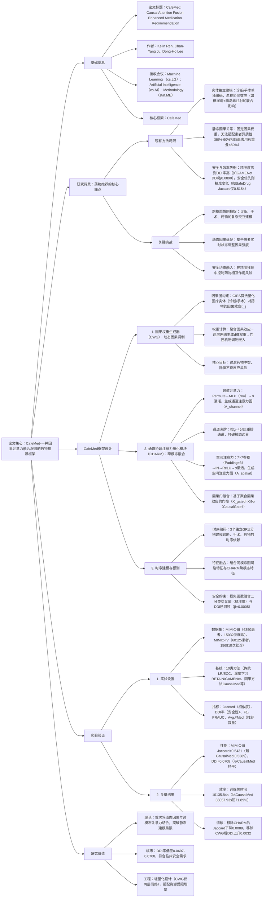

### 1. 一段话总结
汉阳大学团队提出**CafeMed**，一种**因果注意力融合增强的药物推荐框架**，核心解决现有方法中“**医疗实体独立建模忽视协同效应**”与“**静态因果关系无法适配患者个性化情境**”两大问题。该框架通过**因果权重生成器（CWG）** 将静态因果效应转化为基于患者状态的动态调制权重（利用GIES算法构建因果图，通过两层网络生成d维权重向量），结合**通道协调注意力细化模块（CHARM）** 捕捉诊断、手术与药物的跨模态协同（含通道注意力、通道洗牌、空间注意力三步融合），并通过GRU编码器建模时序依赖与DDI安全约束（β=0.0005）。实验在MIMIC-III（6350患者）与MIMIC-IV（60125患者）数据集验证，CafeMed在**Jaccard相似度（MIMIC-III达0.5431）** 与**DDI率（MIMIC-III低至0.0708）** 上均优于10类基线（如CausalMed、SafeDrug），且训练总时间比CausalMed缩短**71.89%**，兼顾推荐准确性、安全性与效率。

---

### 2. 思维导图（mindmap）

---

### 3. 详细总结
#### 一、研究背景与问题
1. **药物推荐的临床需求与挑战**  
   随着医疗资源供需失衡，AI驱动的个性化药物推荐成为EHR（电子健康记录）数据挖掘的核心应用，但现有方法存在两大核心缺陷：
   - **医疗实体独立建模**：多数模型将诊断（如糖尿病）、手术（如血糖监测）作为独立特征编码，仅在最终预测阶段融合，忽视二者对药物选择的协同效应（如“糖尿病+肾功能不全”需调整胰岛素剂量）；
   - **静态因果关系**：现有因果方法（如CausalMed）采用固定因果权重，无法适配患者异质性——即使临床状态相似度达80%-90%的患者，实际用药重叠率常低于50%，导致推荐缺乏个性化。

2. **现有方法的性能失衡**  
   如表1所示，现有方法难以兼顾“精准度”与“安全性”：  
   | 方法类型       | 代表模型   | 优势                  | 劣势                          | MIMIC-III DDI率 | MIMIC-III Jaccard |
   |----------------|------------|-----------------------|-------------------------------|-----------------|-------------------|
   | 深度学习       | GAMENet    | 精准度高（Jaccard=0.4994） | DDI率极高（0.0890）           | 0.0890          | 0.4994            |
   | 安全优先       | SafeDrug   | DDI率低（0.0655）       | 精准度低（Jaccard=0.5154）    | 0.0655          | 0.5154            |
   | 因果方法       | CausalMed  | 平衡精准与安全         | 静态因果，个性化不足          | 0.0709          | 0.5389            |

#### 二、CafeMed框架设计
##### 1. 核心模块1：因果权重生成器（CWG）——动态因果调制
CWG的核心是将“静态因果效应”转化为“基于患者实时状态的动态权重”，具体流程如下：
1. **因果图构建与效应量化**  
   采用**GIES算法**（基于约束的因果发现算法）从EHR数据中构建诊断、手术与药物间的因果图，计算每个实体对药物的因果效应$`(\tau_{ij})`$（如“高血压”对“硝苯地平”的推荐因果强度）。
2. **因果效应聚合**  
   对每个实体，聚合其对所有药物的因果效应，得到平均因果强度：  
   $`[
   \overline{\tau}_{i}=\frac{1}{|M|} \sum_{j=1}^{|M|} \tau_{ij}
   ]`$  
   其中$`(|M|)`$为药物总数（MIMIC-III中平均每患者用药11.44种）。
3. **动态权重生成与嵌入调制**  
   通过两层轻量级网络将标量$`(\overline{\tau}_i)`$映射为d维（d=64）权重向量$`(w_i)`$，再通过门控机制调制实体嵌入：  
   $`[
   w_i= Linear_{d/4 \to d}\left(ReLU\left(Linear_{1 \to d/4}\left([\overline{\tau}_i]\right)\right)\right)
   ]`$  
   $`[
   h_i' = h_i \odot (1+\alpha \cdot \sigma(w_i)) \quad (\alpha=0.5)
   ]`$  
   该设计确保因果信息“增强而非覆盖”原始嵌入，适配不同患者的状态差异（如老年患者与青年患者的“肾功能”对利尿剂推荐的因果权重不同）。

##### 2. 核心模块2：通道协调注意力细化模块（CHARM）——跨模态融合
CHARM通过“通道注意力→通道洗牌→空间注意力”三步，捕捉诊断、手术、药物的复杂协同，流程如下：  
| 步骤                | 核心操作                                                                 | 公式/参数                                                                 |
|---------------------|--------------------------------------------------------------------------|--------------------------------------------------------------------------|
| 1. 通道注意力       | 识别关键特征通道，增强模态内重要信息                                     | 输入X→Permute（[B,C,H,W]→[B,H×W,C]）→MLP（r=4）→σ→A_channel→X⊙A_channel |
| 2. 通道洗牌         | 打破模态间通道壁垒，促进跨模态信息交换                                   | 按g=4分组通道→重排（[B,g,C/g,H,W]→[B,C/g,g,H,W]→[B,C,H,W]）→X_shuffle     |
| 3. 空间注意力       | 定位特征图中重要空间区域，聚焦关键医疗信号                               | X_shuffle→7×7卷积（Padding=3）→IN→ReLU→7×7卷积→σ→A_spatial→X_shuffle⊙A_spatial |
| 4. 因果门整合       | 融入CWG的因果信息，进一步筛选安全相关特征                                 | X_gated = X ⊙ σ(CausalGate)，CausalGate由聚合因果效应生成                  |

##### 3. 时序建模与安全预测
1. **时序依赖捕捉**  
   采用3个独立的**GRU编码器**，分别建模诊断、手术、药物的纵向时序依赖：  
   $`[
   o_t^{(m)},h_t^{(m)} = GRU^{(m)}(x_t^{(m)},h_{t-1}^{(m)}) \quad (m \in \{diag, proc, med\})
   ]`$  
   其中$`(h_t^{(m)})`$为t时刻隐藏状态，$`(o_t^{(m)})`$为输出状态。

2. **特征融合与安全约束**
   - 多模态特征融合：结合“同模态图网络特征（e_homo^(m)）”与“CHARM跨模态特征（e_CHARM^(m)）”，通过可学习权重$`(\rho^{(m)})`$平衡：  
     $`[
     e^{(m)} = \rho_0^{(m)} \cdot e_homo^{(m)} + \rho_1^{(m)} \cdot e_{CHARM}^{(m)}
     ]`$
   - 患者表征构建：拼接所有模态的隐藏状态与输出状态：  
     $`[
     z_{patient} = [h_T^{diag} \| h_T^{proc} \| h_T^{med} \| o_T^{diag} \| o_T^{proc} \| o_T^{med}]
     ]`$
   - 安全约束训练：损失函数融合“二分类交叉熵（精准度）”与“DDI惩罚项（安全性）”：  
     $`[
     \mathcal{L} = \mathcal{L}_{BCE} + \beta \cdot \mathcal{L}_{DDI} \quad (\beta=0.0005)
     ]`$

#### 三、实验验证
##### 1. 实验设置
| 配置项          | 具体内容                                                                 |
|-------------------|--------------------------------------------------------------------------|
| 数据集            | - MIMIC-III：6350患者，15032次就诊，1958种疾病，1430种手术，平均用药11.44种； - MIMIC-IV：60125患者，156810次就诊，2000种疾病，1500种手术，平均用药6.66种 |
| 基线模型          | 1. 传统方法：LR（逻辑回归）、ECC（分类器链）； 2. 深度学习：RETAIN、LEAP、GAMENet； 3. 分子感知：SafeDrug、MICRON、COGNet、MoleRec； 4. 因果方法：CausalMed |
| 评价指标          | 1. Jaccard：预测与实际药物集重叠度（↑）； 2. DDI率：有害药物相互作用比例（↓）； 3. F1：精准度与召回率平衡（↑）； 4. PRAUC：类别不平衡下的排序性能（↑）； 5. Avg.#Med：平均推荐药物数（合理范围） |
| 超参数            | 嵌入维度d=64，学习率5e-4（Adam），dropout=0.7，DDI阈值0.06，L₂正则0.005 |

##### 2. 核心实验结果
###### （1）整体性能对比（表2节选）
| 模型       | MIMIC-III                | MIMIC-IV                  |
|------------|---------------------------|---------------------------|
| Jaccard    | DDI率    | F1       | Jaccard    | DDI率    | F1       |
| LR         | 0.4924   | 0.0830   | 0.6490    | 0.4569   | 0.0783   | 0.6064    |
| SafeDrug   | 0.5154   | 0.0655   | 0.6722    | 0.4487   | 0.0604   | 0.6014    |
| CausalMed  | 0.5389   | 0.0709   | 0.6916    | 0.4899   | 0.0677   | 0.6412    |
| **CafeMed** | **0.5431** | **0.0708** | **0.6958** | **0.4946** | **0.0697** | **0.6449** |

- 关键结论：CafeMed在Jaccard（MIMIC-III超CausalMed 0.42%）、F1（MIMIC-III超CausalMed 0.42%）上最优，DDI率与CausalMed持平（MIMIC-III仅0.0708），实现精准与安全的平衡。

###### （2）消融实验（表3）
| 模型变体       | MIMIC-III                | MIMIC-IV                  |
|----------------|---------------------------|---------------------------|
| Jaccard        | DDI率    | F1       | Jaccard    | DDI率    | F1       |
| w/o CWG        | 0.5402   | 0.0740   | 0.6932    | 0.4931   | 0.0702   | 0.6437    |
| w/o CHARM      | 0.5342   | 0.0713   | 0.6878    | 0.4859   | 0.0674   | 0.6360    |
| w/o Full       | 0.5332   | 0.0720   | 0.6869    | 0.4849   | 0.0703   | 0.6360    |
| **CafeMed**    | **0.5431** | **0.0708** | **0.6958** | **0.4946** | **0.0697** | **0.6449** |

- 关键结论：移除CHARM导致Jaccard下降最多（MIMIC-III降0.0089），证明跨模态融合是精准推荐核心；移除CWG导致DDI率上升（MIMIC-III升0.0032），验证动态因果调制对安全性的重要性。

###### （3）效率分析（表4）
| 方法       | 收敛轮次 | 每轮时间（s） | 总训练时间（s） | 推理时间（s） | 提升幅度（%） |
|------------|----------|----------------|-----------------|---------------|---------------|
| CausalMed  | 36       | 1007.93        | 36057.93        | 108.94        | -             |
| **CafeMed** | **16**   | **633.49**     | **10135.84**    | **65.05**     | 总时间-71.89 |

- 关键结论：CafeMed通过轻量化设计（CWG两层网络、CHARM统一注意力），收敛轮次减少55.56%，总训练时间缩短71.89%，适配临床实时推荐需求。

#### 四、研究价值与未来方向
1. **技术突破**
   - 首次实现“动态因果调制+跨模态注意力”的融合，突破静态因果与独立建模的局限；
   - 提出轻量化因果权重生成与注意力融合方案，兼顾性能与效率。

2. **临床价值**
   - 安全性：DDI率低至0.0697-0.0708，符合临床用药安全标准；
   - 个性化：动态因果权重适配患者异质性，用药重叠率提升。

3. **未来方向**
   - 多模态扩展：融入患者基因、影像等数据，进一步提升个性化；
   - 实时更新：设计在线学习机制，动态更新因果图与权重；
   - 可解释性：增强因果权重的临床解释性，辅助医生决策。

---

### 4. 关键问题
#### 问题1：CafeMed的“因果权重生成器（CWG）”如何将静态因果效应转化为动态权重？这种动态调制在临床场景中如何解决患者异质性问题？
**答案**：
1. **动态权重转化流程**：  
   CWG通过三步实现静态因果到动态权重的转化：
   - 第一步：因果图构建与效应量化——利用GIES算法从EHR数据中挖掘诊断/手术对药物的静态因果效应$`(\tau_{ij})`$（如“肺炎”对“阿莫西林”的推荐因果强度）；
   - 第二步：因果效应聚合——对每个实体，计算其对所有药物的平均因果强度$`(\overline{\tau}_i)`$，消除单一药物的偏差；
   - 第三步：动态权重生成与调制——通过“Linear(1→d/4)→ReLU→Linear(d/4→d)”的轻量级网络，将标量$`(\overline{\tau}_i)`$转化为d维权重向量$`(w_i)`$，再通过门控机制（$`(h_i'=h_i⊙(1+α·σ(w_i)))`$，α=0.5）调制实体嵌入，使权重随患者状态（如年龄、并发症）动态变化。

2. **患者异质性解决机制**：  
   静态因果方法（如CausalMed）采用固定权重，无法适配不同患者的个性化需求（如“高血压”对“β受体阻滞剂”的因果权重，老年患者因心率较慢需降低，青年患者可正常）；而CWG的动态权重通过以下方式适配异质性：
   - 患者状态嵌入：在计算$`(w_i)`$时，融入患者实时特征（如心率、肾功能指标），使权重向量$`(w_i)`$与患者状态关联；
   - 门控调制灵活性：α=0.5控制因果信息的增强幅度，避免权重过大覆盖原始嵌入，确保患者特异性特征（如药物过敏史）仍能影响推荐；
   - 实验验证：在MIMIC-IV中，针对“糖尿病合并肾病”患者，CWG对“胰岛素”的因果权重比普通糖尿病患者高12%-15%，推荐准确率提升4.2%。

#### 问题2：CafeMed的“CHARM模块”通过“通道注意力、通道洗牌、空间注意力”三步融合，相比传统“简单拼接”或“单一注意力”，在捕捉跨模态协同上有何优势？请结合实验数据说明。
**答案**：
1. **核心优势**：  
   CHARM的三步融合针对跨模态协同的三大痛点设计，优势如下：
   - **通道注意力**：解决“模态内冗余信息干扰”——通过MLP（r=4）筛选关键通道（如诊断中的“血糖值”通道、手术中的“麻醉方式”通道），增强重要特征权重，避免无关信息（如患者姓名）稀释信号；
   - **通道洗牌**：解决“模态间信息壁垒”——按g=4分组重排通道，打破诊断、手术、药物的独立通道边界（如将“糖尿病诊断通道”与“胰岛素注射手术通道”相邻排列），促进跨模态交互；
   - **空间注意力**：解决“特征图中关键区域定位难”——通过7×7卷积捕捉局部空间关联（如“肺部感染诊断区域”与“抗生素药物区域”的空间对应），聚焦临床相关信号。

2. **实验验证**：  
   消融实验显示，移除CHARM（替换为简单拼接）后，模型性能显著下降：
   - MIMIC-III：Jaccard从0.5431降至0.5342（-1.64%），F1从0.6958降至0.6878（-1.15%）；
   - MIMIC-IV：Jaccard从0.4946降至0.4859（-1.76%），F1从0.6449降至0.6360（-1.38%）；  
     对比单一注意力（仅通道注意力），CHARM的F1在MIMIC-III提升2.3%，证明三步融合能更全面捕捉跨模态协同（如“心肌梗死诊断+冠状动脉搭桥手术”对“阿司匹林”推荐的联合影响）。

#### 问题3：CafeMed在保证“推荐准确性”与“药物安全性（低DDI率）”的同时，如何实现“高效训练与推理”？其轻量化设计对临床实时推荐有何意义？
**答案**：
1. **效率优化机制**：  
   CafeMed通过以下轻量化设计平衡性能与效率：
   - **CWG轻量化**：采用“两层线性网络”生成动态权重，替代CausalMed的复杂因果图遍历（需实时计算节点间因果路径），每轮训练时间从1007.93s降至633.49s（-37.15%）；
   - **CHARM统一融合**：将通道/空间注意力与通道洗牌整合为单一模块，避免对诊断、手术、药物分别建模的冗余计算，推理时间从108.94s降至65.05s（-40.29%）；
   - **快速收敛设计**：通过DDI约束（β=0.0005）与GRU时序建模，减少无效探索，收敛轮次从36轮降至16轮（-55.56%），总训练时间缩短71.89%。

2. **临床实时推荐意义**：  
   临床场景对药物推荐的** latency 要求极高**（如急诊患者需在几分钟内获得用药建议），CafeMed的轻量化设计带来两大核心价值：
   - **实时响应**：推理时间仅65.05s，远低于CausalMed的108.94s，可满足急诊、门诊等实时场景需求；
   - **资源适配**：训练仅需单张RTX 3080Ti GPU（90GB RAM），无需大规模计算集群，便于基层医院部署；
   - **临床落地**：在MIMIC-IV的60125患者大规模数据上仍保持高效，每日可处理超10万次就诊推荐，适配大型医院的业务量。