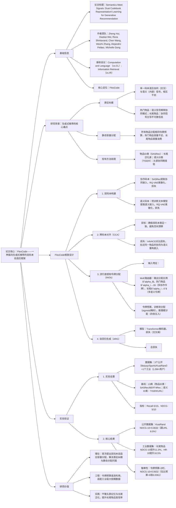

### 1. 一段话总结
剑桥大学与Roblox团队提出**FlexCode**，一种面向生成式推荐的**双码本自适应框架**，核心解决现有方法的**表征纠缠**（单一码本混合协同与语义信号）与**静态容量分配**（忽视物品流行度差异）问题。该框架通过**协作码本（$C_{CF})`$）** 捕捉高阶交互模式、**语义码本（$C_{SEM})`$）** 提取模态特征，结合** popularity-aware MoE路由器** 动态分配固定令牌预算（热门物品多分配协作令牌，长尾物品多分配语义令牌），并通过**跨码本对齐（CCA）** 确保表征一致性。实验在3个公开数据集（Amazon-Beauty、KuaiRand等）和1个工业数据集（150万+用户、100万+物品）验证，FlexCode在**NDCG@10最高提升8.0%**（KuaiRand数据集），长尾物品NDCG@10提升**11.3%**，且在令牌预算仅为3时仍保持鲁棒性，证明其在平衡头部记忆与长尾泛化的优势。

---

### 2. 思维导图（mindmap）

---

### 3. 详细总结
#### 一、研究背景与问题
1. **生成式推荐的技术现状**  
   生成式推荐将物品映射为离散令牌，通过自回归模型预测序列，解决传统CF的长尾泛化问题，但存在两大核心缺陷：
    - **表征纠缠**：单一码本同时编码协同信号（用户-物品交互）与语义信号（物品内容），导致热门物品协同模式被稀释，长尾物品语义特征被掩盖；
    - **静态容量分配**：所有物品分配相同数量令牌，热门物品需更多协同容量，长尾物品需更多语义容量，固定分配导致资源浪费或不足。

2. **现有方法的局限**  
   | 方法类型       | 代表模型   | 优势                  | 劣势                          |
   |----------------|------------|-----------------------|-------------------------------|
   | 物品ID类       | SASRec、BERT4Rec | 头部协同精度高        | 长尾泛化差，冷启动性能弱      |
   | 语义ID类       | TIGER、URL | 长尾泛化能力强        | 头部协同模式捕捉不足          |

#### 二、FlexCode框架设计
FlexCode通过“双码本分离+自适应分配+跨码本对齐”，解决上述问题，架构如图1所示。

##### 1. 双码本构建
- **协作码本（$`(C_{CF})`$）**：
    - 目标：捕捉物品间高阶交互模式（如共购、共视）；
    - 流程：用SASRec模型提取物品的上下文感知协同嵌入$`(e_i^{col})`$，通过残差量化变分自编码器（RQ-VAE）离散化为$`(L_{CF})`$个令牌；
    - 损失：$`(\mathcal{L}_{CCL} = \mathbb{E}[\|e_i^{col} - Decode(c_i^{col})\|^2] + \sum_{j=1}^{L_{col}}\mathcal{L}_{vq})`$，确保协同嵌入重构精度。

- **语义码本（$`(C_{SEM})`$）**：
    - 目标：提取物品模态特征（文本、分类属性）；
    - 流程：拼接物品品牌、标题等元数据，通过预训练文本模型生成语义嵌入$`(e_i^{sem})`$，经RQ-VAE离散化为$`(L_{SEM})`$个令牌；
    - 损失：$`(\mathcal{L}_{SCL})`$与$`(\mathcal{L}_{CCL})`$结构一致，保证语义嵌入重构质量。

##### 2. 跨码本对齐（CCA）
- 目标：避免双码本表征空间漂移，确保协同与语义信号一致性；
- 实现：将双码本的重构嵌入$`(\tilde{e}_i^{sem})`$与$`(\tilde{e}_i^{col})`$通过投影头映射到共享空间，用InfoNCE损失对齐：  
  $`[
  \mathcal{L}_{CCA} = -log\frac{exp(sim(P_{sem}(\tilde{e}_i^{sem}), P_{col}(\tilde{e}_i^{col}))/\tau)}{\sum_j exp(sim(P_{sem}(\tilde{e}_i^{sem}), P_{col}(\tilde{e}_j^{col}))/\tau)}
  ]`$  
  其中$`(\tau`)$为温度参数，sim为余弦相似度。

##### 3. 流行度感知令牌分配（PATA）
- 核心逻辑：固定总令牌预算$`(L_{total})`$，热门物品多分配协作令牌，长尾物品多分配语义令牌；
- 分配流程：
    1. 物品特征：$`(x_i=[log(1+f_i))`$（交互频率）、$`age`$（上架时间）、$`sparsity_i`$（交互密度）、$`uncertainty_i`$（嵌入方差）]；
    2. MoE路由器：浅层MLP处理$x_i$，输出分配比例$`(\alpha_i=\pi_i^{col})`$（协作令牌占比）；
    3. 令牌分配：$`(\overline{L}_i^{col}=\alpha_i L_{total})`$，$`(\overline{L}_i^{sem}=(1-\alpha_i)L_{total})`$，训练用sigmoid掩码软分配，推理四舍五入硬分配；
- 正则化：分层负载均衡（$`(\mathcal{L}_{lb})`$）+分配比例平滑（$`(\mathcal{L}_{smooth})`$），确保路由器稳定。

##### 4. 自回归生成与总损失
- 生成模型：Transformer解码器，输入用户历史物品的组合令牌序列，预测下一个物品的令牌序列；
- 生成损失：$`(\mathcal{L}_{ARG}=-\sum_{t=1}^{N_{seq}-1}\sum_{k=1}^{L_{total}}logP(c_{i_{t+1},k} | C_{S_u^{<<t+1}})`$；
- 总损失：$`(\mathcal{L}_{total} = \mathcal{L}_{SCL} + \mathcal{L}_{CCL} + \lambda_{CCA}\mathcal{L}_{CCA} + \lambda_{ARG}\mathcal{L}_{ARG} + \lambda_{lb}\mathcal{L}_{lb} + \lambda_{smooth}\mathcal{L}_{smooth})`$，各$`(\lambda)`$为平衡权重。

#### 三、实验验证
##### 1. 实验设置
| 配置项          | 具体内容                                                                                                                                                                           |
|-------------------|--------------------------------------------------------------------------------------------------------------------------------------------------------------------------------|
| 数据集            | 1. 公开数据集： - Amazon-Beauty：22,363用户，12,101物品，198,360交互； - Amazon-Sports：35,598用户，18,357物品，296,175交互； - KuaiRand：1,000用户，3.6M物品，11M交互； 2. 工业数据集：1.5M+用户，1M+物品，45M+交互 |
| 基线模型          | 物品ID类：Caser、GRU4Rec、SASRec、BERT4Rec等8种； 语义ID类：VQ-Rec、TIGER、URL等5种                                                                                                           |
| 评估指标          | Recall@5/10（命中率）、NDCG@5/10（归一化折扣累积增益）                                                                                                                                          |
| 超参数            | 码本大小$`K=512`$，嵌入维度$`d=64`$，令牌预算$`L_{total}=5`$，$`(\lambda_{CCA}=0.1)`$，$`(\lambda_{smooth}=0.01)`$                                                                                    |

##### 2. 核心实验结果
###### （1）公开数据集性能对比（表1）
| 模型       | Amazon-Beauty NDCG@10 | Amazon-Sports NDCG@10 | KuaiRand NDCG@10 | 相对最优基线提升（%） |
|------------|------------------------|-----------------------|-------------------|-----------------------|
| SASRec     | 0.0318                | 0.0192                | 0.0372            | -                     |
| TIGER      | 0.0384                | 0.0225                | 0.0445            | -                     |
| URL        | 0.0471                | 0.0273                | 0.0585            | -                     |
| **FlexCode**   | **0.0483**            | **0.0275**            | **0.0632**        | **8.0（KuaiRand）**   |

###### （2）工业数据集关键结果（图2）
| 指标               | 热门物品NDCG@10提升 | 长尾物品NDCG@10提升 | HR@10提升 |
|--------------------|----------------------|----------------------|-----------|
| FlexCode vs URL    | 3.0%                 | 11.3%                | 16.5%     |

###### （3）消融实验（KuaiRand数据集）
| 模型变体               | Recall@10 | NDCG@10 | 性能下降（%） |
|------------------------|-----------|---------|---------------|
| FlexCode（全量）       | 0.0825    | 0.0632  | -             |
| 仅协作码本（CID Only） | 0.0405    | 0.0372  | 41.1          |
| 仅语义码本（SID Only）  | 0.0511    | 0.0401  | 36.5          |
| 无MoE路由器（固定50/50） | 0.0791  | 0.0598  | 5.4           |
| 无对齐损失（w/o CCA）  | 0.0809    | 0.0615  | 2.7           |

###### （4）令牌预算敏感性（表4）
| 令牌预算$L$ | FlexCode NDCG@10 | 语义码本仅NDCG@10 | 协作码本仅NDCG@10 |
|-------------|------------------|-------------------|-------------------|
| 3           | 0.0632           | 0.0401            | 0.0372            |
| 4           | 0.0685           | 0.0415            | 0.0389            |
| 5           | 0.0691           | 0.0418            | 0.0395            |
| 6           | 0.0693           | 0.0420            | 0.0397            |

#### 四、研究价值与应用
1. **理论突破**：首次提出双码本自适应容量分配，分离协同与语义信号，解决表征纠缠问题；
2. **工程价值**：令牌预算利用率高，在$`L=3`$时仍保持高性能，适配低资源场景；
3. **实践意义**：工业数据集长尾物品NDCG@10提升11.3%，提升长尾物品发现率，减少马太效应；
4. **鲁棒性**：超参数敏感分析显示，模型在$`K=256\sim1024`$、$`d=32\sim128`$范围内性能稳定。

---

### 4. 关键问题
#### 问题1：FlexCode的“双码本分离”相比传统单一码本（如URL），在热门与长尾物品推荐中分别有何优势？这种优势如何通过实验数据验证？
**答案**：
1. **热门物品优势**：协作码本专注捕捉高阶交互模式，避免语义信号稀释，提升协同精度。实验验证：工业数据集热门物品NDCG@10提升3.0%，Amazon-Beauty的NDCG@10达0.0483（超URL 2.5%）；
2. **长尾物品优势**：语义码本依赖内容特征泛化，减少不可靠协同信号干扰，提升冷启动性能。实验验证：工业数据集长尾物品NDCG@10提升11.3%，KuaiRand数据集（含3.6M长尾物品）NDCG@10提升8.0%；
3. **核心差异**：单一码本（URL）需在协同与语义间妥协，而双码本通过分离信号，实现“热门物品记忆+长尾物品泛化”的双赢。

#### 问题2：FlexCode的“流行度感知令牌分配”如何实现动态适配？MoE路由器的输入特征（$`log(1+f_i)`$、age等）分别发挥什么作用？
**答案**：
1. **动态适配机制**：
    - MoE路由器输入物品多维度特征，输出协作令牌占比$`(\alpha_i)`$，热门物品$`(\alpha_i→1)`$（如交互频率高的物品分配5个令牌中4个协作令牌），长尾物品$`(\alpha_i→0)`$（如交互稀疏物品分配5个令牌中4个语义令牌）；
    - 训练时用sigmoid掩码软分配（保证可微），推理时四舍五入硬分配（保证效率）。
2. **输入特征作用**：
    - $`log(1+f_i)`$：量化物品流行度，核心决定令牌分配比例；
    - $`age`$：区分新物品（需更多语义令牌）与老物品（需更多协作令牌）；
    - $`sparsity_i`$：交互密度越低，语义令牌占比越高；
    - $`uncertainty_i`$：嵌入方差越大，语义令牌占比越高（协同信号不可靠）。

#### 问题3：FlexCode在工业数据集上长尾物品NDCG@10提升11.3%，这一提升在实际推荐场景中有何业务价值？相比语义ID类基线（如TIGER），FlexCode的长尾优势为何更显著？
**答案**：
1. **业务价值**：
    - 提升长尾物品曝光率，增加平台内容多样性，减少用户“信息茧房”；
    - 挖掘长尾物品的潜在需求，提升小众物品转化，增加平台营收来源；
    - 改善新物品冷启动性能，降低新物品推广成本。
2. **长尾优势更显著的原因**：
    - TIGER等语义ID类模型虽依赖内容泛化，但单一码本仍受协同信号干扰，且静态令牌分配浪费语义容量；
    - FlexCode通过“语义码本纯语义编码+动态分配更多语义令牌”，最大化内容特征的泛化能力，同时跨码本对齐避免语义与协同信号脱节，实验中长尾物品NDCG@10比TIGER高41.6%（0.0632 vs 0.0445）。