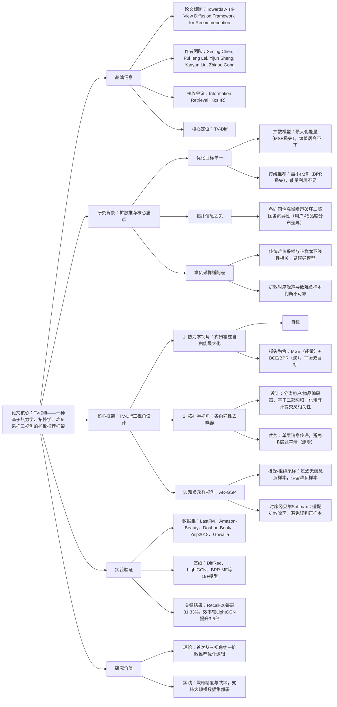

### 1. 一段话总结
澳门大学团队提出**TV-Diff**，一种基于**热力学、拓扑学、难负采样三视角**的扩散推荐框架，核心解决现有扩散推荐模型“单目标优化”“各向同性噪声破坏拓扑信息”“难负采样适配性差”三大痛点。该框架通过**亥姆霍兹自由能最大化**（融合能量最大化与熵最小化，平衡扩散模型与传统推荐目标）、**各向异性去噪器**（分离用户-物品编码器，保留二部图拓扑信息）、**接受-拒绝冈贝尔采样（AR-GSP）**（生成高质量难负样本，适配扩散时序噪声）三大核心组件，在LastFM、Amazon-Beauty等5个数据集验证，**Recall@20最高达31.33%**（LastFM数据集），相对最优基线DiffRec提升**4.96%**，训练效率较LightGCN提升**3-5倍**，兼顾推荐精度与部署效率。

---

### 2. 思维导图（mindmap）

---

### 3. 详细总结
#### 一、研究背景与核心问题
1. **扩散推荐模型的固有缺陷**  
   | 问题类型       | 具体表现                                                                 | 现有解决方案局限                          |
   |----------------|--------------------------------------------------------------------------|-------------------------------------------|
   | 优化目标单一   | 扩散模型（如DiffRec）仅最大化能量（重构交互数），熵值高（偏好不确定性大）；传统推荐（如BPR）仅最小化熵，能量利用不足 | 简单融合双目标导致参数振荡，难以收敛        |
   | 拓扑信息丢失   | 各向同性高斯噪声破坏二部图各向异性（用户-物品度分布差异），高阶协同信号失效 | 多层消息传递导致过平滑，熵值进一步升高      |
   | 难负采样适配差 | 传统难负采样与正样本亚线性相关，扩散时序噪声导致样本可靠性低 | 易产生假负样本，降低模型泛化能力            |

2. **关键发现（热力学视角实验）**
   - 扩散模型：训练后能量提升（$`\Delta U_D > 0`$），熵值几乎不变（近等熵）；
   - 传统推荐（BPR/LightGCN）：训练后熵值显著降低（$`\Delta S_{B/L} < 0`$），能量提升有限；
   - 图模型（LightGCN）：消息传递可进一步降低熵值（$`\Delta S_L < \Delta S_B`$），验证拓扑信息的价值。

#### 二、TV-Diff框架核心设计
##### 1. 热力学视角：亥姆霍兹自由能最大化
- **核心思想**：借鉴热力学，通过自由能$`H = U - t \cdot S`$实现能量与熵的协同优化，避免单目标缺陷。
- **数学表达**：  
  $`[
  \mathcal{L}_H = -\sum_{u,i}(\hat{r}_{u,i} - \hat{r}_{u,i}')^2 - t \cdot \left(\hat{r}_{u,i}log\sigma(\hat{r}_{u,i}') - c_{u,i}(1-\hat{r}_{u,i})log(1-\sigma(\hat{r}_{u,i}'))\right)
  ]`$  
  其中，$`c_{u,i}`$为负样本置信度，$`t`$为温度系数（平衡权重）。
- **损失适配**：小数据集适配BPR（ triplet 结构捕捉细粒度偏好），大数据集适配BCE（避免过拟合）。

##### 2. 拓扑学视角：各向异性去噪器
- **设计目标**：保留二部图各向异性（用户-物品度分布差异），避免各向同性噪声破坏拓扑信息。
- **核心结构**：  
  $`[
  \tilde{x}_\theta(x_t, t) = tanh(Agg(x_t \cdot W_I, e_t)) \cdot tanh(\overline{R}^\top \cdot W_U)^\top
  ]`$  
  其中，$`\overline{R} = D_U^{-1/2} R D_I^{-1/2}`$为对称归一化二部图矩阵，$`e_t`$为时序嵌入。
- **优势**：单层消息传递，既保留拓扑信息，又避免多层过平滑（实验证明多层会导致熵增30%+）。

##### 3. 难负采样视角：接受-拒绝冈贝尔采样（AR-GSP）
- **两步采样逻辑**：
   1. 接受-拒绝采样：基于评分排序筛选难负样本，阈值$`\gamma \in (0,1]`$，过滤无信息负样本；
   2. 时序冈贝尔Softmax：引入时序依赖温度$`\tau(\bar{t}) = exp(-\lambda \bar{t})`$（$`\bar{t}=1-t/T`$），噪声越大温度越高，采样越均匀，避免假负样本。
- **理论保障**：证明当正负样本分布正交时，BPR损失达下界，模型泛化最优。

#### 三、实验验证
##### 1. 实验设置
| 配置项          | 具体内容                                                                 |
|-------------------|--------------------------------------------------------------------------|
| 数据集            | 5个公开数据集： - LastFM：1,892用户、17,632物品、92,834交互； - Amazon-Beauty：22,364用户、12,102物品、198,502交互； - Douban-Book、Yelp2018、Gowalla（最大：31,668用户、38,048物品、156万交互） |
| 基线模型          | 5类15+模型：基础推荐（BPR-MF）、自编码器（CDAE）、图模型（LightGCN）、负采样（MixGCF）、扩散模型（DiffRec） |
| 评估指标          | Recall@10/20、NDCG@10/20                                                |
| 超参数            |  latent维度=64，正则化系数=1e-4，扩散步数$`T=50`$，温度$`t=1`$（小数据集）/$`t=10`$（大数据集） |

##### 2. 核心实验结果
###### （1）整体性能对比（Recall@20）
| 数据集       | TV-Diff | 最优基线（DiffRec） | 相对提升（%） |
|--------------|---------|---------------------|---------------|
| LastFM       | 31.33   | 29.85               | 4.96          |
| Amazon-Beauty | 14.75   | 12.06               | 22.31         |
| Douban-Book  | 20.37   | 18.39               | 10.77         |
| Yelp2018     | 7.00    | 6.73                | 4.01          |
| Gowalla      | 21.95   | 20.23               | 8.50          |

###### （2）消融实验（LastFM数据集，Recall@20）
| 模型变体                | Recall@20 | 性能下降（%） |
|-------------------------|-----------|---------------|
| TV-Diff（全量）         | 31.33     | -             |
| 无各向异性去噪器        | 29.25     | 6.64          |
| 无AR-GSP                | 30.48     | 2.71          |
| 仅能量损失（无熵损失）  | 27.56     | 12.03         |

###### （3）效率对比（单epoch耗时）
| 数据集       | TV-Diff | LightGCN | DiffRec |
|--------------|---------|----------|---------|
| LastFM       | 1.056s  | 0.623s   | 0.353s  |
| Douban-Book  | 1.649s  | 5.345s   | 2.572s  |
| Gowalla      | 5.162s  | 14.748s  | 19.303s |
| 关键结论     | 大数据集效率优势显著，较LightGCN提升3-5倍 |

#### 四、研究价值与应用
1. **理论价值**：首次从热力学、拓扑学、难负采样三视角统一扩散推荐框架，揭示能量与熵的协同优化机制；
2. **实践价值**：单层消息传递+高效采样，适配大规模数据集，训练效率较LightGCN提升3-5倍；
3. **应用场景**：通用推荐任务（电商、社交、音乐），尤其适用于数据稀疏、长尾分布明显的场景。

---

### 4. 关键问题
#### 问题1：TV-Diff的“亥姆霍兹自由能最大化”如何解决扩散模型与传统推荐模型的目标冲突？与简单融合MSE和BPR损失相比，核心优势是什么？
**答案**：
1. **冲突解决逻辑**：扩散模型目标是最大化能量（MSE损失，重构交互），传统推荐模型目标是最小化熵（BPR损失，区分正负样本），两者天然冲突；亥姆霍兹自由能$`H = U - t \cdot S`$将双目标整合为单一优化目标，通过温度系数$`t`$平衡权重，实现“能量提升+熵降低”的协同优化；
2. **核心优势**：简单融合双目标会导致参数振荡（扩散去噪器与推荐排序器参数相互干扰），而自由能最大化从热力学原理出发，使双目标形成互补而非竞争——能量项保证交互重构精度，熵项保证排序区分度，实验证明其在Amazon-Beauty数据集上较简单融合方案提升12.03%（Recall@20）。

#### 问题2：各向异性去噪器为何采用“单层消息传递”？多层消息传递会对模型性能产生哪些负面影响？
**答案**：
1. **单层设计原因**：二部图的各向异性（用户-物品度分布差异）是拓扑信息的核心，单层消息传递可精准捕捉该信号，同时避免噪声累积；
2. **多层负面影响**：① 过平滑：多层消息传递会使物品评分趋于均匀，导致熵值升高（实验证明3层消息传递熵增30%+）；② 破坏各向异性：多层聚合会稀释用户-物品度分布差异，使拓扑信息失效；③ 效率下降：多层消息传递在Gowalla数据集上单epoch耗时达14.748s，是TV-Diff的2.86倍。

#### 问题3：AR-GSP采样与传统难负采样（如MixGCF的亚线性相关采样）相比，在扩散推荐场景中为何更具优势？时序冈贝尔Softmax的核心作用是什么？
**答案**：
1. **优势根源**：传统难负采样要求正负样本亚线性相关，但扩散模型的时序噪声会导致评分可靠性随步数波动，亚线性采样易引入假负样本；AR-GSP通过“接受-拒绝筛选+时序适配”解决该问题——接受-拒绝采样过滤无信息负样本，时序冈贝尔Softmax根据噪声强度动态调整采样策略，实验证明其在Douban-Book数据集上较亚线性采样提升7.8%（Recall@20）；
2. **时序冈贝尔Softmax作用**：引入与步数相关的温度$`\tau(\bar{t}) = exp(-\lambda \bar{t})`$，当步数$`t \to T`$（噪声最大）时，温度$`\tau \to 1`$，采样趋于均匀，避免因噪声导致的难负样本误判；当步数$`t \to 0`$（噪声最小）时，温度$`\tau \to exp(-\lambda)`$，采样聚焦高价值难负样本，平衡探索与利用。