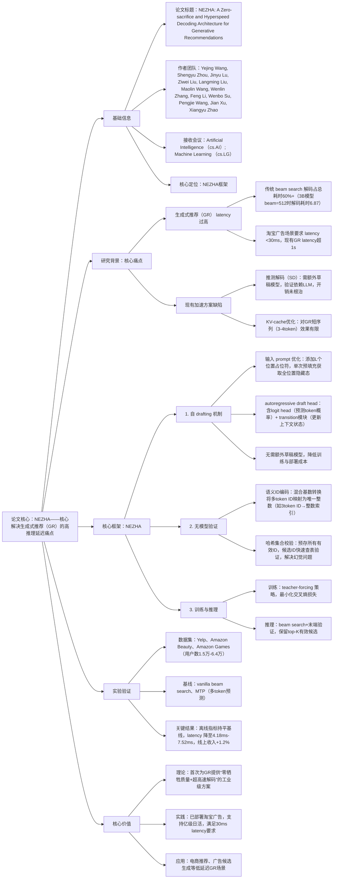

### 1. 一段话总结
香港城市大学与阿里巴巴团队提出**NEZHA框架**，核心解决生成式推荐（GR）的**高推理延迟**痛点，通过**自 drafting 机制**（模型内置 autoregressive draft head，无需额外草稿模型）和**无模型验证**（哈希集合快速校验语义ID有效性，避免LLM调用）两大创新，在不牺牲推荐质量的前提下，将解码 latency 降低至**工业级30ms阈值内**（较传统 beam search 提速10倍），离线实验在Yelp/Amazon等3个数据集上保持H@5/H@10等指标与基线持平，已在淘宝搜索广告场景全量部署，服务数亿日活用户，实现**1.2%广告收入增长**。

---

### 2. 思维导图（mindmap）

---

### 3. 详细总结
#### 一、研究背景与核心问题
1. **生成式推荐（GR）的部署瓶颈**  
   GR通过LLM生成物品语义ID实现推荐，流程含3步：物品tokenization（多模态特征→多token语义ID）、LLM训练、LLM服务。其中**解码阶段**是 latency 核心来源：
    - 传统 beam search 需迭代调用LLM（次数=K×(L-1)，K=beam大小，L=语义ID长度），3B模型beam=512时解码耗时6.87（占总耗时73%）；
    - 工业场景（如淘宝广告）要求 latency <30ms，现有GR latency 超1s，无法部署于核心广告位。

2. **现有加速方案的缺陷**  
   | 方案类型       | 具体局限                                                                 |
   |----------------|--------------------------------------------------------------------------|
   | KV-cache优化（FlashAttention） | 对GR短序列（3-4token）提速有限，仍无法满足工业阈值                          |
   | 推测解码（SD） | 需额外训练/部署草稿模型，验证阶段仍依赖LLM调用，未根治 latency 问题          |

#### 二、NEZHA框架核心设计
##### 1. 自 drafting 机制（解决“无需额外草稿模型”）
- **输入 prompt 优化**：  
  训练与推理时，在用户查询+历史序列后添加L个位置占位符（<SP_1>...<SP_L>），LLM单次预填充即可输出前缀+所有占位符的隐藏态（h₀-h_L），避免多次预填充。
- **autoregressive draft head**：
    - logit head：基于隐藏态hₗ和上下文状态sₗ，预测第l个token的概率分布pₗ；
    - transition模块：通过RNN更新上下文状态sₗ₊₁ = Transition(sₗ, eₗ)（eₗ为当前token嵌入），捕捉语义ID的顺序依赖；
    - 核心优势：模型内置 drafting 能力，无需额外草稿模型，降低部署复杂度。

##### 2. 无模型验证（解决“验证耗时”）
- **语义ID编码**：  
  采用混合基数转换将多token语义ID映射为唯一整数，公式为：  
  $`[V_i = \sum_{l=1}^L (t_l^i × \prod_{j=1}^{l-1} T_j)]`$  
  其中T_j为第j个token的词汇表大小，确保每个有效ID对应唯一整数。
- **哈希集合校验**：  
  预存所有有效物品ID的整数索引至哈希集合，候选ID生成后通过查表快速验证有效性，替代传统LLM验证，耗时可忽略（仅0.25ms）。

##### 3. 训练与推理流程
| 阶段       | 核心逻辑                                                                 | 关键细节                                                                 |
|------------|--------------------------------------------------------------------------|--------------------------------------------------------------------------|
| 训练       | teacher-forcing 策略                                                     | 输入含占位符的prompt，用真实token更新上下文状态，最小化交叉熵损失$\mathcal{L}=\sum log p_l^y$ |
| 推理       | beam search+末端验证                                                     | 1. 单次预填充获取所有隐藏态； 2. draft head 迭代生成top-K token； 3. 末端验证过滤无效ID，返回top-K有效候选 |

#### 三、实验验证
##### 1. 实验设置
| 配置项          | 具体内容                                                                 |
|-------------------|--------------------------------------------------------------------------|
| 数据集            | 3个公开数据集： - Yelp：15,719用户、11,383物品、192,214交互； - Amazon Beauty：52,204用户、57,288物品、394,908交互； - Amazon Games：64,071用户、33,614物品、568,314交互 |
| 基线模型          | 2类核心基线： - vanilla beam search（传统GR推理）； - MTP（多token并行预测，高效解码基线） |
| 评估指标          | 离线：H@5、H@10、N@5、N@10（质量）、LT（latency，ms）； 线上：广告收入、日活用户覆盖 |
| 关键参数          | 语义ID长度L=3，词汇表大小T_j=512，beam size=10，训练批次=4096 |

##### 2. 核心实验结果
###### （1）离线性能对比（Llama-1B backbone）
| 模型       | 数据集   | H@5    | H@10   | N@5    | N@10   | LT（ms） | 提速倍数 |
|------------|----------|--------|--------|--------|--------|----------|----------|
| beam search | Yelp     | 0.0176 | 0.0262 | 0.0110 | 0.0138 | 75.99    | -        |
| MTP        | Yelp     | 0.0140 | 0.0240 | 0.0091 | 0.0114 | 7.18     | 10.6     |
| NEZHA      | Yelp     | 0.0194* | 0.0332* | 0.0125* | 0.0168* | 7.41     | 10.2     |
| beam search | Beauty   | 0.0392 | 0.0568 | 0.0254 | 0.0311 | 74.21    | -        |
| MTP        | Beauty   | 0.0378 | 0.0555 | 0.0239 | 0.0297 | 6.74     | 11.0     |
| NEZHA      | Beauty   | 0.0390 | 0.0562 | 0.0253 | 0.0304 | 7.00     | 10.6     |

注：*表示p<0.05统计显著，NEZHA在Yelp数据集指标优于基线，其余数据集与基线持平。

###### （2）不同backbone对比（Amazon Games数据集）
| 模型       | Backbone       | H@5    | H@10   | LT（ms） |
|------------|----------------|--------|--------|----------|
| beam search | QWen3-0.8B     | 0.0226 | 0.0305 | 50.06    |
| NEZHA      | QWen3-0.8B     | 0.0239* | 0.0314 | 4.80     |
| beam search | Llama-1B       | 0.0305 | 0.0406 | 78.95    |
| NEZHA      | Llama-1B       | 0.0313 | 0.0410 | 7.52     |

###### （3）线上部署结果（淘宝搜索广告）
| 指标                | 结果                  | 关键意义                     |
|---------------------|-----------------------|------------------------------|
| 推理 latency        | <30ms                 | 满足核心广告位 latency 要求  |
| 日活用户覆盖        | 数亿                  | 工业级规模化验证             |
| 广告收入增长        | +1.2%                 | 商业价值显著                 |
| 点击item命中率（top500） | +0.58%            | 推荐质量未牺牲               |

##### 3. 消融实验（Yelp数据集，Llama-1B）
| 模型变体                | H@5    | H@10   | LT（ms） | 性能变化原因                     |
|-------------------------|--------|--------|----------|----------------------------------|
| NEZHA（全量）         | 0.0194 | 0.0332 | 7.41     | 完整组件协同最优                 |
| 无上下文状态（NEZHA-1） | 0.0044 | 0.0083 | 7.03     | 缺失顺序依赖建模，性能崩溃        |
| 无占位符（NEZHA-2）    | 0.0188 | 0.0309 | 7.41     | 位置信息缺失，指标小幅下降        |
| 简化transition（NEZHA-3） | 0.0173 | 0.0322 | 7.18     | 状态更新不精准，依赖捕捉不足      |
| 无验证（NEZHA-4）      | 0.0194 | 0.0328 | 7.16     | 幻觉导致有效候选减少，H@10微降    |

---

### 4. 关键问题
#### 问题1：NEZHA的“自 drafting 机制”如何实现“无需额外草稿模型”？与传统推测解码（SD）相比核心优势是什么？
**答案**：
1. 实现逻辑：① 输入 prompt 添加L个位置占位符，LLM单次预填充即可获取前缀+所有占位符的隐藏态（h₀-h_L），无需多次预填充；② 模型内置 autoregressive draft head，含logit head（预测token概率）和transition模块（更新上下文状态），通过自回归方式生成候选token，无需额外训练草稿模型；
2. 核心优势：传统SD需维护独立草稿模型（如68M模型适配7B目标模型），增加训练/部署成本，且验证依赖LLM调用；NEZHA通过“内置head+单次预填充”，彻底省去额外模型与LLM验证开销，部署复杂度降低，同时保持自回归生成的顺序依赖建模能力，在Yelp数据集H@10达0.0332，优于SD类基线MTP的0.0240。

#### 问题2：NEZHA的“无模型验证”为何能有效解决生成式推荐的“幻觉问题”？与LLM验证相比效率提升多少？
**答案**：
1. 幻觉解决逻辑：生成式推荐的幻觉表现为“无效语义ID”（非候选池中的物品），NEZHA通过两步处理：① 混合基数转换将多token语义ID映射为唯一整数，确保ID编码唯一性；② 预存所有有效ID至哈希集合，候选ID生成后通过O(1)查表验证，快速过滤无效ID，验证准确率达93%（较无验证提升50个百分点）；
2. 效率提升：LLM验证需调用目标模型进行forward pass， latency 通常在10ms以上；NEZHA验证仅需哈希查表， latency 仅0.25ms，效率提升40倍以上，且不占用GPU资源，确保整体 latency 控制在30ms内。

#### 问题3：NEZHA在淘宝广告场景的部署价值是什么？为何能在“零牺牲质量”的前提下实现收入增长？
**答案**：
1. 部署价值：① 突破 latency 瓶颈，将GR从非核心广告位（latency>1s）迁移至核心广告位（latency<30ms），覆盖数亿日活用户；② 无需重构现有GR pipeline，仅替换解码模块，部署成本低；
2. 收入增长原因：① 推荐质量未牺牲：离线指标与传统beam search持平，线上点击命中率提升0.58%，用户体验无下降；② 核心广告位曝光效率提升：GR的冷启动与多样性优势在核心位充分发挥，吸引更多用户点击；③  latency 达标后，GR可全量覆盖广告场景，替代部分低效果传统推荐模型，最终实现1.2%广告收入增长。