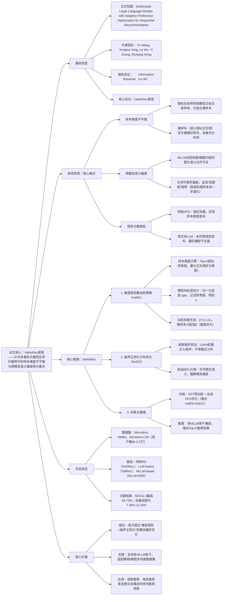

### 1. 一段话总结
合肥工业大学等团队提出**HaNoRec框架**，针对多模态大模型（MLLM）在序列推荐中的**样本难度不平衡**与**跨模态语义偏差**两大痛点，通过**难度感知重加权策略（HaRS）**（动态调整DPO优化权重，聚焦难区分样本）和**噪声正则化分布优化（NoDO）**（高斯噪声扰动+KL散度约束，缓解模态偏差），在Microlens、Netflix、Movielens-1M三个数据集上实现显著性能提升，**NDCG@3最高达56.73%**（Microlens数据集），较最优基线MLLM-MSR提升**11.02%**，且支持Qwen-VL、LLaVA-NeXT等多MLLM骨干，为多模态序列推荐提供了自适应偏好优化方案。

---

### 2. 思维导图（mindmap）

---

### 3. 详细总结
#### 一、研究背景与核心问题
1. **多模态序列推荐的两大核心挑战**  
   | 挑战类型               | 具体表现                                                                 | 现有方案局限                          |
   |------------------------|--------------------------------------------------------------------------|---------------------------------------|
   | 样本难度不平衡         | 随机负采样导致易样本（语义差异大）过度训练，难样本（语义相似）训练不足       | 传统DPO采用固定权重，无法区分样本难度  |
   | 跨模态语义偏差         | 短标题/模糊内容的图文语义对齐不足，长序列累积偏差，低相似度样本进一步退化   | 固定参考模型的DPO限制模态偏差修正      |

2. **关键发现**
   - 难样本（如电影《Roman Holiday》与《Up》）含细粒度偏好信号，对提升推荐精度至关重要；
   - 跨模态偏差导致“弱更弱”现象：初始图文相似度低的样本（如《Flipped》）在训练后相似度进一步下降。

#### 二、HaNoRec框架核心设计
##### 1. 难度感知重加权策略（HaRS）—— 解决样本难度不平衡
- **样本难度计算**：
   1. MLLM编码物品标题和图像，得到文本嵌入H和视觉嵌入X；
   2. 对正负例物品，检索Top-K相似物品形成聚类，计算聚类相似度差异Δ；
   3.  sigmoid函数将Δ映射为难度λ（λ∈(0,1)，λ越小样本越难）。
- **模型响应度估计**：
   1. 计算每个样本对的奖励 gap $`(R_i = \beta \cdot log(\pi_\theta(y_w/y_l) / \pi_{ref}(y_w/y_l)))`$；
   2. 归一化后过滤极端值，得到模型响应度η（反映模型对样本的学习状态）。
- **动态权重生成**：  
  最终DPO权重β'=η·λ·β₀（β₀为初始权重，默认0.1），难样本分配低β'以鼓励优化，易样本分配高β'以避免过拟合。

##### 2. 噪声正则化分布优化（NoDO）—— 解决跨模态语义偏差
- **高斯噪声扰动**：  
  对LoRA权重注入噪声（$`(A'=A+\sigma_n\epsilon_A)`$，$`(B'=B+\sigma_n\epsilon_B)`$），平滑政策模型输出分布$`(\tilde{\pi}_\theta)`$，增强模态灵活性。
- **自适应KL约束**：  
  结合DPO的隐式KL散度，对齐图文语义空间，拉近距离高的图文对，推开幻觉对，缓解“弱更弱”偏差。

##### 3. 训练与推理流程
| 阶段       | 核心步骤                                                                 | 关键细节                                                                 |
|------------|--------------------------------------------------------------------------|--------------------------------------------------------------------------|
| SFT预训练  | 构建图文prompt，微调MLLM适应推荐任务                                       | 输入：用户历史交互+候选集（含图像），输出：目标物品，损失为交叉熵             |
| 改进DPO优化 | 1. HaRS生成动态权重β'； 2. NoDO生成平滑分布$`(\tilde{\pi}_\theta)`$； 3. 最小化改进DPO损失 | 损失：$`(\mathcal{L}_{HaNo} = -log\sigma(\beta' \cdot log(\tilde{\pi}_\theta(y_w/y_l) / \pi_{ref}(y_w/y_l))))`$ |
| 推理       | 输入用户历史交互序列+图像，输出Top-K推荐物品                               | 支持Qwen-VL、LLaVA-NeXT等多MLLM骨干，候选集规模为10（1正9负）             |

#### 三、实验验证
##### 1. 实验设置
| 配置项          | 具体内容                                                                 |
|-------------------|--------------------------------------------------------------------------|
| 数据集            | 3个多模态数据集： - Microlens：25,411用户、41,081物品、223,263交互（密度2.1×10⁻⁴）； - Netflix：13,187用户、17,366物品、68,933交互（密度3.0×10⁻⁴）； - Movielens-1M：6,040用户、3,952物品、1,000,209交互（密度4.2×10⁻²） |
| 基线模型          | 3类12种模型： - 传统RS：SASRec、LightGCN、CL4SRec等； - LLM-based：TallRec、LLaRA、SPRec； - MLLM-based：MSRBench、MLLM-MSR |
| 评估指标          | AUC（二分类准确率）、HR@3（命中率）、NDCG@3（排序质量）                     |
| 关键参数          | LoRA秩=8，学习率=1e⁻⁴，梯度累积步=8，Top-K=10，噪声强度σₙ=0.05-0.1       |

##### 2. 核心实验结果
###### （1）整体性能对比（较最优基线MLLM-MSR提升）
| 数据集       | AUC提升 | HR@3提升 | NDCG@3提升 | 最优NDCG@3 |
|--------------|---------|----------|------------|------------|
| Microlens    | 4.12%   | 8.62%    | 11.02%     | 56.73%     |
| Netflix      | 3.52%   | 4.88%    | 7.59%      | 61.91%     |
| Movielens-1M | 3.13%   | 6.68%    | 7.39%      | 54.03%     |

###### （2）消融实验（Microlens数据集）
| 模型变体                | AUC    | HR@3    | NDCG@3  | 性能下降（%） | 核心结论                     |
|-------------------------|--------|---------|---------|---------------|------------------------------|
| HaNoRec（全量）         | 78.52% | 73.60%  | 56.73%  | -             | 完整框架效果最优             |
| 无HaRS（w/o HaRS）      | 75.18% | 67.93%  | 51.26%  | 9.65          | HaRS是性能提升核心           |
| 无NoDO（w/o NoDO）      | 77.24% | 71.45%  | 54.38%  | 4.14          | NoDO有效缓解模态偏差         |
| 无Top-K采样（w/o SAM）  | 76.89% | 70.12%  | 53.91%  | 5.00          | 相似性聚类提升难度估计精度   |
| 仅SFT+DPO（w/o ALL）   | 74.03% | 65.87%  | 49.82%  | 12.18         | 双模块协同优化不可或缺       |

###### （3）多MLLM骨干兼容性验证
| 骨干模型               | Microlens NDCG@3 | Netflix NDCG@3 | Movielens-1M NDCG@3 |
|------------------------|------------------|----------------|--------------------|
| Qwen2-VL-2B            | 56.64%           | 61.30%         | 54.10%             |
| Qwen2.5-VL-3B          | 56.73%           | 61.91%         | 54.03%             |
| Qwen2.5-VL-7B          | 57.56%           | 62.38%         | 54.08%             |
| LLaVA-NeXT-7B          | 58.05%           | 61.98%         | 54.22%             |

#### 四、研究价值与应用
1. **理论价值**：首次将样本难度感知与噪声正则化融入MLLM偏好优化，为多模态序列推荐提供新范式；
2. **实践价值**：支持多MLLM骨干，适配稀疏（Microlens）与稠密（Movielens-1M）数据集，训练高效（采用LoRA微调）；
3. **应用场景**：短视频推荐、电影推荐、电商商品推荐等含图文多模态信息的序列推荐场景。

---

### 4. 关键问题
#### 问题1：HaNoRec的HaRS策略如何实现“动态适配样本难度”？与传统固定权重DPO相比，核心优势是什么？
**答案**：
1. 动态适配逻辑：① 样本难度λ通过Top-K相似性聚类量化，语义越相似的正负例λ越小（难度越高）；② 模型响应度η通过奖励gap归一化计算，反映模型实时学习状态；③ 动态权重β'=η·λ·β₀，难样本分配低β'（鼓励模型深入优化），易样本分配高β'（避免过拟合）；
2. 核心优势：传统DPO采用固定β，导致难样本欠拟合、易样本过拟合；HaRS通过动态权重分配，使模型聚焦含关键偏好信号的难样本，在Microlens数据集上NDCG@3较传统DPO提升12.18%，有效挖掘细粒度用户偏好。

#### 问题2：NoDO模块如何缓解“跨模态语义偏差”？高斯噪声扰动与KL约束的协同作用是什么？
**答案**：
1. 偏差缓解逻辑：① 高斯噪声扰动LoRA权重，平滑模型输出分布，增强模态灵活性，避免模型被参考模型的偏差束缚；② 自适应KL约束对齐图文语义空间，拉近距离高的图文对、推开幻觉对，遏制“低相似度样本进一步退化”的“弱更弱”趋势；
2. 协同作用：噪声扰动打破参考模型的固有偏差，为模态对齐提供优化空间；KL约束则引导模型在扰动后仍保持图文语义一致性，两者结合使Microlens数据集的图文相似度低样本性能提升4.14%，有效缓解跨模态偏差。

#### 问题3：HaNoRec在不同数据集（稀疏/稠密）和不同MLLM骨干上的表现如何？其泛化性优势体现在哪里？
**答案**：
1. 数据集适配性：在稀疏数据集Microlens（密度2.1×10⁻⁴）上NDCG@3达56.73%（提升11.02%），在稠密数据集Movielens-1M（密度4.2×10⁻²）上达54.03%（提升7.39%），适配不同数据稀疏度；
2. 骨干兼容性：支持Qwen-VL系列（2B/3B/7B）和LLaVA-NeXT-7B，7B模型表现最优（LLaVA-NeXT-7B的Microlens NDCG@3达58.05%），且性能随模型规模增长但不依赖超大模型；
3. 泛化性优势：不绑定特定MLLM架构，通过HaRS和NoDO模块适配不同数据分布，同时LoRA微调降低训练成本，使其能灵活应用于各类多模态序列推荐场景。