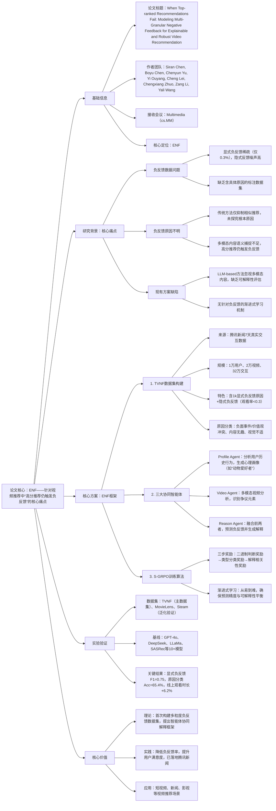

### 1. 一段话总结
中科院深圳先进院与腾讯团队提出**Agentic Explainable Negative Feedback（ENF）框架**，针对视频推荐中“高分推荐仍触发负反馈”的核心痛点，先构建含**多粒度正负反馈**的TVNF数据集（1万用户、2万视频、32万交互，含1k条显式负反馈原因标注），再通过**Profile Agent（用户心理画像提取）、Video Agent（多模态视频分析）、Reason Agent（负反馈预测与解释生成）** 三大协同智能体，结合**S-GRPO渐进式强化学习算法**（三步奖励机制），在负反馈预测与原因解释任务中显著优于基线——显式负反馈原因分类较GPT-4o提升**8.6%**，部署于腾讯新闻平台后，用户平均观看时长提升**6.2%**、快划率降低**9.4%**、不喜欢率降低**42.6%**，为可解释、鲁棒的视频推荐提供了新方案。

---

### 2. 思维导图

---

### 3. 详细总结
#### 一、研究背景与核心问题
1. **视频推荐的负反馈痛点**  
   | 痛点类型               | 具体表现                                                                 | 现有方案局限                          |
   |------------------------|--------------------------------------------------------------------------|---------------------------------------|
   | 数据层面               | 显式负反馈（不喜欢、评论）占比仅0.3%，隐式反馈（快划、低观看率）噪声高     | 缺乏含具体原因的标注数据集，难以深度建模 |
   | 模型层面               | 仅依赖ID嵌入与协同过滤，无法捕捉多模态内容语义，高分推荐仍触发负反馈       | 仅抑制相似推荐，未探究负反馈根本原因    |
   | 可解释性层面           | 负反馈原因不明（如用户快划可能因内容无趣或视觉不适），用户满意度低         | LLM-based方法忽视多模态，缺乏原因解释能力 |

2. **关键发现**  
   负反馈可分为三类核心原因：① 视频含负面事件、 vulgar 内容或价值观冲突；② 内容无趣，无法吸引用户；③ 视觉元素不适（如血腥、爬虫），传统方法无法区分这类细粒度差异。

#### 二、核心方案设计
##### 1. TVNF数据集构建
- **数据来源**：腾讯新闻平台7天真实交互日志， anonymize 隐私信息；
- **数据规模**：10,000用户、20,000视频、320,000交互，用户需至少15条交互记录；
- **数据特色**：
  - 显式负反馈：1k条用户明确标注的不喜欢原因；
  - 隐式负反馈：观看率<0.3的交互（由GPT-4o标注+人工验证）；
  - 多模态信息：每条视频含标题、URL及16帧均匀采样画面。

##### 2. ENF三大协同智能体
| 智能体类型       | 核心功能                                                                 | 输入内容                                                                 | 输出结果                                                                 |
|------------------|--------------------------------------------------------------------------|--------------------------------------------------------------------------|--------------------------------------------------------------------------|
| Profile Agent    | 提取用户心理画像，补充细粒度偏好                                         | 基础信息（年龄/性别/职业）、历史交互（标题、观看率、兴趣标签）             | 心理标签（如“动物爱好者”“反感 vulgar 内容”“喜欢刺激剧情”）               |
| Video Agent      | 多模态视频分析，识别争议元素                                             | 视频标题、16帧画面                                                       | 争议元素判断、类型分类（负面事件/内容无趣/视觉不适）                       |
| Reason Agent     | 模拟用户视角，预测负反馈并生成解释                                         | 用户更新画像、Video Agent分析结果、推荐视频信息                           | 负反馈预测（是否快划）、原因分类、自然语言解释                           |

##### 3. S-GRPO渐进式强化学习算法
- **核心逻辑**：针对“判断-分类-解释”的多层任务，设计三步递进奖励机制，避免单一奖励导致的性能偏科；
- **奖励机制**：
  1. 二进制判断奖励（r_judge）：预测“是否负反馈”正确得0.5分，错误则终止；
  2. 类型分类奖励（r_class）：负反馈类型分类正确额外得1.0分；
  3. 解释相关性奖励（r_reason）：解释与真实原因的ROUGE均值作为额外奖励；
- **优化目标**：通过组内相对优势计算，最大化累积奖励，约束政策模型与参考模型的KL散度，避免更新幅度过大。

#### 三、实验验证
##### 1. 实验设置
| 配置项          | 具体内容                                                                 |
|-------------------|--------------------------------------------------------------------------|
| 数据集            | 主数据集：TVNF；泛化数据集：MovieLens（电影）、Steam（游戏）               |
| 基线模型          | 10+主流模型：GPT-4o、DeepSeek、LLaMa-70B、Qwen2.5-VL、SASRec、MLLM-MSR等 |
| 评估指标          | 负反馈预测：Acc、Precision、Recall、F1；原因解释：Class Acc、ROUGE均值     |
| 部署平台          | 腾讯新闻推荐系统，选取部分用户进行A/B测试                                 |

##### 2. 核心实验结果
###### （1）显式负反馈预测与解释（TVNF数据集）
| 模型               | 二进制判断F1 | 原因分类Acc | 解释ROUGE均值 | 关键优势                     |
|--------------------|-------------|-------------|---------------|------------------------------|
| GPT-4o             | 0.739       | 0.568       | 0.402         | 二进制判断精度高             |
| Qwen2.5-VL-7B      | 0.564       | 0.296       | 0.229         | 基础多模态分析能力           |
| VideoChat-R1       | 0.739       | 0.500       | 0.383         | 视频推理优化                 |
| ENF（Video Agent） | 0.750       | 0.654       | 0.537         | 较GPT-4o分类Acc提升8.6%      |

###### （2）隐式负反馈预测（TVNF数据集）
| 模型               | 二进制判断Acc | F1 Score | 原因分类Acc | 关键结论                     |
|--------------------|--------------|----------|-------------|------------------------------|
| SASRec             | 0.448        | 0.279     | -           | 传统方法不适应隐式负反馈预测 |
| MLLM-MSR           | 0.545        | 0.455     | -           | 多模态模型优于传统ID嵌入     |
| GPT-4o             | 0.575        | 0.521     | 0.502       | 零-shot性能有限               |
| ENF（Reason Agent） | 0.612        | 0.533     | 0.543       | 全流程优化最优               |

###### （3）线上A/B测试结果（腾讯新闻平台）
| 指标                | 基线推荐系统 | ENF框架 | 相对变化（%） |
|---------------------|--------------|---------|---------------|
| 平均观看时长        | 47.6%        | 53.8%   | +13.0（绝对+6.2） |
| 快划率              | 23.7%        | 14.3%   | -39.7（绝对-9.4） |
| 不喜欢率            | 0.61%        | 0.35%   | -42.6        |

###### （4）泛化性验证（MovieLens/Steam数据集）
| 模型       | MovieLens Acc | Steam F1 Score | 结论                     |
|------------|---------------|----------------|--------------------------|
| GPT-4o     | 0.584         | 0.662          | 依赖预训练，泛化有限     |
| Agent4Rec  | 0.691         | 0.679          | 推荐专用智能体框架       |
| ENF        | 0.815         | 0.805          | RL对齐用户偏好，泛化最优 |

##### 3. 消融实验
| 模型变体（Video Agent） | 二进制判断F1 | 原因分类Acc | 解释ROUGE均值 | 核心结论                     |
|-------------------------|-------------|-------------|---------------|------------------------------|
| 仅SFT                  | 0.564       | 0.296       | 0.229         | SFT为冷启动基础               |
| SFT+RL                 | 0.667       | 0.412       | 0.339         | RL提升深度推理能力           |
| SFT+RL+S-GRPO          | 0.750       | 0.654       | 0.537         | 渐进式奖励是性能关键         |

#### 四、研究价值与应用
1. **理论价值**：首次构建含多粒度负反馈原因的TVNF数据集，提出“智能体协同+渐进式强化学习”的负反馈建模框架，填补可解释推荐的技术空白；
2. **实践价值**：线上部署后显著降低负反馈率、提升用户留存，验证了多模态内容分析与用户心理画像结合的有效性；
3. **应用场景**：短视频推荐、新闻推荐、影视推荐等需降低用户反感、提升推荐鲁棒性的场景。

---

### 4. 关键问题
#### 问题1：ENF框架的三大智能体如何协同工作？与传统单模型方案相比，核心优势是什么？
**答案**：
1. 协同逻辑：① Profile Agent先通过用户基础信息+历史交互（重点分析低观看率视频），生成心理画像（如“36岁女性、动物爱好者”）；② 若文本信息不足，触发Video Agent分析视频多模态内容（标题+16帧画面），识别争议元素（如“烤兔子画面”）；③ Reason Agent融合画像与视频分析结果，从“兴趣匹配、剧情吸引力、价值观、视觉舒适度”四维度预测负反馈并生成解释；
2. 核心优势：传统单模型仅做“是否负反馈”的二分类，缺乏多模态理解与可解释性；ENF通过智能体分工协作，既捕捉细粒度原因（如区分“内容无趣”与“视觉不适”），又生成用户易懂的解释，使负反馈原因分类准确率较GPT-4o提升8.6%，线上快划率降低9.4%。

#### 问题2：S-GRPO算法的“渐进式奖励机制”如何解决负反馈建模的多层任务难题？与传统RL算法（如PPO）相比有何不同？
**答案**：
1. 解决逻辑：负反馈建模需完成“判断是否负反馈→分类原因→生成解释”三层递进任务，S-GRPO设计三步奖励：① 二进制判断奖励（正确得0.5分，错误终止）；② 原因分类奖励（正确额外得1.0分）；③ 解释相关性奖励（ROUGE均值为额外奖励），确保模型从易到难逐步学习，避免单一奖励导致的偏科；
2. 与传统RL的区别：PPO依赖单一奖励信号与评论家模型评估政策，难以适配多层任务；S-GRPO无需评论家模型，通过组内相对优势计算优化，既保证判断准确率，又提升原因分类与解释质量，消融实验显示，加入S-GRPO后，解释ROUGE均值从0.339提升至0.537（+58.4%）。

#### 问题3：TVNF数据集的核心特色是什么？为何它能支撑ENF框架的训练与验证？
**答案**：
1. 核心特色：① 多粒度反馈：含1k条显式负反馈（用户标注原因）+31.9万隐式负反馈（观看率<0.3），解决负反馈数据稀疏与噪声问题；② 多模态信息：每条视频含标题、URL及16帧画面，支持Video Agent的多模态分析；③ 真实场景适配：来自腾讯新闻7天真实交互，覆盖1万用户、2万视频，含年龄、性别、兴趣标签等用户信息；
2. 支撑逻辑：① 显式负反馈数据用于SFT冷启动，让模型学习负反馈原因与用户偏好的关联；② 隐式负反馈数据用于S-GRPO强化学习，提升模型泛化能力；③ 多模态与用户信息支撑三大智能体的协同训练，确保模型能从“用户-视频”双视角建模负反馈，避免脱离真实场景的过拟合。