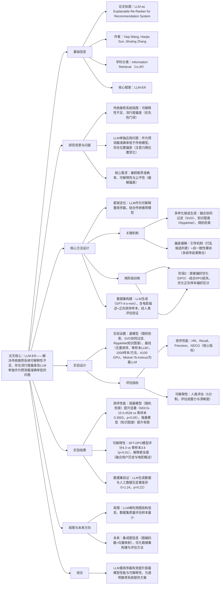

# 1. 一段话总结
为解决传统推荐系统**可解释性不足**、存在**流行度偏差**及LLM单独作为预测器准确率低的问题，研究团队提出将LLM作为**可解释重排序器**的混合框架，结合传统推荐模型与LLM以提升准确率和可解释性；该框架通过两阶段训练（**监督微调SFT+直接偏好优化DPO**），搭配**引导机制**（打乱候选列表缓解位置偏差）和**多样化候选生成**（融合协同过滤、知识图谱等），并构建LLM生成的数据集（经人类评估验证与人类预期对齐，p值0.22无显著差异）；在随机检索、基于矩阵分解的协同过滤、知识图谱（RippleNet）三种候选生成方法上的实验显示，该模型在弱基模型（如随机检索）上提升显著（NDCG@10达0.4528，p<0.05），可解释性评分（4.3）高于零样本基线（3.6，p<0.01），为构建透明、用户中心的推荐系统提供路径。

---

# 2. 思维导图

---

# 3. 详细总结
## 一、研究背景与核心挑战
1. **传统推荐系统的关键缺陷**
    - **可解释性不足**：现有方法侧重提升准确率，忽视生成用户易懂的推荐理由，导致用户信任度低（Chazette & Schneider, 2020）。
    - **偏差问题**：
        - **流行度偏差**：优先推荐热门项，忽略小众或个性化需求（Klimashevskaia et al., 2024）；
        - **位置偏差**：LLM对不同位置的token分配不同注意力权重，导致排序不公平（Zhang et al., 2024）。
2. **LLM单独应用的局限**：LLM作为独立预测器时，准确率低于传统推荐模型，且在序列推荐任务中受位置偏差影响大（Liu et al., 2023）。
3. **研究目标**：提出将LLM作为**可解释重排序器**的混合框架，结合传统推荐模型，同时解决可解释性、偏差与准确率问题。

## 二、核心方法设计
### 1. 整体框架：LLM+传统推荐模型的混合架构
- **定位**：LLM不替代传统推荐模型，而是在其生成候选列表后进行**重排序**，同时生成推荐理由，兼顾准确率与可解释性。
- **三大关键机制**：
    - **多样化候选生成**：融合三种候选来源，确保候选池丰富性：
        - 协同过滤：基于矩阵分解（SVD）；
        - 知识图谱：使用RippleNet；
        - 随机检索：作为弱基模型对照。
    - **偏差缓解策略**：
        - **引导机制**：重排序前打乱候选列表顺序，缓解流行度偏差；
        - **自一致性模块**：生成多个不同顺序的候选列表，通过计算item在所有排序中的位置索引和，按总和升序确定最终排序，抵消LLM位置偏差。
    - **两阶段训练**：分阶段优化LLM的排序能力与解释质量，具体流程如下表：

| 训练阶段 | 核心目标 | 关键操作 | 技术细节 |
|----------|----------|----------|----------|
| 阶段1：监督微调（SFT） | 让LLM掌握基础排序逻辑与解释生成能力 | 1. 用标注数据（含正确排序+理由）训练； 2. 引入Noisy Layer Fine-Tuning（NEF） | NEF通过在模型层引入可控噪声，防止过拟合，提升模型对不同用户/物品的泛化性（Jain et al., 2023） |
| 阶段2：直接偏好优化（DPO） | 优化LLM对正负样本的偏好区分能力 | 1. 正样本：SFT阶段的正确排序； 2. 负样本：打乱正样本排序后的错误结果； 3. 结合RPO损失训练 | - DPO损失：最大化正负样本的评分差距，确保优先正确排序（Rafailov et al., 2024）； - RPO损失：动态加权SFT与DPO损失，平衡排序准确率与解释质量（Pang et al., 2024） |

### 2. 数据集构建
- **构建目的**：为LLM重排序器提供正负训练样本，确保其能学习排序逻辑与解释生成。
- **两阶段构建流程**：
    1. **电影描述生成**：用GPT-4-o-mini将电影概述压缩至15词以内，结合电影ID、名称、类型、语言，生成符合LLM输入要求的自然语言描述。
    2. **正负排序样本生成**：
        - 正样本：输入用户历史与正确电影排序，让GPT-4-o-mini生成排序理由；
        - 负样本：随机打乱正确排序，生成错误排序的理由。
- **数据集验证**：通过人类评估验证与人类预期的对齐性——
    - 实验设计：5名领域同行评估10个人工样本与10个LLM生成样本（1-5分制，评估排序说服力）；
    - 结果：t值=1.24，p值=0.22，无显著差异，证明LLM生成数据质量达标。

## 三、实验设计详情
### 1. 实验基础设置
| 实验要素 | 具体配置 |
|----------|----------|
| 基推荐模型 | 1. 随机检索（Randomly Retrieved）； 2. 基于矩阵分解的协同过滤（SVD）； 3. 知识图谱推荐（RippleNet） |
| 基线模型 | 1. 无重排序（None Ranker）：直接使用基模型输出； 2. 零样本LLM重排序器：未经过两阶段训练的LLM |
| 实验数据 | 每种基模型对应1000个样本，每个样本含基模型生成的Top-15候选item及自然语言描述 |
| 硬件与框架 | 1. 硬件：单NVIDIA A100 GPU； 2. 加速框架：unsloth（Daniel Han & team, 2023）； 3. 基LLM：Mistral-7b-Instruct |
| 关键参数 | 引导机制迭代次数=3（控制计算成本） |

### 2. 评估指标
#### （1）排序性能指标（核心量化指标）
| 指标名称 | 计算逻辑 | 核心意义 |
|----------|----------|----------|
| Hit Ratio（HR）@N | 占比=（地面真值item进入Top-N的用户数）/总用户数 | 衡量推荐列表是否覆盖用户真实需求 |
| Recall@N | 占比=（Top-N中相关item数）/总相关item数 | 衡量推荐的全面性（覆盖相关item的比例） |
| Precision@N | 占比=（Top-N中相关item数）/N | 衡量推荐的精准度（Top-N中有效item比例） |
| NDCG@N | 比值=DCG@N/IDCG@N（DCG：考虑位置的相关度加权和；IDCG：理想情况下的最大DCG） | 综合评估item相关性与排序位置，是核心排序指标 |

#### （2）可解释性指标
- 评估方式：人类评估（5名参与者，每人评估20个样本，样本顺序打乱以避免偏差）；
- 评分标准：1-5分制，评估推荐理由的**说服力**与**清晰度**；
- 统计验证：通过配对t检验判断SFT-DPO模型与零样本基线的差异显著性。

## 四、实验结果分析
### 1. 排序性能结果（按基模型分类）
#### （1）弱基模型：随机检索候选
- 提升显著，核心指标对比（SFT-DPO vs 零样本 vs 无重排序）：
    - NDCG@3：0.5287 vs 0.4832 vs 0.3679（p<0.001，SFT-DPO vs 无重排序）；
    - NDCG@5：0.6394 vs 0.4314 vs 0.3637（p<0.002，SFT-DPO vs 无重排序）；
    - NDCG@10：0.4528 vs 0.3503 vs 0.3468（p<0.008，SFT-DPO vs 无重排序）；
- 结论：SFT-DPO模型在弱基模型上大幅提升排序质量，且统计显著。

#### （2）中等基模型：基于SVD的协同过滤
- 部分指标提升显著：
    - Recall@10：0.1652 vs 0.137 vs 0.1338（p<0.001，SFT-DPO vs 无重排序）；
    - Precision@10：0.2036 vs 0.1696 vs 0.166（p<0.001，SFT-DPO vs 无重排序）；
- 结论：在中等性能基模型上，SFT-DPO对Top-10排序的精准度和全面性提升显著。

#### （3）强基模型：知识图谱（RippleNet）
- 提升有限，多数指标无统计显著性（p>0.05），仅NDCG@10有微小提升（0.2056 vs 0.1804 vs 2.046，注：原文表中Non-Ranker的NDCG@10可能为笔误）；
- 原因：知识图谱模型已整合丰富的图结构信息（用户-物品关联、item特征），LLM重排序器无法充分利用这些信息，导致提升空间有限。

### 2. 可解释性结果
- 评分对比：SFT-DPO模型平均评分4.3，零样本基线3.6；
- 统计显著性：配对t检验p<0.01，差异显著；
- 解释质量差异：
    - 零样本模型：仅依赖电影类型生成理由，内容单一；
    - SFT-DPO模型：融合用户历史、电影概述等信息，理由更全面、有说服力（如“该电影探索关系复杂性与爱情挑战，符合用户对爱情剧的兴趣”）。

## 五、研究局限与未来方向
### 1. 主要局限
- **图结构信息利用不足**：LLM难以处理知识图谱中的图关联信息，导致对强基模型（如RippleNet）的提升有限；
- **数据集评估局限**：人类验证仅用少量人工样本（30条控制数据），无法全面验证LLM生成数据集的质量。

### 2. 未来改进方向
- **整合图信息**：提取基模型（如知识图谱）的子图，训练图编码器将图信息转化为向量，作为LLM的前缀token输入（参考He et al., 2024），让LLM利用图结构信息；
- **优化数据集构建**：设计更完善的数据集评估方法，扩大人工验证样本量，确保数据集与人类预期的长期对齐。

## 六、核心结论
1. LLM作为可解释重排序器，在**弱基推荐模型**（如随机检索、简单协同过滤）上能显著提升排序性能（NDCG等指标）与可解释性，是对传统推荐系统的有效补充；
2. 两阶段训练（SFT+DPO）与偏差缓解策略（引导机制、自一致性模块）是提升LLM重排序效果的关键；
3. 该框架为构建**透明、公平、用户中心**的推荐系统提供了可行路径，尤其适用于对可解释性要求高的场景（如电商、流媒体）。

---

# 4. 关键问题
## 问题1：研究提出的“两阶段训练（SFT+DPO）”与传统单一训练方法相比，核心优势是什么？这种优势在实验结果中如何体现？
### 答案
- 核心优势：两阶段训练实现“基础能力培养+偏好优化”的分层提升，避免单一训练的局限性——
    1. 第一阶段SFT通过标注数据让LLM掌握**基础排序逻辑与解释生成能力**，解决“不会排、不会说”的问题；引入NEF技术还能防止过拟合，提升泛化性；
    2. 第二阶段DPO结合RPO损失，聚焦**正负样本偏好区分**，解决“排不准、偏好模糊”的问题，确保LLM优先选择正确排序，同时平衡解释质量。
- 实验体现：
    - 排序性能：在随机检索基模型上，SFT-DPO的NDCG@5达0.6394，显著高于零样本（0.4314）和无重排序（0.3637），证明两阶段训练让排序更精准；
    - 可解释性：SFT-DPO的解释评分（4.3）高于零样本（3.6），且理由融合用户历史与电影概述，证明两阶段训练让解释更全面，而单一训练（如零样本）无法实现这一点。

## 问题2：研究中LLM重排序器对不同强度的基推荐模型（随机检索、SVD协同过滤、RippleNet）提升效果差异显著，核心原因是什么？这一发现对实际推荐系统部署有何指导意义？
### 答案
- 核心原因：提升效果差异由**基模型的信息丰富度**与**LLM的信息利用能力**共同决定——
    1. 弱基模型（随机检索）：仅提供无结构的候选item，缺乏用户-物品关联信息，LLM通过两阶段训练学到的排序逻辑与用户偏好建模能力可填补信息空白，因此提升显著；
    2. 强基模型（RippleNet知识图谱）：已整合图结构信息（如用户-物品多跳关联、item特征关联），但LLM无法有效解析和利用图结构数据，导致LLM的重排序难以补充新价值，提升有限。
- 部署指导意义：
    - 优先在**弱基模型场景**部署该LLM重排序器（如资源有限、无法构建复杂基模型的中小平台），可以较低成本大幅提升推荐质量；
    - 若使用强基模型（如知识图谱、深度协同过滤），需先通过技术改造（如将图信息转化为LLM可理解的向量）让LLM利用基模型的优势信息，再部署重排序器，避免资源浪费。

## 问题3：研究构建的LLM生成数据集为何需要通过人类评估验证？验证结果（p=0.22）说明了什么？这一验证步骤对整个研究的科学性有何影响？
### 答案
- 需验证的原因：LLM生成数据可能存在“幻觉”（如生成不符合人类逻辑的排序理由）或“偏差”（如过度偏好某类item），若直接用于训练，会导致LLM重排序器学习到错误逻辑，因此必须通过人类评估确保数据质量与人类预期对齐。
- 验证结果说明：t检验p=0.22（p>0.05），表明LLM生成数据集与人工创建数据集在“排序说服力”上**无统计学显著差异**，证明LLM生成的数据符合人类对合理推荐排序的认知，质量达标，可用于后续训练。
- 对研究科学性的影响：
    - 确保“训练数据的有效性”：避免因数据质量问题导致实验结果失真（如模型性能提升源于错误数据而非方法有效性）；
    - 增强“实验结果的可信度”：若数据未经验证，即使模型性能提升，也无法确定是方法有效还是数据偏差导致，而验证步骤让后续的排序性能、可解释性结果更具说服力，支撑研究结论的科学性。