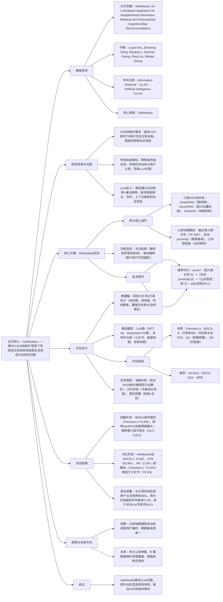

# 1. 一段话总结
为解决“15分钟城市”愿景下传统定位系统忽视**局部生活信息可达性（LLIA）** 的问题（即居民难高效获取时空相关、符合认知的社区级信息），研究团队提出**AskNearby**——一款基于LLM的社区应用，其整合**三层检索增强生成（RAG）流水线**（图检索GraphRAG、语义向量检索VectorRAG、地理检索GeoRAG）与**认知地图模型**（编码用户社区熟悉度与偏好），同时支持主动信息检索与被动个性化推荐；在深圳小红书2万条真实社区数据上的实验显示，AskNearby在**检索精度（Precision@4达75.6%）、排序质量（NDCG@4达0.96）、时空相关性（STR达83.8%）** 上显著优于GPT-4o、高德地图等基线，且幻觉率仅2.5%；真实部署中（北大深圳校区、南头古城），新用户30天使用率46%，社区居民月均查询4.1次，有效助力居民发现本地资源，推动“15分钟城市”落地。

---

# 2. 思维导图

---

# 3. 详细总结
## 一、研究背景与核心问题
### 1. 15分钟城市的核心需求
“15分钟城市”理念旨在让居民通过步行或骑行（15分钟内）满足日常需求（购物、医疗、教育等），其落地不仅需要物理设施的近距离覆盖，还依赖**社区级信息的高效获取**——即居民能实时、准确地了解周边场所、服务及活动信息。

### 2. 传统定位系统的缺陷
现有位置服务（如高德地图、百度地图）及LLM应用存在显著局限：
- 聚焦**城市级任务**，忽视社区尺度的精细时空动态（如“周边1km内今晚营业的超市”）；
- 未建模用户**空间认知**（如居民对常去场所的偏好、对社区的熟悉度），导致推荐与用户实际需求脱节；
- 处理自然语言查询时，将时空视为孤立过滤条件，而非相互关联的决策因素（如“周末适合带孩子去的附近公园”需同时考虑时间（周末）、空间（附近）、语义（亲子））。

### 3. LLIA问题定义
研究首次提出**局部生活信息可达性（Local Life Information Accessibility, LLIA）** 问题，其核心是：让居民通过两种方式高效获取社区信息：
- **主动检索**：用户通过自然语言查询（含时空约束）获取目标信息；
- **被动推荐**：系统基于用户位置、时间、常去场所，主动推送相关内容。
- 形式化定义：$`(A(u)=\underbrace{Retrieve \left(Q, s_{u}, K\right)}_{主动检索} \cup \underbrace{Recommend\left(s_{u}, t_{u}, p_{u}, K\right)}_{被动推荐})`$，其中$`(s_u)`$（用户位置）、$`(t_u)`$（时间）、$`(p_u)`$（常去场所）、$`(K)`$（时空知识库）。

## 二、核心方案：AskNearby系统设计
### 1. 系统整体架构
AskNearby是基于LLM的AI社区应用，通过“三层RAG流水线+认知地图模型”的统一框架，同时支持主动检索与被动推荐，架构如图1所示（文档图1）。

### 2. 核心组件1：三层RAG流水线（支持主动检索）
三层检索协同工作，从时空、语义维度精准筛选社区信息，具体流程与功能如下表：

| RAG层级 | 核心功能 | 技术实现 | 输出结果 |
|---------|----------|----------|----------|
| **GeoRAG（地理检索）** | 基于地理位置筛选候选，确保空间相关性 | 依赖PostGIS空间数据库，支持地理索引、 proximity查询；采用Haversine距离公式，设定阈值θ（如1km） | 满足“距离<θ”的空间实体（如POI、事件） |
| **GraphRAG（图检索）** | 基于语义关联扩展候选，补充概念/关系信息 | 构建语义图（实体：POI类别、标签等；关系：语义关联），使用NebulaGraph数据库 | 与查询意图语义相关的实体（如“咖啡店”关联“安静”“适合办公”） |
| **VectorRAG（语义向量检索）** | 基于语义相似度排序，优化结果相关性 | 用BGELarge-zh-v1.5模型将查询+图扩展语义编码为向量，pgvector存储，欧氏距离计算相似度 | 语义相似度>阈值δ的最终候选列表 |

- **检索流程**：
   1. LLM解析用户查询Q，提取空间实体（如“南头古城”）与语义意图（如“搬运服务”）；
   2. 地理代理调用高德地图API，生成空间实体的几何表示（点/线/面）；
   3. GeoRAG根据用户位置$`(s_u)`$或查询位置$`(Loc_Q)`$，筛选地理近邻候选；
   4. GraphRAG根据语义意图$`(Sem_Q)`$，检索语义关联实体；
   5. VectorRAG将Q与GraphRAG的语义扩展结果$`(Sem_G)`$拼接，检索语义最相似的内容。

### 3. 核心组件2：认知地图模型（支持被动推荐）
模型通过融合**用户个性化认知**与**社区集体认知**，生成符合用户习惯的推荐，推荐评分公式如下：  
$`(score(i) = [f_{sem}(s_u,t_u,p_u,i)]^\alpha \times [f_{dist}(d(s_u,i))]^\beta \times [f_{pop}(i)]^\gamma)`$  
其中α、β、γ为权重（初始均设为1.0，确保三因素平等贡献），各因子定义如下：

| 推荐因子 | 核心含义 | 计算方式 |
|----------|----------|----------|
| **语义相关性$`(f_{sem})`$** | 匹配用户认知偏好与场所的时空功能语义 | 1. 用TF-IWF（Term Frequency-Inverse Word Frequency）表示场所的时间动态语义（如白天“办公”、晚上“餐饮”）； 2. 用户认知画像=常去场所$`(p_u)`$的TF-IWF向量加权（时间越近权重越高）+当前位置$`(s_u)`$的TF-IWF向量； 3. 语义相似度=用户画像与场所TF-IWF向量的内积 |
| **空间proximity$`(f_{dist})`$** | 地理距离对推荐的影响（近者优先） | 距离衰减函数：$`(f_{dist}(d)=\exp(-\lambda_d \cdot d(s_u,i)))`$，$`(\lambda_d)`$为衰减系数，$`(d(s_u,i))`$为用户与item的地理距离 |
| **公共熟悉度$`(f_{pop})`$** | 反映场所的社区认可度（集体认知） | 基于场所的公共访问频率计算，频率越高，熟悉度越高 |

## 三、实验设计详情
### 1. 数据集构建
- **来源**：小红书（中国主流本地生活分享平台），聚焦深圳地区；
- **规模**：约20,000条帖子，覆盖历史景点（如南头古城）、自然景区（如梧桐山）、商业/交通枢纽；
- **数据清洗**：三步法避免平台推荐 bias——1. 关键词广谱搜索；2. 去重、删广告、验证地理准确性；3. 随机抽样；
- **核心字段**：如下表所示：

| 字段 | 描述 | 示例 |
|------|------|------|
| Title/Content | 帖子标题与正文 | “南头古城跳蚤市场，二手自行车出售” |
| Timestamp | 发布时间 | 2024-03-01 14:52:00 |
| Longitude/Latitude | 地理坐标（WGS84） | 经度113.943，纬度22.590 |
| Semantic Tags | 语义标签 | ["深圳","南山","校园","二手"] |
| Likes/Comments | 互动量 | 点赞120，评论30 |

### 2. 实验设置
- **基LLM**：ChatGLM4（适配中文语义理解）；
- **基线模型**：
   - LLM类：GPT-4o（多语言LLM）、DeepSeek-R1（中文优化LLM）、Qwen-3-turbo（中文LLM）；
   - 本地平台类：小红书（关键词搜索）、高德地图（LLM增强本地搜索）、百度地图（LLM增强地图服务）；
- **硬件/工具**：无特殊硬件要求，向量检索依赖pgvector，地理数据库用PostGIS。

### 3. 评估指标
分为**检索性能**与**推荐性能**两类，部分指标需人类评估（3名训练 evaluator，随机匿名呈现结果，取平均值）：

| 指标类别 | 指标名称 | 核心含义 | 计算/评分方式 |
|----------|----------|----------|--------------|
| 检索性能 | Precision@4 | 前4条结果的相关性比例 | （前4条相关结果数）/4，人类标注相关性（0=无关，1=中等，2=高度） |
| | NDCG@4 | 前4条结果的排序质量（考虑相关性与位置） | NDCG=DCG/IDCG，DCG=Σ(2^rel_i -1)/log2(i+1)，IDCG为理想排序的DCG |
| | 幻觉率（HR） | 含虚假信息的结果比例 | （虚假结果数）/总结果数，虚假信息如不存在的地址、错误价格 |
| | 时空相关性（STR） | 结果满足时空约束的比例 | 1=地理在查询范围+满足时间约束（如营业时间），0=不满足 |
| | 答案质量（AQ） | 结果的完整性、连贯性、流畅性 | 1-5分制（5分最优），LLM（Gemini 2.5）或人类评估 |
| | 匹配度（MS） | 结果与查询意图的对齐程度 | 1-5分制（5分最优），LLM或人类评估 |
| 推荐性能 | Hit@5/10 | 前5/10条推荐含真值item的比例 | 1=含真值，0=不含，反映推荐覆盖度 |
| | NDCG@5/10 | 前5/10条推荐的排序质量 | 同检索NDCG逻辑，评估相关性与位置 |
| | MRR | 首个相关item排名的倒数平均值 | MRR=(1/|U|)Σ(1/rank_u)，rank_u为用户u首个相关item的排名 |

### 4. 实验类型
- **消融实验**：验证RAG组件（表2）与推荐因子（表3）的必要性；
- **对比实验**：将AskNearby与6个基线模型比较检索性能（表4）；
- **真实部署**：在两个场景测试实用性——1. 北大深圳校区（校园）；2. 南头古城（高密度社区，3.8万人/km²）。

## 四、实验结果分析
### 1. 消融实验结果
#### （1）RAG组件消融（表2）
| 方法 | Precision@4（%） | NDCG@4 | 幻觉率（%） | STR（%） | AQ | MS |
|------|------------------|--------|-------------|----------|----|----|
| AskNearby（全RAG） | 75.6 | 0.96 | 2.5 | 83.8 | 3.9 | 4.2 |
| Geo+Vector（-GraphRAG） | 70.8 | 0.91 | 3.2 | 82.9 | 3.6 | 3.8 |
| Graph+Vector（-GeoRAG） | 66.1 | 0.83 | 4.5 | 58.7 | 3.4 | 3.2 |
| VectorRAG only（-Geo/-Graph） | 59.7 | 0.78 | 5.1 | 53.6 | 3.1 | 2.9 |
- **关键结论**：
   - 全RAG组件性能最优，移除任一组件均导致性能下降；
   - **GeoRAG对时空 grounding 至关重要**：移除后STR从83.8%降至58.7%，幻觉率上升，证明地理约束能有效减少虚假信息。

#### （2）推荐因子消融（表3）
| 方法 | Hit@5 | Hit@10 | NDCG@5 | NDCG@10 | MRR |
|------|-------|--------|--------|---------|-----|
| S+P+Sem（全因子） | 0.612 | 0.708 | 0.482 | 0.534 | 0.421 |
| S+Sem（-P） | 0.587 | 0.682 | 0.455 | 0.506 | 0.386 |
| S+P（-Sem） | 0.573 | 0.669 | 0.443 | 0.493 | 0.397 |
| S only（-P/-Sem） | 0.542 | 0.638 | 0.412 | 0.461 | 0.357 |
- **关键结论**：
   - 语义相关性（Sem）、空间proximity（S）、公共熟悉度（P）需结合使用，全因子模型在Hit@5（0.612）、MRR（0.421）上最优；
   - 仅依赖空间proximity性能最差，证明推荐需融合用户认知与社区集体偏好。

### 2. 对比实验结果（表4）
| 方法 | Precision@4（%） | NDCG@4 | 幻觉率（%） | STR（%） |
|------|------------------|--------|-------------|----------|
| GPT-4o | 58.3 | 0.86 | 15.8 | 41.7 |
| DeepSeek-R1 | 72.8 | 0.92 | 15.8 | 64.2 |
| Qwen-3-turbo | 70.8 | 0.92 | 15.0 | 62.5 |
| 小红书 | 78.3 | 0.88 | 13.1 | 56.9 |
| 高德地图 | 50.0 | 0.65 | 9.3 | 41.0 |
| 百度地图 | 65.0 | 0.71 | 3.0 | 50.0 |
| AskNearby（Ours） | 75.6 | 0.96 | 2.5 | 83.8 |
- **关键结论**：
   - **排序质量最优**：AskNearby的NDCG@4（0.96）显著高于所有基线，证明三层RAG的排序有效性；
   - **时空相关性最强**：STR达83.8%，是唯一超过80%的模型，说明其能精准捕捉时空约束；
   - **幻觉率最低**：仅2.5%，低于百度地图（3.0%），证明检索增强能有效减少虚假信息；
   - Precision@4略低于小红书（75.6% vs 78.3%）：因小红书擅长简单关键词匹配（如“星巴克”），而AskNearby在复杂时空查询（如“适合下午办公的安静咖啡店”）上更优。

### 3. 真实部署结果
- **校园场景（北大深圳校区）**：新学生30天使用率达46%，主要用于查询食堂开放时间、图书馆座位等；
- **社区场景（南头古城）**：
   - 居民月均发起4.1次查询，促成1472次线下互动（如参与社区活动、使用本地服务）；
   - 人类评估（40名用户+10名城市规划专家）：AskNearby在AQ（3.9）、MS（4.2）、用户评分（4.6）、专家评分（4.5）上均居首（表5）。

## 五、研究局限与未来方向
### 1. 主要局限
- **认知地图模型**：当前权重α、β、γ为固定值（1.0），未动态适配用户偏好变化（如用户搬家后社区熟悉度更新）；
- **数据集**：仅来源于小红书，覆盖范围有限（仅深圳），可能存在平台用户画像 bias；
- **评估方法**：人类评估样本量较小，未验证不同城市/社区类型的泛化性。

### 2. 未来改进
- 优化认知地图：引入自适应权重机制，基于用户行为实时调整α、β、γ；
- 扩展数据与评估：增加多平台数据（如大众点评、美团），覆盖更多城市，设计更严谨的评估协议；
- 增强实用性：整合更多信息源（如社区公告、实时交通），开发多语言版本，适配不同人群（如老年人）。

## 六、核心结论
1. AskNearby通过“三层RAG+认知地图”框架，有效解决LLIA问题，在社区信息检索的**精准度、时空相关性、低幻觉率**上显著优于传统系统与通用LLM；
2. 真实部署验证了其落地价值，能帮助居民高效发现本地资源、规划日常活动，推动“15分钟城市”从物理设施覆盖向“心理与生活可达”升级；
3. 该框架为社区级AI应用提供范式，将静态POI转化为动态场景信息，使居民不仅知道“有什么”，还了解“怎么样”，激活社区资源，促进邻里互动。

---

# 4. 关键问题
## 问题1：AskNearby的“三层RAG流水线”中，GeoRAG为何对减少幻觉至关重要？实验中哪些结果能直接证明这一点？
### 答案
- 核心原因：GeoRAG通过**地理空间约束**为检索结果提供“真实世界锚点”——它基于用户位置或查询位置，筛选距离阈值内（如1km）的实体，排除地理上不存在于社区范围的虚假信息（如虚构的“南头古城内的搬运队地址”），而其他RAG组件（GraphRAG/VectorRAG）仅关注语义关联，无法验证地理真实性，易导致幻觉。
- 实验证据：从RAG消融实验（表2）可见——
   1. 移除GeoRAG后，幻觉率从2.5%（全RAG）升至4.5%，虚假信息比例显著增加；
   2. 时空相关性STR从83.8%骤降至58.7%，说明无地理约束时，结果常超出查询的空间范围（如用户查“南头古城内的医疗服务”，却返回深圳其他区的医院）；
   3. 对比实验中，AskNearby幻觉率（2.5%）低于百度地图（3.0%），核心因GeoRAG的地理 grounding 能力，而百度地图虽幻觉率低，但依赖静态POI库，无法处理动态社区信息（如临时 popup 诊所）。

## 问题2：AskNearby的认知地图模型融合了“语义相关性、空间proximity、公共熟悉度”三因子，为何仅依赖空间proximity的推荐性能最差？这一结果对社区推荐系统设计有何启示？
### 答案
- 性能差的原因：空间proximity仅考虑“物理距离近”，忽略**用户个性化需求**与**社区集体认知**——
   1. 距离近≠用户需要：如用户是素食者，附近的肉食餐厅虽近但无关；
   2. 距离近≠社区认可：如附近新开的小众超市，因知名度低，居民更倾向去常去的连锁超市（公共熟悉度高）；
   3. 实验验证：仅空间proximity的模型在Hit@5（0.542）、MRR（0.357）上显著低于全因子模型（Hit@5 0.612、MRR 0.421），证明单一空间维度无法满足社区推荐需求。
- 设计启示：
   1. 社区推荐需“三维融合”：必须结合**用户认知（语义相关性）、物理距离（空间proximity）、社区共识（公共熟悉度）**，避免“唯距离论”；
   2. 动态适配：需根据场景调整因子权重，如老年用户可能更关注“距离近+公共熟悉度高”（如社区医院），年轻用户可能更关注“语义匹配”（如小众咖啡馆）。

## 问题3：AskNearby在Precision@4上略低于小红书（75.6% vs 78.3%），但研究仍认为其更适用于“15分钟城市”场景，核心原因是什么？这一差异对AI社区应用的发展有何借鉴意义？
### 答案
- 核心原因：两者优势场景不同，AskNearby更契合“15分钟城市”的**复杂、动态、个性化信息需求**——
   1. 小红书的优势：针对简单关键词查询（如“南头古城星巴克”），通过平台标签系统快速匹配，Precision高；但无法处理含时空约束的复杂查询（如“周六上午适合带3岁孩子玩的、人少的室内场所”），因这类查询需理解语义意图（亲子、室内、人少）+时空约束（周六上午）+社区认知（人少的本地场所），而小红书缺乏时空语义解析与认知建模能力；
   2. AskNearby的优势：
      - 复杂查询表现：能解析上述复杂需求，返回精准结果（如社区儿童活动中心），NDCG@4（0.96）远高于小红书（0.88）；
      - 动态信息处理：能获取社区实时信息（如临时市集、店铺营业时间调整），而小红书依赖用户主动发帖，信息更新滞后；
      - 被动推荐：无需用户查询，基于用户常去场所（如频繁去公园）推送相关活动（如公园周末野餐会），符合“15分钟城市”的主动服务理念。
- 借鉴意义：
   1. AI社区应用需**超越“关键词匹配”**，聚焦“语义+时空+认知”的深度理解，才能满足居民真实生活需求；
   2. 评估指标需“场景化”：不能仅看Precision等单一指标，需结合场景需求（如复杂查询的NDCG、动态信息的STR）综合判断，避免“为指标而优化”。