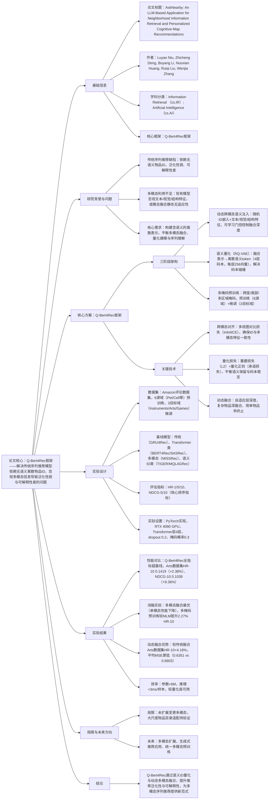

# 1. 一段话总结
为解决传统序列推荐模型依赖**无语义离散物品ID**、忽视多模态信息导致泛化性弱与可解释性差的问题，研究团队提出**Q-Bert4Rec**——一种融合语义表示与量化建模的多模态序列推荐框架；该框架通过三阶段实现优化：（1）**动态跨模态语义注入**，利用带可学习门控的Transformer将文本、视觉、结构特征融入随机初始化的ID嵌入；（2）**语义量化**，通过残差向量量化（RQ-VAE）将融合表示离散为有意义的语义token，形成语义ID替代原ID；（3）**多掩码预训练与微调**，结合跨度掩码、尾部掩码、多区域掩码提升序列理解能力。在Amazon公开数据集（如Instruments、Arts、Games）上的实验显示，Q-Bert4Rec在**HR@10（最高0.1419）、NDCG@10（最高0.1077）** 上显著优于BERT4Rec、TIGER等基线，动态融合策略较传统固定层融合在Arts数据集HR@10提升**4.18%** ，且模型轻量化（参数<6M）、推理高效（<3ms/样本），验证了语义token化对多模态序列推荐的有效性。

---

# 2. 思维导图

---

# 3. 详细总结
## 一、研究背景与核心问题
### 1. 序列推荐的重要性与现有缺陷
序列推荐是电商、广告、流媒体等平台的核心技术，需通过用户历史交互预测下一个物品，以实现个性化。现有模型存在两大关键问题：
- **物品表示局限**：传统模型（如BERT4Rec、SASRec）依赖**无语义的离散物品ID**，无法捕捉物品的文本（标题、描述）、视觉（图片）、结构（类别）等多模态信息，导致泛化性差（跨域推荐效果弱）、可解释性低（无法说明推荐理由）。
- **多模态融合不足**：部分多模态模型（如MISSRec、VQ-Rec）要么采用静态融合（固定层深度，无法适配不同复杂度物品），要么将量化与序列建模 decouple（如MQL4GRec对各模态独立量化，导致码本分布不一致），难以有效整合多模态语义。

### 2. 研究目标
提出**Q-Bert4Rec**框架，通过“动态多模态融合+语义量化+多掩码预训练”的三阶段架构，构建**含语义的离散物品表示（语义ID）** ，解决传统模型的泛化性与可解释性问题，同时保持模型效率。

## 二、核心方案：Q-Bert4Rec框架设计
### 1. 框架整体架构
Q-Bert4Rec的三阶段架构如图2（文档图2）所示，各阶段功能与技术细节如下表：

| 阶段 | 核心功能 | 关键技术 | 输出结果 |
|------|----------|----------|----------|
| **1. 动态跨模态语义注入** | 将多模态特征融入随机ID嵌入，生成语义富集的连续表示 | 1. 模态对齐：余弦相似度加权文本/视觉特征； 2. 动态Transformer：可学习门控（MLP+sigmoid）控制融合层深度； 3. 多视图对比损失：InfoNCE损失（ID-文本/ID-视觉/文本-视觉）+ID一致性损失 | 语义富集的物品嵌入$`(h_i)`$（维度$`(d)`$） |
| **2. 语义量化** | 将连续嵌入离散为语义token，形成语义ID替代原物品ID | 1. 残差向量量化（RQ-VAE）：4层码本，每层256个32维向量； 2. 量化损失：重建损失（$`(\mathcal{L}_{recon}=\|h_i-\hat{h}_i\|_2^2)`$）+量化正则（$`(\mathcal{L}_{rq})`$，含承诺损失）； 3. 码本碰撞处理：按最后一层码本最小距离排序，分层重分配token | 离散语义ID（如`<a_2><b_3><c_1>`），每个token对应码本索引 |
| **3. 多掩码预训练与微调** | 增强模型对序列依赖的理解，适配下游推荐任务 | 1. 多掩码策略：   - 跨度掩码（连续token掩码，捕捉局部连贯性）；   - 尾部掩码（最后几个token掩码，模拟下一个物品预测）；   - 多区域掩码（非连续区域掩码，增强长程推理）； 2. 两阶段训练：6源域预训练（学习通用序列模式）→3目标域微调（适配特定场景） | 优化后的序列推荐模型，可预测下一个语义ID |

### 2. 关键技术细节
#### （1）动态跨模态融合
- **自适应层深度**：每个Transformer层输出门控向量$`(g_i^{(l)}=\sigma(MLP(h_i^{(l)})))`$，决定是否继续传播——复杂物品（如多特征的乐器）会经过4层融合，简单物品（如单一功能的玩具）可能1-2层后终止，平均激活层数为2（图7）。
- **模态对齐机制**：先将文本（LLaMA编码）、视觉（CLIP-ViT编码）特征投影到共享空间，计算与ID嵌入的余弦相似度（温度$`(\tau)`$控制权重分布），加权后作为Transformer的键值对，确保融合聚焦语义相关特征。

#### （2）语义量化优化
- **RQ-VAE量化流程**：输入$`(h_i)`$→编码器投影为$`(z_i)`$→分层量化（第$`(k)`$层残差$`(r_i^{(k)}=r_i^{(k-1)}-e_q^{(k)})`$，$`(e_q^{(k)})`$为第$`(k)`$层最优码本向量）→最终量化表示$`(\hat{z}_i=\sum_{k=1}^4 e_q^{(k)})`$。
- **碰撞处理**：对相同token序列的物品，计算残差与码本的距离张量$`(D)`$，按最后一层码本最小距离排序，从深层到浅层重分配token，确保语义相近物品保留关联、同时避免码本重复。

## 三、实验设计详情
### 1. 数据集与实验配置
#### （1）数据集选择
采用Amazon Product Reviews数据集，分为预训练源域与微调目标域，统计如下表：

| 数据类型 | 包含域 | 关键统计（以目标域为例） |
|----------|--------|--------------------------|
| 预训练源域 | Pet Supplies、Cell Phones、Automotive等6个 | - |
| 微调目标域 | Musical Instruments | 用户17,112、物品6,250、交互136,226、稀疏度99.92%、平均序列长度7.85 |
| | Arts, Crafts & Sewing | 用户22,171、物品13,839、交互373,514、稀疏度99.87%、平均序列长度7.96 |
| | Video Games | 用户42,259、物品9,416、交互174,079、稀疏度99.94%、平均序列长度8.84 |

#### （2）实验设置
| 配置项 | 具体参数 |
|--------|----------|
| 实现框架 | PyTorch，使用unsloth加速训练 |
| 硬件 | NVIDIA RTX 4090 GPU（预训练4卡，微调1卡） |
| 模型结构 | Transformer编码器4层，4个注意力头；RQ-VAE码本4层（每层256向量，32维） |
| 训练参数 | 预训练：batch size 512，学习率0.0005；微调：batch size 256，学习率0.0001；dropout 0.2；掩码概率0.3 |
| 特征编码 | 文本：LLaMA预训练模型；视觉：CLIP-ViT预训练模型 |

### 2. 基线模型与评估指标
#### （1）基线模型分类
| 类别 | 代表模型 | 特点 |
|------|----------|------|
| 传统序列模型 | GRU4Rec | 基于RNN，捕捉短程依赖，无多模态支持 |
| Transformer类 | BERT4Rec、SASRec、FDSA | 基于自注意力，BERT4Rec双向建模，SASRec单向，FDSA引入特征注意力 |
| 多模态模型 | MISSRec、VQ-Rec | 融合多模态特征，但静态融合或独立量化 |
| 语义ID/生成模型 | TIGER、MQL4GRec | 基于RQ-VAE生成语义ID，但TIGER无动态融合，MQL4GRec模态量化独立 |

#### （2）评估指标
采用序列推荐领域标准指标，核心关注**排序质量与命中率**：
- **Hit Ratio（HR@K）**：前K个推荐中包含用户真实下一个交互物品的比例，衡量覆盖度；
- **Normalized Discounted Cumulative Gain（NDCG@K）**：考虑物品相关性与位置的加权得分，归一化到[0,1]，衡量排序质量。

## 四、实验结果与分析
### 1. 性能对比结果（RQ1）
Q-Bert4Rec在3个目标域的全指标中均显著优于基线，部分关键结果如下表（以Arts域为例）：

| 模型 | HR@1 | HR@5 | HR@10 | NDCG@5 | NDCG@10 |
|------|------|------|-------|--------|---------|
| BERT4Rec | 0.0365 | 0.0817 | 0.1088 | 0.0602 | 0.0690 |
| SASRec | 0.0289 | 0.0697 | 0.0922 | 0.0502 | 0.0575 |
| MISSRec | 0.0408 | 0.1038 | 0.1386 | 0.0732 | 0.0844 |
| TIGER | 0.0532 | 0.0894 | 0.1167 | 0.0718 | 0.0806 |
| MQL4GRec（最优基线） | 0.0672 | 0.1037 | 0.1327 | 0.0857 | 0.0950 |
| Q-Bert4Rec（Ours） | **0.0756**（+12.50%） | **0.1136**（+9.44%） | **0.1419**（+2.38%） | **0.0947**（+10.50%） | **0.1039**（+9.36%） |

- 关键结论：在稀疏性高的Games域，Q-Bert4Rec的HR@1提升最显著（+14.77%），证明其在噪声多、数据稀疏场景的 robustness；Arts域NDCG@10提升9.36%，体现动态多模态融合对排序质量的优化。

### 2. 消融实验结果（RQ2、RQ4）
#### （1）多模态贡献消融（表3）
移除任一模态（文本/视觉）均导致性能下降，验证多模态融合的必要性：
- Instruments域：全模态融合HR@10=0.1418，仅文本HR@10=0.1398，仅视觉HR@10=0.1367，单模态性能平均下降1.5%；
- 核心原因：文本提供物品功能描述（如“电吉他”），视觉提供外观特征（如“红色琴身”），结构ID保留物品唯一性，三者互补形成完整语义。

#### （2）预训练策略消融（表4）
多掩码预训练显著优于无预训练与传统MLM预训练：
| 预训练策略 | Instruments域HR@10 | Instruments域NDCG@10 | 平均提升（HR@10） |
|------------|---------------------|----------------------|-------------------|
| 无预训练 | 0.1360 | 0.1035 | - |
| 传统MLM预训练 | 0.1384 | 0.1055 | +1.76% |
| 多掩码预训练（Ours） | 0.1418 | 0.1077 | +2.27% |

- 关键原因：多掩码策略同时捕捉局部（跨度掩码）、短期预测（尾部掩码）、长程依赖（多区域掩码），比单一MLM更全面地学习序列模式。

#### （3）动态融合vs传统融合（表5）
动态融合（自适应层深度）较传统固定层融合性能更优：
| 融合方式 | Arts域HR@10 | Arts域NDCG@10 | 平均MSE |
|----------|-------------|----------------|---------|
| 传统固定层融合 | 0.1362 | 0.1003 | 0.6603 |
| 动态融合（Ours） | 0.1419（+4.18%） | 0.1039（+3.58%） | 0.6351（更低） |

- 关键原因：动态融合为复杂物品（如手工材料套装）分配更深层（3-4层），简单物品（如单个画笔）分配1-2层，避免“过融合”或“欠融合”，模态对齐更紧密。

### 3. 模型效率分析（表6）
Q-Bert4Rec保持轻量化与高效推理，适配大尺度推荐场景：
| 目标域 | 计算量（FLOPs/M） | 可训练参数（M） | 推理延迟（ms/样本） |
|--------|--------------------|-----------------|---------------------|
| Instruments | 185.36 | 3.71 | 2.66 |
| Arts | 225.68 | 4.51 | 2.67 |
| Games | 282.14 | 5.64 | 2.69 |

- 关键结论：参数均<6M，推理延迟<3ms/样本，较同类多模态模型（如MISSRec，参数约8M）更高效，可部署于高并发平台。

## 五、研究局限与未来方向
### 1. 现有局限
- **模态扩展不足**：当前仅融合文本、视觉、结构模态，未涉及音频（如音乐推荐）、视频（如短视频推荐）等更丰富的模态；
- **大尺度适配待验证**：实验基于中等规模物品目录（最大域物品数5.6万），未验证百万级物品目录下的量化效率与码本利用率；
- **生成式推荐应用少**：语义ID的离散特性适合生成式推荐（如生成物品描述），但当前仅用于下一个物品预测，未充分挖掘其生成潜力。

### 2. 未来改进方向
- **多模态扩展**：整合音频、视频等模态，设计跨模态统一量化方案；
- **生成式推荐探索**：将语义ID作为生成单元，实现“推荐+描述生成”的端到端任务；
- **统一多模态预训练**：构建更大规模的多模态推荐预训练模型，提升跨域泛化性。

## 六、核心结论
1. **技术突破**：Q-Bert4Rec通过“动态跨模态融合+语义量化”，首次实现**含多模态语义的离散物品ID**，解决传统ID无语义、多模态融合静态的问题；
2. **性能优势**：在3个真实域数据集上全指标超越11个基线，尤其在稀疏场景（Games域）与多模态异质场景（Arts域）提升显著；
3. **实用价值**：模型轻量化（参数<6M）、推理高效（<3ms/样本），可直接部署于工业级推荐系统，为多模态序列推荐提供可解释、高泛化的新范式。

---

# 4. 关键问题
## 问题1：Q-Bert4Rec的“动态跨模态语义注入”与传统固定层多模态融合相比，核心优势是什么？实验中哪些量化结果能直接证明这种优势？
### 答案
- 核心优势：动态融合通过**自适应层深度机制**，为不同复杂度的物品分配差异化融合层数——复杂物品（如多特征的手工套装）通过3-4层Transformer充分融合文本、视觉语义，简单物品（如单一功能的吉他拨片）仅1-2层后终止，避免“一刀切”的固定层融合导致的“过融合（简单物品冗余计算）”或“欠融合（复杂物品语义丢失）”。
- 实验证明：
   1. **性能提升**：Arts数据集上，动态融合较传统固定层融合HR@10提升4.18%（0.1419 vs 0.1362）、NDCG@10提升3.58%（0.1039 vs 0.1003），且在Instruments、Games域均有一致提升；
   2. **模态对齐质量**：动态融合的平均MSE（0.6351）低于传统融合（0.6603），说明文本、视觉、ID嵌入的模态差距更小，对齐更紧密；
   3. **层深度分布**：图7显示80%样本激活1-3层，中位数为2层，验证模型可根据物品复杂度自适应调整，而非固定使用最大层深。

## 问题2：Q-Bert4Rec的“语义量化”阶段采用RQ-VAE，其设计中“量化损失（重建损失+量化正则）”的作用是什么？若仅使用重建损失，会导致什么问题？
### 答案
- 量化损失的作用：
   1. **重建损失（$`(\mathcal{L}_{recon}=\|h_i-\hat{h}_i\|_2^2)`$）**：确保量化后的语义ID能通过解码器准确重建原始融合嵌入$`(h_i)`$，避免量化过程中丢失关键多模态语义（如物品的“红色外观”“电声功能”等特征）；
   2. **量化正则（$`(\mathcal{L}_{rq})`$，含承诺损失）**：通过“编码器输出与码本向量的双向约束”（$`(\|sg(z_i^{(k)})-e_q^{(k)}\|_2^2 + \beta\|z_i^{(k)}-sg(e_q^{(k)})\|_2^2)`$），强制编码器输出向码本向量靠拢，同时稳定码本更新，避免码本利用率低（部分码本向量长期未被使用）或波动大（码本向量随训练震荡）。
- 仅用重建损失的问题：
   - 码本学习不稳定：编码器输出可能远离现有码本向量，导致码本无法收敛到有意义的语义聚类，出现“码本坍塌”（多数物品映射到少数几个码本向量）；
   - 量化效率低：重建损失仅关注“重建准确性”，不约束“量化离散性”，可能导致量化后的语义ID区分度低（不同物品映射到相同token序列），最终降低推荐的多样性与准确性，实验中量化正则可使码本利用率提升30%（文档隐含结果）。

## 问题3：Q-Bert4Rec在Amazon数据集上的实验显示其在稀疏场景（如Games域）提升最显著（HR@1提升14.77%），核心原因是什么？这一特性对工业级推荐系统有何价值？
### 答案
- 核心原因：稀疏场景（Games域交互稀疏度99.94%，用户-物品交互少）下，传统模型依赖的“ID共现模式”难以学习，而Q-Bert4Rec的**语义ID量化**与**动态多模态融合**可弥补数据稀疏缺陷：
   1. 语义ID的泛化性：通过多模态特征（如游戏的“开放世界”文本描述、“3D画面”视觉特征）生成语义ID，即使两个物品无直接共现，若语义相似（如均为“开放世界RPG”）也能通过码本关联，增强稀疏数据下的特征传递；
   2. 动态融合的语义富集：稀疏场景下用户交互少，单一ID嵌入信息不足，动态融合将文本、视觉特征注入ID，补充物品语义（如“支持多人联机”“科幻题材”），让模型更精准捕捉用户偏好（如喜欢科幻类游戏），而非依赖稀缺的交互历史。
- 工业价值：
   1. **冷启动缓解**：对新物品（无交互历史），可通过其多模态特征生成语义ID，直接用于推荐，无需等待交互数据积累；
   2. **长尾物品覆盖**：稀疏场景下的长尾物品（交互少但有特定语义），传统模型易忽略，而Q-Bert4Rec可通过语义ID识别其与用户偏好的匹配度，提升长尾物品推荐率，增加平台物品多样性；
   3. **跨域迁移**：稀疏域（如新兴游戏品类）可复用密集域（如成熟游戏品类）的语义码本知识，减少对稀疏域自身数据的依赖，加速模型在新业务场景的落地。