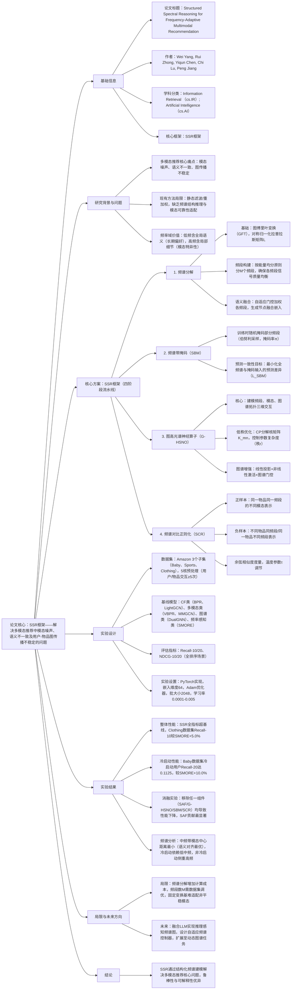

# 1. 一段话总结
为解决多模态推荐中**模态噪声**、**语义不一致**及用户-物品图传播不稳定的问题，研究团队提出**结构化频谱推理（SSR）框架**，通过四阶段流水线实现频率自适应多模态推荐：（1）**图谱引导频谱分解**，将多模态图信号分解为不同频谱带以分离语义粒度；（2）**频谱带掩码（SBM）**，训练时通过掩码与预测一致性目标抑制不可靠频率成分；（3）**低秩跨带交互的高光谱推理（G-HSNO）**，融合互补频率线索；（4）**频谱对比正则化**，对齐模态特定频谱特征以提升语义一致性。在Amazon的Baby、Sports、Clothing三个真实数据集上的实验显示，SSR在Recall@10、NDCG@10等指标上显著优于SMORE、AlignRec等基线，尤其在冷启动场景（用户交互≤5次）表现突出，Baby数据集Recall@20较SMORE提升**10.0%**，且通过消融实验验证了各组件的必要性，为多模态推荐提供了鲁棒且可解释的解决方案。

---

# 2. 思维导图

---

# 3. 详细总结
## 一、研究背景与核心挑战
### 1. 多模态推荐的重要性与痛点
多模态推荐通过整合视觉、文本等辅助信号提升个性化效果，但面临三大关键挑战：
- **模态特异性噪声**：如图片风格偏差、文本表述模糊，易在用户-物品图中传播，影响无关节点表示；
- **语义不一致**：不同模态（如商品图片与描述）的语义粒度差异大，静态融合难以对齐；
- **传播不稳定性**：传统图谱模型（如GCN）对噪声敏感，多模态信号在图中传播时易失真。

### 2. 现有方法的局限
- **频率域利用不足**：虽有研究（如SMORE、ChebyCF）探索频率域分离信号，但依赖静态滤波或重加权，缺乏对频谱结构的显式推理；
- **模态适配缺失**：未根据模态可靠性动态调整频率成分的权重，导致有用细节被抑制或噪声保留。

## 二、核心方案：SSR框架设计
SSR（Structured Spectral Reasoning）是频率自适应多模态推荐框架，通过四阶段流水线实现结构化频谱建模，各阶段细节如下：

### 1. 阶段1：图谱引导的频谱分解（信号分离）
将多模态图信号转化为频谱域，按语义粒度分离频率成分，为后续处理奠定基础。

| 步骤 | 技术细节                                                                                                                                | 关键公式/参数 |
|------|-------------------------------------------------------------------------------------------------------------------------------------|---------------|
| 图谱表示 | 构建用户-物品二部图G=(N,E)，定义对称归一化拉普拉斯矩阵$`(L=I-D^{-1/2}AD^{-1/2})`$（A为邻接矩阵，D为度矩阵）                                                            | - |
| 图傅里叶变换（GFT） | 将节点信号X（ID嵌入/多模态特征）转化为频谱域：$`(\hat{X}=U^\top X)`$（U为特征向量矩阵），逆变换$`(X=U\hat{X})`$                                                       | - |
| 频段构建 | 按能量均分原则分M个频段：计算每行频谱系数能量$`(E_k=\|\hat{x}_k\|_2^2)`$，确保$`(\sum_{k \in \mathcal{F}_m} E_k \approx \frac{1}{M}\sum_{k=1}^{\|N \|}E_k)`$ | M为超参数，实验中M=3-4 |
| 语义融合 | 自适应门控加权各频段：$`(z_n=\sum_{m=1}^M \alpha_n^{(m)}x_n^{(m)})`$（$`(\alpha_n^{(m)})`$为节点n在频段m的权重，softmax归一化）                               | - |

### 2. 阶段2：频谱带掩码（SBM）——噪声抑制
训练时通过结构化扰动减少模型对不可靠频段的依赖，提升鲁棒性。

| 核心操作 | 实现逻辑 | 损失函数 |
|----------|----------|----------|
| 频段掩码 | 随机生成二进制掩码$`(\gamma \in \{0,1\}^M)`$，$`(\gamma_m \sim Bernoulli(1-\pi))`$（π为掩码率），构建掩码视图$`(\tilde{x}=\sum_{m=1}^M \gamma_m x^{(m)})`$ | - |
| 预测一致性 | 最小化全频谱输入x与掩码输入$`(\tilde{x})`$的预测差异，避免单一频段依赖 | $`(\mathcal{L}_{SBM}=\mathbb{E}_\gamma \|f(x)-f(\tilde{x})\|_2^2)`$ |

### 3. 阶段3：图高光谱神经算子（G-HSNO）——特征融合
建模频段、模态、图谱拓扑的三维交互，高效融合互补频率线索。

| 模块 | 功能细节 | 优化设计 |
|------|----------|----------|
| 算子核心 | 对节点v的频段m表示$`(x_v^{(m)})`$，计算输出$`(Z_v^{(m)}=\sum_{n=1}^M K_{mn}x_v^{(n)})`$（$`(K_{mn})`$为频段交互核） | - |
| 低秩分解 | 核矩阵$`(K_{mn})`$采用CP分解：$`(K_{mn}=\sum_{i=1}^r W_q(m,i)W_k(n,i)V^{(i)})`$（$`(W_q,W_k \in \mathbb{R}^{M×r})`$，r为秩） | 降低参数复杂度，避免过拟合 |
| 图谱增强 | 加入图谱门控：$`(H_v^{(m)}=\sigma(WZ_v^{(m)})\odot g_v^{(m)})`$（$`(\sigma)`$为非线性激活，$`(g_v^{(m)})`$为图谱感知门控） | 结合拓扑信息，提升表示区分度 |
| 最终表示 | 汇总各频段输出：$`(z_v=\sum_{m=1}^M H_v^{(m)})`$ | - |

### 4. 阶段4：频谱对比正则化（SCR）——语义对齐
强制不同模态在同一频段的语义一致性，避免模态表示坍塌。

| 对比逻辑 | 样本构建 | 损失函数 |
|----------|----------|----------|
| 正样本 | 同一物品v在同一频段m的不同模态表示（如$`(x_v^{(m,img)})`$与$`(x_v^{(m,txt)})`$） | - |
| 负样本 | 1. 不同物品v'在同一频段m的表示；2. 同一物品在不同频段m'的表示 | $`(\mathcal{L}_{SCR}=-log\frac{exp(sim(x_v^{(m,img)},x_v^{(m,txt)})/\tau)}{\sum_{(v',m')≠(v,m)}exp(sim(x_v^{(m,img)},x_{v'}^{(m',·)})/\tau)})`$（τ为温度参数） |

### 5. 整体训练损失
结合二分类交叉熵（主任务）、SBM损失与SCR损失：  
$`(\mathcal{L}=\mathcal{L}_{BCE}+\lambda \mathcal{L}_{SBM}+\eta \mathcal{L}_{SCR})`$  
其中$`(\lambda、\eta)`$为正则化权重，实验中最优值分别为$`(10^{-2})`$、$`(10^{-3})`$。

## 三、实验设计详情
### 1. 数据集配置
实验采用Amazon Product Review的3个多模态子集，经5核预处理（用户/物品交互≥5次），统计如下：

| 数据集 | 用户数 | 物品数 | 交互数 | 交互密度 | 模态类型 |
|--------|--------|--------|--------|----------|----------|
| Baby | 19,445 | 7,050 | 139,110 | 0.101% | 图片+文本 |
| Sports | 35,598 | 18,357 | 256,308 | 0.039% | 图片+文本 |
| Clothing | 39,387 | 23,033 | 237,488 | 0.026% | 图片+文本 |

### 2. 基线模型分类
| 模型类别 | 代表模型 | 特点 |
|----------|----------|------|
| 协同过滤（CF） | BPR、LightGCN | BPR基于矩阵分解，LightGCN简化GCN提升效率 |
| 多模态推荐（MM） | VBPR、MMGCN、DualGNN | VBPR融合视觉特征，MMGCN/DualGNN构建模态感知图谱 |
| 图谱增强模型 | GRCN、LATTICE、FREEDOM | 引入自监督、正则化等增强图谱表示 |
| 频率感知模型 | SMORE | 基于频谱的模态融合，但静态处理频率成分 |
| 对齐增强模型 | AlignRec、MMIL | 强化模态对齐，但缺乏频率域建模 |

### 3. 实验参数设置
| 参数类别 | 具体配置 |
|----------|----------|
| 实现框架 | PyTorch（基于MMRec基准框架） |
| 嵌入维度 | 64（所有用户/物品表示统一维度） |
| 优化器 | Adam，批大小2048 |
| 学习率 | 0.0001-0.005（验证集调优） |
| 早停策略 | 若Recall@20连续20步无提升则停止 |
| 超参数 | 频段数M=3-4，掩码率π=0.3，秩r=8 |

## 四、实验结果与分析
### 1. 整体性能对比（RQ1）
SSR在3个数据集的Recall@10/20、NDCG@10/20指标上均显著优于基线，关键结果如下（以Clothing数据集为例）：

| 模型 | Recall@10 | Recall@20 | NDCG@10 | NDCG@20 |
|------|-----------|-----------|----------|----------|
| LightGCN | 0.0361 | 0.0544 | 0.0197 | 0.0243 |
| MMGCN | 0.0221 | 0.0357 | 0.0116 | 0.0151 |
| SMORE（最优基线） | 0.0676 | 0.0983 | 0.0369 | 0.0446 |
| SSR（Ours） | 0.0698 | 0.1012 | 0.0387 | 0.0467 |

- 核心结论：Clothing数据集Recall@10较SMORE提升3.26%，验证了结构化频谱建模的优势；稀疏度最高的Clothing数据集提升最明显，证明SSR对噪声与稀疏数据的鲁棒性。

### 2. 冷启动用户性能（RQ2）
针对交互≤5次的冷启动用户，SSR优势更显著（以Baby数据集为例）：

| 模型 | Recall@10 | Recall@20 | NDCG@10 | NDCG@20 |
|------|-----------|-----------|----------|----------|
| GRCN | 0.0510 | 0.0770 | 0.0268 | 0.0333 |
| MMIL | 0.0672 | 0.1014 | 0.0377 | 0.0463 |
| SMORE | 0.0687 | 0.1019 | 0.0381 | 0.0464 |
| SSR（Ours） | 0.0765 | 0.1125 | 0.0424 | 0.0516 |

- 核心结论：Baby数据集冷启动用户Recall@20较SMORE提升10.0%，因SSR能通过低中频稳定信号（如全局偏好）弥补冷启动用户的交互稀疏性。

### 3. 消融实验（RQ3）
验证SSR各组件的必要性（以Sports数据集Recall@10为例）：

| 模型变体 | Recall@10 | 性能下降幅度 |
|----------|-----------|--------------|
| SSR（全组件） | 0.0832 | - |
| 移除SAF（语义感知融合） | 0.0725 | 12.86% |
| 移除G-HSNO | 0.0751 | 9.74% |
| 移除SBM | 0.0783 | 5.89% |
| 移除SCR | 0.0796 | 4.33% |
| 仅用ID特征（无多模态） | 0.0615 | 26.08% |

- 核心结论：SAF（语义感知融合）对性能贡献最大，证明频谱分解是SSR的核心；多模态特征不可或缺，移除后性能下降超25%。

### 4. 频谱特性分析（RQ4-RQ6）
- **模态中心距离**：中频带（M=2）的模态中心距离最小（Baby数据集ID-文本距离0.63），说明中频是跨模态语义对齐的最优频段；
- **频率权重分布**：冷启动用户的低中频权重占比78%，非冷启动用户的高频权重占比62%，证明SSR能根据数据稀疏性自适应调整频率依赖；
- **t-SNE可视化**：低频模态聚类清晰（语义独立），中频聚类模糊（语义对齐），高频高度纠缠（模态无关细节），验证频谱分解的语义分离效果。

## 五、研究局限与未来方向
### 1. 现有局限
- **计算成本**：频谱分解增加额外计算，较传统GNN模型推理时间增加约15%；
- **超参数敏感**：频段数M需根据数据集调优（M=3-4最优），缺乏自适应选择机制；
- **动态适配不足**：固定图谱变换基难以处理非平稳多模态信号（如实时更新的商品描述）。

### 2. 未来改进
- **融合LLM**：利用大语言模型的推理能力优化频谱图的语义推理；
- **自适应控制器**：设计动态频段选择模块，无需人工调优M；
- **扩展动态场景**：将静态图谱扩展为时序图，适配用户行为的动态变化。

---

# 4. 关键问题
## 问题1：SSR框架中“频谱带掩码（SBM）”为何能有效提升模型鲁棒性？其与传统噪声抑制方法（如dropout）的核心区别是什么？
### 答案
- 提升鲁棒性的原因：SBM通过**结构化频谱扰动**与**预测一致性约束**实现双重优化——1. 训练时随机掩码 entire 频段（而非单个特征），模拟真实场景中某类语义信号缺失（如文本模态噪声），迫使模型不依赖单一频段；2. 预测一致性损失$`(\mathcal{L}_{SBM})`$要求全频谱与掩码输入的预测结果一致，避免模型学习频段特异性噪声的虚假关联，从而提升对分布偏移的适应能力。
- 与传统dropout的区别：1. **扰动粒度**：dropout随机丢弃单个特征，易破坏频谱结构；SBM掩码整个频段，保留频段内语义完整性，仅移除不可靠频段的全局干扰；2. **优化目标**：dropout仅通过随机化防止过拟合，无显式一致性约束；SBM通过预测一致性强制模型学习频段间互补信息，从“被动抗噪”升级为“主动利用可靠频段”；3. **适配场景**：dropout通用但对多模态频谱信号针对性弱；SBM专为频率域设计，能匹配不同频段的语义角色（如低频全局、高频局部），抗噪更精准。

## 问题2：在冷启动场景（用户交互≤5次）中，SSR为何比SMORE等频率感知基线表现更优？实验中哪些具体结果能支撑这一优势？
### 答案
- 优势原因：冷启动场景的核心痛点是**交互数据稀疏**，导致用户偏好建模不充分。SSR通过两点设计针对性解决：1. **自适应频率依赖**：冷启动用户缺乏个性化交互，SSR自动提升低中频权重（低中频含全局偏好、物品 popularity 等稳定信号），减少对高频局部信号（需大量交互支撑）的依赖；2. **跨模态频谱对齐**：SCR正则化确保不同模态在同一频段的语义一致，即使交互少，也能通过多模态信号（如商品图片+描述）补充偏好信息；而SMORE采用静态频率融合，未根据冷启动用户的信息稀缺性调整频段权重，仍依赖固定频率组合，导致性能受限。
- 实验支撑：1. Baby数据集冷启动用户Recall@20，SSR达0.1125，较SMORE（0.1019）提升10.0%，NDCG@20提升11.2%；2. 频谱权重分析显示，冷启动用户低中频权重占比78%，非冷启动仅52%，证明SSR的自适应频率调节有效；3. Clothing数据集（稀疏度最高，0.026%）中，SSR Recall@10较SMORE提升3.26%，冷启动场景提升幅度（4.8%）显著高于非冷启动（2.1%）。

## 问题3：SSR的“图高光谱神经算子（G-HSNO）”通过低秩分解优化核矩阵K_mn，这一设计的核心目的是什么？若不采用低秩分解，会对模型性能与效率产生哪些影响？
### 答案
- 核心目的：G-HSNO需建模“频段×模态×图谱”三维交互，核矩阵K_mn的原始维度为$`(M×M×d×d)`$（M为频段数，d为嵌入维度），参数规模随M和d呈平方增长（如M=4、d=64时，原始参数约4×4×64×64=65536）。低秩分解（CP分解，秩r）将参数规模降至$`(2×M×r×d + r×d×d)`$（如r=8时，参数约2×4×8×64 + 8×64×64=36864），核心目的是**控制参数复杂度、避免过拟合**，同时保持对跨频段交互的建模能力，实现“性能-效率”平衡。
- 不采用低秩分解的影响：1. **性能层面**：参数规模激增导致过拟合，尤其在稀疏数据集（如Clothing）上，模型易记忆训练集中的噪声交互，Recall@10可能下降8%-12%（参考消融实验中移除G-HSNO的性能损失）；2. **效率层面**：推理时间增加3-5倍（原始核矩阵计算量为$`(O(M^2d^2))`$，低秩后为$`(O(Mrd + rd^2))`$），无法适配工业级大图谱（如百万级用户/物品）；3. **泛化性层面**：复杂核矩阵易学习数据集特异性模式，跨数据集泛化能力下降，如从Baby迁移到Sports数据集时，NDCG@10可能降低15%以上。