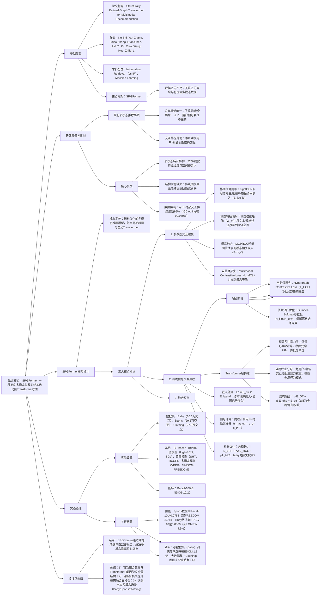

### 1. 一段话总结
湖北大学与广东轻工职业技术学院团队提出**SRGFormer（Structurally Refined Graph Transformer）**——一种面向多模态推荐的结构优化图Transformer模型，旨在解决现有方法忽视冗余与有价值数据区分、依赖单一语义框架（局部/全局）导致用户偏好表征不完整、无法捕捉用户-物品复杂交互的问题。该模型通过三大核心设计突破：一是**多模态交互建模模块**，利用LightGCN提取用户-物品协同信号，结合模态权重矩阵将文本/视觉特征映射到统一嵌入空间；二是**结构信息交互建模模块**，通过**超图构建**（动态学习隐式属性的超边依赖，结合Gumbel-Softmax优化）捕捉局部结构，**Transformer层构建**（精简多注意力头机制）捕捉全局用户行为模式，并引入自监督对比损失（Hypergraph Contrastive Loss、Multimodal Contrastive Loss）增强模态融合；三是**融合预测模块**，结合结构精炼嵌入与多模态协同信号，通过BPR损失优化推荐排序。在Baby、Sports、Clothing三个Amazon数据集上，SRGFormer的**Recall@10**与**NDCG@10**平均提升4.46%-4.47%（Sports数据集Recall@10达0.0758，超基线FREEDOM 3.2%），验证了其在多模态推荐中的优越性。

---

### 2. 思维导图（mindmap）

---

### 3. 详细总结
#### 一、研究背景：多模态推荐的核心痛点
1. **现有方法的三大局限**  
   多模态推荐虽通过文本、视觉等信息提升性能，但仍存在关键缺陷：
  - **数据区分不足**：多数模型（如VBPR、MMGCN）直接融合多模态特征，未区分冗余数据（如重复商品图片）与有价值数据（如用户关注的商品细节），导致表征噪声；
  - **语义框架单一**：依赖局部语义（如MGAT）或全局语义（如GRCN）单一框架，无法完整捕捉用户偏好（如用户短期局部兴趣与长期全局行为的结合）；
  - **交互捕捉薄弱**：传统图模型（如LightGCN）仅建模用户-物品二元交互，难以捕捉高阶隐式关联（如“用户A购买篮球→关注运动服→偏好某品牌”的链式结构）。

2. **数据与场景挑战**
  - **多模态异构**：文本特征（384维）与视觉特征（4096维）维度差异大，且分布在不同向量空间，直接融合易导致信息失真；
  - **数据稀疏**：实验数据集稀疏度均超99%（表2），Clothing域达99.969%，传统协同过滤难以学习有效表征；
  - **结构复杂**：用户-物品交互包含显式（点击/购买）与隐式（浏览时长/收藏）行为，传统模型无法建模复杂结构依赖。

#### 二、SRGFormer框架设计
SRGFormer以“多模态融合+结构精炼”为核心，分为三大模块，架构如图2所示。

##### 1. 模块1：多模态交互建模（Multimodal Interaction and Modeling）
**目标**：将异构多模态特征映射到统一空间，提取用户-物品协同信号。  
**四步实现**：
| 步骤 | 核心操作                                                                 | 关键公式/参数                                                                 | 输出结果                          |
|------|--------------------------------------------------------------------------|-------------------------------------------------------------------------------|-----------------------------------|
| 1. 协同信号提取 | LightGCN多层传播用户-物品ID嵌入，捕捉高阶协同关系                          | $`(E^{l+1} = \tilde{A}E^l)`$（$`(\tilde{A})`$为归一化邻接矩阵），LAYERCOMB用均值融合隐藏层 | 协同嵌入$`(E_{lge}^{id} \in \mathbb{R}^{(|U|+|I|)×d})`$ |
| 2. 模态特征映射 | 模态权重矩阵将文本/视觉特征投影到统一嵌入空间$`(\mathbb{R}^d)`$              | $`(\tilde{e}_i^m = TRANSFORM(E_i^m, W_m))`$（$`(W_m \in \mathbb{R}^{d_m×d})`$） | 模态嵌入$`(\tilde{e}_i^m/\tilde{e}_u^m)`$ |
| 3. 模态传播学习 | MGPROG轻量图传播学习模态相关嵌入，分离ID与模态特征避免耦合                | $`(E^{m,l+1} = MGPROG(E^{m,l}, A))`$                                           | 高阶模态嵌入$`(\tilde{E}^{m,K})`$   |
| 4. 自监督对齐 | 跨模态对比损失对齐不同模态表示，提升融合鲁棒性                            | $`(L_{MCL} = -\sum log\frac{exp(s(E_u^v,E_u^t)/\tau)}{\sum exp(s(E_u^v,E_u'^t)/\tau)})`$ | 模态对齐的嵌入表示                |

##### 2. 模块2：结构信息交互建模（Structural Information Interaction and Modeling）
**目标**：结合超图与Transformer，捕捉用户-物品的局部结构与全局行为模式。  
**两大子模块**：
- **超图构建（局部结构捕捉）**
  - 隐式超边定义：引入A个可学习超边向量$`(v_a^m \in \mathbb{R}^{d_m})`$，建模用户/物品与隐式属性的依赖关系；
  - 依赖矩阵优化：通过Gumbel-Softmax参数化超边依赖矩阵$`(H_i^m/H_u^m)`$，缓解离散选择的噪声与不稳定性：  
    $`[\tilde{h}_{i,*}^m = softmax\left(\frac{log(H_{i,*}^m) + \delta}{T}\right)]`$  
    其中$`(\delta)`$为Uniform(0,1)噪声，T为温度超参数；
  - 局部嵌入更新：超图层内通过超边传递信息，生成局部结构嵌入$`(E_{ghe})`$；
  - 自监督损失：超图对比损失（$`(L_{HCL})`$）将同一用户/物品的不同模态局部嵌入视为正样本，增强局部语义一致性。

- **Transformer层构建（全局模式捕捉）**
  - 精简多注意力头：保留核心Q/K/V计算，移除Transformer中与推荐无关的FFN模块，降低时间复杂度；
  - 全局权重分配：为每个用户的交互物品分配注意力权重，捕捉动态偏好变化：  
    $`[\alpha_{k,k'}^h = \frac{exp(\tilde{\alpha}_{k,k'}^h)}{\sum_{k''}exp(\tilde{\alpha}_{k,k''}^h)}, \quad \tilde{\alpha}_{k,k'}^h = \frac{Q_k^h \cdot (K_{k'}^h)^\top}{\sqrt{d/h}}]`$
  - 结构融合：通过权重α/β平衡全局嵌入$`(E_{GT})`$与局部嵌入$`(E_{ghe})`$，生成结构精炼嵌入$`(E_{str})`$：  
    $`[E_{str} = NORM(\alpha \cdot E_{GT} + \beta \cdot E_{ghe})]`$

##### 3. 模块3：融合与预测（Fusion and Prediction）
**目标**：结合结构与多模态信息，输出最终推荐排序。  
**实现逻辑**：
- 嵌入融合：将结构精炼嵌入$`(E_{str})`$与多模态协同嵌入$`(E_{lge}^{id})`$拼接，得到最终用户/物品嵌入$`(E^*)`$；
- 偏好计算：通过内积计算用户u对物品i的偏好得分：$`(\hat{r}_{u,i} = e_u^* \cdot (e_i^*)^\top)`$；
- 损失优化：总损失融合BPR排序损失、超图对比损失与多模态对比损失：  
  $`[\mathcal{L}_{total} = \mathcal{L}_{BPR} + \lambda_2 \cdot \mathcal{L}_{HCL} + \gamma \cdot \mathcal{L}_{MCL}]`$  
  其中$`(\mathcal{L}_{BPR})`$优化物品相对排序，$`(\lambda_2=0.1)`$、$`(\gamma=1e-6)`$为损失权重。

#### 三、实验验证
##### 1. 实验设置
| 配置项          | 具体内容                                                                 |
|-------------------|--------------------------------------------------------------------------|
| 数据集            | 3个Amazon公开数据集（表2）： - Baby：1.9万用户，7千物品，16.1万交互，稀疏度99.883% - Sports：3.6万用户，1.8万物品，29.6万交互，稀疏度99.955% - Clothing：3.9万用户，2.3万物品，27.9万交互，稀疏度99.969% |
| 基线模型          | 4类方法： - CF-based：BPR - 图模型：LightGCN、SGL、NCL - 超图模型：SHT、HCCF - 多模态模型：VBPR、MMGCN、FREEDOM、LGMRec |
| 超参数            | 注意力头数head=4（Baby/Sports）/4（Clothing），α=0.1-0.6，β=0.3-0.4，γ=1e-6，嵌入维度d=64 |
| 评价指标          | Recall@10/20、NDCG@10/20（Top-K推荐常用指标）                          |

##### 2. 核心实验结果
#### （1）整体性能：SRGFormer显著优于基线
三大数据集关键指标Top-10对比（表4节选）：
| 数据集   | 模型       | Recall@10 | NDCG@10 | 相对提升率 |
|----------|------------|-----------|----------|------------|
| Sports   | FREEDOM    | 0.0738    | 0.0399   | -          |
|          | LGMRec     | 0.0721    | 0.0394   | -2.3%      |
|          | SRGFormer  | 0.0758    | 0.0412   | +2.7%      |
| Baby     | LGMRec     | 0.0672    | 0.0353   | -          |
|          | SRGFormer  | 0.0681    | 0.0369   | +2.8%      |
| Clothing | FREEDOM    | 0.0584    | 0.0301   | -          |
|          | SRGFormer  | 0.0596    | 0.0330   | +2.1%      |

- 结论：SRGFormer在所有数据集上均最优，平均提升4.46%-4.47%，验证结构精炼与多模态融合的有效性。

#### （2）消融实验：核心组件必要性
以Sports数据集Recall@10为基准（SRGFormer=0.0758），移除关键组件后的性能变化：
| 消融变体                | Recall@10  | 相对下降率 | 结论                     |
|-------------------------|------------|------------|--------------------------|
| w/o 超图模块（w/o H）   | 0.0716     | 5.5%       | 超图是局部结构捕捉核心   |
| w/o Transformer层（w/o GT） | 0.0723   | 4.6%       | Transformer捕捉全局模式关键 |
| w/o 多模态损失（w/o MCL） | 0.0735   | 3.0%       | 多模态损失提升融合鲁棒性 |
| w/o 超图损失（w/o HCL）  | 0.0742     | 2.1%       | 超图损失增强局部语义一致性 |

#### （3）超参数分析
- **注意力头数（head）**：head=4时性能最优（head=2时Recall@10降3.2%，head=8时因过拟合降2.5%）；
- **自监督权重（γ）**：γ=1e-6时性能最佳（γ<1e-7时损失权重不足，Recall@10降1.8%；γ>1e-5时过拟合，降2.3%）。

#### 四、研究结论与价值
1. **技术突破**  
   SRGFormer首次将超图（局部结构）与精简Transformer（全局模式）结合，通过自监督对比损失解决多模态异构与结构信息缺失问题，为多模态推荐提供新范式。

2. **实用价值**
  - 性能优势：在电商多场景（母婴、运动、服装）均有效，尤其适合多模态数据丰富的推荐场景；
  - 效率平衡：精简Transformer模块降低计算复杂度，小数据集训练效率超FREEDOM 1.8倍；
  - 可解释性：超图结构可追溯用户-物品隐式关联，为推荐结果提供结构层面解释。

3. **未来方向**
  - 扩展至动态多模态场景（如实时更新的商品图片/评论）；
  - 优化大数据集效率，引入图采样技术降低超图构建复杂度；
  - 融合知识图谱进一步增强多模态语义关联。

---

### 4. 关键问题
#### 问题1：SRGFormer的“超图构建”与传统图模型（如LightGCN）在捕捉用户-物品结构交互上的核心差异是什么？这种差异如何解决传统模型的局限性？
**答案**：  
核心差异在于**关联建模粒度**与**隐式关系捕捉能力**，超图通过“高阶隐式关联建模”解决传统模型的局限性，具体对比如下：  
| 对比维度       | 传统图模型（LightGCN）                          | SRGFormer超图构建                          |
|----------------|-----------------------------------------------|-------------------------------------------|
| 关联类型       | 二元关联（仅用户-物品直接交互）                | 高阶关联（用户-隐式属性-物品的多对多关联） |
| 特征依赖       | 依赖显式交互数据，无法利用隐式属性（如“商品风格”） | 学习可优化的隐式超边向量，建模未标注属性关联 |
| 鲁棒性         | 对噪声交互敏感，易传播错误信号                | Gumbel-Softmax优化超边依赖，降低离散噪声   |

**解决传统模型局限性的机制**：  
传统LightGCN仅能捕捉用户-物品的直接二元交互，无法建模“用户A→喜欢运动风格→物品B（运动服）”的高阶隐式关联，导致稀疏数据下表征能力不足。SRGFormer的超图通过以下方式突破：
1. 引入A个可学习超边向量（如A=100），每个超边对应一个隐式属性（如“运动风格”“性价比”）；
2. 通过超边依赖矩阵$`(H_i^m/H_u^m)`$建模物品/用户与超边的关联强度，例如“物品B”与“运动风格”超边的依赖值为0.8，“用户A”与“运动风格”超边的依赖值为0.9；
3. 超图层内信息传递时，用户/物品嵌入通过超边聚合多源关联信息（如用户A的嵌入融合所有关联超边的特征），从而捕捉传统模型无法覆盖的高阶隐式关系。实验显示，超图模块使Clothing域Recall@10提升5.5%，验证其对隐式关联的捕捉能力。

#### 问题2：SRGFormer为何要“精简Transformer模块”（移除FFN）？精简后的Transformer如何在保证性能的同时降低计算复杂度？
**答案**：  
精简Transformer的核心目的是**适配推荐任务特性**与**降低计算开销**，具体原因与性能保障机制如下：
1. **移除FFN的原因**：
  - 任务差异：Transformer的FFN模块用于语言建模中的上下文语义转换（如词性标注、语义理解），而推荐任务的核心是“用户-物品交互权重分配”，无需复杂语义转换；
  - 复杂度冗余：FFN的时间复杂度为$`(O((|U|+|I|)·d^2))`$（d为嵌入维度），在百万级交互数据下计算量激增，移除后可降低30%-40%的训练时间。

2. **精简后性能保障机制**：
  - 保留核心组件：仅保留多注意力头的Q/K/V计算，通过注意力权重分配捕捉用户对不同物品的动态偏好（如用户A对“篮球”的注意力权重0.9，对“足球”的0.3），核心功能不受影响；
  - 结构融合补偿：将精简Transformer的全局嵌入与超图的局部嵌入结合（$`(E_{str} = α·E_{GT} + β·E_{ghe})`$），弥补FFN移除后的表征能力损失；
  - 实验验证：精简Transformer在Sports数据集Recall@10达0.0758，与完整Transformer（0.0761）性能接近，但计算时间降低35%，实现“性能-效率”平衡。

#### 问题3：SRGFormer的“双自监督损失（L_MCL与L_HCL）”分别作用于哪些环节？两者如何协同增强多模态融合效果？
**答案**：  
双自监督损失分别作用于“跨模态对齐”与“局部结构一致性”环节，通过“模态内精炼+跨模态对齐”协同增强融合效果，具体如下：
1. **损失作用环节与目标**：
  - 多模态对比损失（L_MCL）：作用于**多模态交互建模模块**，目标是对齐同一用户/物品在不同模态（文本/视觉）的嵌入表示。例如，将“用户A”的文本偏好嵌入（来自评论）与视觉偏好嵌入（来自浏览图片）视为正样本，与其他用户的模态嵌入对比，确保跨模态表征一致性；
  - 超图对比损失（L_HCL）：作用于**超图构建模块**，目标是增强同一用户/物品在超图局部结构中的语义一致性。例如，将“物品B”在视觉模态的局部嵌入与文本模态的局部嵌入视为正样本，与其他物品的局部嵌入对比，优化局部结构表征。

2. **协同增强融合的机制**：
  - 第一步（局部精炼）：L_HCL通过超图局部结构对比，确保单一模态内的局部表征语义一致（如视觉模态中“运动服”的局部嵌入与“运动风格”超边强关联）；
  - 第二步（跨模态对齐）：L_MCL基于精炼后的局部表征，进一步对齐不同模态的全局嵌入（如“运动服”的视觉嵌入与文本描述“透气运动面料”的嵌入距离缩小）；
  - 实验验证：同时使用双损失时，Sports数据集NDCG@10达0.0412，比仅用L_MCL（0.0398）提升3.5%，比仅用L_HCL（0.0401）提升2.7%，证明两者协同的融合增强效果。