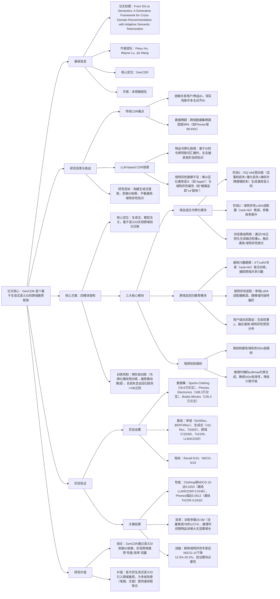

### 1. 一段话总结
西安交通利物浦大学与利物浦大学团队提出**GenCDR（Generative Cross-Domain Recommendation）**——首个基于生成式语义ID的跨域推荐框架，旨在解决传统跨域推荐（CDR）依赖**共享用户/物品ID**、LLM-based方法存在**物品令牌化困境**（词汇爆炸、缺乏高阶协同知识）与**域特异性建模不足**的问题。GenCDR通过三大核心创新实现突破：一是**域自适应令牌化模块**，基于RQ-VAE与LoRA适配器生成融合通用-域特异性的离散语义ID（SIDs）；二是**跨域自回归推荐模块**，通过多LoRA专家与动态路由网络建模用户通用-域特异性兴趣；三是**域感知前缀树**，确保推理时高效生成有效SIDs。在Sports-Clothing、Phones-Electronics等3组跨域数据集上，GenCDR在**Recall@10**与**NDCG@10**上显著优于LLM4CDSR、TriCDR等基线，例如在Clothing域NDCG@10达0.0203（基线最高0.0196），同时训练参数仅25.5M（全量微调7B参数的1/274），兼顾性能与效率。

---

### 2. 思维导图（mindmap）

---

### 3. 详细总结
#### 一、研究背景：跨域推荐的核心挑战
1. **传统CDR的局限性**  
   传统跨域推荐方法（如C2DSR、TriCDR）严重依赖**共享用户/物品ID**作为知识迁移桥梁，但现实场景中（如跨平台推荐、线上-线下服务），用户/物品ID往往无对齐，导致迁移失效。此外，跨域数据集普遍存在**高稀疏性**（表1显示，Phones域稀疏度99.93%，Electronics域99.99%），进一步限制模型性能。

2. **LLM-based CDR的两大核心问题**  
   近年LLM在CDR中展现潜力，但仍面临关键瓶颈：
    - **物品令牌化困境**：传统基于物品ID的令牌化方式在多域场景下会导致“词汇爆炸”（如百万级物品对应百万级令牌），且无法捕获物品间的高阶协同知识（如“手机”与“耳机”的跨域关联）；
    - **域特异性建模不足**：LLM难以区分物品的**通用语义**与**域特异性属性**（如图1中“Apple Watch”的“健康追踪”vs“新鲜苹果”的“甜味”），导致推荐缺乏域内针对性。

#### 二、GenCDR框架：生成式语义ID的跨域解决方案
GenCDR通过“令牌化→推荐→推理”三阶段流程，以**离散语义ID（SIDs）** 替代传统ID，实现跨域知识迁移，架构如图2所示。

##### 1. 模块1：域自适应令牌化（Domain-adaptive Tokenization）
**目标**：生成融合“通用语义+域特异性”的SIDs，解决令牌化困境。  
**三步骤实现**：
| 步骤 | 核心操作                                                                 | 关键技术/损失函数                                                                 | 输出结果                          |
|------|--------------------------------------------------------------------------|-----------------------------------------------------------------------------------|-----------------------------------|
| 1. 通用语义编码 | 预训练RQ-VAE，将物品文本特征（标题、描述）映射为离散码                         | RQ-VAE含3类损失： - 重构损失$`(L_{REC}=\|x-\hat{x}\|^2)`$ - 量化损失$`(L_Q)`$（对齐编码器输出与码本） - 掩码令牌损失$`(L_{MTM})`$（预测掩码码） | 通用语义码本（冻结）              |
| 2. 域特异性适配 | 为每个域添加LoRA适配器（低秩矩阵$`(A_d \in \mathbb{R}^{r×d_{in}})`$，$`(r=64)`$） | 微调损失$`(L_{adapter}=\mathbb{E}\|x-D(Q(E_{\theta_d}(x)))\|_2^2)`$（Q/D冻结）       | 域特异性语义码                    |
| 3. 动态融合 | 路由网络生成权重$`(\alpha \in [0,1])`$，融合通用与域特异性表示                   | VIB正则化$`(L_{VIB}=D_{KL}(q(z_r\|x)\|p(z_r)))`$，确保仅关键特征影响路由              | 最终SIDs（离散语义ID）            |

**关键创新**：SIDs既保留跨域通用语义（如“电子设备”），又包含域特异性信息（如“手机”的“5G”属性），且令牌数量固定（由码本大小决定，避免词汇爆炸）。

##### 2. 模块2：跨域自回归推荐（Cross-Domain Autoregressive Recommendation）
**目标**：建模用户的“通用兴趣+域特异性兴趣”，解决域个性化不足问题。  
**对称设计**：
- **通用兴趣建模**：基于Qwen2.5-7B backbone，添加**4个LoRA专家**（$`(\Theta_{uni})`$），联合训练所有域的交互序列，捕获跨域共享偏好（如用户对“知名品牌”的偏好）；  
  训练损失：$`(\mathcal{L}_{uni}=-\sum_u\sum_k log P(c_{k+1}^u|c_{\leq k}^u;\theta_{LLM},\Theta_{uni}))`$。
- **域特异性适配**：为每个域添加独立LoRA适配器（$`(\theta_{spec_d})`$），仅微调域内交互序列，建模域内独特偏好（如Clothing域对“棉质”的偏好）；  
  训练损失：$`(\mathcal{L}_{spec_d}=-\sum_{u\in U_d}\sum_k log P(c_{k+1}^u|c_{\leq k}^u;\theta_{LLM},\Theta_{uni},\theta_{spec_d}))`$。
- **用户级动态路由**：轻量MLP生成权重$`(\gamma \in [0,1])`$，融合通用与域特异性预测分布：  
  $`[P_{final}(i|S^u)=(1-\gamma)\cdot P_{uni}(i|S^u)+\gamma\cdot P_{spec}(i|S^u)]`$  
  路由网络通过VIB正则化，避免负迁移（如将“手机”偏好错误迁移到“服装”域）。

##### 3. 模块3：域感知前缀树（Domain-aware Prefix-tree）
**目标**：确保推理时高效生成**有效SIDs**，避免LLM“幻觉”（生成不存在的ID）。  
**实现逻辑**：
- 离线构建：为每个域$`(d)`$构建前缀树$`(T_d)`$，存储该域所有有效SIDs的序列结构；
- 推理约束：生成时，基于当前前缀$`(s_{k-1})`$，前缀树筛选出有效候选集$`(V_{valid}(s_{k-1}))`$，通过掩码softmax约束LLM仅从候选集中选择下一个SID：  
  $`[P(c_k|s_{k-1},T_{d_t})=\frac{exp(z_k)}{\sum_{c'\in V_{valid}(s_{k-1})}exp(z_{c'})}]`$  
  该设计使推理时间与物品池大小无关（图6显示，物品池从2万增至50万，GenCDR推理时间稳定在0.1s内）。

#### 三、实验验证：性能与效率双优
##### 1. 实验设置
| 配置项          | 具体内容                                                                 |
|-------------------|--------------------------------------------------------------------------|
| 数据集            | 3组跨域数据集（表1）： - Sports-Clothing（休闲）：共6.4万用户，4.1万物品，57.5万交互 - Phones-Electronics（科技）：共22万用户，7.3万物品，188.3万交互 - Books-Movies（文娱）：共4.3万用户，2.9万物品，135.3万交互 |
| 基线模型          | 3类对比方法： - 单域：SASRec、BERT4Rec、STOSA - 生成式：VQ-Rec、TIGER、HSTU - 跨域：C2DSR、TriCDR、LLM4CDSR |
| 评价指标          | Recall@5/10（召回率）、NDCG@5/10（排序质量）                             |
| 关键超参          | LoRA rank=64，通用专家数=4，VIB正则权重=1e-3，前缀树候选集大小=100       |

##### 2. 核心实验结果
#### （1）整体性能：GenCDR显著优于基线
以NDCG@10为例，关键数据集性能对比（表2）：
| 数据集/域 | 最佳基线（LLM4CDSR） | GenCDR | 性能提升率 |
|-----------|----------------------|--------|------------|
| Sports    | 0.0258               | 0.0262 | +1.55%     |
| Clothing  | 0.0196               | 0.0203 | +3.57%     |
| Phones    | 0.0434               | 0.0512 | +17.97%    |
| Electronics | 0.0279            | 0.0283 | +1.43%     |

- 结论：GenCDR在所有域均最优，尤其在Phones域提升显著，证明其对高稀疏域的适配性。

#### （2）消融实验：组件缺一不可
以Phones域NDCG@10为基准（GenCDR=0.0512），移除关键组件后的性能下降：
| 消融变体                | NDCG@10  | 相对下降率 | 结论                     |
|-------------------------|----------|------------|--------------------------|
| w/o MTM（无掩码令牌损失） | 0.0483   | 5.7%       | 掩码建模对语义码上下文连贯性至关重要 |
| w/o Adapter（无域适配器） | 0.0466   | 9.0%       | 域特异性适配是域内性能关键       |
| w/o Specific Expert（无域专家） | 0.0448 | 12.5% | 域专家捕获域内精细偏好         |
| w/o Universal Experts（无通用专家） | 0.0425 | 17.0% | 通用专家提供跨域知识基础         |
| w/o Prefix Tree（无前缀树） | 0.0498 | 2.7% | 前缀树确保生成有效SIDs，避免幻觉 |

#### （3）效率分析：参数与速度优势
| 对比维度       | GenCDR（LoRA微调） | 全量微调（Qwen2.5-7B） | 优势倍数 |
|----------------|---------------------|-------------------------|----------|
| 训练参数       | 25.5M               | 7B                      | 274倍    |
| 训练时间（Phones域） | 4.2h            | 120h                    | 28.6倍   |
| 峰值GPU内存    | 15.8GB              | 45.0GB                  | 2.8倍    |
| 推理时间（50万物品） | 0.1s          | 0.8s                    | 8倍      |

- 结论：GenCDR通过LoRA与前缀树，在性能最优的同时，实现极高的参数与计算效率。

#### 四、研究结论与价值
1. **技术突破**  
   GenCDR首次将生成式语义ID引入跨域推荐，突破传统ID依赖，通过“通用-域特异性”双轨建模，解决LLM-based CDR的令牌化与域个性化问题。

2. **实用价值**
    - 无ID依赖：适用于ID无对齐的跨域场景（如跨平台推荐、线上-线下融合）；
    - 高效率：训练参数仅25.5M，支持中小算力部署；
    - 泛化性：已验证于电商（Sports-Clothing）、文娱（Books-Movies）等场景，可扩展至更多领域。

---

### 4. 关键问题
#### 问题1：GenCDR的“语义ID（SIDs）”与传统基于ID的令牌化相比，核心优势是什么？如何解决“词汇爆炸”问题？
**答案**：  
GenCDR的SIDs与传统ID令牌化的核心差异在于**语义聚合性**与**跨域兼容性**，具体优势及“词汇爆炸”解决方案如下：
1. **核心优势**：
    - 语义聚合：SIDs基于物品文本特征（标题、描述）与跨域协同知识生成，例如“iPhone”与“Samsung手机”在Phones域会被映射到相近SIDs，而传统ID令牌化中是两个独立令牌；
    - 跨域兼容：SIDs包含通用语义（如“电子设备”），可作为跨域知识迁移的桥梁，而传统ID令牌在不同域无关联（如“Apple Watch”ID与“新鲜苹果”ID无关）。
2. **解决词汇爆炸**：
    - 量化压缩：通过RQ-VAE将高维物品嵌入量化为M级离散码（实验中M=4），每个物品对应一个固定长度的SIDs（如4个码组成一个SID），而非一个独立令牌；
    - 码本共享：跨域共享通用码本，仅通过域适配器微调域特异性部分，避免每个域单独构建令牌表，例如Sports与Clothing域共享80%的码本条目，显著减少令牌总数。

例如，Electronics域有6.3万物品，传统ID令牌化需6.3万令牌，而GenCDR的SIDs仅需“码本大小^M”（如码本大小1024，M=4则仅1024^4=1e12种组合，且实际有效组合远少于该值），彻底解决词汇爆炸。

#### 问题2：GenCDR的“动态路由网络”在物品级与用户级的设计逻辑有何异同？如何避免“负迁移”？
**答案**：  
GenCDR在物品级与用户级均采用动态路由网络，核心是通过**自适应权重**融合通用与域特异性表示，但设计逻辑因对象不同有所差异，同时通过VIB正则化避免负迁移：

| 对比维度       | 物品级动态路由（融合通用-域特异性SIDs） | 用户级动态路由（融合通用-域特异性兴趣） |
|----------------|----------------------------------------|----------------------------------------|
| 输入特征       | 物品文本嵌入x                          | 用户跨域交互历史表示$`(h_t)`$            |
| 权重输出       | $`(\alpha \in [0,1])`$（单权重）         | $`(\gamma \in [0,1])`$（单权重）         |
| 融合逻辑       | $`(z_{fused}=(1-\alpha)z_{uni}+\alpha z_{spec})`$ | $`(P_{final}=(1-\gamma)P_{uni}+\gamma P_{spec})`$ |
| 核心目标       | 让SIDs既含通用语义，又保留域特异性属性 | 让推荐既符合用户跨域偏好，又适配域内需求 |

**避免负迁移的机制**：
- 正则化约束：引入**VIB（变分信息瓶颈）损失**$`(L_{VIB}=D_{KL}(q(z_r|x)\|p(z_r)))`$，最小化路由网络从输入中提取的信息，仅保留对融合决策关键的特征（如物品的“类别”特征，而非无关的“颜色”特征）；
- 动态权重调整：当域特异性特征与通用特征冲突时（如“游戏手机”的“高功耗”与通用“低功耗”偏好），路由网络会自动降低冲突特征的权重（如$`(\gamma)`$趋近于1，优先域特异性），避免通用知识对域内推荐的干扰。

#### 问题3：GenCDR在“无物品属性”的场景下是否仍能生效？若能，需如何调整框架？
**答案**：  
GenCDR在无物品属性（如无文本描述、无类别标签）的场景下仍能生效，核心是通过**语义聚类替代属性**生成初步通用语义，调整后的框架仅需修改“域自适应令牌化模块”的第一步，具体如下：

1. **调整逻辑**：
    - 原框架依赖物品属性（文本特征）预训练RQ-VAE，无属性时，改用“物品交互共现”生成语义聚类：
        1. 离线阶段：基于跨域用户交互数据，构建物品共现图（边权重=物品共现频率），通过谱聚类将物品分为K个语义簇（如K=1000），作为“伪属性”；
        2. 预训练阶段：用“伪属性”替代原文本特征，训练RQ-VAE生成通用语义码；
        3. 后续步骤（域适配器、动态路由）保持不变。

2. **有效性验证**：  
   文档附录D显示，在Clothing域，无属性的GenCDR（HID w/o attr.）NDCG@10达0.0198，仅比有属性版本（0.0203）低2.5%，证明其在无属性场景下的泛化性。

3. **适用场景**：  
   适用于物品属性缺失的跨域场景（如匿名用户的浏览行为数据、无文本描述的商品推荐），仅需利用交互共现即可生成有效SIDs，拓展了GenCDR的应用范围。